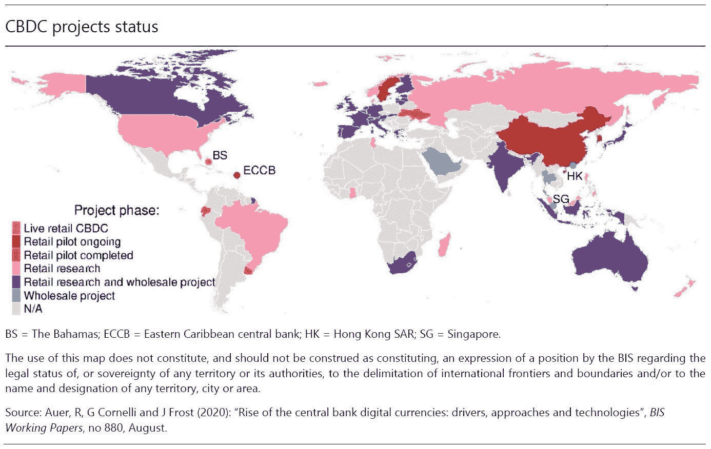

# 了解 CBDCs

> 原文：<https://medium.com/coinmonks/understanding-cbdcs-bc5f27e1ada6?source=collection_archive---------3----------------------->

## *央行数字货币设计要点、发行和预测*

如果你关注加密世界、 [DeFi](https://blog.coinbase.com/a-beginners-guide-to-decentralized-finance-defi-574c68ff43c4) 或区块链相关倡议的总体情况，你可能在过去一年开始听到更多关于央行数字货币(CBDCs)的消息。虽然对这一主题的研究已经稳步增长了一段时间，但 2020 年见证了一系列新项目和令人兴奋的里程碑，如第一个[“现场”CBDC 在巴哈马的到来](https://cointelegraph.com/news/the-bahamas-launches-world-s-first-cbdc-the-sand-dollar)。上周发布的一项新调查显示，86%的央行受访者正在进行 CBDC 计划。

这种实验的势头伴随着监管领域的势头，因为联邦机构的态度似乎正在转向 CBDCs 的可能性。2020 年 10 月，七大央行[在某种程度上合作达成了 CBDC“希波克拉底誓言”](https://www.bis.org/publ/othp33.htm)，为 CBDC 设计制定了原则。本月早些时候，美国财政部货币监理署(OCC)发布了一封[信函](https://www.occ.gov/news-issuances/news-releases/2021/nr-occ-2021-2.html)称，银行可以参与区块链系统上的节点验证，这实际上使区块链作为全球金融网络合法化。

虽然我们仍处于 CBDC 发展的早期阶段，但我们可以开始想象它们可能对世界产生的影响。为了迎接充满更多 CBDC 新闻的一年，这篇文章旨在强调关键的设计点、问题和值得注意的项目。

## **定义央行数字货币:我们都在谈论同一件事吗？**

有点吧。虽然通过过去几年的研究和实验，对这一概念的理解有了很大的进步，但它仍然相对不明确，因为方法可以有很大的不同。2018 年的一篇论文试图描述 CBDC 的本质:“一种不同于传统储备或结算账户余额的央行货币的数字形式。”[一般来说](https://en.wikipedia.org/wiki/Central_bank_digital_currency)，这个术语指的是由中央银行发布的涉及数字货币的项目和提案的集合，其灵感来自“区块链”——其第一个化身是比特币的技术框架。根据其设计，这种货币可以面向公众，也可以不面向公众，可以计息，也可以匿名，也可以用区块链担保。这些选择会给经济带来不同的结果，并对消费者产生一系列影响。

## **CBDC 四大设计要点**

最终，CBD 的成功将取决于它们的设计，而它们的设计将取决于它们各自辖区的经济状况、消费者习惯和银行系统。最近关于世界各地 CDBC 进程的调查显示，各国的项目在经济和制度动机、政策方法和技术设计方面存在显著差异。这些因素会影响 CBDC 是否更像现金或银行存款，它们与现有支付机制的竞争程度，以及它们对消费者的可及性。

## **设计点 1:是普通人用还是只有银行用？**

换句话说，是“零售”还是“批发”？普遍的假设是，公众在日常零售交易中使用的可访问的通用 CBDC 将比只供银行或有限机构使用的批发 CBDC 对现有系统产生更大的影响。零售 CBDC 将代表对央行的类似现金的要求，甚至可能完全取代现金。在像几乎没有现金的瑞典这样的国家，2020 年不到 10%的支付是用现金进行的，这只是一个已经在进行中的趋势的延续。

相比之下，为批发使用而设计的 CBDC 不会那么具有破坏性，甚至可能非常类似于目前的系统(央行已经通过储备向银行提供了批发数字货币的渠道)。尽管如此，批发 CBDCs 可以提供结算效率的额外好处，尤其是在证券和衍生品方面。总的来说，与 CBDC 零售项目相比，批发项目代表了现有实验中的少数。

## **设计要点二:有没有利息？**

CBDC 计息的程度对它是最像现金还是最像银行存款有着重大影响，因此也是它最具竞争力的支付工具。当现金或银行存款受到引入 CBDC 的威胁时，特定经济体的动态将决定整体福利受到何种影响。

虽然目前正在考虑的许多中央发展中国家是无息类型的，但国际货币基金组织的这份[工作文件](https://www.imf.org/en/Publications/WP/Issues/2019/11/18/Designing-Central-Bank-Digital-Currencies-48739)表明，无息 CDBC 为中央银行创造了一个具有挑战性的福利权衡。简而言之，无息 CBDC 创造了一种类似现金的工具，在某些情况下会将现金使用量降至零。当获得现金和保持支付多样性对一个社会很重要时，这种无息方法可能不是最佳的。

同样的分析表明，可变利率的 CBDC 赋予央行创造最优政策的灵活性，该政策“维持支付工具的多样性并限制银行脱媒。”具体而言，央行可以利用 CBDC 负利率来保护实物现金的使用，利用正利率来影响银行存款需求。在一项关于 CBDCs 对私人银行的[影响的研究中，研究人员表明，当引入正利率的 CBDC 时，银行必须将存款利率提高到至少等于 CBDC，这为储户创造了更有利的条件。由此导致的存款需求增加，可能来自现有储户被鼓励增加存款，也可能来自那些没有银行账户的人，他们现在有动力支付进入银行业的成本。如果 CBDC 的利率最初高于存款利率，这种对存款利率和整体贷款的积极影响就会发生——但只是在一定程度上。如果 CBDC 利率过高，银行无法应对，银行将被迫缩减存贷款规模。](https://doi.org/10.20955/wp.2018.026)

## **设计要点 3:匿名程度如何？**

现金的好处之一就是完全匿名。这也是缺点之一。你可以拿着它，把它送给别人，偷走它，或者丢失它，没有人会发现。只有在采取“基于令牌”的方法时，CBDC 才能实现现金的匿名性，这意味着数字货币可以通过与身份不直接相关的账户或支付卡来使用。当然，这种方法也像现金一样容易丢失和被盗。或者，对 CBDC 采取“基于账户”的方法，通过央行的一个账户提供货币，这个账户只有通过官方身份才能使用——类似于银行存款的可追溯性。

但这并不一定非此即彼——CBDC 的一个好处是混合方法是可能的。例如，交易可以由中央银行记录，但除非在特定情况下(如达到交易阈值时)，否则不会被访问。此外，用户的身份可能会受到各种实体的保护，如银行、执法机构或第三方。匿名性和安全性之间的权衡对于最终用户的采用和最终利益至关重要。 [2020 年对 CBDC 的驱动因素和方法](https://www.bis.org/publ/work880.htm)的分析指出，依赖严格身份验证的基于账户的 CBD 很可能会排除一个已经被传统银行系统排除在外的核心目标群体——没有银行账户的人和依赖现金的个人。

## **设计点 4:技术是集中式还是分散式？**

换句话说——CBDC 将依靠传统的会计技术，还是将在一个类似区块链的系统上由多台计算机来验证交易？最终用户可能不会感受到太大的不同，但是技术选择可能会对匿名性、安全性和可伸缩性产生影响。区块链或分布式账本技术(DLTs)可以提供更好的单点故障恢复能力，信任底层技术而不是中介或机构。然而，这种系统必须精心设计，而且可能比大多数政府准备实施和维护的系统更先进。不出所料，大多数使用 DLT 的 CBDC 项目都集中在“许可的”方法上——也就是说，所有参与网络交易验证的节点都是已知的，并被一些权威机构所承认。这与运行比特币等加密货币的“公共”或“无许可”网络形成对比。

## **关于相关方法的说明:“合成 CBDC”**

还有另一个[提议的 CBDC](https://www.imf.org/en/Publications/fintech-notes/Issues/2019/07/12/The-Rise-of-Digital-Money-47097) 方法，称为“合成 CBDC”或“间接 CDBC”它描述了一种混合方法，其中电子货币支付服务提供商充当中央银行和最终用户之间的中介。这种方法的好处是创建了一种由中央银行认可的数字现金形式，同时由第三方提供商创建和维护。假设监管框架支持这一方法，它可以保证这些供应商的负债总能得到央行资金的完全匹配。然而，[几个主要央行最近的联合论文](https://www.bis.org/publ/othp33.htm)明确表示，他们不认为合成方法是真正的 CBDC，因为最终用户实际上并没有对央行提出要求。他们认为这是“狭义银行”资金的一种形式，到目前为止，美联储对此反应不佳。

## 为什么要介绍 CBDC？

[人们对 CBDC 的兴趣越来越浓厚](https://www.bis.org/publ/bppdf/bispap114.htm),成熟市场和新兴市场都取得了令人振奋的进展。除了在巴哈马群岛发行第一个 CBDC 外，2020 年将有 60%的央行进行概念验证，14%进入试点阶段。尽管大多数央行不太可能在近期发行 CBDC，但代表全球五分之一人口的银行集团表示，它们可能会在未来三年发行 CBDC。

总的来说，[当地的环境塑造了 CBDC 工作的动力](https://www.bis.org/publ/bppdf/bispap114.htm)，但也有一些共同的动机。一个是支付效率，包括国内和国外交易。另一个是金融包容性，但如前所述，这将取决于关键的设计选择。例如，金融包容性可能取决于 CBDC 的竞争压力是否真的导致银行将存款利率提高到一定水平，从而激励没有银行账户的人进入银行业。这也可能取决于进入中央银行账户所需的身份识别级别。CBDC 的第三个动机是更好地控制和实施货币政策。广泛使用和持有的 CBDC 可以被用作直接向家庭传导货币政策的工具，就像在金融压力时期执行“直升机撒钱”一样。此外，一般认为，从长远来看，实施和维护 CBDC 比铸造实体硬币和纸币更便宜。

另一方面，不能保证 CBDC 会按预期工作。一个根本性的问题是:央行经营互联网货币有意义吗？许多在加密和 DeFi 领域工作多年，努力建立开放、自由和公平的金融市场的人，对垄断、中央运营的数字货币的想法犹豫不决，这种货币可能会加强联邦政府的控制。这似乎与该空间的初衷背道而驰——在不依赖传统机构的情况下，促进点对点的分散交易。在讨论[中国的数字元](https://www.coindesk.com/us-china-digital-yuan-cbdc-geopolitical-power-report)计划时，这种不安是显而易见的，预计这将“加强其数字威权主义”

## **对未来一年的预测**

2021 年，你可能会听到更多关于 CBDCs 的消息。中国已经成功完成了第二个试点项目，[似乎正在为大规模推广](https://www.pymnts.com/news/payment-methods/2021/chinas-cbdc-dress-rehearsal-sets-stage-for-other-central-banks/)做准备。瑞典的[电子克朗试点项目](https://www.riksbank.se/en-gb/press-and-published/notices-and-press-releases/notices/2020/the-riksbank-to-test-technical-solution-for-the-e-krona/)，于 2020 年初启动，将于本月结束。紧随巴哈马群岛和美元之后的东加勒比中央银行，正在[准备生产其数字货币](https://www.forbes.com/sites/vipinbharathan/2021/01/30/dxcd-the-eastern-caribbean-central-bank-money-is-being-readied-for-production/?sh=7aa2ec7f178d)。这些先行者肯定会因为他们提供的结果和教训而受到密切关注。

虽然预计大多数央行不会很快发行 CBDC，但这一领域的进展是更大运动的一部分，这一运动超出了政府是否应该发行数字货币的问题。随着 crypto 和 DeFi 的持续发展，更大的问题是——支持现代经济的支付系统的最佳组合是什么？比特币[继续给人们](https://www.forbes.com/sites/cbovaird/2021/01/14/bitcoin-has-climbed-above-40000-again-whats-next/?sh=47ca18535ec8)带来惊喜，各大银行[将自己](https://www.fool.com/investing/2021/01/27/3-banks-that-have-big-plans-for-blockchain-and-cry/)定位为对加密更加友好，这并非巧合。所有迹象表明，我们将迎来激动人心的一年。

# 资源

设计中央银行数字货币。*国际货币基金组织*2019 年 11 月 18 日[www . IMF . org/en/Publications/WP/Issues/2019/11/18/Designing-Central-Bank-Digital-currences-48739。](http://www.imf.org/en/Publications/WP/Issues/2019/11/18/Designing-Central-Bank-Digital-Currencies-48739.)

安多法托，大卫。"评估央行数字货币对私人银行的影响."*经济研究—圣路易斯美联储银行*，2020 年 4 月 22 日，research.stlouisfed.org/wp/more/2018–026.

中央银行数字货币的兴起:驱动力、方法和技术。*国际清算银行*2020 年 8 月 24 日[www.bis.org/publ/work880.htm.](http://www.bis.org/publ/work880.htm.)

伯克维兹，布拉姆。“3 家银行对区块链和加密货币有很大的计划。”*杂色傻瓜*，2021 年 1 月 27 日，[www . Fool . com/investing/2021/01/27/3-为区块链制定大计划的银行。](http://www.fool.com/investing/2021/01/27/3-banks-that-have-big-plans-for-blockchain-and-cry/.)

巴拉森，维平。"东加勒比中央银行数字货币 DXCD 已经准备好投入生产."*福布斯*，福布斯杂志，2021 年 1 月 30 日，[www . Forbes . com/sites/vipinbharathan/2021/01/30/dxcd-the-eastern-Caribbean-central-bank-money-is-ready-for-production/？sh=7aa2ec7f178d。](http://www.forbes.com/sites/vipinbharathan/2021/01/30/dxcd-the-eastern-caribbean-central-bank-money-is-being-readied-for-production/?sh=7aa2ec7f178d.)

野猪，Codruta 和安德烈亚斯魏尔利。“准备，稳住，走？——国际清算银行第三次中央银行数字货币调查的结果。”*国际清算银行*，2021 年 1 月 27 日[www.bis.org/publ/bppdf/bispap114.htm.](http://www.bis.org/publ/bppdf/bispap114.htm.)

查尔斯·博瓦德。“比特币再次攀升至 40000 美元以上——下一步是什么？”*福布斯*，福布斯杂志，2021 年 1 月 28 日，[www . Forbes . com/sites/CBO vaird/2021/01/14/bit coin-has-clipped-above-40000-again-whats-next/？sh=47ca18535ec8。](http://www.forbes.com/sites/cbovaird/2021/01/14/bitcoin-has-climbed-above-40000-again-whats-next/?sh=47ca18535ec8.)

卡拉佩拉，弗朗西丝卡和让·弗莱明。"中央银行数字货币:文献综述."*美联储-央行数字货币:文献综述*，2020 年 11 月 9 日，[www . federal reserve . gov/econres/notes/feds-notes/Central-Bank-Digital-Currency-A-Literature-Review-2020 11 09 . htm .](http://www.federalreserve.gov/econres/notes/feds-notes/central-bank-digital-currency-a-literature-review-20201109.htm.)

"中央银行数字货币:基本原则和核心特征."*www.bis.org/publ/othp33.htm.[2020 年 10 月 9 日](http://www.bis.org/publ/othp33.htm.)*国际清算银行

"中国的 CBDC“彩排”为其他央行搭建舞台."*PYMNTS.com*，2021 年 1 月 4 日，[www . pym nts . com/news/payment-methods/2021/China-cbdc-dress-prediction-sets-stage-for-other-central-banks/。](http://www.pymnts.com/news/payment-methods/2021/chinas-cbdc-dress-rehearsal-sets-stage-for-other-central-banks/.)

希德科埃略.帕布。"分散金融初学者指南." *Medium* ，比特币基地博客，2020 年 8 月 28 日，Blog . coin base . com/a-初学者指南-去中心化金融-defi-574c68ff43c4。

uré、Benoî和 Jacqueline Loh。“央行数字货币。”*国际清算银行*，2018 年 3 月 12 日，[www.bis.org/cpmi/publ/d174.htm.](http://www.bis.org/cpmi/publ/d174.htm.)

杜伦、卡洛琳和鲁查·科尔。“‘狭义银行’挑战传统行业模式，但美联储予以回击。” *S & P 全球市场情报*，2019 年 3 月 27 日，[www . sp Global . com/Market Intelligence/en/news-insights/latest-news-headlines/narrow-bank-challenges-traditional-industry-model-but-fed-pulls-back-49204495。](http://www.spglobal.com/marketintelligence/en/news-insights/latest-news-headlines/narrow-bank-challenges-traditional-industry-model-but-fed-pushes-back-49204495.)

“联邦特许银行和储蓄机构可以参与独立的节点验证网络，并使用稳定的货币进行支付活动。”*货币监理署*，2021 年 1 月 4 日[www . OCC . gov/news-issues/news-releases/2021/NR-OCC-2021-2 . html](http://www.occ.gov/news-issuances/news-releases/2021/nr-occ-2021-2.html.)

格里夫利、托马索·曼奇尼和托拜厄斯·阿德里安。数字货币的兴起。国际货币基金组织，2019 年 7 月 15 日，[www . IMF . org/en/Publications/fin tech-notes/Issues/2019/07/12/The-Rise-of-Digital-Money-47097。](http://www.imf.org/en/Publications/fintech-notes/Issues/2019/07/12/The-Rise-of-Digital-Money-47097.)

曼奇尼·格里夫利，托马索等着，《央行数字货币的启示》*国际货币基金组织*2018 年 11 月 12 日[www . IMF . org/en/Publications/Staff-Discussion-Notes/Issues/2018/11/13/Casting-Light-on-Central-Bank-Digital-currences-46233。](http://www.imf.org/en/Publications/Staff-Discussion-Notes/Issues/2018/11/13/Casting-Light-on-Central-Bank-Digital-Currencies-46233.)

力量，本杰明。"地缘政治在美国对数字人民币的反应中岌岌可危:报告."*coin desk*2021 年 1 月 28 日[www . coin desk . com/us-China-digital-yuan-cbdc-geographic-power-report。](http://www.coindesk.com/us-china-digital-yuan-cbdc-geopolitical-power-report.)

"瑞典央行将测试克朗的技术方案."*瑞典中央银行*，2020 年 2 月 20 日，[www . riks bank . se/en-GB/press-and-published/notices-and-press-releases/notices/2020/the-riks bank-to-test-technical-solution-for-the-e-krona/。](http://www.riksbank.se/en-gb/press-and-published/notices-and-press-releases/notices/2020/the-riksbank-to-test-technical-solution-for-the-e-krona/.)

瑞典银行。“2020 年瑞典的支付”*瑞典中央银行*，2020 年 10 月 29 日，[www . riks bank . se/en-GB/press-and-published/notices-and-press-releases/press-releases/2020/payments-in-Sweden-2020/。](http://www.riksbank.se/en-gb/press-and-published/notices-and-press-releases/press-releases/2020/payments-in-sweden-2020/.)

莱特特纳。"巴哈马发行了世界上第一个 CBDC，即“沙元”. "Cointelegraph，2020 年 10 月 21 日，coin telegraph . com/news/the-Bahamas-launchs-world-s-first-cbdc-the-sand-dollar。

> 加入 coin monks[Telegram group](https://t.me/joinchat/EPmjKpNYwRMsBI4p)学习加密交易和投资

## 另外，阅读

*   什么是[闪贷](https://blog.coincodecap.com/what-are-flash-loans-on-ethereum)？
*   最好的[密码交易机器人](/coinmonks/crypto-trading-bot-c2ffce8acb2a) | [网格交易](https://blog.coincodecap.com/grid-trading)
*   [3 商业评论](/coinmonks/3commas-review-an-excellent-crypto-trading-bot-2020-1313a58bec92) | [Pionex 评论](/coinmonks/pionex-review-exchange-with-crypto-trading-bot-1e459d0191ea) | [Coinrule 评论](https://blog.coincodecap.com/coinrule-review-a-perfect-trading-bot)
*   [AAX 交易所评论](/coinmonks/aax-exchange-review-2021-67c5ea09330c) | [德里比特评论](/coinmonks/deribit-review-options-fees-apis-and-testnet-2ca16c4bbdb2) | [FTX 交易所评论](/coinmonks/ftx-crypto-exchange-review-53664ac1198f)
*   [n 零审核](/coinmonks/ngrave-zero-review-c465cf8307fc) | [Phemex 审核](/coinmonks/phemex-review-4cfba0b49e28) | [PrimeXBT 审核](/coinmonks/primexbt-review-88e0815be858)
*   [Bybit 交易所评论](/coinmonks/bybit-exchange-review-dbd570019b71) | [Bityard 评论](https://blog.coincodecap.com/bityard-reivew) | [CoinSpot 评论](https://blog.coincodecap.com/coinspot-review)
*   [3Commas vs Cryptohopper](/coinmonks/3commas-vs-pionex-vs-cryptohopper-best-crypto-bot-6a98d2baa203)
*   最好的比特币[硬件钱包](/coinmonks/the-best-cryptocurrency-hardware-wallets-of-2020-e28b1c124069?source=friends_link&sk=324dd9ff8556ab578d71e7ad7658ad7c) | [BitBox02 回顾](/coinmonks/bitbox02-review-your-swiss-bitcoin-hardware-wallet-c36c88fff29)
*   [总帐 vs n 平均](https://blog.coincodecap.com/ngrave-vs-ledger) | [总帐 nano s vs x](https://blog.coincodecap.com/ledger-nano-s-vs-x)
*   [密码拷贝交易平台](/coinmonks/top-10-crypto-copy-trading-platforms-for-beginners-d0c37c7d698c) | [比特码拷贝交易](https://blog.coincodecap.com/bityard-copy-trading)
*   [沃德评论](https://blog.coincodecap.com/vauld-review) | [尤霍德勒评论](/coinmonks/youhodler-4-easy-ways-to-make-money-98969b9689f2) | [区块链评论](/coinmonks/blockfi-review-53096053c097)
*   最好的[加密税务软件](/coinmonks/best-crypto-tax-tool-for-my-money-72d4b430816b) | [硬币追踪评论](/coinmonks/cointracking-review-a-reliable-cryptocurrency-tax-software-5114e3eb5737)
*   最佳[加密借贷平台](/coinmonks/top-5-crypto-lending-platforms-in-2020-that-you-need-to-know-a1b675cec3fa) | [杠杆令牌](/coinmonks/leveraged-token-3f5257808b22)
*   [莱杰 Nano S vs 特雷佐 one vs 特雷佐 T vs 莱杰 Nano X](https://blog.coincodecap.com/ledger-nano-s-vs-trezor-one-ledger-nano-x-trezor-t)
*   [block fi vs Celsius](/coinmonks/blockfi-vs-celsius-vs-hodlnaut-8a1cc8c26630)|[Hodlnaut Review](https://blog.coincodecap.com/hodlnaut-review)
*   [Bitsgap 审查](/coinmonks/bitsgap-review-a-crypto-trading-bot-that-makes-easy-money-a5d88a336df2) | [四项审查](/coinmonks/quadency-review-a-crypto-trading-automation-platform-3068eaa374e1)
*   [埃利帕尔泰坦评论](/coinmonks/ellipal-titan-review-85e9071dd029) | [赛克斯斯通评论](https://blog.coincodecap.com/secux-stone-hardware-wallet-review)
*   [DEX Explorer](https://explorer.bitquery.io/ethereum/dex) | [区块链 API](https://explorer.bitquery.io/graphql)|[本地比特币评论](https://blog.coincodecap.com/localbitcoins-review)
*   最佳[区块链分析](https://bitquery.io/blog/best-blockchain-analysis-tools-and-software)工具| [赚比特币](https://blog.coincodecap.com/earn-bitcoin)
*   [加密套利](/coinmonks/crypto-arbitrage-guide-how-to-make-money-as-a-beginner-62bfe5c868f6)指南:新手如何赚钱
*   最佳[加密制图工具](/coinmonks/what-are-the-best-charting-platforms-for-cryptocurrency-trading-85aade584d80) | [最佳加密交易所](/coinmonks/crypto-exchange-dd2f9d6f3769)
*   了解比特币的[最佳书籍有哪些？](/coinmonks/what-are-the-best-books-to-learn-bitcoin-409aeb9aff4b)

> [直接在您的收件箱中获得最佳软件交易](/coinmonks/newsletters/coinmonks)

