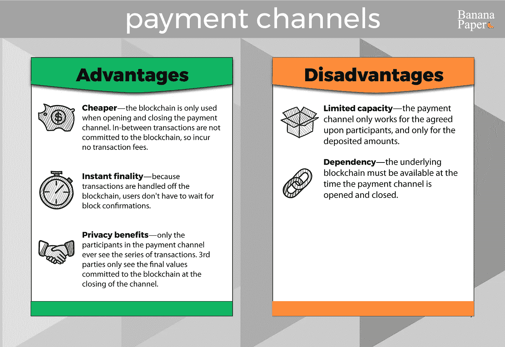
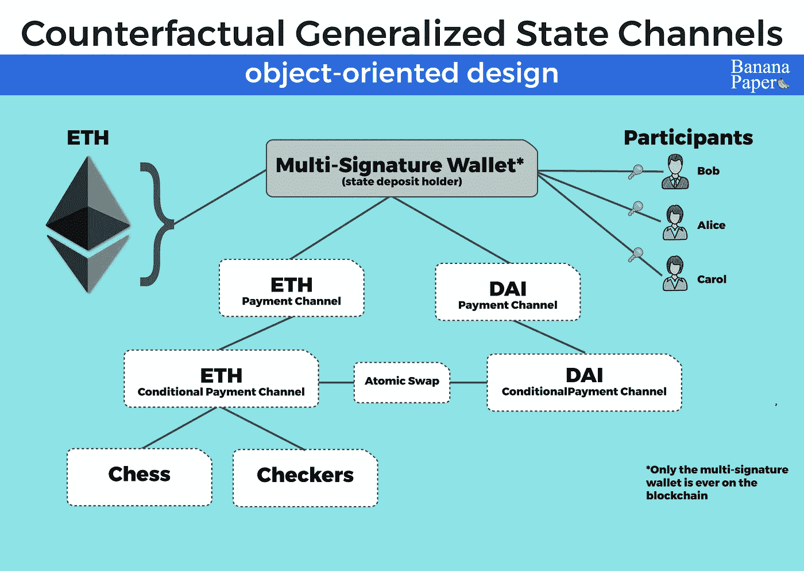

# 理解反事实以及支付渠道和国家渠道的演变

> 原文：<https://medium.com/coinmonks/understanding-counterfactual-and-the-evolution-of-payment-channels-and-state-channels-9e939d7c6f34?source=collection_archive---------3----------------------->

[https://counterfactual.com/](https://counterfactual.com/)

这篇文章是我的系列文章之一🍌香蕉白皮书——区块链白皮书以一种易于理解的方式重新编写(比如香蕉！)风度。我的目标是帮助读者以最小的痛苦快速理解和评估复杂的区块链思想。

我知道，我对这篇关于反事实的香蕉论文有点难以理解。白皮书几周前刚刚发布，没有 ICO，没有投资炒作，这就是我所说的区块链科技深处的*。但是 EOS 上有足够的信息。对吗？尽管毫无疑问，报道 10 大密码会给我带来更多的读者……让我们花一点时间在一些新的区块链想法上，这些想法由一些大牌支持，技术上具有挑战性，但很安静。*

**反事实**是一个由[维塔利克·布特林](https://medium.com/u/587a00dbce51?source=post_page-----9e939d7c6f34--------------------------------)、[以太坊](https://medium.com/u/d626b3859bc9?source=post_page-----9e939d7c6f34--------------------------------)和 [L4 风险投资](https://medium.com/u/405fc689e478?source=post_page-----9e939d7c6f34--------------------------------)资助的想法，由杰夫·科尔曼、[利亚姆·霍恩](https://medium.com/u/3d78a0a3caa0?source=post_page-----9e939d7c6f34--------------------------------)和[李·玄寂](https://medium.com/u/7a5652c866a5?source=post_page-----9e939d7c6f34--------------------------------)开发。这是一份写得很好的(谢谢你们向我介绍了这个词*desiratum*，伙计们)和全面的白皮书。这是一个非常令人兴奋的想法。让我们开始吧。

# **反事实——简单的解释**

我们以前见过这个问题:以太坊区块链对于大多数应用来说太贵太慢。因为汽油成本，它很贵——目前一笔交易的成本约为 0.20 美元。而且它很慢，因为用户被迫等待几个块确认(至少几分钟)才能完成交易。这种体验不能满足生活在网络和手机上的现代用户的高期望。

反事实——通过**广义状态渠道**——通过将*进程移出*区块链来解决这些问题，同时仍然给进程带来区块链的*好处*。

反事实交易是*便宜*和*快速*，然而仍然*不可信*和*最终*。

# **反事实—详细概述**

为了理解反事实是如何实现上述目标的，让我们做一点知识积累。

*首先是区块链……*

在区块链，交易是不可信的和最终的。但是在一个典型的区块链上，你**支付交易费**(支付矿工挖掘你的交易)，你**等待你的信息块在网络上传播**以确保它是真实的(这至少需要几分钟)。

*接下来是支付渠道……*

## **支付渠道**

支付渠道试图提供比区块链更好的体验——他们创造了一个便宜、快捷的支付层。

支付通道是部署在区块链上的智能合约，在内部记录一组用户之间发生的交易，而无需将它们写入底层区块链。

例如，你和我一起工作，想要一种简单的方式来支付对方的午餐、咖啡等费用。所以我们开通了一个支付通道，每个人存入 10 个 ETH。这 10 个 ETH——称为国家存款——被锁定在渠道中。现在，当我们使用支付通道相互支付时(我们都必须签署每笔交易，以便通道知道交易是真实的)，智能合约记录交易并在内部转移资金，但不会将交易发送到基础区块链。支付渠道知道并跟踪我们的余额。因此，我们之间没有交易费或付款延迟。

当所有的参与者都完成了他们的交易时——在我们的例子中，我们说我们已经完成了合作，并且不期望在短时间内再次合作——我们发出信号，我们完成了智能合约，然后智能合约将所有的交易一次性提交给底层的区块链，使一切永久化。在整个过程中，只收取了两次交易费用，并且只有两次我们必须等待块通过网络传播:当我们创建支付通道/国家存款时，以及当我们关闭支付通道时。

Advantages and Disadvantages of Payment Channels

支付渠道项目的例子有[雷电网络](https://medium.com/u/b92c9d83819e?source=post_page-----9e939d7c6f34--------------------------------)和[比特币雷电网络](https://lightning.network/)。

*接下来是特定于应用的状态通道……*

## 国家频道

**状态通道**就像上面的支付通道——除了它们不仅仅是为货币而构建，还可以为任何需要区块链状态的而构建——基本上是存储在区块链上的任何交易。

例如:国际象棋中的走法。不是每个回合都被发送给记录管理员，而是在频道中收集，然后在游戏结束时作为一个大报告提交。就像支付渠道一样，国家渠道允许一组用户在几分钟甚至几年内进行多次交易，就每一步发生的事情达成一致，然后——当每个人都完成时——将整个交易记录提交给区块链。国有渠道快速而廉价，但仍然不可信且不可靠。

需要注意的一点是:状态通道是专门为每个单独的应用程序构建的，并且只为特定的应用程序及其特定的状态工作。这对开发团队来说是一个很大的阻碍——为一个应用程序建立一个新的状态通道既昂贵又耗时。

*现在，最后，我们开始反事实，以及他们的广义状态通道的概念…*

## **反事实和广义国家渠道**

**通用状态通道**类似于上面的 app 专用状态通道，除了它们是一个*通用*框架。通用状态通道允许*任何*任何*应用程序的任何*状态同时合并成一个单一状态通道。(类似于状态通道，广义状态通道只对商定的参与者起作用。)

因此，你可以下棋、卖咖啡、玩跳棋、送 MKR 代币等等，所有这些都在同一个国家频道上进行，没有费用、没有延迟，也没有区块链交易。

不仅如此，而且(这可能是最令人印象深刻的功能)通用状态通道允许您在任何时候向您的通道添加新的应用程序和状态，并在您的所有应用程序之间移动资金，所有这些都不需要额外的工作，不需要费用，不需要延迟，也不需要将交易发送到区块链。

嘿——我知道我一直在用这个频道偿还你的午餐费用，但我也想在这个频道上开始一场象棋比赛吗？

反事实——以及广义的国家频道——是一种让所有应用程序在区块链上一起工作的方式，并且让它们变得便宜和快速。它们是一个框架，开发团队可以用最少的工作将状态通道放入他们的应用程序中。

这就是总体思路，而且是大思路。该白皮书详细介绍了威胁模型、实施、与其他离线交易方式的比较等。我们将在下面讨论其中的一些。

## **更多详情**

白皮书详细介绍了反事实背后的概念和定义。我将介绍几个我认为很重要的例子。

*向渠道添加新合同*

正如我上面提到的，反事实最强大的功能之一是，你可以动态地将新应用程序(指应用程序的智能合约)添加到你的频道，然后使用智能合约的功能，而无需“上线”或产生任何费用。反事实通过一个叫做**反事实实例化**的过程来做到这一点。这一过程将区块链上的原始智能合约编译成 C*counter fact*智能合约，然后部署到并驻留在您的州频道中，参与者同意该合约现在是他们整体协议的一部分。这个新的反事实契约链接到原始智能契约，使得当完成状态通道的时间到来时，智能契约的反事实版本可以在区块链上更新原始智能契约。

*面向对象设计*

反事实状态通道是以面向对象的方式构建的，这意味着反事实实例化的智能合约可以被视为与状态通道中的其他对象交互并在其上构建的对象。所有这些物体都可以交谈、互动等。构建一个金字塔直到顶部联系人，这是一个直接与区块链交互的多签名钱包。事实上，这个顶级的多签名钱包是唯一与区块链交互的对象，处理所有需要到区块链的事情，比如争议和终结。

A simplified object model of a Counterfactual generalized state channel

*威胁*

《反事实》杂志必须担心国家频道面临的几个威胁。

首先，为了让官方渠道正常运转，有几个假设对区块链来说不一定成立。如果这些假设中的任何一个被证明是错误的，那么这个错误的假设将对国家频道构成致命的威胁。反事实不处理这些假设不成立的情况:

*   下面的区块链必须建得好
*   参与者必须随时在线
*   绝不能有比内部激励更大的外部激励
*   智能合约必须构建良好

第二大担忧是**悲伤**。悲伤是指用户在系统中做了一些意想不到的事情，没有任何个人回报，只是为了伤害其他人。肮脏的东西，对不对？也很危险。以下是国家频道中可能出现的两种抱怨方式:

*不可用故障*

在你的状态通道中，一切都进行得很顺利，直到其中一个参与者 Bob 决定停止响应。鲍勃不会签署他的信息，他不会同意你的信息，什么都不会。正因为如此，其他参与者现在被迫付费来完成区块链的国家频道。

这是一个艰难的情况，因为系统不能只惩罚悲伤的人。毕竟，也许鲍勃不是真的发脾气，也许他只是不在线，也许是另一个*人做了一个针对鲍勃的虚假声明。系统没有办法明确知道谁在说真话。*

反事实提出了一些可能的解决方案，如信任的第三方，以及惩罚抱怨者的经济方法，但这一领域仍在研究中。

*发布陈旧状态*

当状态通道中的一个参与者提交一个旧状态作为最新状态时，就会发布一个陈旧状态。例如，我们的好友 Bob 为你的晚餐支付了 1 ETH，然后向频道提交了一个旧状态，他仍然拥有这 1 ETH，然后再次花费这 1 ETH。

这是一个真正的问题，因为虽然你作为已经收到 ETH 的人通常能够质疑这一行动，并证明 Bob 已经花了 ETH，但如果你离线或网络拥塞，无法发送你的质疑，会发生什么情况？

反事实提出了一个处理这种行为的建议，即惩罚提交状态的参与者，这些状态后来通过各种建议的方式被证明是错误的。

白皮书中有更多内容，但我们将在此停止。希望我已经给了你一个坚实的基础，如果你有兴趣了解更多，你已经有了通读[白皮书](https://counterfactual.com/statechannels)所需的知识。

## **资源**

[一个优秀的概述视频](https://www.youtube.com/watch?v=kZH_ty82jKY)

[白皮书](https://counterfactual.com/statechannels)

[反事实概述解释](/statechannels/counterfactual-generalized-state-channels-on-ethereum-d38a36d25fc6)

# 给点掌声怎么样？

*如果你喜欢这篇文章，* ***随时鼓掌多次或与朋友分享*** *。这让我知道我的工作是有帮助的，并鼓励我写更多。*

还有——如果你想看更多的话🍌香蕉论文，请在下面评论，让我知道你对哪些区块链项目感兴趣，并想更好地了解。

Michael Bogan 是一名技术爱好者，拥有 25 年的技术架构、创业、产品发布和研究区块链项目的经验。

跟随我的媒介。

在 Instagram 上关注我。

在推特上关注我。