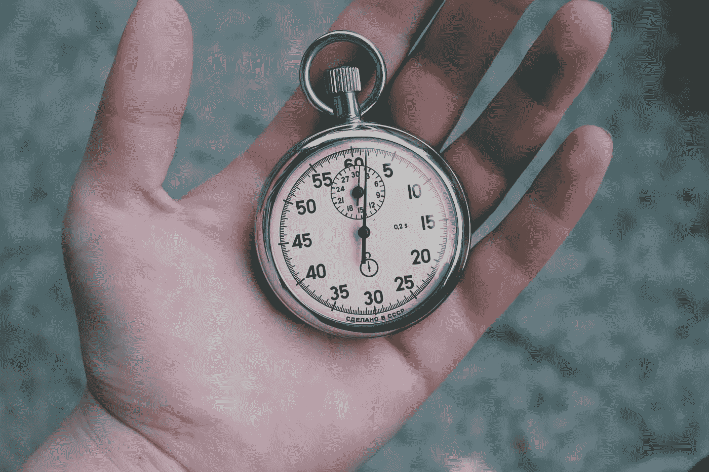

# 了解加密货币交易速度

> 原文：<https://medium.com/coinmonks/understanding-cryptocurrency-transaction-speeds-f9731fd93cb3?source=collection_archive---------1----------------------->

关于加密货币的交易速度，网上有多种说法。平均交易速度、理论交易速度、实际交易速度和声称的实际交易速度之间存在差异。

> 交易新手？试试[加密交易机器人](/coinmonks/crypto-trading-bot-c2ffce8acb2a)或者[复制交易](/coinmonks/top-10-crypto-copy-trading-platforms-for-beginners-d0c37c7d698c)

*   **平均交易速度**——硬币当前平均处理的速度。
*   **实际交易速度** —根据当前的数学计算，硬币可以处理的速度。
*   **理论交易速度** —当星星排成一行时硬币的处理速度。
*   **声称的实际交易速度** —在没有任何证据和网络量的情况下，硬币可以处理开发团队声称的事情。

目前，大多数硬币声称每秒理论交易量为 50，000 次以上。但使用最佳估计来分析实际和平均交易速度更有用，而不是像推出加密货币的公司或社区所声称的那样。

然而，还应该记住，用实时流量测试网络的最大限制几乎是不可能的。因为当它超过极限时，网络就会崩溃，留下许多不满意的客户。

# 什么是交易速度？

在分析给定加密货币的交易速度时，有两个通用标准。一个是从一个钱包到另一个钱包的时间——确认时间。另一个是每秒交易量(tps)，这是决定特定加密货币可扩展性的关键数字。

由于网络拥塞和交易时提供的费用，交易速度可能有所不同。所以它并不是一成不变的，而且在实际的交易速度上有很多相互矛盾的信息。这是一个随着网络上的新功能和额外用户而不断发展的领域。一些硬币只有测试网络，并提出大量索赔。其他有主网络，这意味着他们有真正的流量。

确认时间是平均值。因此，一枚 60 分钟确认时间的硬币可能需要 10 分钟或两个小时来确认。这将取决于硬币的方差。[莱特币](https://cryptodisrupt.com/litecoin-99-million-in-two-seconds-and-40-cents/)方差较高，因此任何给定交易所用的时间很可能比方差较低的硬币(如 DASH)更远离平均值。

# 加密货币交易速度的复杂性

但交易速度通常是有争议的，这取决于交换数据，也由于差异和不同的功能，可以加快或减慢时间。根据不同来源使用的时间段，[实际交易速度](https://howmuch.net/articles/crypto-transaction-speeds-compared)可能会有所不同。但是这些时间对于比较是有用的，即使有多个混杂变量。

关于交易速度，很多加密货币也有固定的限制。莱特币的限额是 56 tps，比特币的限额是 7。但是如果社区投票支持的话，还有一些新的特性和分支可以消除这些限制。在交易时间、可伸缩性、费用和分散化方面有许多可变因素。这往往是两者之间的权衡。这就是关于比特币的块大小辩论，它导致了比特币现金的产生。增加块大小意味着更大的最大事务速度，因此网络可以更好地扩展。

# 加密货币对比列表

下面的列表应该很好地说明了各种加密货币的交易速度，并作为有效的比较。然而，在这样一个快速变化的领域，很难获得准确的时间。除了来自该公司的声明之外，通常没有官方来源，最好的方法是从大量交易中获取时间戳，并计算出确认时间和 tps。确认时间来源于高交易量[北海巨妖](https://support.kraken.com/hc/en-us/articles/203325283-How-long-do-digital-assets-cryptocurrency-deposits-take-)。

*   根据 IBM 在 2010 年进行的测试， **Visa** 声称它可以处理 [24，000 tps](https://www.fastcompany.com/1784751/how-visa-protects-your-data) 。这个数字被广泛引用，但实际上从来没有达到实时。该公司表示，它可以处理多达 56，000。
*   PayPal 每秒可以处理大约 193 笔交易。这一数字是基于每年处理的总交易量和每秒的平均值。该公司表示，在 2015 年的网络星期一，它处理了 450 个 tps。
*   **Ripple** 可以处理 1,500 tps，确认需要 4 秒左右。团队宣称 50,000 tps。
*   **恒星**(波纹叉)能处理 1000 tps 需要 2-5 秒确认。
*   **比特币现金**可以办理 [61 tps](https://coinanalysis.io/how-many-transactions-per-second-bitcoin-cash/) 需要 60 分钟确认。
*   **莱特币**可以用 Segwit 处理 [56 tps](https://coinanalysis.io/how-many-transactions-per-second-bitcoin-cash/) 需要 30 分钟确认。
*   **比特币**可以处理 [7 tps](https://blockchain.info/charts/transactions-per-second?timespan=1week) 需要 [60 分钟](https://coincentral.com/how-long-do-bitcoin-transfers-take/)确认。目前平均为 3 tps。
*   **以太坊**可以处理 [25](https://ethereum.stackexchange.com/questions/1034/how-many-transactions-can-the-network-handle?utm_medium=organic&utm_source=google_rich_qa&utm_campaign=google_rich_qa) tps，需要 6 分钟确认。目前平均约为 15 tps。
*   [**IOTA**](https://cryptodisrupt.com/iota-a-very-expensive-abstraction/) 可以处理 1500 tps，需要 2 分钟确认。然而，[实时压力测试](http://analytics.iotaledger.net/stresstest.table)显示它目前处理 3 个 tps。
*   根据北海巨妖，Monero 大约需要 30 分钟来确认。交易速度未知，但估计在 4 tps 左右。
*   **DASH** 可以处理 28 个 tps，需要 15 分钟确认。平均 tps 约为 DASH 团队声称确认时间的数字要低得多)。

就可伸缩性和当前的交易速度而言，Ripple 是迄今为止最好的硬币。它处理 1，500 tps，大约需要 4 秒钟来确认。这一点在社区内没有争议。Ripple 在已证实的交易速度方面遥遥领先。Nano 和 Nem 声称它们分别能够达到 7000 tps 和 4000 tps。

# 其他功能

请注意，在莱特币和比特币的情况下，当使用[闪电网络](https://cryptodisrupt.com/buying-a-coffee-with-the-lightning-network-at-brisbane-airport/)时，交易速度会*大幅降低*。因此，虽然比特币的平均交易时间可能是 25 分钟，但这可能并不完全准确，交易可以在短短 30 秒内完成。

闪电网络目前正在被采用。要使用这一功能，BTC 持有者必须有一个支持闪电的钱包，如 Zap。以太坊也有 Raiden 在进行中，Dash 有 Instasend 功能，交易可以在 4 秒内完成。因此，即使是平均交易时间也可能不完全准确，因为大多数参与者没有利用某些可以显著降低费用、确认时间和增加 tps 的附加功能。

还有一点值得注意的是，Visa 用了大约 60 年的时间来发展其网络，而区块链公司的发展速度可能要快得多。这一点已经得到了证明，并且有许多项目和功能正在开发和积极部署中。

> 加入 Coinmonks [电报频道](https://t.me/coincodecap)和 [Youtube 频道](https://www.youtube.com/c/coinmonks/videos)获取每日[加密新闻](http://coincodecap.com/)

## 另外，阅读

*   [复制交易](/coinmonks/top-10-crypto-copy-trading-platforms-for-beginners-d0c37c7d698c) | [加密税务软件](/coinmonks/crypto-tax-software-ed4b4810e338)
*   [网格交易](https://coincodecap.com/grid-trading) | [加密硬件钱包](/coinmonks/the-best-cryptocurrency-hardware-wallets-of-2020-e28b1c124069)
*   [密码电报信号](/coinmonks/top-3-telegram-channels-for-crypto-traders-in-2021-8385f4411ff4) | [密码交易机器人](/coinmonks/crypto-trading-bot-c2ffce8acb2a)
*   [最佳加密交易所](/coinmonks/crypto-exchange-dd2f9d6f3769) | [印度最佳加密交易所](/coinmonks/bitcoin-exchange-in-india-7f1fe79715c9)
*   开发人员的最佳加密 API
*   最佳[密码借贷平台](/coinmonks/top-5-crypto-lending-platforms-in-2020-that-you-need-to-know-a1b675cec3fa)
*   [免费加密信号](/coinmonks/free-crypto-signals-48b25e61a8da) | [加密交易机器人](/coinmonks/crypto-trading-bot-c2ffce8acb2a)
*   [杠杆代币](/coinmonks/leveraged-token-3f5257808b22)终极指南