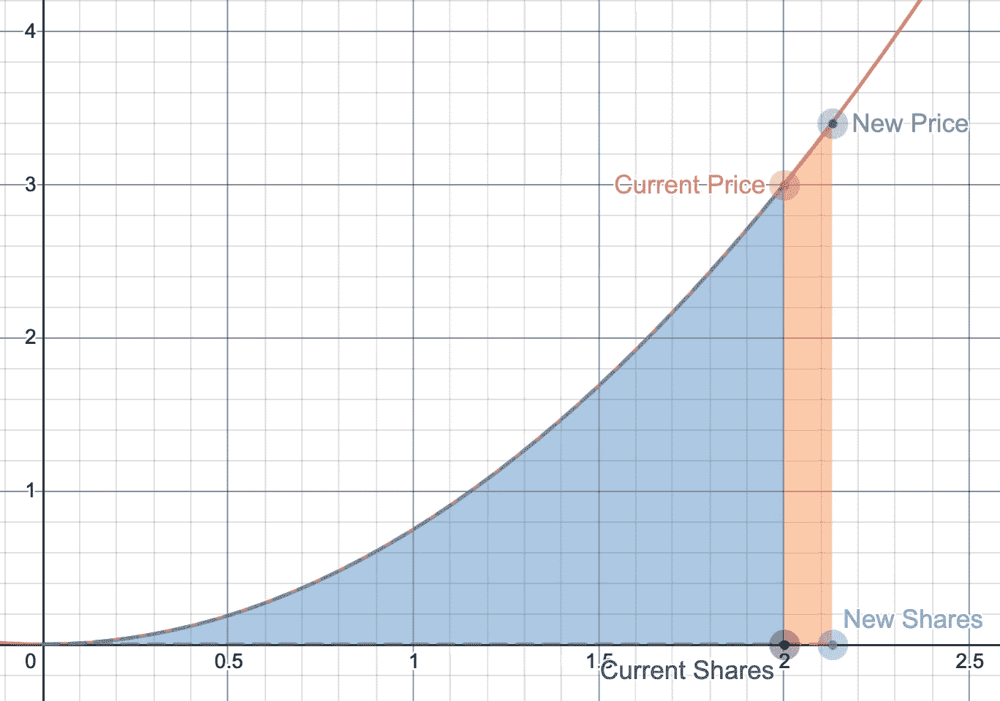

# 理解图表中的策展人奖励

> 原文：<https://medium.com/coinmonks/understanding-curators-rewards-in-the-graph-3762241bc6f6?source=collection_archive---------6----------------------->

在[图的 Testnet 策展人动员会](https://www.youtube.com/watch?v=sM8XBg8YkP8&feature=youtu.be)中，团队解释说策展人在子图上发出信号，锁定 GRT 以换取策展人奖励，该奖励作为未来查询费用的一部分支付。这些奖励是使用 [Bancor 结合曲线公式](https://drive.google.com/file/d/0B3HPNP-GDn7aRkVaV3dkVl9NS2M/view)自动计算的，其中 GRT 代币被存放，相关的份额被分配给发出特定子图的每个策展人。下面是 Bancor 系统论文公式的两个引用，它定义了粘合曲线的概念及其数学证明:a)抽象的一个练习和 b)数学定义。

> Bancor 系统允许智能合约处理代币的购买和销售，无需第二方。代币被用来交换储备的母币硬币



Figure 1\. The Bancor bonding curve

> 设 R 为母币(比如乙醚)的当前储备。让我们成为当前未偿还的代币供应。设 F 为常数部分准备金率，最后设 P 为代币现价。代币的总市值是 SP，根据定义，储备金额是它的 F 倍，R = F SP。这意味着任何时候的价格都可以计算为 P = R/SF。

```
Reserve Ratio = Reserve Token Balance / (Continuous Token Supply x Continuous Token Price) **(1)**Continuous Token Price = Reserve Token Balance / (Continuous Token Supply x Reserve Ratio) **(2)**
```

在图 1 中，X 轴代表股票，Y 轴代表价格。当你在债券曲线中存入代币时，你就增加了新的股票，结果你得到了一个新的价格。你得到的股份数量是当前股份和新股份之间的差值。总储量是曲线下的面积。为了将奖励分配给策展人，代币被直接存入储备代币余额中，并且当曲线由于储备被存入而达到不同的状态时，您可以以比您第一次铸造它们时更高的价格从您的股份中提取您的奖励。这在 Bancor 公式中是可能的，因为准备金率参数允许您将准备金放在曲线上，同时保持相同的形状、份额分布和其他特征。

可以用来理解策展人给子图发信号的经济可能性的一个类比是作为股票投资组合的子图。根据 [Investopedia](https://www.investopedia.com/terms/p/portfolio.asp) 的说法，[投资组合管理](https://www.investopedia.com/terms/p/portfoliomanagement.asp)的一个关键概念是[多样化](https://www.investopedia.com/terms/d/diversification.asp)的智慧——简单来说就是不要把所有的鸡蛋放在一个篮子里。分散投资试图通过在各种金融工具、行业和其他类别之间分配投资来降低风险。它旨在通过投资于对同一事件反应不同的不同领域来实现回报最大化。分散投资的方法有很多。你选择怎么做取决于你自己。你的未来目标、你的风险偏好和你的个性都是决定如何建立投资组合的因素。将同样的概念应用于子图，策展人可以考虑用信号传递一篮子多样化的子图，以降低整体风险，实现投资回报最大化。

我对这种通过结合曲线中的子图发出信号的奖励机制感到非常兴奋，正是因为这种微妙的策略可以用来最大化整体回报。发现新的大量使用的子图，为现有的 dApp 开发新的子图，甚至评估市场未来方向以发现新的项目类别，这些都是可以单独使用或组合使用来收集子图查询费用、累积回报并为网络提供最大价值的许多策略的例子。除此之外，你还需要根据债券曲线的变动制定一个明智的退出策略，因为你的股票价格会根据新的信号事件而变化，这将导致更多的 GRT 代币被存入储备。

在昨天发布博文 [Flight Path to Mainnet](https://thegraph.com/blog/flight-path-to-mainnet) 之后，Graph 社区充满了为加密经济构建全球分散数据层和 API 的热情，这将有助于释放 Web3 的全部潜力。在这篇博文中，我介绍了用于分配策展人报酬的 Bancor 公式，这是一个将子图理解为股票投资组合的类比，最后，我想象了策展人可以在图网络中的任务中使用的一些可能的策略。

感谢阅读！

如果您有兴趣了解更多关于图表的信息，请查看以下资源:

*   查看[图浏览器](https://thegraph.cmail20.com/t/j-l-ayhjhid-iydljjkuhy-d/)来熟悉子图
*   [不和谐服务器](https://thegraph.cmail20.com/t/j-l-ayhjhid-iydljjkuhy-u/)
*   [推特](https://twitter.com/graphprotocol?s=20)
*   [电报](https://t.me/GraphProtocol)

> 加入 Coinmonks [Telegram group](https://t.me/joinchat/EPmjKpNYwRMsBI4p) 并了解加密交易和投资

## 另外，阅读

*   [学习以太坊和 Web3 开发](http://blog.coincodecap.com/go/learn)
*   最好的[密码交易机器人](/coinmonks/crypto-trading-bot-c2ffce8acb2a)
*   [3 商业评论](/coinmonks/3commas-review-an-excellent-crypto-trading-bot-2020-1313a58bec92)
*   [Pionex 审查](/coinmonks/pionex-review-exchange-with-crypto-trading-bot-1e459d0191ea)
*   [AAX 交易所评论](/coinmonks/aax-exchange-review-2021-67c5ea09330c) |推荐代码、交易费用、利弊
*   [德里比特评论](/coinmonks/deribit-review-options-fees-apis-and-testnet-2ca16c4bbdb2) |选项、费用、API 和测试网
*   [FTX 密码交易所评论](/coinmonks/ftx-crypto-exchange-review-53664ac1198f)
*   [n 零审核](/coinmonks/ngrave-zero-review-c465cf8307fc)
*   [Bybit 交换评论](/coinmonks/bybit-exchange-review-dbd570019b71)
*   [3Commas vs Cryptohopper](/coinmonks/3commas-vs-pionex-vs-cryptohopper-best-crypto-bot-6a98d2baa203)
*   最好的比特币[硬件钱包](/coinmonks/the-best-cryptocurrency-hardware-wallets-of-2020-e28b1c124069?source=friends_link&sk=324dd9ff8556ab578d71e7ad7658ad7c)
*   [密码本交易平台](/coinmonks/top-10-crypto-copy-trading-platforms-for-beginners-d0c37c7d698c)
*   [莱杰 nano s vs x](https://blog.coincodecap.com/ledger-nano-s-vs-x)
*   [Vauld 审查](https://blog.coincodecap.com/vauld-review)
*   最好的[加密税务软件](/coinmonks/best-crypto-tax-tool-for-my-money-72d4b430816b)
*   [最佳加密交易平台](/coinmonks/the-best-crypto-trading-platforms-in-2020-the-definitive-guide-updated-c72f8b874555)
*   最佳[加密贷款平台](/coinmonks/top-5-crypto-lending-platforms-in-2020-that-you-need-to-know-a1b675cec3fa)
*   [莱杰纳米 S vs 特雷佐 1 vs 特雷佐 T vs 莱杰纳米 X](https://blog.coincodecap.com/ledger-nano-s-vs-trezor-one-ledger-nano-x-trezor-t)
*   [block fi vs Celsius](/coinmonks/blockfi-vs-celsius-vs-hodlnaut-8a1cc8c26630)vs Hodlnaut
*   Bitsgap 评论——一个轻松赚钱的加密交易机器人
*   为专业人士设计的加密交易机器人
*   [共同追踪审查](/coinmonks/cointracking-review-a-reliable-cryptocurrency-tax-software-5114e3eb5737)
*   [优霍德勒评论](/coinmonks/youhodler-4-easy-ways-to-make-money-98969b9689f2)
*   [埃利帕尔泰坦评论](/coinmonks/ellipal-titan-review-85e9071dd029)
*   [赛克斯·斯通评论](https://blog.coincodecap.com/secux-stone-hardware-wallet-review)
*   [BlockFi 评论](/coinmonks/blockfi-review-53096053c097) |赚取高达 8.6%的加密利息
*   [Coinrule 评论](https://blog.coincodecap.com/coinrule-review-a-perfect-trading-bot)
*   [最佳区块链分析工具](https://bitquery.io/blog/best-blockchain-analysis-tools-and-software)
*   [加密套利](/coinmonks/crypto-arbitrage-guide-how-to-make-money-as-a-beginner-62bfe5c868f6)指南:新手如何赚钱
*   最佳[加密制图工具](/coinmonks/what-are-the-best-charting-platforms-for-cryptocurrency-trading-85aade584d80)
*   了解比特币的[最佳书籍有哪些？](/coinmonks/what-are-the-best-books-to-learn-bitcoin-409aeb9aff4b)

> [直接在您的收件箱中获得最佳软件交易](/coinmonks/newsletters/coinmonks)

[](https://medium.com/coinmonks/newsletters/coinmonks)