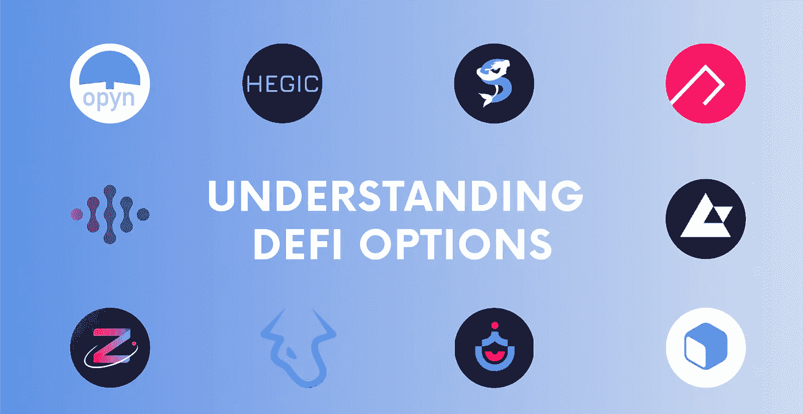

# 了解 Defi 选项(Opyn、Hegic、SIREN、Ribbon Finance 等)

> 原文：<https://medium.com/coinmonks/understanding-defi-options-opyn-hegic-siren-ribbon-finance-and-more-4f05477037b0?source=collection_archive---------4----------------------->

由于以太坊的可组合性和构建大量金融工具的机会，分散金融(Defi)已经发展起来。过去一年，许多项目已经成熟，并提供了长期基础设施。

以太坊可以被视为数字金融的乐高积木，随着市场的成熟，传统的金融衍生工具…