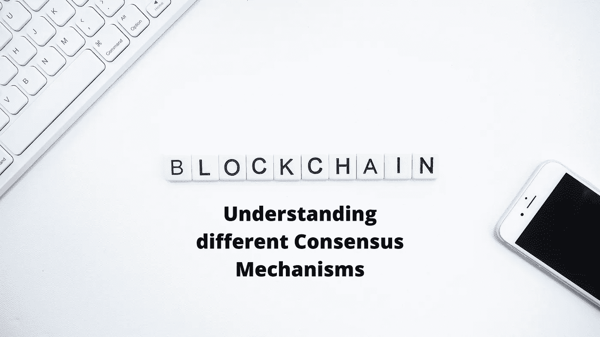
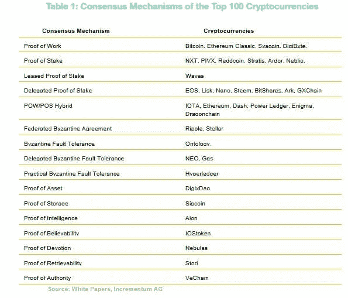

# 了解不同的共识机制

> 原文：<https://medium.com/coinmonks/understanding-different-consensus-mechanisms-77f088eaacd8?source=collection_archive---------1----------------------->

区块链网络由一系列形成分布式架构的节点组成。这些节点需要对齐并同步运行，以维护网络的安全性。因此，共识的概念被设计来维持区块链网络中的和谐。

共识机制可以定义为所有节点遵守相同规则或协议的过程。这些共识机制对于区块链网络的正常运行非常重要。该网络由许多进行交易的用户共享。这些事务被进一步验证，以将其添加到块中，然后添加到链中。因此，需要定期检查交易和网络，以维护网络的安全。因此，一个良好的共识机制或协议是强制性的，以保护网络免受各种攻击。

这些协议应该是高效的、安全的、可靠的和实时的，以便它们能够检查交易的真实性，并且网络参与者通常同意其结果。

> [在 CoinCodeCap 上购买最佳加密交易](https://coincodecap.com/deals)

**不同的共识机制**

基于不同的原则，有不同种类的共识机制。

**1。** **工作证明(PoW)**

工作证明是有史以来第一个共识机制，并被比特币采用。之后变得非常有名，后来在以太坊、莱特币等上实现。该算法是基于解决一个非常难以破解的复杂数学难题。解决它的节点然后广播结果以供验证。一旦通过验证，这些块就被添加到网络中。这个算法也奖励解决难题的矿工。

虽然 PoW 已经提供了使网络对黑客防弹所非常需要的期望的安全性，但是多年来由于其解决复杂数学难题所需的高能量和资源需求而受到批评。但这也是比特币网络如此值钱的原因。

**2。** **股权证明(PoS)**

这个算法基于验证器的赌注。基于包括赌注年龄和节点财富的不同因素的组合来决定验证器。任何想要参与伪造活动的网络用户向网络中投入一定数量的硬币。这是通过发送一个特殊的交易来完成的，该交易将锁定他们的基础加密货币(在以太坊的情况下，是以太)。赌注大小决定了一个节点被选为下一个伪造下一个块的验证者的几率。赌注越大，机会就越大。

该算法于 2011 年推出，旨在通过工作证明来解决问题。

一些加密硬币，如 Nxt (NXT)、Blackcoin、ShadowCoin 和 Peercoin (PPC)使用 PoS 方法。以太坊(ETH)也在改用 PoS 系统。

**优点:**

增强的安全性

更多权力下放

更少的能量

更高的透明度

**3。** **授权证明**

在 PoA 共识模型中，身份被选择为利益的形式，而不是利益的象征。这是加强版的股权证明。一组验证者已经被选为权威。他们的任务是检查和验证所有新添加的身份，验证要添加到网络中的事务和数据块。为了确保网络中的效率和安全性，验证器组通常保持较小的规模(大约 25 个或更少)。

PoA 是由一群开发人员在 2017 年 3 月提出的(由 Gavin Wood 创造)，作为基于以太坊协议的区块链。它是为了解决以太坊的 Ropsten 测试网络上的垃圾邮件攻击问题而开发的。这个新网络被命名为科万。它是今天所有以太坊用户的主要测试网络。

使用 PoA 的项目:Kovan、Rinkeby、TomoChain、Swarm City、Go Chain 等。

**PoA 网络的特征:-**

与电力相比，能量消耗更少。

不需要通信来达成节点之间的共识。

网络操作与可用的真正节点的数量无关。

一个节点成为锻造厂的机会取决于它的股份和总持有量。

**4。****【DPOS(委托股权证明)**

2014 年，Dan Larimer 开发了委托利益证明(DPoS)共识算法。该算法被认为比前面的 PoS 机制更有效。

DPoS 算法基于一个投票系统，利益相关者投票给第三方来外包工作。这些委托被称为见证，负责新块的生成和验证。投票权与每个用户持有的硬币数量成正比。此外，它因项目而异。当要求投票时，每个代表提出一个单独的提议。代表们获得的奖励按比例与他们各自的选民分享。

由于 DPoS 系统基于投票系统并由投票人维护，因此它直接依赖于代表的声誉。正因为如此，代表们被鼓励诚实和高效，否则他们将被淘汰出局。

使用 DPoS 共识算法的加密货币项目- Bitshares、Steem、Ark 和 Lisk **。**

DPOS 的主要优势在于它更具可扩展性，即与 POW 和 POS 相比，它每秒可以处理更多的事务。

**5。** **混合动力/位置**

开发混合工作证明和利益证明系统的想法是最大化两种方法的优点和最小化其缺点(PoW/PoS)。

这种方法允许采矿和打桩在社区外的人(矿工)和社区内的人(利益相关者)之间建立平衡。在这个模型中，PoW 矿工创建包含要添加到区块链的事务的新块。当这些区块被创建时，PoS 矿工投票决定是否确认它们。PoS 矿工标上他们代币的一部分；股份越大，投票权就越大。然而，混合共识机制随机选择 5 个“投票”来确定有效性，而不是计数总投票数来检查新创建的块的有效性；如果 5 票中有 3 票是肯定的，则该区块被确认并添加到区块链中。作为奖励，战俘矿工获得 60%的街区奖励，PoS 矿工获得 30%，剩下的 10%专用于开发工作。

通过使用 PoS 投票，这些系统保护网络免受 51%的攻击，因为它提供了一个额外的验证层。

**6。** **委派拜占庭容错(dBFT)**

这种共识算法是由 NEO 的开发者发明的，NEO 是世界上最大的构建和部署分散应用程序(dApps)的平台之一。该方法与 PoS 非常相似，即投票选择代表和发言人。

所有近地天体令牌持有者(普通节点)都有权投票选举代表，无论他们持有多少令牌。

任何代币持有人只要符合以下条件，都可以成为代表

可靠的互联网连接。

特定设备。

一千块汽油。

从这些代表中随机选出一名发言人。这些发言人被期望跟踪所有的交易并在网络上记录下来。从需要验证的交易中形成新的块。一旦形成，议长发送验证的建议给当选的代表。如果超过三分之二的代表达成共识并批准，该区块将被添加到区块链。

***让我知道你对这篇文章的看法。请务必阅读我的其他文章，在这些文章中，我深入探讨了区块链的各个技术方面。***

> [直接在您的收件箱中获得最佳软件交易](https://coincodecap.com/?utm_source=coinmonks)

