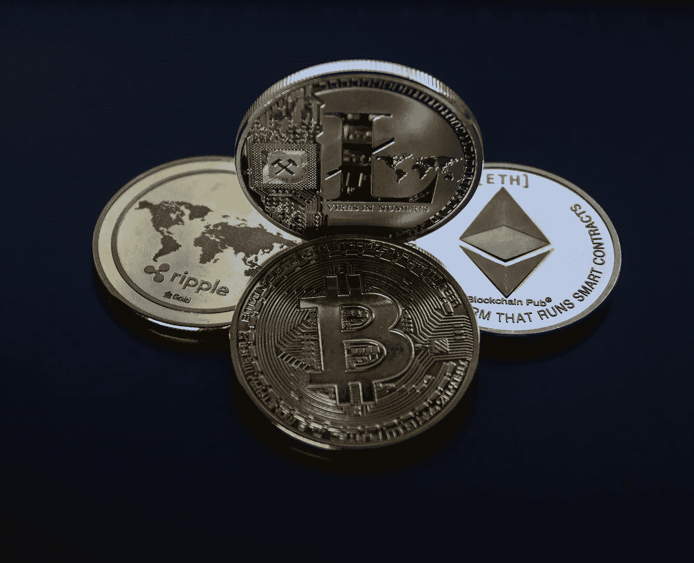

# 了解不同的加密货币

> 原文：<https://medium.com/coinmonks/understanding-different-cryptocurrencies-98f74e6e79f9?source=collection_archive---------8----------------------->

## 所有不同类型的硬币可以压倒一切。我是来让它更容易理解的。

加密货币的世界在过去几年里有了显著的发展。有许多不同的硬币和代币，涵盖了一吨不同的功能，但有五个组成了目前最流行的密码。这是一个非常令人生畏的空间，有如此多的信息要吸收，所以为了让它变得简单一点，我们将在这里查看前五个。

# **数字现金**

只有从最广为人知的加密货币开始才有意义。数字现金试图创造一种被广泛接受的分散支付方式。由于没有中间人或银行来管理资金转移，通常涉及的费用更少，过程更透明，因为大多数信息在分类账中是公开的。

比特币是迄今为止最大的数字现金，其增长速度超出了所有人的预期。创造者中本聪设想了一个完全点对点的电子现金系统，不依赖于第三方。这个目标实现了，但是网络的增长超出了它的合理处理能力，这导致了更高的费用和更长的交易时间。因此，有许多其他项目旨在以最低的费用和更快的交易时间创造真正的数字现金。

**数字现金的例子:**

*   比特币
*   莱特币
*   Dogecoin
*   比特币现金
*   毫微；纤（10 的负九次方）

# **站台**

区块链有无限的可能性，其中许多是通过链条实现的，链条的功能不仅仅是一种货币，而是一个平台。智能合约是这里的游戏规则改变者；智能合约规定了在什么条件下可以在没有第三方干预的情况下交易硬币和代币。

开发人员能够利用智能合约功能在这些平台上创建分散式应用程序，也称为 dApps。最受欢迎的是分散式金融交易所和 dex，我稍后会讲到。以太坊上制作的游戏也开始获得一些关注，这带来了更多的机会。

虽然以太坊是老大，但它确实受到网络拥塞的困扰，这导致一些人寻求创建一个更有效的平台。这就是币安智能链的用武之地。该平台由币安创建，于 2020 年底推出，已经爆炸式增长，有许多 dApps 可以与以太坊的平台相媲美，随着开发者寻求更可持续的网络，更多 dApps 将会出现。

**区块链平台示例:**

*   以太坊
*   币安智能连锁
*   Cardano(智能合约功能将于今年晚些时候推出)

# **隐私币**

出于对数字现金的同样想法，还有另一个领域更关注货币的隐私方面。我们期望我们的银行和现实世界的金融有一定程度的保密性，那么为什么不期望我们的加密货币也有同样的保密性呢？隐私硬币旨在提供不同级别的匿名性和保密性。在大多数情况下，它们的功能与数字现金相同，但在公众眼中隐藏了许多交易细节。

Monero 是目前最受欢迎的隐私硬币，它的功能相当于数字现金区块链，可以模糊交易数据，以隐藏交易双方的匿名性。虽然许多是一种货币，但也有一些旨在为智能合同提供面向隐私的平台，如 Secret Network。基本上，秘密网络可以比作以太坊区块链，除了它使用一些不同的方法来提供完全私有和安全的 dApps。

**隐私币示例:**

*   莫内罗
*   秘密网络
*   Zcash
*   破折号

# **Stablecoins**

常规加密货币价值的不稳定性可以被视为它的负面标志，因此有一些硬币旨在创造稳定的数字现金渠道。稳定的货币与实际的法定货币挂钩，因此除非货币本身升值或贬值，否则它们的价值不一定会改变。稳定硬币有许多不同的应用，更常见的是可以用来交易没有固定交易对的代币或硬币。

虽然有点争议，但 Tether 是目前最大的稳定硬币网络，提供与美元、欧元和人民币挂钩的硬币。

**稳定的例子**

*   极限
*   美元硬币
*   奶妈

# **分散兑换令牌**

尽管深入研究去中心化交易所(dex)超出了本文的范围，但是很难不在这里提到它们，因为它们已经非常流行了。它们允许点对点交易，通常是在集中交易所正式上市前获得代币的一种方式。

Uniswap 是目前最受欢迎的。它建立在以太坊平台上，提供了任何基于以太坊的代币相互交换的能力。使用它最大的弊端就是 Eth 相关的交易费用。智能合约通常也有更高的交易价格。

通常，属于 DEX 的令牌是治理令牌。他们允许用户对平台的开发决策进行投票。

虽然大多数都是建立在以太坊上，但币安智能链已经有所增长。开发商来到币安，试图利用与区块链相关的较低费用。PancakeSwap 是目前最受欢迎的币安智能链 DEX。

**dex 的例子:**

*   Uniswap
*   SushiSwap
*   薄饼交换
*   1 英寸(尽管这是一个 DEX 聚合器，而不是真正的交易所)

请记住，这些只是众多不同加密货币领域中的一小部分。这些都有增加空间的价值，其中许多可以同时成为不同部门的一部分。你可以在加密货币中找到几乎任何你能想到的代币，这也是这个空间如此有趣的部分原因！关于 crypto 还有很多东西需要学习。

> 加入 Coinmonks [Telegram group](https://t.me/joinchat/EPmjKpNYwRMsBI4p) 并了解加密交易和投资

## 另外，阅读

*   [什么是融资融券交易](https://blog.coincodecap.com/margin-trading)
*   最好的[密码交易机器人](/coinmonks/crypto-trading-bot-c2ffce8acb2a) | [网格交易](https://blog.coincodecap.com/grid-trading)
*   [3 商业评论](/coinmonks/3commas-review-an-excellent-crypto-trading-bot-2020-1313a58bec92) | [Pionex 评论](/coinmonks/pionex-review-exchange-with-crypto-trading-bot-1e459d0191ea) | [Coinrule 评论](/coinmonks/coinrule-review-2021-a-beginner-friendly-crypto-trading-bot-daf0504848ba)
*   [AAX 交易所评论](/coinmonks/aax-exchange-review-2021-67c5ea09330c) | [德里比特评论](/coinmonks/deribit-review-options-fees-apis-and-testnet-2ca16c4bbdb2) | [FTX 交易所评论](/coinmonks/ftx-crypto-exchange-review-53664ac1198f)
*   [n 零审核](/coinmonks/ngrave-zero-review-c465cf8307fc) | [Phemex 审核](/coinmonks/phemex-review-4cfba0b49e28) | [PrimeXBT 审核](/coinmonks/primexbt-review-88e0815be858)
*   [Bybit Exchange 审查](/coinmonks/bybit-exchange-review-dbd570019b71) | [Bityard 审查](/coinmonks/bityard-review-7d104239be35) | [CoinSpot 审查](https://blog.coincodecap.com/coinspot-review)
*   [3 commas vs crypto hopper](/coinmonks/3commas-vs-pionex-vs-cryptohopper-best-crypto-bot-6a98d2baa203)|[赚取加密利息](/coinmonks/earn-crypto-interest-b10b810fdda3)
*   最好的比特币[硬件钱包](/coinmonks/the-best-cryptocurrency-hardware-wallets-of-2020-e28b1c124069?source=friends_link&sk=324dd9ff8556ab578d71e7ad7658ad7c) | [BitBox02 回顾](/coinmonks/bitbox02-review-your-swiss-bitcoin-hardware-wallet-c36c88fff29)
*   [莱杰 vs n ave](/coinmonks/ledger-vs-ngrave-zero-7e40f0c1d694)|[莱杰 nano s vs x](/coinmonks/ledger-nano-s-vs-x-battery-hardware-price-storage-59a6663fe3b0)
*   [密码本交易平台](/coinmonks/top-10-crypto-copy-trading-platforms-for-beginners-d0c37c7d698c)
*   [CoinLoan 评论](/coinmonks/coinloan-review-18128b9badc4) | [YouHodler 评论](/coinmonks/youhodler-4-easy-ways-to-make-money-98969b9689f2) | [BlockFi 评论](/coinmonks/blockfi-review-53096053c097)
*   最好的[加密税务软件](/coinmonks/best-crypto-tax-tool-for-my-money-72d4b430816b) | [硬币追踪评论](/coinmonks/cointracking-review-a-reliable-cryptocurrency-tax-software-5114e3eb5737)
*   最佳[加密借贷平台](/coinmonks/top-5-crypto-lending-platforms-in-2020-that-you-need-to-know-a1b675cec3fa) | [杠杆代币](/coinmonks/leveraged-token-3f5257808b22)
*   [block fi vs Celsius](/coinmonks/blockfi-vs-celsius-vs-hodlnaut-8a1cc8c26630)|[Hodlnaut 评论](/coinmonks/hodlnaut-review-best-way-to-hodl-is-to-earn-interest-on-your-bitcoin-6658a8c19edf)
*   [Bitsgap 审查](/coinmonks/bitsgap-review-a-crypto-trading-bot-that-makes-easy-money-a5d88a336df2) | [Quadency 审查](/coinmonks/quadency-review-a-crypto-trading-automation-platform-3068eaa374e1) | [Bitbns 审查](/coinmonks/bitbns-review-38256a07e161)
*   [埃利帕尔泰坦评论](/coinmonks/ellipal-titan-review-85e9071dd029) | [赛克斯斯通评论](/coinmonks/secux-stone-hardware-wallet-review-15-discount-coupon-2020-7577032faa6e)
*   [本地比特币审核](/coinmonks/localbitcoins-review-6cc001c6ed56) | [加密货币储蓄账户](https://blog.coincodecap.com/cryptocurrency-savings-accounts)
*   最佳[区块链分析](https://bitquery.io/blog/best-blockchain-analysis-tools-and-software)工具| [赚比特币](/coinmonks/earn-bitcoin-6e8bd3c592d9)
*   [加密套利](/coinmonks/crypto-arbitrage-guide-how-to-make-money-as-a-beginner-62bfe5c868f6)指南| [如何做空比特币](/coinmonks/how-to-short-bitcoin-568a2d0b4ae5)
*   最佳[加密制图工具](/coinmonks/what-are-the-best-charting-platforms-for-cryptocurrency-trading-85aade584d80) | [最佳加密交易所](/coinmonks/crypto-exchange-dd2f9d6f3769)
*   [如何在印度购买比特币？](/coinmonks/buy-bitcoin-in-india-feb50ddfef94) | [WazirX 审核](/coinmonks/wazirx-review-5c811b074f5b)
*   [印度比特币交易所](/coinmonks/bitcoin-exchange-in-india-7f1fe79715c9) | [比特币储蓄账户](/coinmonks/bitcoin-savings-account-e65b13f92451)
*   [CoinDCX 评论](/coinmonks/coindcx-review-8444db3621a2) | [加密保证金交易交易所](https://blog.coincodecap.com/crypto-margin-trading-exchanges)

> [直接在您的收件箱中获得最佳软件交易](/coinmonks/newsletters/coinmonks)

