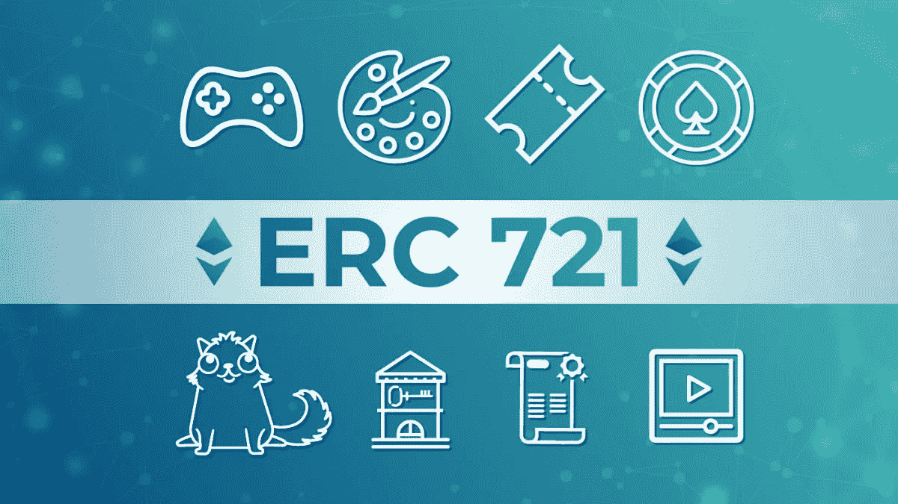
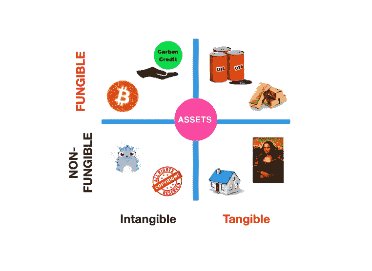
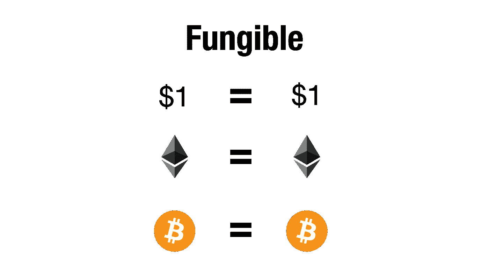
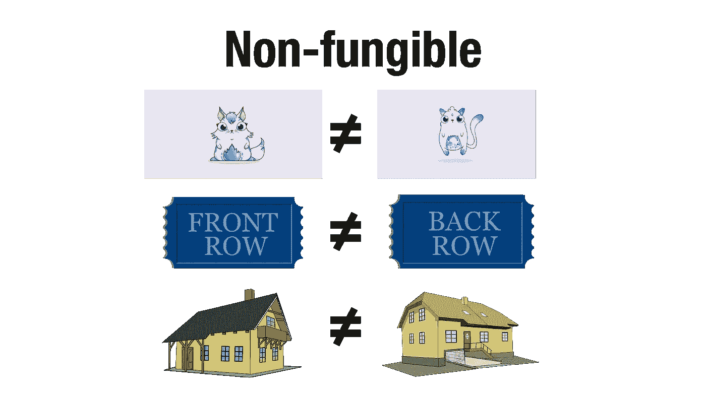

# 从开发者的角度解读 ERC721 令牌标准&资产的可替代性。

> 原文：<https://medium.com/coinmonks/understanding-erc721-token-standard-fungibility-of-assets-from-a-developers-perspective-1d17440ad439?source=collection_archive---------3----------------------->



# 首先，代币到底是什么？

用更简单的术语来说，代币可以被视为特定平台内价值的代表，能够被交易为服务、货币、时间甚至公司股份等。

在[区块链](https://blog.coincodecap.com/what-is-blockchain-a-simple-guide-for-dummies/)空间中，代币的整个概念主要是受现实生活中代币使用的启发。

## 想象一个电影院

理解令牌的最佳方式是举一个真实世界的例子，比如电影院。

在你进入电影院之前，你需要兑换你的电影票。

> ***那些票其实可以看做代币。***

在电影院内，真钱并不真的有任何价值(*除非里面的经理是腐败的*)，但票有。

这些票现在有足够的价值来换取大厅里的一个座位。事实上，你在这个大厅里想要的几乎所有东西或服务，完全取决于你所拥有的票的种类。

你有越多的票，你就有越多的座位。你的机票越贵，你的座位质量就越好。


## 门票是代币，大厅是 DAPP

现在，只需用一个[分散式应用程序(DAPP)](https://blog.coincodecap.com/what-are-dapps-an-ultimate-guide) 和带有 DAPP 中允许的加密令牌的电影票来交换整个电影院的想法。

就是这样。你已经掌握了代币的本质。

因此，可以毫无疑问地说，令牌扮演了一个必不可少的角色，因为它们让您可以访问 DAPP 提供的某些功能或服务，并充当该特定平台内的交换媒介。

# **可替代性的概念**

在理解 ERC721 的基本概念之前，我们必须理解两种最重要的令牌。



## **可替换令牌**

这代表了我们日常生活中非常熟悉的简单类型的标记。



一个可替换的令牌可以被定义为那些等价的以及容易互换的令牌。例如，一张 100 卢比的钞票可以兑换成任何其他 100 卢比的钞票，因为所有这些钞票都是一样的，持有相同数量的价值。

可替代资产没有独特性，因为它们已经大量存在。你的 100 卢比和我的纸币在各个方面都很相似，即大小、形状、颜色和价值。因此，可替代资产不存在唯一性。

此外，这些可替代资产可以分割成更小的单位，这并不重要，因为所有更小单位的价值仍然保持不变。

例如，一张 100 卢比的钞票可以分成两张 50 卢比的钞票，甚至可以分成十张 10 卢比的钞票。这没什么大不了的，因为所有这些小面值的纸币加在一起和 100 卢比纸币的价值是一样的。

然而，对于[不可替代代币](https://blog.coincodecap.com/non-fungible-tokens-explained)，情况并非如此。

## **2。不可替代代币**



与可替代资产不同，不可替代代币(NFT)根本不可互换和等价。

NFTs 可以简单地理解为所有那些因其独特性、有用性和稀有性而存在价值的资产。

NFTs 可以简单地理解为所有那些因其独特性、有用性和稀有性而存在价值的资产。

不可替代资产的最好例子是绘画或独特的艺术品。每幅画都是独一无二的，都有自己独特的方式。

现在，这些绘画属于不可替代资产的范畴，因为它们都是不同的、稀有的，最重要的是独一无二的。这意味着与可替换的令牌不同，NFT 不能简单地交换。

此外，它们不像可替代资产那样可以分割，因为一旦分割，它们就失去了实际价值。

> 因此，可替代资产处理的是你拥有代币的数量( ***多少*** )，而不可替代资产更多的是你拥有代币的质量(*)。*

# *进入 ERC721*

*2017 年末，Dieter Shirley 推出了一个名为 ERC721 的以太坊改进提案。*

## *为什么是 ERC721 而不是 ERC20？*

*以太坊社区已经有了一个名为 ERC20 代币的有效标准，用来代表和跟踪区块链上的可替换代币。*

*然而，跟踪 NFT 超出了 ERC20 的能力，因为与可替换的令牌不同，每个 NFT 都是不同的。*

***尽管 ERC721 受到 ERC20 协议的启发，但它为不可替代的令牌提供了一个修改后的有效标准接口。***

*虽然 ERC721 代币可以在任何交易所使用，但它们的价值却很不相似，很大程度上取决于它们的独特性和稀有性。*

*此外，与 ERC20 令牌不同，ERC721 令牌标准中不可替换令牌的价值很大程度上取决于它们的唯一性和稀有性。*

# *深入研究 ERC721 合同*

*使 ERC721 不同于 ERC20 的事实实际上可以在其智能合同中找到。*

*尽管 ERC721 遵循 ERC20 的基本程序，但 ERC721 中的某些功能也允许我们跟踪不可替代的资产。*

*让我们深入了解更多关于 ERC721 合约及其独特功能的信息。*

***ERC 721 中的命令功能***

*   *`balanceOf(owner)`*
*   *`ownerOf(tokenId)`*
*   *`safeTransferFrom(from, to, tokenId)`*
*   *`transferFrom(from, to, tokenId)`*
*   *`approve(to, tokenId)`*
*   *`getApproved(tokenId)`*
*   *`setApprovalForAll(operator, _approved)`*
*   *`isApprovedForAll(owner, operator)`*
*   *`safeTransferFrom(from, to, tokenId, data)`*

***ERC 721 中的重要事件:***

> *转移*
> 
> *同意*
> 
> *批准全部*

# *对 ERC721 功能和事件的深入分析*

*ERC721 Interface*

## ***所有权人***

> ***语法:***
> 
> *`function ownerOf(uint256 _tokenId) external view returns (address);`*

***功能参数** r:*

> *_ token Id-为每个 NFT 分配的唯一 ID。*

***它的作用:**简单地查找特定 NFT 的所有者。*

***返回内容:**返回拥有 NFT 的所有者的地址。*

***抛出错误:**如果作为参数传递的 tokenId 没有任何所有者，那么这样的 NFT 是无效的。*

## *安全转移自:*

> ***语法:***
> 
> *`function safeTransferFrom(address _from, address _to, uint256 _tokenId, bytes data) external payable;`*

***功能参数:***

> **_* 出自*——NFT*的现任主人*
> 
> *_ 新所有者的收件人地址*
> 
> *_ token Id-要传输的 NFT 的唯一 ID。*
> 
> *_ Data-附加数据。*

*它的主要任务是将所有权从一个地址转移到另一个地址。*

***抛出错误:**该函数可以在 5 种关键情况下抛出错误。理解它们中的每一个都是非常必要的。*

> *a.如果 msg.sender 不是当前的所有者、授权的操作者或者要传输的 NFT 的批准地址，它将抛出一个错误。*
> 
> *b.如果 *_from* 参数不包含当前所有者的地址，则会抛出错误。*
> 
> *c.如果*_ 至*参数为零地址(无效地址)。*
> 
> *d.如果令牌 Id 不是有效的 NFT。*

***注意:即使在传输完成后，该函数也会抛出错误。***

> *e.必须理解的最重要的部分之一是，一旦传输完成，该函数就检查参数中传递的 *_to* 地址是外部拥有的帐户(由个人拥有)还是合同地址(由合同拥有)。*

*如果 _ *到*地址是一个约定地址(代码大小> 0)，那么它调用一个``onERC721Received` function on `_to` address.`*

*然后，它检查返回值是否等于:*

> *``bytes4(keccak256("onERC721Received(address,address,uint256,bytes)"))`.`*

*如果返回值不同，那么它抛出一个错误。*

## ***转自***

> ***语法:***
> 
> *`function transferFrom(address _from, address _to, uint256 _tokenId) external payable;`*

***功能参数:***

> **来自-*NFT 的现任主人*
> 
> **至*-新所有人的地址*
> 
> **token Id*-要传输的 NFT 的唯一 ID。*

***它的作用:**它还将 NFT 的所有权从一个地址转移到另一个地址。然而，这个函数和 safeTransferFrom 函数有一个重要的区别。*

> *在这个函数中，调用者负责确认 NFT 的接收者能够接收 NFTs。*
> 
> *否则，一旦完成该功能的执行，NFTs 可能会丢失。*

***抛出错误:***

> *a.如果 msg.sender 不是当前的所有者、授权的操作者或者要传输的 NFT 的批准地址，它将抛出一个错误。*
> 
> *b.如果参数中的*_ 不包含当前所有者的地址，则会抛出错误。**
> 
> *c.如果*_ 至*参数为零地址(无效地址)。*
> 
> *d.如果 _ *tokenId* 不是有效的 NFT。*

## ***批准***

> ***语法:***
> 
> *`function approve(address _approved, uint256 _tokenId) external payable;`*

***功能参数:***

> **_ 批准-特定 NFT 的新批准地址**
> 
> **token Id-要批准的 NFT 的唯一 ID。**

***功能:**该功能用于更改或确认 NFT 的批准地址。*

***抛出错误:***

> *a.如果 msg.sender 不是当前的所有者、授权的操作者或者要传输的 NFT 的批准地址，它将抛出一个错误。*
> 
> *b.如果 _ *tokenId* 不是有效的 NFT。*

## *setApprovalForAll*

> ***语法:***
> 
> *`function setApprovalForAll(address _operator, bool _approved) external;`*

***功能参数:***

> **_ 操作员-将被批准控制 NFTs 的操作员的地址**
> 
> **_ approved-如果要批准所提供的操作员，则为 True 如果要撤销批准，则为 False。**

***它的作用:**这是最重要的功能之一，因为它允许 NFT 的所有者允许或阻止某些第三方(即运营商)管理他/她的所有 NFT。*

***抛出错误:***

*a.如果 msg.sender 不是当前的所有者、授权的操作者或者要传输的 NFT 的批准地址，它将抛出一个错误。*

## ***获得批准***

> ***语法:***
> 
> *`function getApproved(uint256 _tokenId) external view returns (address);`*

***功能参数:***

> **token Id-要批准的 NFT 的唯一 ID。**

***它的作用:**这是一个简单的函数，为我们提供一个 NFT 的批准地址。*

***返回内容:**返回特定 NFT 的批准地址。如果 NFT 没有批准的地址，它将返回零地址。*

***抛出错误:**如果 _ *tokenId* 不是有效的 NFT。*

## ***全部被批准***

> ***语法:** `function isApprovedForAll(address _owner, address _operator) external view returns (bool);`*

***功能参数:***

> *_ *主人——NFT 的主人**
> 
> *_ *经营者——代表所有人行事的第三方的地址。**

***功能:**该功能为我们提供操作员是否被授权使用另一个地址的信息。*

***返回内容:**如果 _operator 是所有者的批准地址，则返回 True，否则返回 False。*

***ERC 721 中的重要事件:***

## *转移事件:*

```
*event Transfer(address indexed _from, address indexed _to, uint256 indexed _tokenId);*
```

*每当任何 NFT 的所有权从一个地址更改为另一个地址时，都会发出此事件。*

## *2.批准事件*

```
*event Approval(address indexed _owner, address indexed _approved, uint256 indexed _tokenId);*
```

*每当转换或重新确认特定 NFT 的批准地址时，都会发出批准事件。*

## *3.ApprovalForAll 事件*

```
*event ApprovalForAll(address indexed _owner, address indexed _operator, bool _approved);*
```

*仅当允许或阻止第三方或操作员代表用户使用特定用户的 NFTs 时，才会触发此事件。*

*一旦获得许可，运营商可以管理所有者的所有 NFT。*

# *不可替换令牌的最佳使用案例*

*NFT 有一组完全不同的属性，这使得它与传统的可替换令牌完全不同。*

> *因此，在使用 NFT 或开始开发自己的 NFT 之前，您非常有必要了解不可替代的令牌的最佳使用方式。*

*NFTs 的一些最著名的应用如下:
***游戏
收藏品
许可****

## *游戏中的 NFTs*

**

*游戏中最著名的 NFT 用例之一无疑是 Cryptokitties。*

*事实上，这是 NFTs 的第一个最佳用例之一，吸引了人们对 NFTs 和 ERC721 令牌标准的极大关注。*

*随着 NFTs 的使用，这种游戏极大地扩展了它的边界，人们已经为这些独特的密码猫花费了超过 650 万美元。*

## *许可中的 NFTs*

*软件许可是 NFTs 的另一个最佳用例。*

*人们普遍认为，在许可中使用 NFTs 不仅可以减少盗版，还可以让人们通过在公开市场上出售他们的许可证来赚取利润。*

> *我猜你已经准备好开始使用 ERC721 令牌了。*
> 
> *祝你好运！*

# *关于我自己*

## *我是谁？🙋🏻‍♂️*

*𝙃𝙞, 𝙄 𝙖𝙢 𝙕𝙖𝙧𝙮𝙖𝙗 👋🏻我是一名精通区块链和智能合同的工程师，我的愿景是用 Web3 去中心化和保护传统网络。主要从事智能合约工作，在开发和智能合约安全方面都有丰富的经验。*

## *我做什么🧑🏼‍💻*

*   *我撰写安全和优化的智能合同*
*   *我对智能合同进行安全审计，并提高 EVM 连锁店智能合同的整体安全性*
*   *我撰写和谈论 Web3 和智能合约&为扩展 Web3 的边界贡献我的一份力量。*

## *打声招呼，保持联系🤝*

*[领英](https://www.linkedin.com/in/zaryab-afser-97085b157/)。| [推特](https://twitter.com/zaryab_eth)。| [Github](https://github.com/zaryab2000) 。| [邀请我参加 Web3 活动](https://zaryab2000.notion.site/Invite-me-to-your-Next-Web3-Event-78bcd204b866426687e1afbcdc61c5c7)*