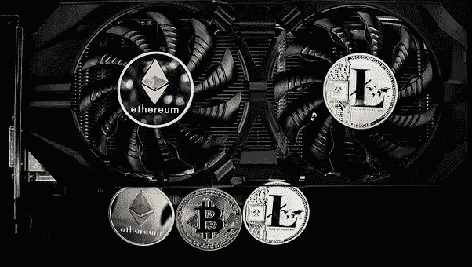
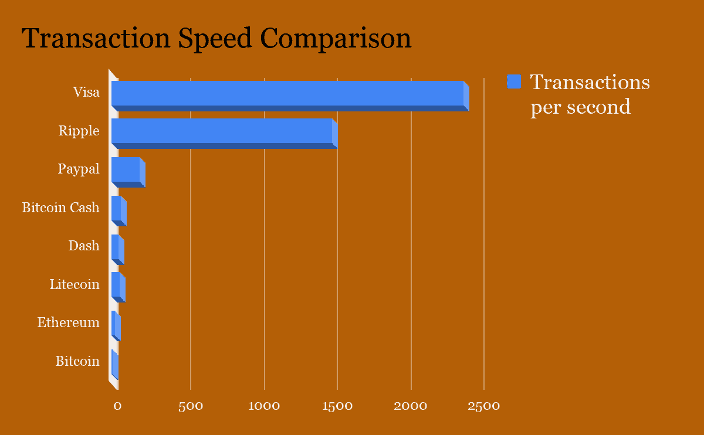
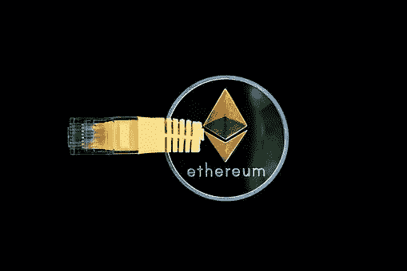

# 理解以太坊——相关问题、可扩展性和可能的解决方案。

> 原文：<https://medium.com/coinmonks/understanding-ethereum-pertinent-problems-scalability-and-possible-solutions-eb4fec0405be?source=collection_archive---------1----------------------->

# **总结**

区块链为安全和分散的支付转移提供了一种创新的解决方案。在区块链技术的帮助下开发的加密货币彻底改变了我们进行交易的方式，并注入了一定程度的安全性和透明度，否则将受到监管和控制。以太坊不仅仅是一个点对点数字货币转移的平台，还通过智能合约提供了更大的灵活性和更广泛的区块链技术应用。这使得它成为最受欢迎的区块链之一，并导致近年来其区块链的流量呈指数增长。通过智能合约，在以太坊的区块链之上开发了其他几种加密货币，许多企业依赖这项技术进行商业交易和日常转账。这些发展的主要问题是，它对以太坊区块链的交易处理速度产生了负面影响，这反过来对该技术的可扩展性构成了切实的威胁。

我们发现以太坊区块链上每秒的交易数量非常低，事实上，拥塞使得交易验证成为一个漫长的过程，用户经常要等待几个小时。随着区块链的增长，块的大小也在增加，并且由于每个节点都必须具有完整的数据区块链状态来验证和处理事务，因此处理事务变得越来越困难和耗时。提高交易速度和实现无缝交易的挑战是明确的，本质上也是复杂的，但是有一些可行的解决方案。尽管某些解决方案损害了平台提供的分散化水平，但它们仍然使交易处理更快、更安全。迫切需要开发探索创新和经过测试的解决方案，通过提高交易处理速度来使以太坊的区块链具有可扩展性。

# 背景

近年来，由革命性的区块链技术驱动的加密货币变得越来越受欢迎，因为它们提供相对安全和更快的交易。加密货币开发背后的核心理念是安全、匿名和快速无缝的交易(Bonneau 等人，2015 年)。虽然比特币是第一种流行的加密货币，但紧随其后的是以太坊及其以太令牌。彻底改变整个加密市场以太坊的开发是为了使整个交易过程完全去中心化。它超越了现有加密货币(例如比特币)的流行功能，后者仅限于数字令牌的点对点传输。此外，智能合约功能为人们利用替代数字货币创造了广泛的机会。智能合同是一种特殊的协议，旨在促进、验证或实现合同的协商或履行。智能合约允许在没有第三方的情况下进行可信的交易。这些交易是可追踪和不可逆转的(Tar，2017)

**区块链和 TPS(交易处理速度)**

要理解以太坊区块链缓慢的交易速度，理解区块链、采矿和智能合约的概念很重要。

**区块链、采矿和智能合同的简要说明。**

区块链是一个去中心化的账本，它记录所有的交易，并将其存储在区块中。一旦一个块满了，它就创建一个新的块。任何用户都可以获取、验证和阅读该分类帐。具有该分类帐的任何计算机或计算设备被称为节点。每当任何节点的区块链中出现新事务时，它都会根据智能合约中定义的规则将更新后的区块链发送到其他节点进行验证。反复检查区块链、核实交易并为区块链找到新区块的过程被称为采矿，完成这项工作的机器被称为矿工。如果没有大量专用于硬币的矿工，就不可能安全、有效和廉价地转移任何硬币。重要的是要激励加密货币的开采，以确保大量的人开采，否则任何拥有大量采矿机器的公司都可能会腐蚀区块链。为了实现这一目标，矿工们每完成一次交易验证，就会得到一小部分硬币，用于发挥他们的规则来求解数学方程，以找到区块链的新区块。矿工获得的奖励价值取决于几个因素，包括硬币的价值、解锁硬币的数量、矿工总数、每秒交易总数和智能合同的性质。去除

**交易处理速度对比**

在区块链技术的帮助下，许多加密货币正在市场上交换所有权。据估计，有超过 1400 种加密货币在流行的加密交易所交换所有权，更多的加密货币被用于各种目的。鉴于加密货币的性质和匿名是关键属性的事实，不可能有一个准确的数字。除了制造分散货币和确保安全交易之外，加密货币最重要的特征之一是快速交易。然而，事实是，一般来说，如果我们比较现有交易机制(visa、paypal)提供的促进法定货币交易的交易速度，我们会发现实际上没有一种加密货币的交易处理速度接近它们。

虽然 Visa 每秒可以处理 24000 笔交易，paypal 每秒可以处理约 200 笔交易，但最受欢迎的加密货币比特币平均每秒只能处理 7 笔交易。尽管比特币现金已经显示每秒可以处理多达 60 笔交易，但与 Visa 或 Paypal 相比仍然非常慢。为了解决交易速度慢的问题，并使加密交易更快，Ripple 是唯一一种交易速度不错的区块链货币，他们声称每秒可进行 1500 次交易。“这使得 ripple 在交易速度方面仅次于 VISA(流行的点对点转账),因为 Ripple 比 paypal 快 300%以上。拥有 2.18 亿活跃用户的 Paypal 仍然是最受欢迎的点对点资金转账服务提供商。”但是在所有的加密货币中，以太币的交易速度相对较慢，每秒钟只有 20 笔交易。尽管以太坊在交易速度上优于比特币，并声称可以提供比比特币更快的交易速度，但随着以太坊区块链日益拥堵，它已经无法跟上更高的交易速度。通常，交易不会被处理，需要几个小时才能得到验证。

**讲解以太坊**

以太坊不仅仅是借助区块链技术开发的加密货币。远不止如此。

**以太坊是什么？**

以太坊不仅仅是另一种加密货币，与其他流行的加密货币不同，它不仅仅是为了点对点支付转移而开发的。以太坊基金会将以太坊解释为“一个运行智能合约的分散平台:应用程序完全按照编程运行，没有任何停机、审查、欺诈或第三方干扰的可能性。”(以太坊基金会 2016)。

以太坊的平台是为更大的灵活性和增强的功能而构建的。它允许用户编写智能合约，也可以基于以太坊的区块链开发自己的加密货币。虽然最受欢迎的加密货币比特币是用 C++编写的，而其他加密货币是用特定的编程语言编写的，但以太坊不是用一种特定的语言编写的，而是用包括七种不同类型语言的图灵完整语言编写的。

它是如何工作的？

以太坊在工作证明的基础上工作。只有当数学方程被求解时，块才会被创建并添加到以太坊的区块链中，从而确保交易的有效性。尽管这种工作证明模型使以太坊的区块链上的交易和转移变得安全，但它并不理想，而且有其缺点。这种模式对矿商没有任何好处，也没有任何风险来阻止欺诈活动(Janin，Ethereum For Investors Part II，2015)。为了理解以太坊区块链上的交易，理解可以成为其区块链一部分的用户类型也很重要。与其他加密货币不同，以太坊区块链有两类用户或参与者:

- **外部用户**-由于区块链是一个分布式账本，任何人都可以是会员或账户持有人，因此外部账户或用户是任何可以发送或接收以太坊的以太令牌并可以像任何其他加密货币一样进行交易的实体。

*   **智能合约账户** —这是定义以太坊功能的特性，使其有别于其他流行的加密货币。智能合约帐户或用户也可以像外部用户一样进行交易，但是，除此之外，他们还可以运行定制的专用程序，通过运行智能合约程序来管理不同的功能或活动。这使得个人或商业实体能够在以太坊的区块链之上开发自己的货币。

以太坊的区块链可扩展的解决方案正在被提出，区块链以太坊的创建者也在考虑提高其区块链网络的交易处理速度。根据一份报告，他们正在考虑分片以提高速度，并创建数据链路层或“第二层”协议，该协议将大多数交易发送到链外，只与底层区块链进行交互，以便进入和退出第二层系统，以及在系统受到攻击的情况下。

**-分片**:分片的目的是确保每个节点不必处理所有数据来验证和处理事务。完整的区块链国家可以被分割成不同的碎片。一旦区块链被分成碎片，每个节点存储所有数据的需求就会受到损害，因为每个节点只需要存储特定节点的一部分状态。现在，当在区块链上启动事务时，它们将不会被定向到所有节点，而只会被定向到那些依赖于它们所影响的碎片的节点。它的分类方式是每个碎片只处理整个状态的一部分。正如 Allison 在他的文章中解释的那样，分片是关于在单个区块链内创建多个孤立的子环境，因此，与整个区块链的单个全局状态(其中任何消息都可以触发任何合同，可以更新任何地方的任何数据库)不同，你拥有单独的世界(Allison，2016)。然而，必须有一种通信或命令机制，在碎片之间建立自动无缝通信。

**—非链计算:**非链计算是一个概念，它允许在区块链之外的一个层上进行所有复杂数学方程的计算或求解。这不仅可以减轻以太坊区块链的负担，还有助于降低交易验证和处理的成本。这种工作方式是，并非区块链中的每个节点都参与计算，而是区块链中的特定参与者在存款的同时执行复杂的计算。如果答案是正确的，那么参与者将获得奖励并保留押金。如果答案不正确，押金将被没收。离线计算需要验证，因此存在验证解的验证者。这种机制将通过在区块链中添加一个单独的层来确保以太坊区块链上导致较慢交易速度的任务被单独执行。Miller 在这篇全面的文章中解释说，链外交易可以在不到一秒钟的时间内处理，通过将交易从链外处理，可以通过将信息从公共记录的账本中删除来提高隐私级别(Miller 2018)。离线解决方案的一个流行的例子是雷电网络，它越来越受欢迎，尽管它仍在研究中，还有更多工作要做

**—从工作证明到利害关系证明** —如前所述，比特币和以太坊都有一个工作证明机制，其中必须求解复杂的数学方程来验证和处理交易。这需要时间，也是以太坊区块链交易速度较慢的重要原因。证明工作有其自身的缺点，因此，具有改进的交易速度和可扩展且更安全的解决方案的建议方案是具有利害关系证明。利害关系证明意味着，不是解决复杂的问题，而是矿工解决并产生工作证明以获得令牌产生的奖励，将有验证者拥有醚，并将自己的醚置于利害关系中以验证交易，如果他们失败，他们将失去自己的醚。工作证明模型和利益证明模型之间的另一个显著区别是，在利益证明中，验证者不会获得乙醚，但与矿工不同，他们将获得验证和处理交易的交易费。股权证明将大大提高交易速度。

**—存储机制**:以太坊实现快速交易的最大挑战之一是减少节点上不断增长的数据和负载。目前，每个节点都必须在区块链上存储所有数据。因此，分担数据负载的分散存储机制有助于提高事务处理的效率和速度。可以集成到区块链的分布式数据存储机制允许节点仅存储频繁和本地使用的数据，这将减轻节点的负荷，并使事务处理更快。完整的区块链数据可以存储在云上，每个节点只需存储和加载更频繁的特定事务处理的相关数据。这种存储机制可以使以太坊可扩展，因此有必要关注这种解决方案。

最近，我回顾了三个即将推出的 ico——light stream、UNcloak 和 TIM。虽然 Lightstreams 开发了自己的协议，我们可以说是对现有以太坊区块链的优化，以提供经济高效、快速的数据传输和共享，但 TIM(货币互联网)试图努力解释为什么他们可以实现每秒 1 亿至 1 亿的 TPS(交易处理速度)。虽然 Lightstreams 依赖于分片，但 TIM 也依赖于分片，但结合了量子安全加密和归属证明等其他技术，将 GPS 与区块链集成在一起，使他们的网络可以通过垂直分片来分隔集群。此外，重要的是要明白，要使区块链成为有效和实用的主流现实，还需要考虑更多因素，如存储、安全性、成本等。

**结论**

区块链技术可以在颠覆金融科技行业方面发挥重要作用，我们进行交易的方式，特别是以太坊，为其应用提供了大量机会。然而，缓慢的交易速度(这在很大程度上是由于以太坊的区块链在确保平台的去中心化性质的同时涉及到的流程)是一个必须被识别到核心的主要问题。随着加密货币在个人和团体投资者中日益流行，以太坊区块链的流量和拥堵将进一步增加。此外，借助智能合约，初创公司和企业正在创建自己的代币，通过其 ico 筹集资金。这需要更快的交易验证和处理，以使依赖该技术的区块链和企业具有可扩展性和可持续性。尽管针对这场危机的一些研究和创新解决方案令人信服，但仍有待彻底检验。需要进一步的研究来探索所提出的解决方案的可能性和性能。