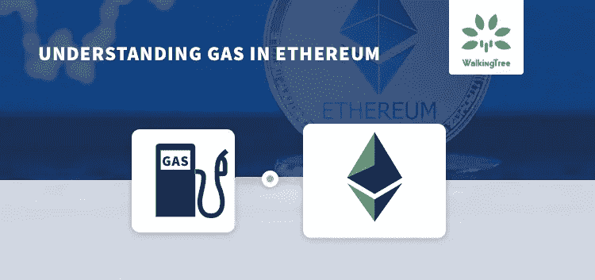
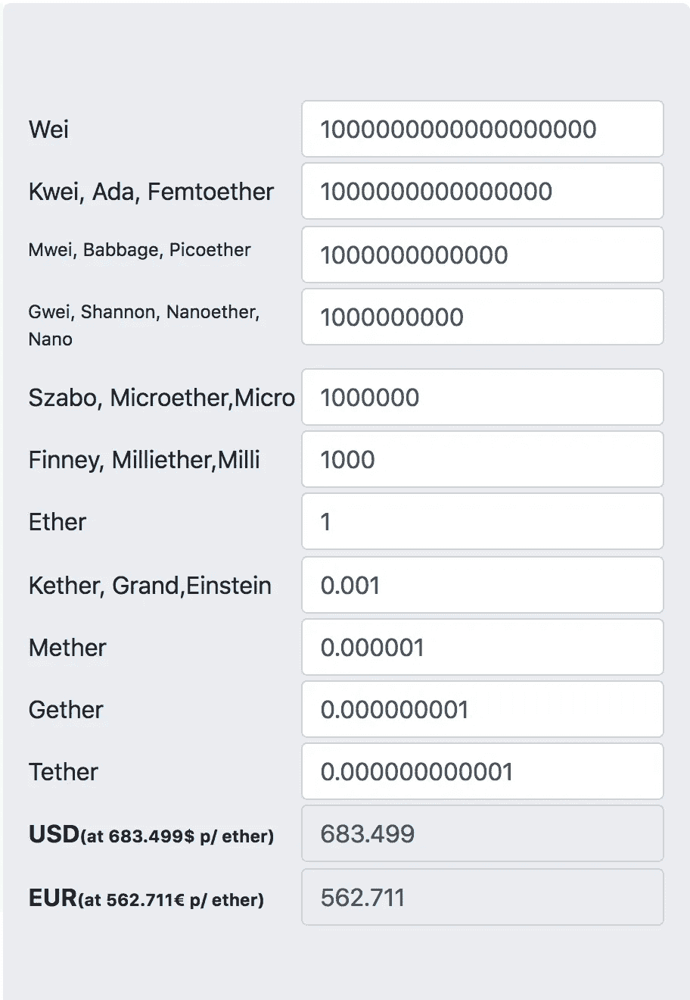
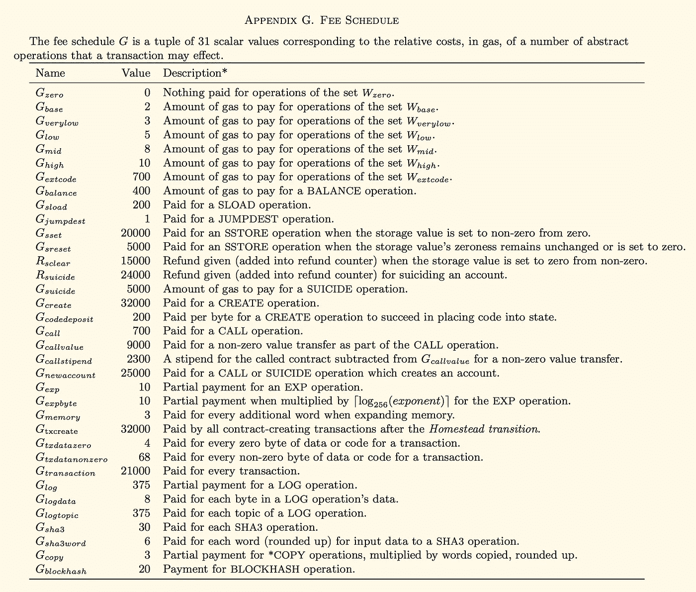
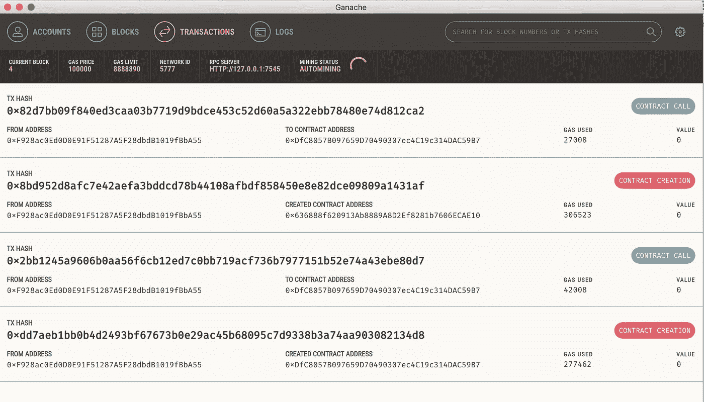
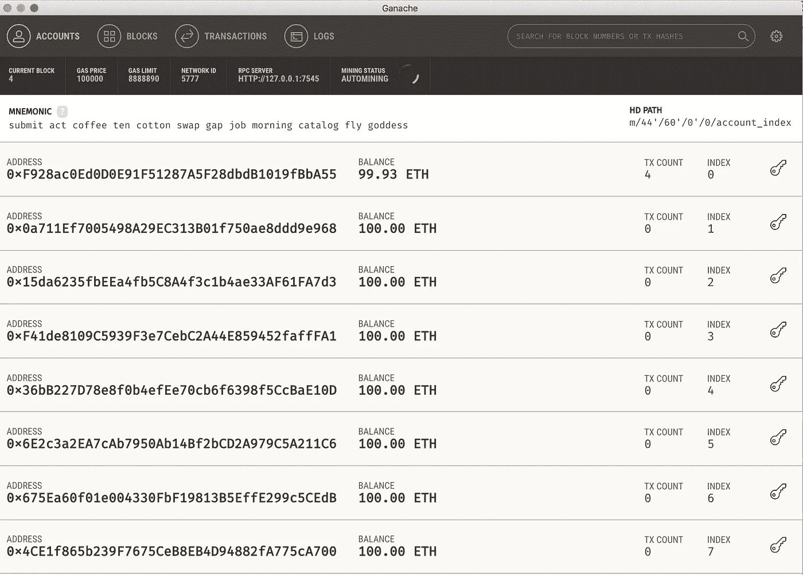
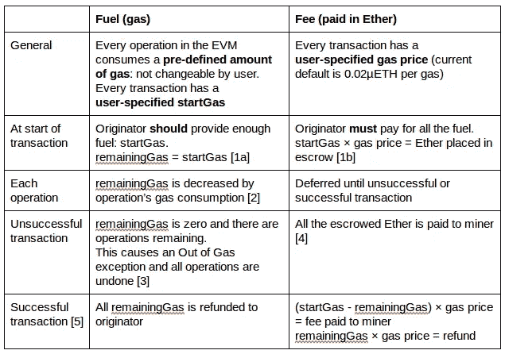

# 了解以太坊中的气体

> 原文：<https://medium.com/coinmonks/understanding-gas-in-ethereum-53ad816f79ae?source=collection_archive---------0----------------------->



在以太坊中， **Gas** 是计算工作量的度量单位，需要支付给以太坊客户端以将交易提交给区块链网络。消息/交易的发送者支付该费用。在非常高的层次上，gas 是用于在以太坊虚拟机中执行事务的指令数量。在以太坊架构中，它确保提交给网络的交易支付适当的费用。通过要求交易为其执行的每个操作付费，以太坊确保了网络不会被滥用。

交易可以小到在 HelloWorld greetings 合同中设置消息、合同部署、十亿美元的商业合同、支付(价值)转移、ICO 或任何不仅仅是网络上的只读查询的东西。

虽然执行的操作与 gas 之间存在直接映射，但在现实世界中，我们以以太(以太坊网络上的内置令牌)的形式支付这一成本。气体只存在于 EVM(以太坊虚拟机)内部，作为正在执行的工作量的计数。在支付汽油费用时，交易费是以乙醚的形式收取的，这是根据汽油价格计算的。

主要有两种获取以太网的方法，可用于在网络上执行任何交易/操作

*   来开采你自己
*   从第三方获得以太坊

在这篇文章中，我们将看看成本计算的不同方面，以及它如何映射到天然气。

# 气体是一种神秘的燃料

由于区块链网络上的交易费用，需要由发送方以气体的形式支付，这是物理生活中的一种燃料，气体也被称为加密燃料。

作为一种加密燃料，天然气有助于推动智能合同。发送者用气体交换被称为以太的货币。钱包为一个单位的汽油设置默认的最小值。例如，默认值可以是 20 香农(0.02 萨博斯或 0.00000002 乙醚)。发送者(通常是钱包开发者)可以改变成本以优化交易的等待时间。

# 影响矿工选择你的交易

如你所知，gas 在以太坊网络上被用于促进网络上交易的广播和确认。网络区块中包含的每一笔天然气量都是对矿商进行交易的额外激励。因此，提高天然气价格可以让用户吸引矿工参与交易，并更快地确认他们的转让。

因此，作为钱包开发者，目标是

*   确保用户的交易尽快得到确认
*   用户不必为交易超支费用

因此，当交易处理时间变得至关重要时(例如，在 crypto ICO 的情况下)，开发者抬高天然气价格，以使他们的交易在其他钱包用户之前被接受。

# 气体及其转换的测量单位

下表显示了不同醚单元的转化率:



**信用* *:[https://etherconverter.online/](https://etherconverter.online/)

# 以太坊交易费用表

由于以太坊中的每项操作(即每一行实体代码)都需要一些气体，因此了解以太坊的费用表非常重要。

白皮书中的下图显示了各种测量结果:



此外，以下是指令的子集:

*   Wzero = {STOP，RETURN}
*   Wbase = {ADDRESS，ORIGIN，CALLER，CALLVALUE，CALLDATASIZE，CODESIZE，GASPRICE，COINBASE，时间戳，数字，难度，GASLIMIT，POP，PC，MSIZE，GAS}
*   Wverylow = {ADD，SUB，NOT，LT，GT，SLT，SGT，EQ，ISZERO，AND，OR，XOR，BYTE，CALLDATALOAD，MLOAD，MSTORE，MSTORE8，PUSH*，DUP*，SWAP*}
*   Wlow = {MUL，DIV，SDIV，MOD，SMOD，SIGNEXTEND}
*   Wmid = {ADDMOD，MULMOD，JUMP}
*   Whigh = {JUMPI}
*   Wextcode = {EXTCODESIZE}

您可能需要注意以下几点:

*   停止和返回零成本汽油
*   给定交易的最低支付额为 21000 美元
*   签订合同至少要支付 32000 英镑的汽油费

# 气体估算与实际使用的气体

以太坊协议对交易中执行的每个计算步骤收费。每笔交易都必须包括天然气限额和愿意为每笔天然气支付的费用，矿商可以选择包括这笔交易。

假设用户正在发送有效的交易，如果交易中的计算操作所使用的气体总量小于或等于气体限制，则交易被处理。但是，如果事务所需的总气体量超过气体量限制，则所有更改都将被恢复。交易保持有效，但是，矿工仍然可以收取部分处理交易的费用。交易执行过程中未使用的所有多余气体将作为乙醚退还给发送方。因此，我们总是建议您发送的交易的气体限制应远远高于估计值。

API web 3 . eth . estimate Gas 为您提供了执行事务所需的 gas 的大致概念。以下是一个如何计算天然气估计值的示例:

```
<strong>Estimation Code</strong>truffle(ganache)> var result = web3.eth.estimateGas(app.setGreetings(“Hello! Gas Estimate Please!”,{from:’0xf928ac0ed0d0e91f51287a5f28dbdb1019fbba55'}))undefinedtruffle(ganache)> result53000
```

当您进行真正的交易时，您会得到如下输出，显示使用了 34476 gas。

```
<strong>Actual Gas Uses</strong>truffle(ganache)> app.setGreetings(“Hello! Gas Estimate Please!”, {from:’0xf928ac0ed0d0e91f51287a5f28dbdb1019fbba55'}){ tx: ‘0x7e42fe63048ddd85261bd7f33901ffedc48b5a0a3b480d2919cb89a6fc81122d’,receipt:{ transactionHash: ‘0x7e42fe63048ddd85261bd7f33901ffedc48b5a0a3b480d2919cb89a6fc81122d’,transactionIndex: 0,blockHash: ‘0xd18acc3b8a748f3fa225520440bf02f3b2ff340c428a79658e5c53523b24d20f’,blockNumber: 10,gasUsed: 34476,cumulativeGasUsed: 34476,contractAddress: null,logs: [],status: ‘0x01’,logsBloom: ‘…’ },logs: [] }
```

estimateGas API 假装这个特定的交易包含在区块链中，其操作将在网络上执行。在这种情况下，它使用与任何采矿者计算实际交易费用相同的机制。

在执行交易时，稍微高估一点是好的。你不想在执行过程中汽油不够吧。此外，即使有一点高估，也不能保证所需的气体不会超过你已经提出的气体估计。

# 交易成本

以太坊网络中交易的总成本基于两个因素:

*   使用的气体是消耗的气体总量
*   交易中指定的汽油价格

```
<strong>Transaction Cost</strong>Total Transaction Cost = gasUsed * gasPrice
```

**注释**

*   以太网中的任何气价参考，特别是在以太网、货币、余额或付款的上下文中，应被假定为计入**魏**
*   在 EVM 的每次行动都需要一定量的汽油。对于有效的交易，基于交易代码(例如，可靠性代码)，决定操作，因此也决定每个操作对 gas 的需求。**使用的气体**是执行所有操作的所有气体的总和
*   当用户构建并签署交易时，他/她可以指定他们认为合适的任何价格。他们经常使用钱包进行交易，通常，钱包开发商会尝试为他们优化汽油价格，以给他们最好的体验
*   使用上一节中显示的单位换算表，您可以计算乙醚的价格，其法定货币值一直在变化。

# 使用 Ganache 计算天然气用量和成本的示例

假设您一直使用 Ganache network 来部署和测试您的合同，一个基本的 HelloWorld 类型的问候合同将具有以下事务:



上图显示了合同部署和更新合同版本的总成本

```
Total Gas = 277462 + 42008 + 306523 + 27008 = 653001
```

默认情况下，Ganache 将天然气价格的值设置为 10000000000。目前，它的 UI 值没有被拾取(可能是一个 bug)。

所以，总价=总气*默认价格= 653001 * 100000000000 = 6.53 * 10 的 16 次方= 6.5 / 100 乙醚= 0.0653 乙醚



在上图中，您可以看到 100 乙醚的初始余额减少到 99.93 乙醚，这基本上表明 0.0653 乙醚已经被该帐户用于部署合同。

我们注意到 4 个事务对应于合同部署。如果你想更深入地了解这一点，那么让我们看看交易数据，并将它们解码成字节码，称为操作码，以太坊 EVM 可以理解。使用以下网站，您可以尝试解码相同的内容，以查看在给定交易期间执行的确切操作:
[https://etherscan.io/opcode-tool](https://etherscan.io/opcode-tool)

# 交易燃料和交易费用对交易的影响

下表总结了交易费用的影响及其对交易的影响:



在事务开始时，startGas 所需的以太被搁置，剩余的以太被设置为 startGas。随着交易的每一次操作，天然气被消耗，剩余的天然气被降低。如果出现气体耗尽的异常情况，所有操作都将恢复，所有最初放在一边的乙醚都将交给矿工。如果交易成功完成，所有剩余的天然气将退还给发起人，其余部分将支付给矿工。

您可以参考以下网址了解更多关于燃气的信息和建议:
[【https://ethgasstation.info/index.php】](https://ethgasstation.info/index.php)

来源:[https://walkingtree.tech/understanding-gas-in-ethereum/](https://walkingtree.tech/understanding-gas-in-ethereum/)