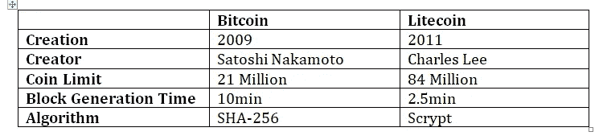

# 了解硬分叉

> 原文：<https://medium.com/coinmonks/understanding-hard-fork-fc56cb68649?source=collection_archive---------1----------------------->

区块链的扩展解决方案可以分为四个部分

1.第一层链上解决方案

2.第二层链外解决方案

3.可扩展的共识机制

4.分布式分类帐

## **第一层链上解决方案**

第一层缩放解决方案支持底层区块链码的改变。

例如，将块大小限制从 1MB 增加到 10 MB，或将块创建时间从 10 分钟减少到 5 分钟。

对区块链房产的任何结构性或根本性的改变都需要整个社区过渡到一个新的和改进的链条中。

第一层缩放解决方案中有 3 种不同的缩放机制:-

分片

塞格维特

硬叉子

在这篇文章中，我将重点介绍第一层的扩展解决方案之一，即**硬分叉**。

但在开始之前，我们首先要了解什么是 fork？

***“分叉可以定义为给区块链技术带来新特性的软件升级/变更。”***

**那么分叉背后的原因是什么？**

由于该技术相当新并且在不断发展，因此需要最新的特征来提供更多的安全性、速度、私密性、健壮性等，以使其更令人满意。这种必要性导致了“软件的定期升级和增强”。因此，分叉开始对底层协议进行修改。

分叉是任何正在开发的技术的常见和迭代过程之一。

分叉的另一个原因是当社区面临协议升级的分歧时。一些社区成员特别是矿工和开发者非常不高兴，以至于他们用类似的基础代码创建了竞争对手的加密货币。

叉子可以进一步分为两部分:-

# **1。** **硬叉**

硬分叉是与以前版本的区块链的永久分离。在这种方法中，网络被升级以遵循一组新的共识规则，并且与旧的规则不兼容。因此，为了验证和确认新的交易块，所有网络参与者都需要升级到软件的最新版本。即运行旧版本的节点将不再接受在新版本上创建的事务。如果没有升级到协议的最新版本，这些节点取消所有这些块的资格，并认为它们无效。这允许用户使用新硬币和新区块链。

此方法创建两个不同版本的区块链

一个继续在旧版本上运行。

而其他人遵循新升级的路径。

因此，它产生了新的硬币有两个单独的分类账。旧货币用户收到与硬分叉时相同数量的新货币。

因此，硬分叉会导致两种情况:

要么一个区块链占优势。

或者两个区块链共存并独立运作。

几种硬分叉加密货币如下:

点击查看硬分叉加密货币[的完整列表。](https://www.forks.net/list/)

硬分叉的例子很多，但最突出的是 2017 年 8 月 1 日硬分叉的比特币/比特币现金。

这种划分背后的想法是扩大[比特币网络](https://blog.coincodecap.com/a-candid-explanation-of-bitcoin/)的规模，以便越来越多的交易可以加入这个区块。

但是这个想法并没有得到整个比特币的完全欢迎，导致了硬分叉。在这个分叉过程中，比特币继续以旧协议运行，比特币现金以更大的块大小被创造出来。

# **不同类别**

硬叉子可以分为两个部分

## **计划硬叉**

在 2004 年，计划中的 hard fork 用户被项目开发人员提前告知协议升级事宜.因此，在实际的硬分叉过程发生之前，这个活动就获得了项目开发人员和社区的高度一致。

例如:Monero 的 hard fork 在 2017 年 1 月，添加了名为 Ring Confidential Transactions(Ring CT)的新隐私功能。

## **争硬叉**

现在考虑这样一种情况，当一个项目的不同参与者，即它的开发者、网络用户和矿工，不同意一个共同的解决方案，并走向被称为有争议的硬分叉的分叉。这种类型的分叉发生在一组社区用户支持主要的代码变更，以期发明一个优于父代的区块链的时候。

比特币现金是一个有争议的硬分叉的流行例子，这是因为一群比特币社区用户认为，将比特币的块大小从 1MB 增加到 8MB 将导致网络上更快的交易处理。

## **硬叉原因**

为了增强安全性。

提高交易速度。

提高可扩展性。

# **2。** **软叉**

软分叉是与软件的早期版本向后兼容的软件升级，即底层代码已经更新，但是运行旧版本的节点批准新版本。在软分叉区块链中，所有块都遵循新旧一致性规则集，因此不需要网络上的节点升级来保持一致性。然而，由遵循旧共识规则的节点产生的块将违反新的共识规则集。因此，与创建两个不同的区块链从而导致新的加密货币的创建的硬分叉不同，软分叉允许新的块被添加到将被旧节点批准的区块链。一旦大多数用户认可并采纳了新的共识规则，旧的网络将被抛弃，新的区块链将被称为真正的“区块链”。在分叉之前，共享的区块链历史将保持不变。

软叉的例子:

比特币改进提案(BIP) 66:这是作为比特币签名验证的软分叉实现的

支付脚本哈希(P2SH):这种软分叉导致了比特币网络上的多重签名地址

## **硬叉子的例子:-**

1.比特币现金

比特币现金是比特币的硬分叉加密货币，创建于 2017 年。它有时也被称为 Bcash。一些开发者希望对比特币进行某些重要的改变，但整个比特币社区并不支持它，因此他们分离出来创造比特币现金。

2018 年，比特币现金进一步分为两种加密货币:

o 比特币现金

o 比特币服务

比特币现金的优势:-

比特币现金支持比比特币块大八倍的块大小。

BCH 每秒可以处理更多的交易，因此更多的人可以同时使用 BCH

它的交易费用更低，大约每笔交易 0.2 美元

BCH 的转账速度更快——验证一笔比特币交易需要 10 分钟。

**2。** **莱特币**

Litecoin 是一个点对点加密货币和开源软件项目，Litecoin 是比特币的早期衍生产品，于 2011 年 10 月开始。和比特币很像。

莱特币的三个好处如下:

o 交易确认时间更快——在 BTC 每笔交易只需 10 分钟，而莱特币只需 2.5 分钟。这种确认时间的差异，让莱特币在商家和电商店铺中名声大噪。

o 由于在 LTC 工作验证算法中使用了脚本，提高了存储效率

o 奖励矿工更多的硬币(与 2100 万 BTC 相比，总共将分配 8400 万)。

阅读更多:[智能合约指南](/@tulip311bit/a-guide-to-smart-contracts-ad783eb015aa)

> [直接在您的收件箱中获得最佳软件交易](https://coincodecap.com/?utm_source=coinmonks)

