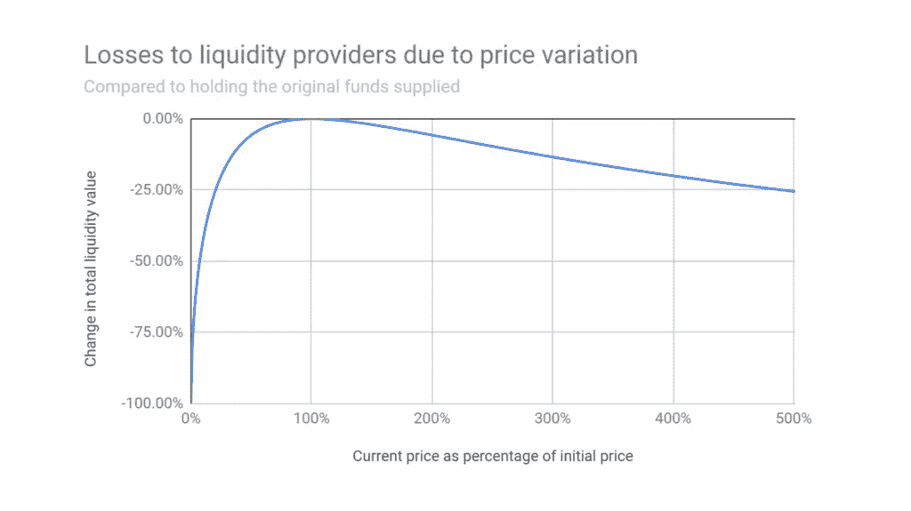
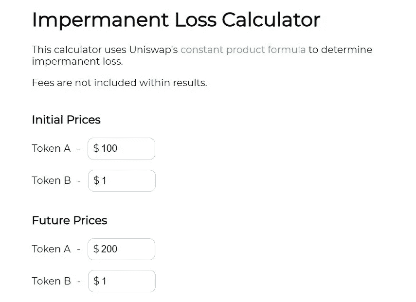
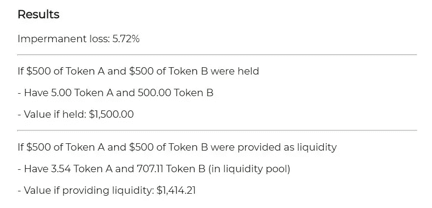
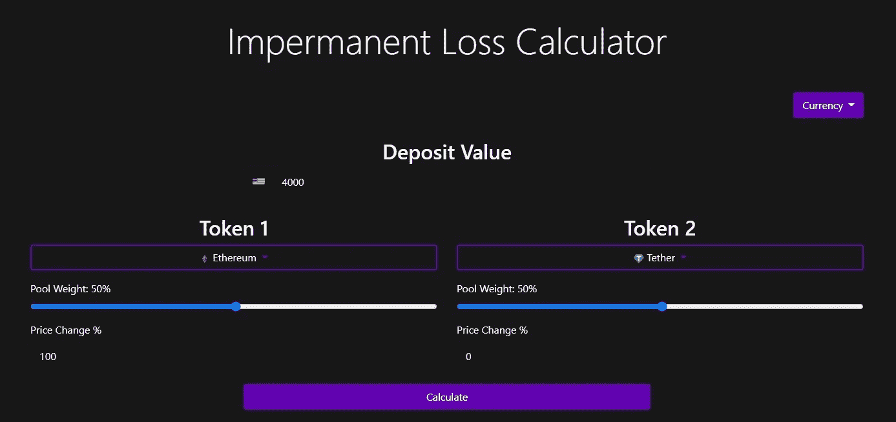
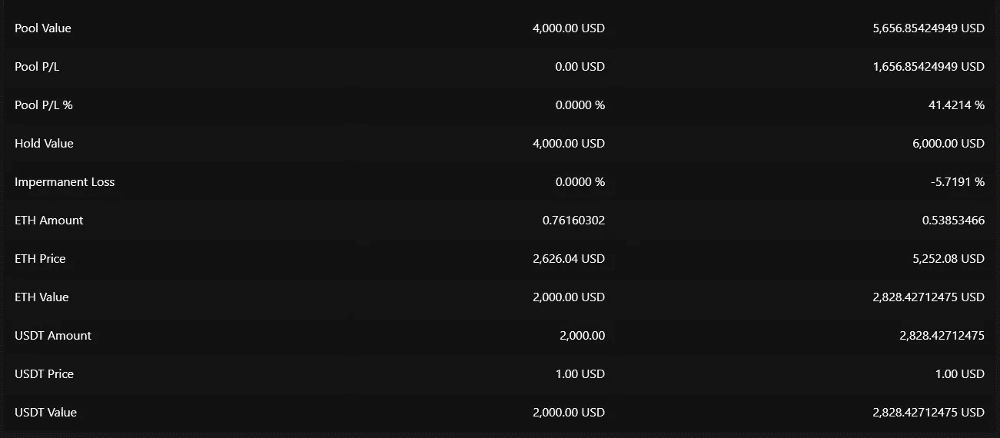
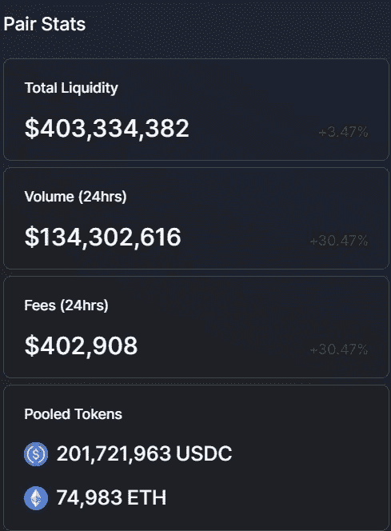
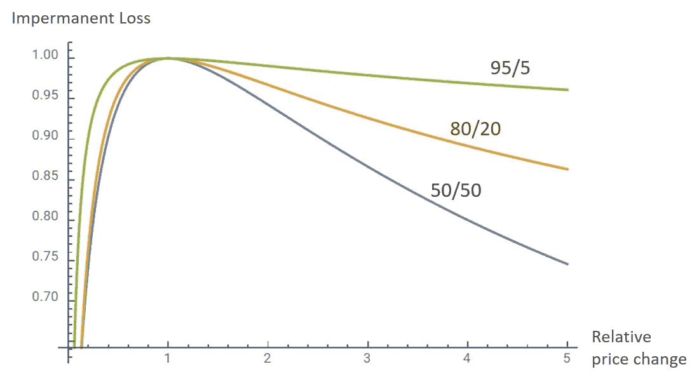
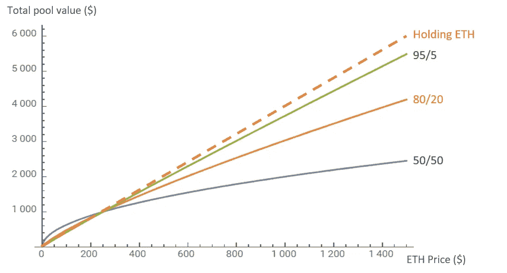

# 理解暂时的损失

> 原文：<https://medium.com/coinmonks/understanding-impermanent-loss-9ac6795e5baa?source=collection_archive---------0----------------------->

## **什么是无常的失去？**

非永久性损失是指基金在流动性池中面临的损失。当流动性池中的代币比率变得不均衡时，通常会发生这种损失。尽管如此，非永久性损失直到代币从流动性池中取出后才会实现。这种损失通常是通过比较您在流动性池中的代币价值与简单持有代币的价值来计算的。由于稳定债券具有价格稳定性，利用稳定债券的流动性池较少遭受非永久性损失。

## **无常的损失是如何运作的？**

非永久性损失通常会影响流动性池，这些流动性池的令牌比率相等，即 50/50。在 USDC/ETH 流动性池中，流动性提供者需要向池中提供等量的 USDC 和 ETH。然后，他们有权从资金池中提取相等的份额。当用户使用流动性池进行交易时，这发生在分散的交易所，比率将根据每个池中有多少代币而变化，这将影响这些代币的价格。

假设一家流动性提供商向流动性池中添加了 1 个 ETH 和 100 个 USDC，这是因为两个令牌的价值相等。他们存款的美元金额是 200 美元，因为他们的 ETH 和 USDC 都值 100 美元。目前，流动性池中有 10 个 ETH 和 1，000 个 USDC，比例为 50/50，流动性提供商拥有该池的 10%份额。他们将收到 LP 代币，可用于随时兑换 10%的池份额。

由于代币的价格取决于其流动性池的比率，它们的价格可以与其他交易所的价格分开。如果以太网价格上涨 100%，现在每以太网价值 200 美元，流动性池将变成 7.071 以太网和 1，414.21 USDC。这是因为资金池的比例发生了变化，不再是 50/50，这影响了 ETH 的价格。

由于流动性提供者拥有流动性池的 10%份额，他们可以提取 0.7071 ETH 和 141 USDC，相当于 282 美元。然而，如果流动性提供者仅仅持有他们的 1 ETH 和 100 USDC，他们将值 300 美元。两者之间的差额是 18 美元，这是流动性提供者经历的非永久性损失。资金池比率的更大变化将导致更大数量的非永久性损失。

 [## 最佳免费加密交易机器人——前 16 名比特币交易机器人[2021]

### 2021 年币安、比特币基地、库币和其他密码交易所的最佳密码交易机器人。四进制，位间隙…

medium.com](/coinmonks/crypto-trading-bot-c2ffce8acb2a) 

非永久性损失的金额也可能受到流动性池中的代币以及池中流动性提供者数量的影响。由于上述例子使用了瑞士联邦理工学院/USDC 流动性池，瑞士联邦理工学院有一个稳定的资产进行互换。如果流动性池是 ETH/LINK，那么非永久性损失的风险可能会更高，因为这两种令牌都有可能波动。流动性池也可以由纯粹稳定的资金组成，比如戴和。这大大降低了非永久性损失的风险，因为稳定的 coins 几乎没有波动性，这将使池保持极其稳定。

下图显示了价格如何影响流动性提供者将经历的非永久性损失。当代币价格上涨 500%时，你可以看到流动性提供者将遭受大约 25%的非永久性损失。这比单纯持有代币的价值低 25%。

由于分散式交易所使用等式来计算当比率变化时如何调整代币的价值，因此您可以使用非永久性损失计算器来轻松计算潜在损失。下面是一个可以在 dailydefi.org/tools/impermanent-loss-calculator/找到的非永久性损失计算器的例子

在本例中，代币 A 为 100 美元，代币 B 为 1 美元，两个代币之间的总起始值为 1000 美元，这是由计算器自动设置的。在“未来价格”部分，代币 A 的价值增加到 200 美元，而代币 B 保持在 1 美元。

由于持有的代币 A & B 的价值为 1500 美元，而它们在流动性池中的价值为 1414.21 美元，这将导致 85.79 美元的非永久性损失。

这使用了 500 美元作为令牌 A 和 b 的示例。要使用您自己的金额进行计算，您可以乘以或除以任何给定值。如果你两种代币都用了 2000 美元，是这个例子的两倍，你的非永久性损失将是 171.58 美元。

下面是另一个非永久性损失计算器的例子，可以在 decentyields.com/impermanent-loss-calculator.找到。在这里，您可以手动设置您的存款金额以及泳池的比率和泳池重量。

在本例中，ETH 的价格上涨了 100%，而 Tether 保持稳定。从下图可以看出，4000 美元存款的利润为 1656 美元，即池损益。但是，非永久性损失为 5.7%，导致损失 344 美元。这可以通过从持有值中减去池值来计算，6，000 美元-5，656 美元= 344 美元。

但是，它只能根据令牌的当前值进行计算。如果你以比现在更低或更高的价格购买了令牌，它将不允许你改变它。如果您需要尽可能多的数据，您可能需要使用多个计算器，因为目前没有一个计算器可以提供所有必要的功能和数据点。

 [## 存储比特币的最佳加密硬件钱包[2021] | CoinCodeCap

### 保管您的数字资产很容易，但找到正确的存储方式却是一项繁琐的任务。在线钱包有一个风险…

blog.coincodecap.com](https://blog.coincodecap.com/best-hardware-wallet-bitcoin) 

## **为什么要成为流动性提供者？**

尽管流动性提供者可能会经历非永久性损失，但他们的代币收益率也必须考虑在内。如果你的收益高于你在非永久性损失中的损失，那么你就可以获得比仅仅持有代币更多的利润。此外，通过获得流动性池中代币的收益，你也将它们转化为生产性资产。

Uniswap 从每笔交易中抽取 0.03%的费用，交给流动性提供者。交易量越大，流动性提供者获得的收入就越多。下面你可以看到，联邦理工学院/USDC 大学在 24 小时内产生的费用超过了 402，000 美元。你在这个资金池中的份额越高，你从这 402，000 美元中获得的收入就越多。

DeFi 平台也一直在激励用户向他们的资金池增加流动性。这通常是通过根据你的份额给予奖励来实现的。在 Uniswap 上，除了提供流动性的收益之外，流动性提供商还可以获得 UNI 代币作为额外奖励。这可以进一步增加流动性提供者的利润，同时降低非永久性损失的影响。

 [## 加密税务软件——五大最佳比特币税务计算器[2021]

### 不管你是刚接触加密还是已经在这个领域呆了一段时间，你都需要交税。

medium.com](/coinmonks/best-crypto-tax-tool-for-my-money-72d4b430816b) 

## **解决方案**

虽然流动性提供者可以使用稳定的收益、收益率和回报来帮助减轻非永久性损失的影响，但他们也可以通过使用非 50/50 比率的流动性池来减少这种影响。Balancer 是一个提供流动性池的平台，比率为 60/40 或 80/20。当 ETH 被存入一个 50/50 的池中时，流动性提供者必须对另一个令牌有 50%的风险敞口。有了 80/20 组合，他们只需要对另一个令牌有 20%的风险敞口。您可以在下面看到三个流动性池比率如何受到非永久性损失的不同影响，其中 95/5 池的非永久性损失最小。

Credit to Balancer

这些较高的比率也有助于减轻非永久性损失的影响，因为与提供流动性相比，持有代币的差异较小。下面你可以看到，在一个流动性池中，80%的 ETH 和 20%的 token 比 50/50 的比例表现更好。

Credit to Balancer

值得注意的是，50/50 池比其他池更常见，尤其是在 Uniswap 上。由于交易费进入流动性池，你的收益取决于有多少人在使用你的流动性池。如果这个比率是 95/5，但是没有人用这个池来交易，那么你的存款将很少或者没有收益。

Bancor 是另一个平台，它通过其流动性池实现了 oracles，以帮助最小化非永久性损失。由于 oracles 可以从外部来源提供数据，流动性池可以从其他交易所获得资产价格数据。这可以帮助流动性池相应地调整价格，而不是仅仅依靠池的比率来确定代币的价格。由于比率变化越大，非永久性损失越严重，这可以使流动性池保持接近 50/50 的比率，这可以大大降低非永久性损失的风险。

> 加入 Coinmonks [电报频道](https://t.me/coincodecap)和 [Youtube 频道](https://www.youtube.com/c/coinmonks/videos)获取每日[加密新闻](http://coincodecap.com/)

## 另外，阅读

*   [密码电报信号](http://Top 4 Telegram Channels for Crypto Traders) | [密码交易机器人](/coinmonks/crypto-trading-bot-c2ffce8acb2a)
*   [复制交易](/coinmonks/top-10-crypto-copy-trading-platforms-for-beginners-d0c37c7d698c) | [加密税务软件](/coinmonks/crypto-tax-software-ed4b4810e338)
*   [网格交易](https://coincodecap.com/grid-trading) | [加密硬件钱包](/coinmonks/the-best-cryptocurrency-hardware-wallets-of-2020-e28b1c124069)
*   [印度的加密交易所](/coinmonks/crypto-exchange-dd2f9d6f3769) | [印度的加密应用](/coinmonks/buy-bitcoin-in-india-feb50ddfef94)
*   开发人员的最佳加密 API
*   最佳[加密贷款平台](/coinmonks/top-5-crypto-lending-platforms-in-2020-that-you-need-to-know-a1b675cec3fa)
*   杠杆代币的终极指南
*   [ko only 回顾](https://coincodecap.com/koinly-review) | [Binaryx 回顾](https://coincodecap.com/binaryx-review)|[Hodlnaut vs CakeDefi](https://coincodecap.com/hodlnaut-vs-cakedefi-vs-celsius)
*   [40 个最佳电报频道](https://coincodecap.com/best-telegram-channels) | [1xBit 回顾](https://coincodecap.com/1xbit-review) | [Keevo 钱包回顾](https://coincodecap.com/keevo-wallet-review)
*   [如何在印度购买以太坊？](https://coincodecap.com/buy-ethereum-in-india) | [如何在币安购买比特币](https://coincodecap.com/buy-bitcoin-binance)
*   [在美国如何使用 BitMEX？](https://coincodecap.com/use-bitmex-in-usa) | [BitMEX 回顾](https://coincodecap.com/bitmex-review) | [买入索拉纳](https://coincodecap.com/buy-solana)