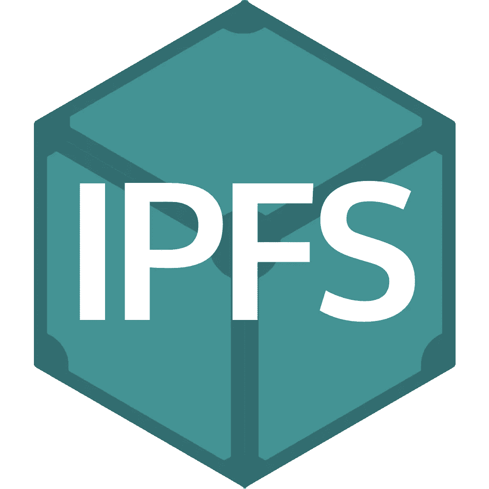
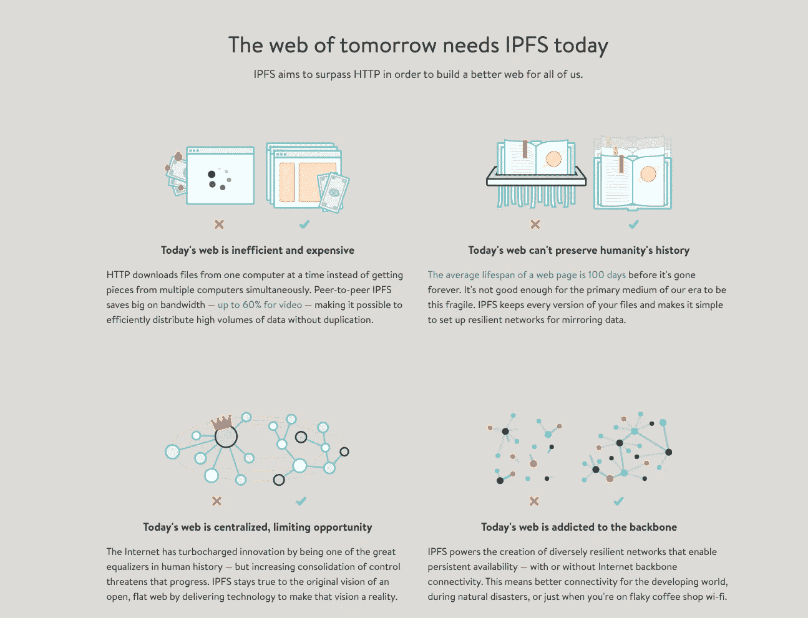
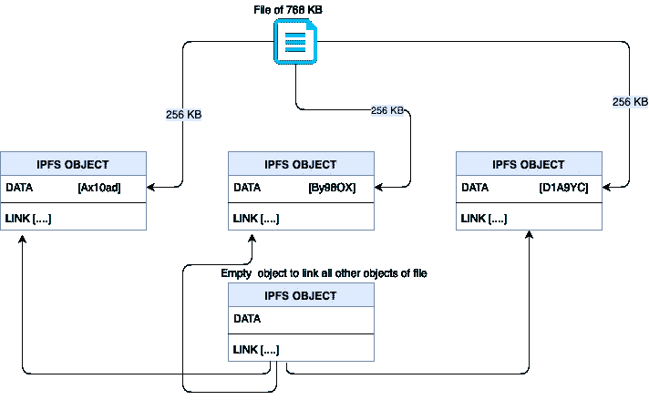
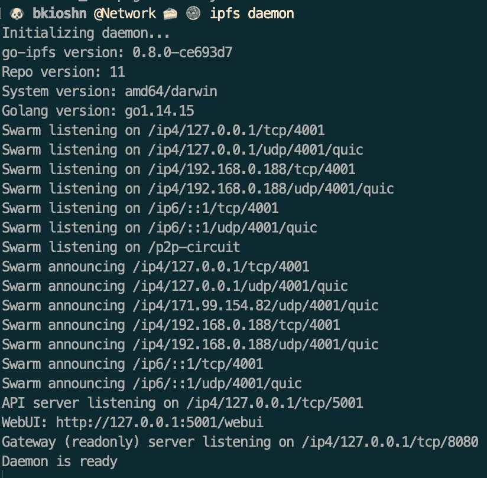
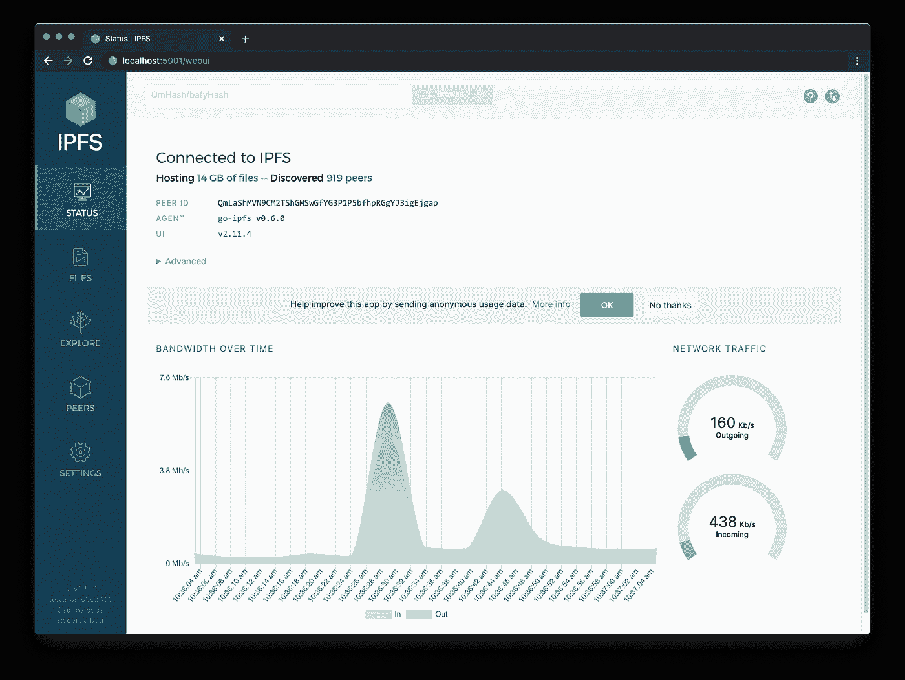

# 了解 IPFS +简单文件上传

> 原文：<https://medium.com/coinmonks/understanding-ipfs-simple-file-uploading-cb63bcd4b946?source=collection_archive---------2----------------------->



Image Source: [https://en.wikipedia.org/wiki/InterPlanetary_File_System](https://en.wikipedia.org/wiki/InterPlanetary_File_System)

在详细介绍什么是 IPFS 之前，我们必须熟悉“去中心化”这个词。

## 什么是权力下放的简要概述

去中心化的主要概念是“无中心”。这意味着没有一个实体能够凌驾于另一个实体之上。权力将从中心位置或权力机构分散开来。没有集中的服务器，所有用户直接相互交互。

## 什么是 IPFS

IPFS 或星际文件系统是分布式系统中的协议和对等网络，用于访问和存储数据、文件、应用程序和网站。它可以通过多种类型的传输层进行通信，例如 TCP、UDP、UDT、QUIC 和 TOR。IPFS 建立在一个分散的系统上，包含分布在整个网络中的节点。基于内容的寻址用于检索数据，数据以 IPFS 对象的形式存储。

IPFS 最吸引人的地方是在 IPFS 开设网站。正如 IPFS 声称的那样

> 通过使用 IPFS 托管您的静态网站，保护您免受单点故障风险，并从分散的基础架构中受益。



Image source: [https://ipfs.io/](https://ipfs.io/)

然而！抱歉，这不是我们要在这个媒体中讨论的内容🙁，但我将涵盖 IPFS 的基本概况以及如何在分散系统中存储您的文件！

## IPFS 是如何工作的？

它使用比特交换协议。位交换是从另一个节点下载文件的协议，类似于 bit-torrent。它将发送 CID 来检查每个节点。如果节点有相同的 CID，它会将文件发送回用户。所以现在两个节点将拥有相同的文件。下次当新用户想要调用该 CID 时，该用户可以从任一节点进行调用。

IPFS 建立在三个基本原则之上

1.  通过内容寻址的唯一标识
2.  经由有向无环图(Dag)的内容链接
3.  通过分布式哈希表(DHT)进行内容发现

## ***内容寻址***

IPFS 使用内容寻址来标识内容，而不是内容的位置。IPFS 将根据文件的细节创建 CID，这与书名的想法相同。CID 与 IP 地址的不同之处在于它不是通过位置来定位文件，而是通过文件的细节来定位。CID 将采用哈希 SHA-256 的形式。

根据版本的不同，cid 可以采用不同的形式。一些 IPFS 将产生 v0 CIDS，一些将产生 v1

*版本 0 CID 的示例*

版本 0 是作为内容标识符的 58 编码的多重散列。它包含以“Qm”开头的 46 个字符

```
*QmXoypizjW3WknFiJnKLwHCnL72vedxjQkDDP1mXWo6uco*
```

*版本 1 CID 的示例*

版本 1 包含前导标识符，它告诉哈希本身使用什么表示。这些包括多基前缀、CID 版本标识符和多编解码器标识符

## ***有向无环图***

IPFS 使用 Merkle-directed 非循环图或 Merkle DAGs 来生成具有哈希格式的唯一标识符的节点。

## *分布式哈希表*

*IPFS 使用分布式哈希表的分布式哈希表来查找哪些对等点托管数据或内容。*

## *存储的数据*

*IPFS 以数据对象的形式存储数据，其中每个对象最多可以存储 256 KB。*

**

*Image source: [https://medium.com/block360-labs/ipfs-a-distributed-file-store-533cda4c6047](/block360-labs/ipfs-a-distributed-file-store-533cda4c6047)*

*在文件大于 256 KB 的情况下，它被切割成多个 IPFS 数据对象(不得超过 256 KB)。它们都由一个空 IPFS 对象链接在一起。*

*现在来看有趣的部分！*

## *如何在您的本地机器上使用 IPFS*

***第一步**:在你的电脑上安装 IPFS*

**

*Step2*

*步骤 2 :初始化 IPFS 存储库，这将初始化节点*

**

*Step 3*

***第三步**:运行节点可以通过 *ipfs 守护进程*来完成。这个命令将打开一个到蜂群的连接。对等体可以通过使用 IPFS 群对等体来查看，或者可以通过使用 id 来搜索特定的对等体。*

**

*Step4*

***步骤 4** (可选):运行 web UI 是显示有用信息的另一种方式，例如对等 id、群组、流量等。当前使用的网络。*

**

*Step5*

***步骤 5** :将文件添加到网络。这可以在 IPFS 用户界面或命令行中完成。*

*在这种情况下，文件可以是任何格式。vdo 和映像也允许发送到该网络。*

***第六步***

*现在，可以通过网关在整个网络中访问该文件。在这种情况下，公共网关被用作遵循协议实验，该实验部署公共网关 https://ipfs.io，因此格式为*

*[*https://ipfs . io/ipfs/qmwnburoeqn 4 ftlesvc 9 vzhgmnr 7 tcxnarmfziu 6 juqgzz*](https://ipfs.io/ipfs/QmWnburoeQn4FTLESvc9VzHGmNR7TcxnArmFZiu6jUqGzz)*

*(加载页面可能需要一段时间)*

*这就是结局！希望你喜欢这篇文章。如果有任何错误，请随时与我联系🤩*