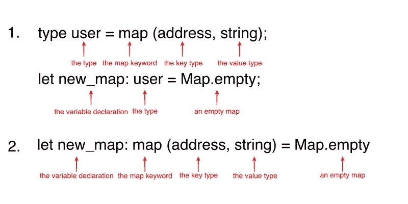

# 理解 Ligo 中的地图

> 原文：<https://medium.com/coinmonks/understanding-maps-in-ligo-c271c768e424?source=collection_archive---------0----------------------->

## 在 Ligo 中创建和操作地图和大地图


*这篇文章也可以在我的 IPFS 博客* [*上看到。*](https://decentradev.netlify.com/#/post/ligo-lesson-4)

区块链就是以一种分散的方式在线保存数据。您不希望在区块链上保存大量数据(因为这很昂贵)，但是您希望保存正确的数据，希望数据组织有序，并且希望能够快速访问这些数据。

因此，在 Ligo 中编写智能合同时，地图将是您最好的盟友之一。如果你来自固体，你已经知道什么是地图，你只需要学习新的语法。如果你是[智能合约](https://blog.coincodecap.com/tag/smart-contact/)开发的新手，地图是一种非常容易理解的数据结构。

在本教程中，我们将看到什么是地图和大地图，如何创建它们，更新它们和删除它们的内容。照例我会用 Ligo 的理智味。

# 什么是地图？

世界上很多孩子都有一本降临节日历来计算圣诞节前的天数。降临节日历的原理非常简单:一个印有数字的扁平盒子，每个数字代表一天。每个数字后面都有一块巧克力🍫

地图就像一个降临节日历:它们是一个大盒子，你可以用任何可比较的类型(整数、地址、字符串等)代替数字。，[参见表格中的第一列作为参考](https://michelson.nomadic-labs.com/#types))称为**键**除了巧克力，你几乎可以拥有任何你想要的东西，称为**值**。这个键/值对被称为**绑定**。就像降临节日历一样，键的类型在整个地图中必须相同，值的类型也必须相同。例如，你可以有一个`integer/string`或`address/record`绑定，而不是像日历中那样有一个`number/chocolate`绑定。如果要检索值，只需要知道它的键就可以找到它。

# 大地图呢？

与区块链上的任何其他操作一样，检索与地图中的键相关联的值需要耗费大量的时间。如果你要加载一个有数千或数百万绑定的地图，它会变得非常昂贵和缓慢。这时候就可以用大地图了。大地图只是为您考虑了比例问题的地图。把它们用于你的下一个 [dapp](https://blog.coincodecap.com/tag/dapps/) 来搭载你的数百万潜在用户😊

# 创建地图

当需要在代码中使用映射时，有两种方法可以用来声明映射:

1.  你可以先声明类型，然后声明变量。
2.  您可以将两个声明连接成一个。

让我们看看它是什么样子的:



这两种方法的主要区别在于，在第二种情况下，您不能为另一个变量重用该类型。在这两种情况下，声明一个映射都非常简单:使用 **map** 关键字，在括号之间，首先放置键的类型、一个逗号和值的类型。然后，您可以创建一个空地图:

```
let new_map: map (address, string) = **Map.empty**
```

或者您可以在地图中初始化一些绑定:

```
let new_map: map (address, string) = **Map.literal**([
  ("tz1...": address, "John"),
  ("tz1...": address, "Jane")
]);
```

> 📝初始化映射时，请注意绑定的语法。

# 访问地图绑定

一旦您的地图被数以千计的绑定填充，您希望能够找到其中的一个。该操作将需要 **Map.find_opt** 函数。顾名思义，当你使用一个键来查找相关的值时，这个函数将返回一个可选值，这就是为什么它非常适合与模式匹配一起使用！

语法如下:`Map.find_opt(the_key_to_find, the_map)`。

现在让我们使用模式匹配来获取值:

```
switch (**Map.find_opt**("tz1...", new_map)){
  | **None** => failwith("No match found!");
  | **Some (name)** => /* We get here the value we found! */
}
```

**Map.find_opt** 函数将返回一个可选值，它可以接受两个可能的值:如果没有找到匹配，则为 **None** ，如果找到匹配，则为 **Some** 以及与映射中的键相关联的*值*。

这是一个非常强大的设计！不像 JavaScript 这样的语言，它不会返回一个未定义的值，也不会使你的 dapp 崩溃。如果没有找到值，您可以抛出一个错误或做其他事情。与 Solidity 等其他智能合约语言不同，默认情况下，所有键都不存在，搜索键不会返回默认值。模式匹配让你远离意想不到的错误！

# 更新地图

现在让我们填充我们的地图！使用 **Map.add** 向映射添加新的绑定非常简单。该函数有 3 个参数:新的键、新的关联值和要添加它们的映射:

```
let mymap = **Map.add**((*"tz1..."*: address), "*Kevin*", *new_map*);
```

如果您想更改与映射中某个绑定的键相关联的值，该怎么办？这其实是一个很简单的操作！您可以使用接受 3 个参数的`Map.update`:您想要更新的键，新值和映射的可选参数，例如:

```
let mymap = **Map.update**((*"tz1..."*: address), *Some("Bob")*, *new_map*);
```

这里的可选性非常重要，因为你也可以使用 **None** 来移除绑定，就像这样:

```
let mymap = **Map.update**((*"tz1..."*: address), *None(string)*, *new_map*);
```

如果您想删除一个绑定，您也可以使用 **Map.remove** 函数，它有两个参数:要删除的键和 Map:

```
let mymap = **Map.remove**((*"tz1..."*: address), *new_map*);
```

# 地图上的迭代

在某些情况下，您可能希望遍历地图，要么更新它的一些值，要么使用这些值产生一些副作用。Ligo 提供了 3 个不同的函数，你可以根据你想要的结果来使用。

## Map.iter()

假设我们有一个地图，其中包含与用户拥有的令牌数量相关联的用户地址。我们想遍历列表，检查它们是否都有 10 个或更多的令牌。这是我们将要做的:

```
*[declared earlier => let new_map = map (address, nat)]*let check_tokens = 
  ((**key**, **value**): (address, nat)) => **assert(value > 10n)**;**Map.iter**(check_tokens, new_map);
```

如果一切顺利，Map.iter 返回一个类型为 *unit* 的值。
如果其中一个值不大于或等于 10，*断言*功能将抛出错误，操作将停止。

## Map.map()

现在让我们继续上面的例子，想象我们想要空投，给地图上的所有用户 10 个免费的代币。我们可以使用 **Map.map** 函数轻松实现。它有两个参数:应用于映射的函数(接收键/值对并返回新值)和映射。然后，它返回更新后的地图:

```
let *free_tokens* = ((**key**, **value**): (address, nat)) => **value + 10n**;**Map.map**(*free_tokens*, new_map);
```

## Map.fold()

现在，假设我们想知道我们的用户总共拥有多少令牌。如果您想要检索地图中的所有值，并通过以某种方式将它们相加或分组来使用它们，您可以使用 **Map.fold** 。这个函数有 3 个参数:累加函数、映射和累加器的初始值。accumulating 函数接收两个参数:第一个是累加器的当前值，第二个是包含映射的当前键(在第一个位置)和值(在第二个位置)的元组:

```
*[will return the total amount of token as an integer]*let *accumulate* = 
  ((**accumulator**, **binding**): (int, (string, int))): int => 
    **accumulator** + **binding[1]**;**Map.fold**(*accumulate*, *new_map*, *0*);
```

# 附加功能

最后，让我们介绍一些有用的函数，让您可以获得一些关于地图的信息:

*   `Map.size(my_map: map(key, value))` = > **Map.size** 以地图为参数，以 *nat* 的形式返回地图的大小。
*   `Map.mem(my_map: map(key, value))` = >

# 大地图呢？

除了`size`和`mem`之外，我们刚刚看到的所有用于地图的功能也适用于大地图。你唯一需要做的就是用 **Big_map** 替换 **Map** 关键字。

# 概述

在 Ligo 中，地图是一种非常有用的数据结构，用于存储和检索数据，这就是为什么知道如何操作它们以释放它们的全部能量是非常重要的。记住一些与地图相关的重要词汇:

*   **KEY** = >映射的左侧，您将使用它来访问值，通常是字符串、地址或数字类型(int、nat)。
*   **VALUE** = >地图的右边，你要保存的数据，可以通过它的键访问。
*   **绑定** = >键/值对，如果映射是两列电子表格，这将是一行。
*   **迭代** = >循环遍历地图而不修改它。
*   **映射** = >遍历一个地图并修改其绑定。
*   **折叠** = >遍历一个地图并使用它的绑定来产生一个最终值。

以下是地图和大地图的所有可用功能列表:

*   宣布一张新地图
*   创建一个空地图
*   `**Map.literal([(first_binding), (second_binding), ...])**` = >创建一个非空地图
*   `**Map.find_opt(key, map)**` = >查找与指定键相关的值，如果找不到值，则返回可选的等于 **None** 的值，如果值存在，则返回 **Some (value)** 的值。
*   `**Map.add(key, value, map)**` = >向现有地图添加新绑定
*   `**Map.update(key, Some (value), map)**` = >更新给定映射中绑定的值。请注意，该值必须是可选类型，因为传递等于 *None* 的值与移除绑定是一样的。
*   `**Map.remove(key, map)**` = >删除映射中与提供的键匹配的绑定。
*   `**Map.iter(function_to_be_called, map)**` = >循环遍历所提供地图的绑定，并将给定函数应用于每个绑定。 *Map.iter* 返回一个单元(或者更简单地说就是没有)。
*   `**Map.map(function_to_be_called, map)**` = >遍历所提供地图的绑定，并应用函数修改它们。 *Map.map* 返回相同类型的新地图。
*   `**Map.fold(function_to_be_called, map, accumulator)**` = >遍历所提供映射的绑定，将键/值“折叠”在一起，以产生累加值(或“累加器”)，并在每次循环中更新它。
*   `**Map.size(map)**` = > *(仅适用于地图，不适用于大地图)*输出给定地图的大小。
*   `**Map.mem(key, map)**` = > *(仅适用于地图，不适用于大地图)*输出一个布尔值，指示一个键在地图中是存在(真)还是不存在(假)。

来源: [Ligo 文档](https://ligolang.org/docs/language-basics/maps-records)和[地图参考](https://ligolang.org/docs/reference/map-reference)。

如果你喜欢这个教程，考虑发送一些 tezzies 到**tz 1 sjr neue 4 zypgszpogdz D5 tvryixndsd 2v**，不要犹豫留下你的意见或建议！

## **也读作:**

*   [**在 Tezos**](/coinmonks/build-your-first-dapp-on-tezos-270c568d4fe9) 上建立你的第一个 Dapp
*   [**Ligo 入门**](/coinmonks/getting-started-with-ligo-13ea2c4e844e)

> [直接在您的收件箱中获得最佳软件交易](https://coincodecap.com/?utm_source=coinmonks)

[](https://coincodecap.com/?utm_source=coinmonks)