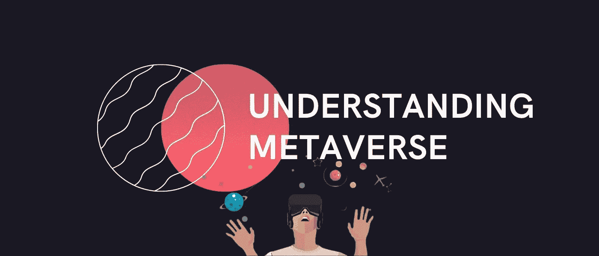

# 理解元宇宙:一个基本的解释

> 原文：<https://medium.com/coinmonks/understanding-metaverse-a-basic-explanation-75e562ee6bb1?source=collection_archive---------5----------------------->

如果你最近一直在关注头条新闻，你可能会发现很多人都在谈论一种叫做元宇宙的东西。这个短语在加密、金融科技以及社交媒体中非常流行。然而，如果它继续以目前的速度增长，它将成为一个改变游戏规则的概念，将对整个互联网产生巨大的影响。

如果你担心这一点，不必担心。

这是一个积极的变化，一旦它到来，将带来很多好处，这就是为什么它有很多人对此非常兴奋。但是，我们超越了自己。如果您还不熟悉元宇宙，现在是时候让我们解释一下它是什么，它是如何工作的，以及它为什么如此重要。所以我在 Twitter 上的一些粉丝让我写一篇关于元宇宙的基本解释。这就是了。

# 什么是元宇宙？

**元宇宙并不是一个新名词——它已经在电影、漫画、游戏、书籍等等中被彻底使用和探索过。根据来源的不同，它代表了一个单一概念的变体— ***连接来自不同地方、不同宇宙或生活领域的人们，并允许他们相互交流。*****

**将其转化为现实世界的情况和技术，我们得到一个元宇宙的概念，指的是互联网的新版本。这被想象成一种新的环境，允许更沉浸式的社交分享。**

**它涉及各种产品和技术，如 NFTs 和加密、3D 化身、分散式应用程序、虚拟景观和现实、赢得奖励的能力、参与空投、通过智能合同进行交易、在数字现实中运营业务等等。**

**元宇宙是真实世界的替代物，它*“代表了开放世界和环境的集合，通过可互操作的资产和体验连接在一起，”*如[解密](https://decrypt.co/84721/facebook-metaverse-new-company-name-meta-nft)在线杂志所解释的。**

**这是一个虚拟的世界，以虚拟人物、数字物品、功能经济为特征，在这里，技术不仅仅是一种工具，而是无所不包的东西。**

**显然，这意味着元宇宙有巨大的潜力来改变人与人之间的沟通方式。不仅如此，它还能改变企业的运营方式、我们花钱的方式、我们花钱的目的等等。元宇宙也可能是整个人类技术和社会进化的下一步。**

****

**它对世界的影响至少会和互联网本身一样大，回到它成为主流的时候，这已经是一个巨大的承诺。**

# **元宇宙将如何影响世界？**

**元宇宙最近爆发了，因为脸书决定更名为 Meta。当然，社交平台脸书将一如既往。然而，它背后的公司不再叫脸书，而是走向更大的东西，因为它相信元宇宙是下一个大东西，它的目标是成为行业领导者，带来它并改变世界。**

**至于我们可以期待什么样的变化，答案并不十分清楚。**

**有些事情，我们已经知道将成为新的规范，但它的许多仍然是未知的，只会在前进的道路上被发现。以医疗保健为例。医疗技术已经相当先进了，但元宇宙可以走得更远。它将允许医疗专业人员在没有直接接触的情况下收集患者的大量数据。**

**它将使游戏变得更加真实和令人身临其境，而且它将允许消费者在购买之前在虚拟环境中测试产品。它将允许你在不离开房间的情况下环游世界——这与你已经可以用谷歌地图和街景做的事情没有什么不同，但想象一下，它更加身临其境，更加生动，充满了与你一起探索世界的其他人。**

**这是我们正在走向的未来，也只是元宇宙对世界整体影响的一小部分。即使这看起来已经很大了，但这只是触及了表面，在短短几年或几十年内，我们预计世界将与我们成长的世界有很大不同，这要归功于如此巨大的技术飞跃。**

**如果你想了解元宇宙、crypto、Play2Earn 和 NFT 行业的最新动态和研究，并参加不同的加密比赛和活动***——***[***请在 Twitter 上关注我。***](https://twitter.com/SERGOMOSCOW?ref=hackernoon.com)**

*****在此期间，如果你对 crypto 有任何疑问或者你是 Crypto / GameFi /元宇宙/ NFT 项目，想了解更多关于*** [***如何推广你的项目***](https://x10.agency/) ***，你可以随时通过*** [***电报(@baloyan)***](https://t.me/baloyan) 联系我**

# **查看我以前的文章:**

*   **[**玩 2 赚:密码市场新趋势**](/coinmonks/play-2-earn-a-new-trend-on-the-crypto-market-6507461e5bc6)**
*   **[**如何免费创建和铸造您的第一个 NFT(不可替换的代币)**](/coinmonks/how-to-create-and-mint-your-first-nft-non-fungible-token-for-free-e99e375ffe86?source=user_profile---------0----------------------------)**
*   **[**NFT 营销推广终极指南**](/coinmonks/the-ultimate-guide-to-nft-marketing-and-promotion-b13c9b02aa3d?source=user_profile---------1----------------------------)**
*   **[**2021 年密码行业 6 大预测(无交易)**](/coinmonks/6-predictions-for-crypto-industry-in-2021-without-trading-9d9f5ff32f8a?source=user_profile---------2----------------------------)**