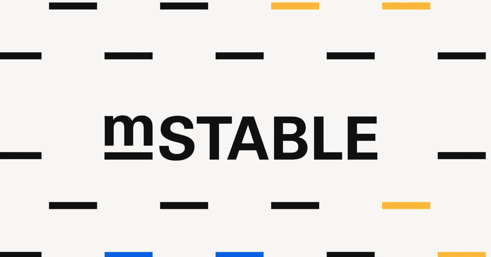

# 了解 mStable 及其智能合约

> 原文：<https://medium.com/coinmonks/understanding-mstable-and-its-smart-contracts-708968df102c?source=collection_archive---------4----------------------->

由于波动性，稳定密码已经成为人们锁定密码的标准。某一天可能是 6 万美元的比特币可能会变成 5 万美元，所以这是一种与当前 web2.0 金融系统挂钩的机制。

随着任何新系统(Stablecoins)的引入，这些项目中的一个可能无法很好地处理美国钉住汇率的波动性，或者因不钉住汇率而面临风险…