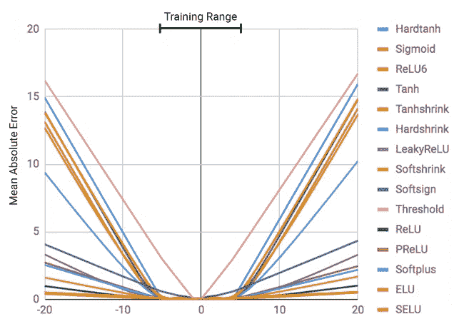
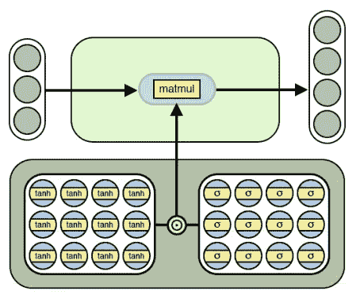
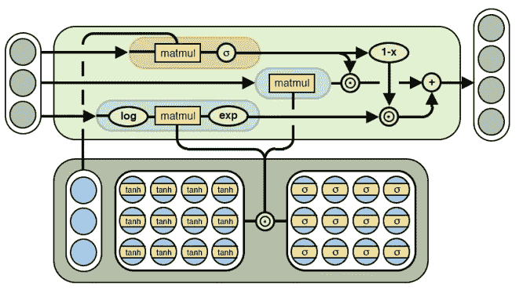
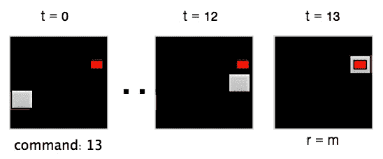

# 理解神经 ALU

> 原文：<https://medium.com/coinmonks/understanding-neural-alu-e7bf2ea64953?source=collection_archive---------4----------------------->

## 神经算术逻辑单元(NALU)

嗨，你现在一定听说过谷歌 DeepMind 发表的新论文——神经算术逻辑单元。上周，我浏览了一下，从那以后，我就很想了解它的数学上的细微差别。所以在这里我试着把自己看完之后的理解写在纸上。我认为没有比告诉世界你所知道的更好的学习方法了，所以这就是。

今天，正如我们所知，神经网络能够识别物体，生成数据，翻译几乎任何东西，甚至可以学习驾驶汽车，只要你有广泛的数据进行训练。但神经网络缺乏的一点是计数或学习数字函数的能力。嗯，它们在训练数据中确实工作得很好，但是当我们推断我们的数据并将其输入到相同的网络中时会发生什么呢？他们当然会失败。所以这是本文的核心主题。神经算术逻辑单元(NALU)正如他们所说， ***能够跟踪时间，对数字的图像进行算术运算，将数字语言翻译成实值标量，执行计算机代码，并对图像中的对象进行计数。***

为了说明神经网络中的数值外推失败，他们训练正常的神经网络来学习身份函数。训练数据由-5 和 5 之间的数字组成，他们测试了-20 和 20 之间的数字的学习功能。该模型是一个自动编码器，它接受标量值作为输入(例如，输入-2)，使用完全连接的层对其进行编码，然后将输入值重构为最后一个隐藏层的线性组合(例如，输出-2)。结论— *所有的非线性函数都无法学习表示超出训练范围的数字。该故障的严重程度直接对应于所选激活函数内的非线性程度。*

这是普通自动编码器的样子——

> **输入(2) →编码器(输入层+全连接层)→全连接层→解码器(全连接层+重构层)→输出(2)**

正如您在下面看到的，所有的非线性都给出了在-5 和 5 的训练数据范围之外的高平均绝对误差

Source: Neural Arithmetic Logic Units [***arXiv:1808.00508***](https://arxiv.org/abs/1808.00508) ***[cs.NE]***

# 神经累加器和神经算术逻辑单元

为了克服上述问题，他们引入了 NAC 和 NALU。

第一个模型是神经累加器(NAC)，它就像普通的仿射层 ***f* (W *x* + b)** ，不同之处在于变换或仅由-1、0 和 1 组成的权重矩阵。也就是说，与输入向量中的行的任意缩放不同，输出是相同的加法和减法。****

由于 **W** 中的每个元素要么是-1，要么是 0，要么是 1，所以在微分中存在约束。因此，通过将 **W** 写成无约束值，**W = tanh(Wˇ).σ(mˇ)**(tanh 和 sigmoid 的逐元素乘积)**，提出了连续且可微分(能够使用梯度下降)的参数化。** W hat 和 M hat 可以是任何值，并且结果 **W** 保证在-1 和 1 之间(包括-1 和 1 ),并且偏向于接近-1、0 和 1。

*Neural Accumulator(NAC) Source:* [***arXiv:1808.00508***](https://arxiv.org/abs/1808.00508) ***[cs.NE]***

为了学习像乘法这样更复杂的数学函数，引入了神经 ALU。它使用两个 NAC，一个执行如上所述的加法/减法，另一个能够执行乘法、除法幂函数，如√ x. ***与 NAC 一样，在从输入到输出的映射过程中，对学习重新缩放有相同的偏见。***

如果你看下面的图像，有两个紫色的 NAC 细胞。带有 *matmul* 的较小的一个使用上面的等式输出 NALU 加法和减法运算的结果: **a = Wx** 其中**W = tanh(Wˇ).σ(mˇ)。**第二个较大的紫色 NAC 单元在对数空间中操作，因此能够学习乘法和除法，将其结果存储在:**m = expW(log(| x |+ε))**

NALU Source: [***arXiv:1808.00508***](https://arxiv.org/abs/1808.00508) ***[cs.NE]***

最后，这两个 NAC 单元由一个已学习的 s 形门 **g** (橙色单元)进行插值。如果添加/子单元的输出值应用了权重 1，则另一个 NAC 单元关闭，反之亦然。

**y = g . a+(1g)。m** 其中 **g = σ(Gx)**

****

# ***实验***

他们做了各种实验来证明他们的主张。首先是简单的函数学习任务。NAC 和 NALU 能够静态和递归地学习加法、减法、乘法、除法、平方和平方根等函数。结果是 ***虽然几个标准架构在插值的情况下成功完成了这些任务，但是没有一个在外推法上成功。然而，在内插法和外推法中，NAC 成功地模拟了加法和减法，而更灵活的 NALU 也成功地模拟了乘法运算。***
其次，他们对 MNIST 数字计数任务和 MNIST 数字加法任务进行了实验。标准架构在插值长度的保持序列上是成功的，但是在外推上完全失败。值得注意的是，***RNN-坦和 RNN-雷鲁模型也无法学习插值到比训练期间所见更短的序列。然而，新议程联盟和 NALU 都外推和插值很好。***

他们还试验了语言到数字的翻译，以测试数字单词的表达是否是以系统的方式学习的。不出所料，NAC 和 NALU 不仅学会了，而且聪明地推断出将语言翻译成数字。
他们还训练了一个强化学习程序，目标是代理必须在 5x5 网格中给出的完全相同的时间实例 **T** 到达目标

Learning to track time in a grid world environment Source: [***arXiv:1808.00508***](https://arxiv.org/abs/1808.00508) ***[cs.NE]***

有两种型号。简单地说，一个具有 LSTM 记忆，另一个具有 LSTM 记忆，并通过 NAC 返回到 LSTM。**两名特工都接受过 T∞U { 5，12}发作的训练。两位特工都很快学会了掌握训练情节。然而，具有 NAC 的代理在 T ≤ 19 时在任务中表现良好，而标准 LSTM 代理在 T > 13** *时表现恶化。两个代理都失败了。作者**假设，相对于 NAC 的其他用途，此处 NAC 更有限的外推(就数量级而言)是由仍在某种程度上使用 LSTM 编码算术的模型引起的。***

> [直接在您的收件箱中获得最佳软件交易](https://coincodecap.com/?utm_source=coinmonks)

