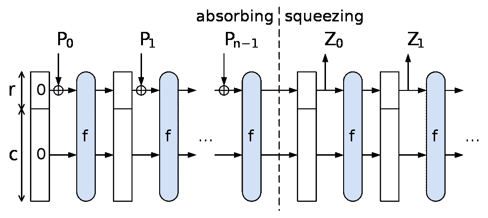
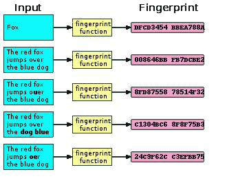

# 了解单向哈希函数# how to guidl(5/n)

> 原文：<https://medium.com/coinmonks/understanding-one-way-hash-functions-howtobuidl-5-n-6c5887c08c3?source=collection_archive---------4----------------------->

## 哈希::每个加密系统的构建块

## 以太坊充分利用了 Keccak/SHA-3 算法。

具体来说，以太坊& Solidity 用的是 Keccack-256 版本的 SHA-3。

出于某种原因，这似乎是 Dapp 开发者的商业秘密。虽然散列绝对是所有密码系统的关键组成部分，但我们不需要重新发明轮子来编写运行在密码平台上的系统和智能契约。
你不需要了解 **SHA-3** 的工作原理。我重复一遍:
你不需要了解 **SHA-3** 是如何工作的。再说一次:
你不需要了解 **SHA-3** 是如何工作的。明白了吗？很好。现在…
*你应该明白* ***为什么要用*** *哈希了。*



The sponge construction for hash functions. *Pi* are input, *Zi* are hashed output. The unused “capacity” *c*should be twice the desired resistance to [collision](https://en.wikipedia.org/wiki/Collision_attack) or [preimage attacks](https://en.wikipedia.org/wiki/Preimage_attack).

SHA-3 是加密原始族 Keccak 的子集。SHA-3 采用海绵结构，数据被*吸收*到海绵中，然后结果被*挤出*。

一个 ***散列函数*** 是可以用来将任意*大小的数据映射到固定 大小的 ***数据的任何函数。哈希函数返回的值称为哈希值、哈希代码、摘要或简称为哈希。****

*一个 ***单向哈希函数*** 展现出以下性质:
A)不可逆；从摘要中确定消息在计算上是不可行的，B)抗冲突；找到一个以上的消息来提供给定的摘要是不切实际的，以及 C)高雪崩效应；任何微小的变化都有重大的消化变化。d)确定性。相同的输入必须总是映射到相同的输出。*

> *打个比方:烤一个蛋糕 *你有黄油、糖、鸡蛋、面粉、盐、发酵粉、牛奶、香草、糖霜，你把所有这些配料混合在一起，混合在一起，放在烤箱里加热。出来一个蛋糕。但是你能拿一块蛋糕回去把每一种成分都取出来吗？想象一下，从蛋糕中取出一个鸡蛋有多难。实际上，这是不可能的。**

*因为输出的数据总是唯一的，我们可以做一些有趣的事情，比如从给定的*公钥*中导出特定的钱包*地址*，这意味着相同的公钥每次都映射到相同的钱包地址。*

## *确定性数字指纹。*

**

*hashing function creates a fingerprint*

*我们还可以创建文档的*数字指纹，并将作者提供的文档的 ***哈希*** 与完全可读文档的独立计算哈希进行比较。只要哈希匹配，我们就知道文档没有被传递消息的中介篡改。即使是微小的变化也会对指纹产生巨大的雪崩效应，使得伪造变化几乎不可能，但如果系统中有不良行为者，则很容易识别。我们过去已经讨论过散列作为一种机制用于[挖掘和工作证明](/@dan.ryan.emmons/bitcoin-mining-proof-of-work-fb09ba124783)，但是现在我们更感兴趣的是我们可能希望如何在我们的智能合同中使用散列。**

**让我们试试这个。启动松露开发控制台:**

```
****truffle develop****
```

**`web3.js`库有很好的[文档](https://web3js.readthedocs.io/en/1.0/web3-utils.html#sha3)。
让我们用不同的样本输入来试试`sha3`:**

```
**web3.sha3("Ladies and gents, this is the moment you've waited for")
'**0x698b948227d9bd31126f12d50b31991dacaea46f28293ee551d057094af30080**'web3.sha3("Ladies and Gents, this is the moment you've waited for")
'**0x8075374896d5dbb7027d9b5b710b3097f48513d287c18c49e7307c9089a7367f**'web3.sha3("Been searching in the dark, your sweat soaking through the floor")
'0x081cbc70e6cc9c8a295d90f9a3b62c7e3122376111ade597a346ec9cefb1bcc2'web3.sha3("And buried in your bones there's an ache that you can't ignore")
'0x5e997b2a5c35920d3766cca0cce578911bcb252758c2bfd49888eaca331e7051'web3.sha3("Taking your breath, stealing your mind")
'0x6c68baed17efc0033efafc53618aae61c666c0440cbc3f87e8b586ffe8dda623'web3.sha3("And all that was real is left behind")
'0x76fb4b778db420f198c73a8976b7e8ce5cee4e3ec742b8d073da1225440bd077'**
```

**一些在线工具可供你试用，如果你不想编码…
[https://emn178.github.io/online-tools/keccak_256.html](https://emn178.github.io/online-tools/keccak_256.html)**

**一些需要快速注意的事情:1)即使将`g`改为`G`，输出也会有很大的变化。2)无论`sha3`函数的输入消息有多长，输出总是 64 个十六进制字符或 32 个字节。Solidity 方便地为我们提供了一个存储这个的数据类型:`bytes32`。**

**举个例子，夏洛克的整个冒险故事。如果对整本书进行哈希运算，得到的 keccak256 / SHA3hash 是**

```
**'0xe2af31201f97e4d24df87332465243f8e56f046bc268a790540ce2a258bed40c'**
```

**这产生了有趣的后果。因为我们知道哈希函数是确定性的，所以将*哈希数据*存储在智能合同的*存储器*中意味着记录在公共区块链上的数字指纹可以与原始文档进行比较，并在未来的某个日期进行独立验证。此外，我们知道存在高雪崩效应，因此即使输入数据中的一位发生变化，也会导致输出数据发生剧烈变化。也许这将有助于确定数据的来源，或者艺术品的所有权记录，作为真实性/质量的指南。**

**一个非常简单的智能合约示例将为第一个记录传递给合约的唯一的`fingerprint`的人记录`msg.sender`。如果一个条目已经存在，一个`storeFingerprint`函数将抛出一个异常。另一个函数可以采用任意长度的`data`字符串，然后计算数据的`keccak256`。对于合同的客户来说，预先计算 sha3 哈希会便宜得多，但是为了方便起见，我们提供了两个`function`选项。**

```
**pragma solidity ^0.4.23;contract Provenance { mapping (bytes32=>address) public fingerprints; function storeFingerprint( bytes32 fingerprint ) public {
        require(fingerprints[fingerprint] == 0x0);
        fingerprints[fingerprint] = msg.address;
    } function storeDataFingerprint( string data ) public {
        storeFingerprint( keccak256(data) );
    }}**
```

***Dan Emmons 是*[*Emmonspired LLC*](http://www.emmonspired.com/)*的所有者，a* [*认证比特币专业人士*](http://cryptoconsortium.org/lookup/6f0d14) *，认证以太坊开发者，全栈开发者，加密货币项目顾问。他还是一个名为*[*# ByteSizeBlockchain*](https://www.youtube.com/watch?v=SVBZ7mdgGcA)*的 Youtube 频道和 iTunes 播客的创造者。***

**如果你真的有兴趣了解更多关于 SHA3 的内部细节，维基百科有几篇关于这个问题的文章。**

 **[## NIST 哈希函数竞赛-维基百科

### NIST 散列函数竞赛是由美国国家标准和…

en.wikipedia.org](https://en.wikipedia.org/wiki/NIST_hash_function_competition)**  **[## 安全散列算法-维基百科

### 安全散列算法是由美国国家安全研究所发布的一系列加密散列函数

en.wikipedia.org](https://en.wikipedia.org/wiki/Secure_Hash_Algorithms)** **[](https://en.wikipedia.org/wiki/Fingerprint_%28computing%29) [## 指纹(计算)-维基百科

### 在计算机科学中，指纹算法是映射任意大的数据项(例如…

en.wikipedia.org](https://en.wikipedia.org/wiki/Fingerprint_%28computing%29)**