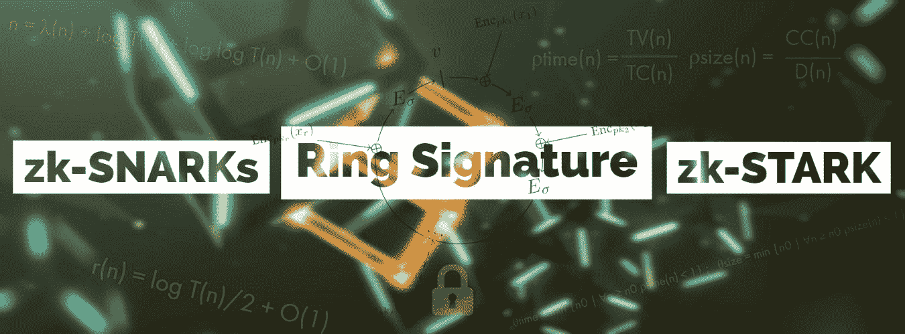
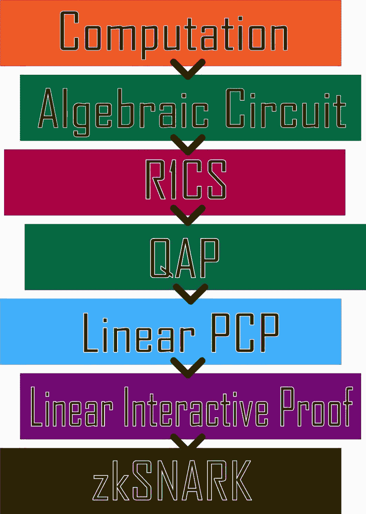
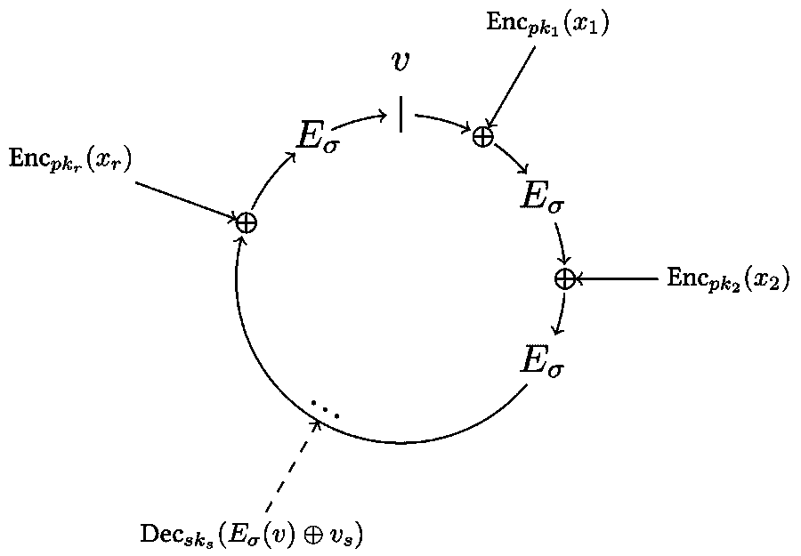
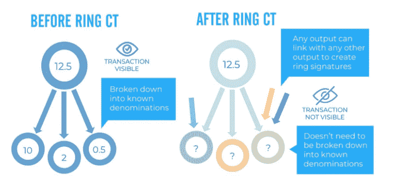

# 理解基于隐私的协议🔐

> 原文：<https://medium.com/coinmonks/understanding-privacy-based-protocols-44222a4fb2e9?source=collection_archive---------4----------------------->

> “你的钥匙，你的比特币。不是你的钥匙？不是你的比特币。”— Andreas M. Antonopoulos

密码货币的市值和交易量增长迅速。随着机构投资者进入密码货币市场，开发替代交易系统对于交易大量密码资产至关重要，同时保持最低的价格下滑和市场影响以及维护用户隐私的能力。显然，在线隐私正在消失，许多区块链公众前所未有的透明度让情况变得更糟。您的所有数据都将公开披露。

由于比特币区块链的公共性质，它已被证明不像人们曾经认为的那样匿名。出于同样的原因，比特币的可替代性也受到了影响。比特币协议的缺陷导致了主要专注于匿名和隐私的密码货币的发展。今天，我们将尝试理解这些基于隐私的密码货币工作的协议。

> *ZK-斯纳克(零知识简洁非交互的知识论证)*

A **zk-SNARK** 是一个**零知识简洁的非交互式知识论证**。正如你们中的许多人所知，零知识证明是增加隐私的一种方式。

零知识证明是证明方和验证方之间的协议，其中提出索赔的证明方可以说服验证方他们的索赔是有效的*、*，同时只显示他们索赔的有效性。**零** - **知识证明**最早是由沙菲·戈德瓦瑟、希尔维奥·米卡利和查尔斯·拉科夫在 1989 年的论文《交互证明系统的知识复杂性》中提出的。他们正在研究与交互式证明系统相关的问题，证明者与验证者交换消息，以使他们确信他们知道某个真理，而不声明该知识是什么。听起来有点混乱？嗯，起初看起来是这样，我们不是来这里攻读 ZKP 的博士学位的😜。

了解这三个关键属性将有助于您理解零知识证明是如何工作的。

*   完整性:如果陈述是真的，那么诚实的验证者可以被诚实的证明者说服。
*   合理性:如果证明者不诚实，他们就不能通过撒谎来说服验证者陈述的合理性。
*   零知识:如果语句是真的，验证者将不知道该语句实际上是什么。

**zk-SNARKs** 是应用零知识证明的一种方式。

除上述 ZKP 房产外，zk-SNARK 还需要:

1.  **简洁**:证明的大小需要足够小，以便在几毫秒内验证。
2.  **非交互**:只有一组信息被发送给验证者进行验证，因此验证者和验证者之间没有来回的通信。
3.  **论点**:一个计算上合理的证明:稳健性反对利用多项式时间的证明，即有界计算。
4.  【知识的 :没有证人的参与(证明陈述所需要的私人投入)，证据是无法构建的。

**使用密码货币，这意味着可以隐藏所有交易数据，包括**发送方地址、接收方地址和交易金额。zk-SNARKs 允许我们隐藏所有这些信息，同时也允许网络确认和验证交易。它最大限度地保护隐私，同时保持共识。

**ZCash** 是第一个使用 zk-SNARKS 的区块链技术概念的密码货币的例子。 [**电阻 DEX**](https://drive.google.com/file/d/1oAJLCXbPr3FnS5q0cB2GY2WYhDlc3goH/view) **(ResDEX)** 使用零知识证明来保护**电阻区块链**上的交易隐私。有了 zk-SNARKs，RES 可能没有公共记录或历史记录，如果用户选择通过私人交易发送另一个硬币，其历史记录基本上被删除。由于交易历史存在于区块链，与硬币本身无关，硬币只需要通过一次加密交易来掩盖其整个历史，进而实现可替代性。

How zk-SNARKs are constructed

毫无疑问，ZK-斯纳克将会是密码领域的一个巨大的游戏改变者，但是有一些潜在的问题。一些人认为，可信的设置阶段可能会受到损害，存在可伸缩性问题，并且，与大多数区块链协议一样，zk-SNARK 加密容易受到量子计算机的攻击。

> *zk-STARKs(零知识可扩展透明知识论据)。*

zk-STARKs 是零知识密码的最新创新。

**zk-STARKs** 是由 Eli-Ben Sasson 在本 [**白皮书**](https://eprint.iacr.org/2018/046.pdf) 中提出的，作为 zk-SNARK 证明的替代版本。一般来说，zk-STARKs 被认为是该技术的一种更有效的变体，根据实现方式，可能更快更便宜。

**有哪些改进？**

首先，zk-STARKs 解决了可信设置问题。它们完全消除了多方创建字符串所需的私钥的需要。相反，生成证明所需的一切都是公开的，证明是由随机数生成的。zk-STARKs 实际上取消了 zk-SNARKs 中对[非对称加密](https://coincentral.com/unlocking-key-encryption/)的要求，而是使用类似于比特币挖掘中发现的散列函数。ZK-stark 也被认为是抵制量子计算的进步。例如，量子计算机能够比过时的计算机更快地从公钥中破译私钥。这是由于比特(0 或 1)和量子比特(同时为 0 和 1)之间的差异。椭圆曲线加密是我们通常用来生成私有和公共密钥的方法，它不是抗量子的。相反，zk-STARKs 不使用这种类型的加密技术，因此不会受到这种技术进步的影响。换句话说，zk-STARKs 在密码假设方面呈现了更简单的结构。

目前，zk-STARKs 的主要问题是他们的规模。与 zk-SNARKs 相比，校样的尺寸更大。这种数据大小上的差异可能会根据使用环境带来限制。StarkWare Industries 正在寻求利用 zk-STARKs(一个是证明的大小)来解决一些挑战，并使该技术商业化，该技术可以在多个行业中利用，包括区块链实施。

zk-STARKs 是可扩展的、透明的、具有通用的应用，并且目前是抗量子的。这允许建立对技术的信任，因为它是可验证的。如果解决了块大小的问题，我们可以清楚的看到很多项目采用了 zk-STARK 技术。

> *戒指签名和戒指 CT*

图片提供:[维基百科](https://en.wikipedia.org/wiki/Ring_signature)

Monero 利用环签名技术在交易的**输入方**保护发送方的隐私。环签名是一种加密数字签名，其中一组可能的签名者被合并在一起以产生可以授权交易的独特签名。这一过程早在 2001 年就由阿迪·萨莫尔、罗恩·里维斯特和耶尔·陶曼发明，随后在 [Asiacrypt](https://en.wikipedia.org/wiki/Asiacrypt) 上推出。

为了理解什么是环签名以及它们如何帮助维护发送者的隐私，让我们举一个例子。当你给某人寄支票时，你需要签名，对吗？然而，正因为如此，任何看到你的支票(知道你的签名)的人都能看出你就是寄支票的人。假设，你随机挑选四个人，将你的签名与这四个人的签名合并，创建一个独特的签名。没有人能发现这是否真的是你的签名。本质上，这就是环签名的工作原理。

**戒指 CT(保密交易)** **:**

Monero 环保密交易，也称为环 CT，是 Monero 协议中实现的隐私功能。使用 Ring CT，通过确保隐藏交易金额本身，提高了用户的交易隐私。

图片提供:谷歌图片

在实施 Ring CT 之前，Monero 要求将交易金额划分为如下面额:

如果 Bob 想在区块链上启动一个 12.5 XMR 的事务，这个输出将被命名为 2、0.5 和 10 这三个独立的环。这种技术的优点在于，它确保了在网络上总是有足够数量的环成员可以被发现，因为环签名只能将具有相同值的输出集合在一起。然而，这种技术的局限性在于，从外部方的角度来看，他们能够看到正在交易的金额。为了解决这个问题，基于 Gregory Maxwell 的研究实现了环形 CT。Ring CT 所做的很简单，它隐藏了区块链中的交易金额。Monero 通过环签名、秘密地址和后来实现的环 CT 实现了交易的三个方面的匿名性。

*“不动的人，不会注意到自己的锁链。”*

***关闭思想***

毫无疑问，随着未来变得更加开放和分散，基于隐私的协议将越来越吸引人。对于所有上述协议以及将实现它们的项目来说，有趣的时代即将到来。随着这些协议的惊人增长，未来看起来确实非常光明。当我们走向主流采用时，观察这些和更多即将出现的以隐私为中心的网络的持续发展和最终结果将是令人着迷的。

> [直接在您的收件箱中获得最佳软件交易](https://coincodecap.com/?utm_source=coinmonks)

