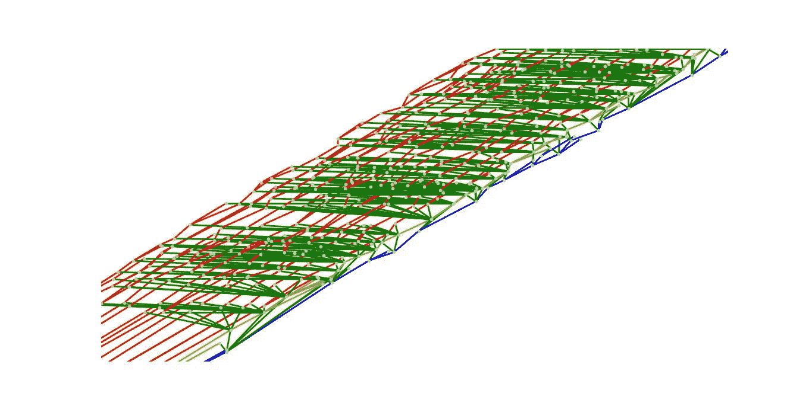

# 理解利害关系证明:建议的好处，第 1 部分

> 原文：<https://medium.com/coinmonks/understanding-proof-of-stake-suggested-benefits-part-1-a0d97546e6c9?source=collection_archive---------1----------------------->

在工作证明(PoW)中，共识机制和矿工激励都属于一个简单的逻辑:

我们如何解决网络中的临时分叉？我们选择力量最大的叉子。

我们如何决定哪个矿工可以提议下一个区块(也就是我们如何创造随机性)？我们转向工作证明。

我们如何防止矿工攻击网络？PoW 再一次为我们提供了答案。

工作证明的优雅在于它的简单。

为了增强区块链技术的潜力，[以太坊基金会](https://www.ethereum.org/foundation)正计划过渡到一种新的共识机制，称为利益证明(PoS)。以太坊发布使许多事情变得复杂，而 PoW 使这些事情变得简单。PoS 不再依赖 PoW 来获得所有答案，而是将额外的规则编码到它的软件中。

PoS 的反对者怀疑对这些新规则进行编码会使以太坊容易受到一些新的攻击，而这些攻击在 PoW 中是不可能执行的。他们怀疑以太坊将无法幸免于这些攻击。

虽然他们正在开发的 PoS 共识机制更加复杂，但以太坊相信 PoS 将能够提高区块链技术的安全性和效率，同时为大规模采用区块链创造必要的条件。

# **卡斯珀是什么？**

你会经常听到以太坊基金会正在开发的被称为 Casper 的利害关系证明算法。这可能会令人困惑，因为 Casper 引用了许多不同的利害关系证明研究分支。Casper 研究的不同分支包括 Casper 友好的终结小工具、Casper 通过构造纠正和 Casper 友好的幽灵。Casper 之所以有这么多不同的版本，是因为每个版本都探索了不同的实现利害关系证明的方法。

尽管它们都探索了不同的利害关系证明实现，但这些研究分支都旨在影响/告知 PoS 的最终形式最终会是什么样子。

出于本文的目的，当我提到 Casper 或 proof-of-stake 时，我指的是目前计划成为 Casper 最终形式的内容。这种形式是不断发展的，但在这篇文章中，我搜索了互联网，试图给你关于 Casper 未来的最新信息。

# **PoS 的建议优势**

在下文中，我将列出 PoS 的**建议**好处。重要的是要记住，在 PoS 上线之前，这些优势还没有得到证实。

# **耗电少**

与电力相比，标桩法有望显著降低能耗，因此更加环保。保守估计表明，比特币矿工的集体用电量[与一个小国的用电量](https://www.forbes.com/sites/christopherhelman/2018/01/16/bitcoin-mining-uses-as-much-power-as-ireland-and-why-thats-not-a-problem/#34b7d7f14589)相同。

Proof-of-work 的高能耗水平是非常故意的。PoW 故意为矿商创造沉没成本，他们只有遵守网络规则才能收回这些成本。

如果他们遵守规则，并建立在最 PoW，他们将获得他们的块奖励，付清电费，并在此过程中获得一些利润。

相反，如果矿工试图以某种方式欺骗网络，他们将不会收到他们的块奖励，他们将没有必要的钱来支付他们的电费。

## **用 Eth 存款替代电力作为激励**

Casper 没有使用电力沉没成本作为鼓励矿工遵守规则的激励，而是使用验证器安全存款。PoS 中的验证器扮演着与 PoW 中的挖掘器相同的角色。验证者不被允许提议和验证块，直到他们首先将以太存款提交到智能合约中。如果验证者试图欺骗网络，他们会损失一部分甚至全部的安全保证金。

以太坊的 PoS 机正试图用安全押金来代替电费，作为一种威慑。这意味着 PoS 不需要巨大的处理能力来激励验证者遵守网络规则。通过消除对强大处理能力的需求来保护区块链，PoS 旨在维护网络安全，同时大幅降低能耗。

Vitalik Recently Tweeted this image with the text “Sharding is coming.” [Source](https://twitter.com/vitalikbuterin/status/991021062811930624?lang=en)

# 为更快的区块链奠定基础

Casper 不会直接提高以太坊的交易速度(以每秒的交易量来衡量)，但它被视为未来升级的必要步骤(先驱)。

分片是一个计划中的以太坊升级，预计**将导致每秒交易量的大幅增加**。每秒的交易量预计会增加，因为分片分担了区块链网络中验证器的工作。目前在 PoW 中，成千上万的节点和矿工在整个网络中重复完全相同的计算。这样做是为了确保矿工不会攻击网络。

以太坊基金会打赌，我们可以通过分割网络的工作负载，让网络的不同“碎片”或子集验证彼此的工作，来获得类似的安全保证。预期的额外好处是我们可以将每秒事务数(tps) **提高几个数量级**。

理论上，在 PoW 中分片是可能，但是有点困难，因为 PoW 没有协议内终结的含义或定义。当我们说一个块已经实现终结时，这意味着该块中的事务永远不能被撤销。当一个区块达到最终结果，我们可以有信心，这笔交易将永远在区块链的历史。

## **概率终结**

权力终结通常被称为概率终结。不要太专业，最重要的想法是，随着您的事务被埋在越来越多的块中，您的事务被撤销的可能性继续接近(但永远不会达到)零。

战俘区块链总是有机会被还原的原因是因为正确的区块链总是展示最大力量的那个。

如果有一次攻击者发起 51%的攻击并回复 10 块(或 2 块或 20 块等等。)，尽管不太可能，但只要它表现出最大的 PoW，网络就会立即接受该修订。

你可能听说过，企业通常会等待 6 次确认，才会认为你的比特币交易有效。重要的是要记住，等待 6 次确认不是比特币客户端软件强制执行的规则。这是一个被加密团体巩固的通用实践，因为他们相信在 6 个块之后，事务恢复的概率足够低，可以认为该事务是最终的。在 6 个街区之后，**社区已经同意交易在概率上是最终的**。

根据我的理解，PoW 的概率终结性使分片变得困难的原因是因为分片需要在任何给定的时间就某个历史观点达成一致，以便高效和有效地相互协调。如果一个区块链总是因为某个矿工随机展示了能还原几个区块的异能而面临重组其历史的风险，那么实现这种协调会变得非常复杂。

## **卡斯帕对终结的定义**

与概率终结相反，卡斯珀为我们提供了“经济终结”。对于经济终结性，当以太坊协议告诉我们交易已终结时，我们可以确定以下两种情况之一已经发生:

1)您正在查看的交易实际上已经完成或

2)一个恶意验证器(又名 PoS miner)或一组验证器欺骗您接受一个假的区块链，但他们在这个过程中损失了价值数百万美元的乙醚。

这里的关键细节是 Casper 的目标是给我们一个协议内的终结性定义，而 PoW 没有。换句话说，以太坊客户端软件将自我意识到，在没有人工干预的情况下，交易是最终的，而比特币的工作证明无法做到这一点。

通过为网络中的节点配备同时意识到某些交易何时结束的能力，理论是 Casper 的经济终结性将比 PoW 的概率终结性更容易切分。

在下周的帖子中，我将完成我的 PoS 系列的“建议的好处”部分。我将讨论如何 Casper 的目标是减少矿工集中化，并使攻击区块链网络比 PoW 更昂贵。

## 喜欢你读的吗？在 twitter 上关注我@ [jmartinez_43](https://twitter.com/jmartinez_43)

## 你准备好第二部分了吗？单击下面的链接。

 [## 理解利害关系证明:建议的好处，第 2 部分

### 这篇文章是我关于以太坊计划升级到利益证明(PoS)的系列文章的第二部分。如果您还没有阅读第 1 部分…

medium.com](/coinmonks/understanding-proof-of-stake-suggested-benefits-part-2-8c6e63e62c40) 

# 引用/资源/了解更多信息:

## **股权证明概述**

[乔恩·崔](/@jonchoi?source=post_header_lockup)——[以太坊 Casper 101](/@jonchoi/ethereum-casper-101-7a851a4f1eb0)

[Vitalik Buterin](/@VitalikButerin?source=post_header_lockup) — [桩设计理念的证明](/@VitalikButerin/a-proof-of-stake-design-philosophy-506585978d51)

弗拉德·扎姆菲尔—卡斯帕的历史第一部分 [1](/@Vlad_Zamfir/the-history-of-casper-part-1-59233819c9a9) 、 [2](https://blog.ethereum.org/2016/12/07/history-casper-chapter-2/) 、 [3](/@Vlad_Zamfir/the-history-of-casper-chapter-3-70fefb1182fc) 、 [4](/@Vlad_Zamfir/the-history-of-casper-chapter-4-3855638b5f0e) 和 [5](/@Vlad_Zamfir/the-history-of-casper-chapter-5-8652959cef58)

Ameer Rosic — [以太坊 Casper 协议是什么？速成班](https://blockgeeks.com/guides/ethereum-casper/)

Bitmex Research — [股权证明完整指南](https://blog.bitmex.com/complete-guide-to-proof-of-stake-ethereums-latest-proposal-vitalik-buterin-interview/)

以太坊基金会— [股权证明常见问题解答](https://github.com/ethereum/wiki/wiki/Proof-of-Stake-FAQ)

## **关于终结**

[萧-王巍](/@icebearhww?source=post_header_lockup)——[以太坊分割:概述与终结](/@icebearhww/ethereum-sharding-and-finality-65248951f649)

[维塔利科·布特林](https://blog.ethereum.org/author/vitalik-buterin/)——[关于结算终结](https://blog.ethereum.org/2016/05/09/on-settlement-finality/)