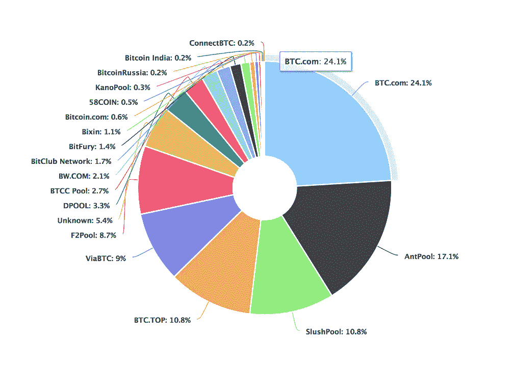
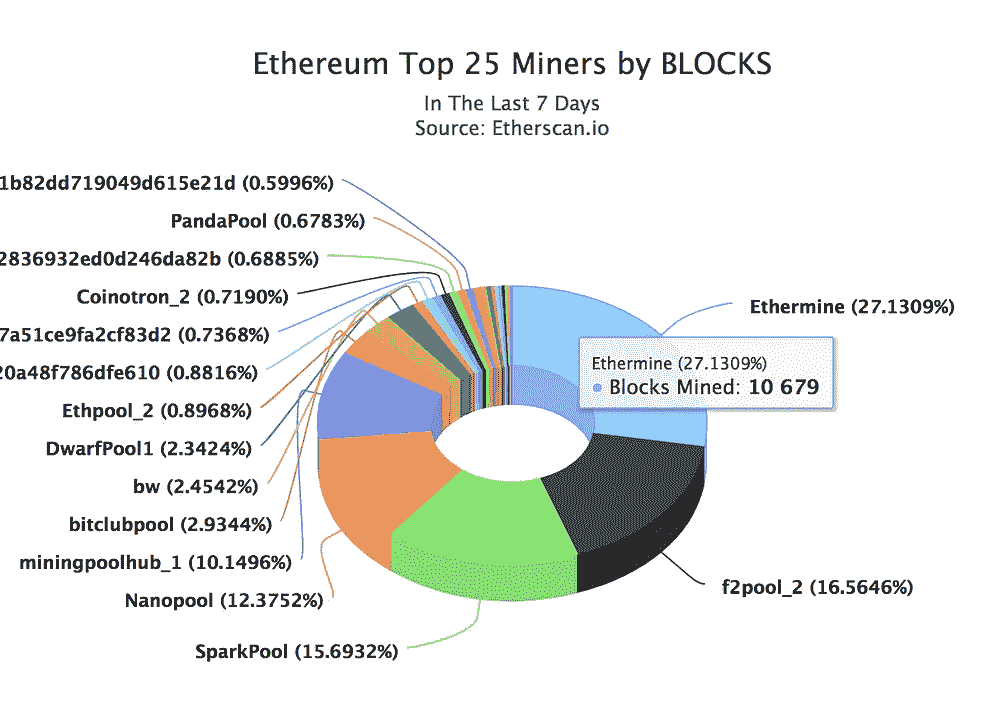
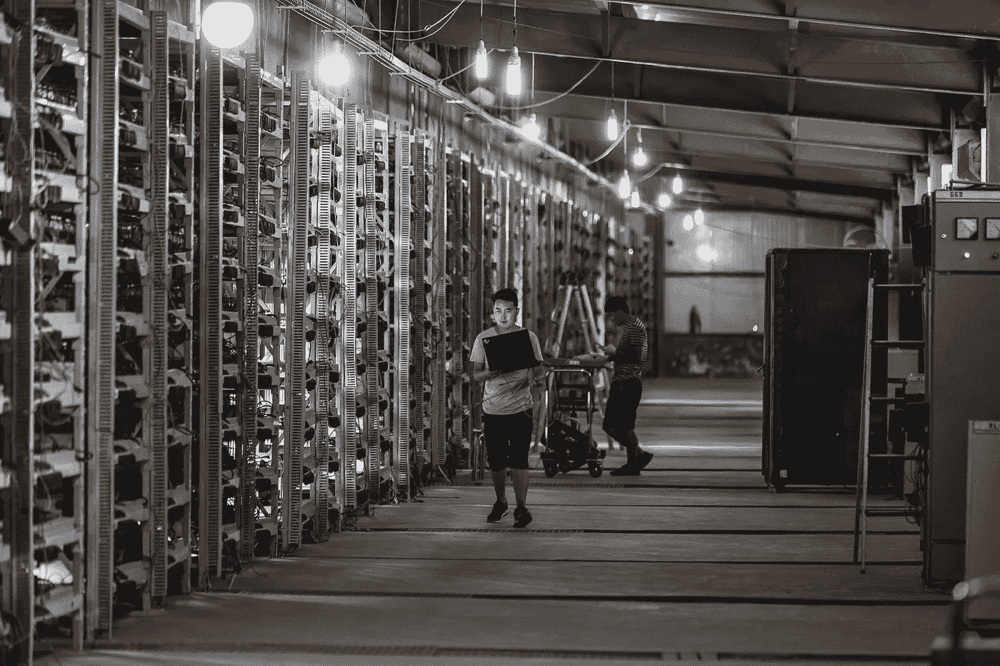
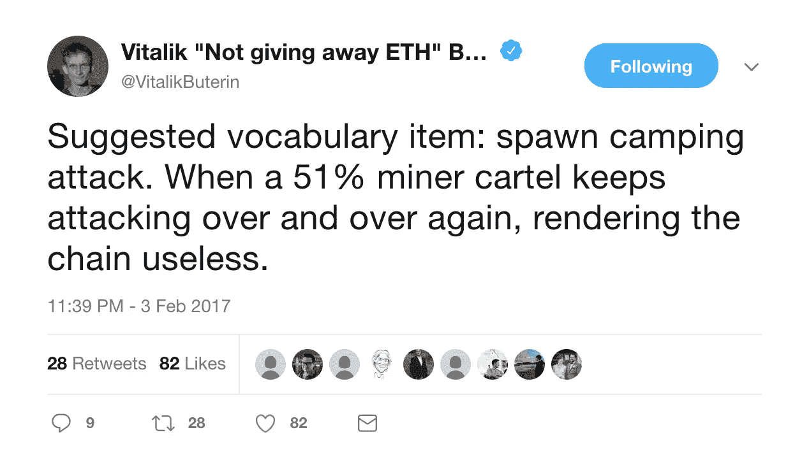

# 理解利害关系证明:建议的好处，第 2 部分

> 原文：<https://medium.com/coinmonks/understanding-proof-of-stake-suggested-benefits-part-2-8c6e63e62c40?source=collection_archive---------3----------------------->

这篇文章是我关于以太坊计划升级到利益证明(PoS)的系列文章的第二部分。如果您还没有阅读第 1 部分，[点击这里](/@julianrmartinez43/understanding-proof-of-stake-suggested-benefits-part-1-a0d97546e6c9)。

在第 1 部分中:

*   我解释了卡斯帕是什么，
*   解释 PoS 如何利用乙醚沉积物来提高安全性
*   解释 PoS 的目标是如何降低能耗，以及
*   解释在我们能够提高以太坊区块链的速度之前，PoS 如何被视为一个必要的过渡。

在第 2 部分中，我将解释 proof-of-stake 如何旨在减少矿业集中化，以及如何旨在增强区块链技术的安全性。

# **减少矿业集中化**

## **理想的采矿情况**

理想情况下，你希望许多矿工平均分布在世界各地的许多国家。理想情况下，这些矿工验证区块的机会大致相同。这些条件之所以可取，是因为它降低了某个人或一群人成功攻击网络的可能性。

## 如果我们要分权，为什么要集权。

工作证明挖掘的当前状态与上面描述的理想情况相差甚远。这是因为随着时间的推移，工作证明采矿的激励自然会导致采矿权集中到越来越少的人手里。采矿目前由工业规模的作业所主导，与较小的作业相比，这些作业对[散列率](https://coinsutra.com/hash-rate-or-hash-power/)的影响越来越大。

Currently in both [Bitcoin](https://blockchain.info/pools) and [Ethereum](https://www.etherchain.org/charts/topMiners), 3 mining pools collectively control over 50% of the hash power of both networks. The chart for Bitcoin mining is on the left. Ethereum mining is on the right.

## **集中开采是规模经济的产物**

电力开采出现集中化是因为这个行业有强大的规模经济。解释规模经济最简单的方法就是宣称，这一切都是为了在你购买越来越多的东西时，在你经营业务所需的东西上获得更大的折扣。

例如，假设您一次性购买 1000 个 ASIC(专用采矿硬件)时获得了 10%的折扣。如果你决定购买 2000 个 ASIC，ASIC 制造商这次可能会给你 15%的折扣。当你扩大采矿业务时，你不仅创造了更多的比特币，还从你生产的每一个比特币中榨取了更多的利润。

注:上一段中提到的百分比和数量不准确。我使用这些数字只是为了证明规模经济的概念。

如果你是一个工业规模的矿商，这里有一个不完整的清单，列出了你必须花钱购买的东西:

*   [ASIC](https://www.digitaltrends.com/computing/what-is-an-asic-miner/) 硬件(专用采矿设备)
*   用于为您的 ASICs 供电的电力
*   你需要冷却设备，以确保你的芯片不会过热
*   为您的冷却设备供电
*   用于存放 ASIC 机器的设施
*   其他事情

在大多数情况下，当你大量消费清单上的物品时，规模经济就开始发挥作用了。

An industrial scale mining operation. It is likely that the man in the photograph is an employee of the mining operation.

经常听到工业规模的矿商因为对网络有如此大的影响力而被妖魔化，但我认为重要的是不要因此而评判他们。激励措施实际上是为了更快地做大，或者被甩在后面。对于 PoW 来说，做大是最符合逻辑的选择。

## **PoS 将规模经济从等式中移除**

*如果成功实施*，PoS 将无法实现规模经济。PoS 消除了规模经济，因为它不需要使用电力沉没成本来激励验证者的行为。PoS 使用以太坊安全存款代替。

在 PoS 中，您提出区块的可能性与您提交存款的乙醚量成正比。如果所有验证方的乙醚存款总额为 1000 万乙醚，而您已提交了 100 万乙醚，则您提出阻止的可能性为 10%。

**这消除了通常被称为“工业军备竞赛”的网络安全问题，也为较小的 PoS 验证机(又名 PoS 矿工)提供了更公平的系统**。

(如果你有兴趣阅读更多关于 PoW mining 的阴暗面，请查看[这篇文章](https://blog.sia.tech/the-state-of-cryptocurrency-mining-538004a37f9b)。许多内部秘密最近被公之于众。)

# **提高攻击网络的成本**

与 PoW 相比，PoS 旨在使攻击者攻击网络的成本更高。

PoW 攻击者的目标是控制超过 50%的散列功率，以便攻击网络。如果拥有 51%散列率的攻击者的目标是破坏比特币网络的信心，他们可以通过不断还原区块链的历史来实现这一目标。攻击者达到 51% hash 功率后，持续攻击网络的成本现在**只有电费**。

Vitalik tweeting about the spawn camp attack.

即使整个比特币社区都意识到了攻击，他们也无法阻止攻击，除非他们创建一个[硬分叉](https://cointelegraph.com/bitcoin-cash-for-beginners/what-is-hard-fork#what-is-a-soft-fork)来使比特币的 ASIC 硬件失效。

在 PoS 中，只有具有保证金的验证者才能够向网络提议和添加块。如果验证者试图攻击网络，他们的保证金将被删除。除了失去安全保证金，**他们将无法再攻击网络，因为没有保证金**他们无法验证交易。如果攻击者想要再次攻击网络，他们将不得不再次提交价值数百万美元的以太网，以便进行另一次尝试。

**在 PoS 中，攻击网络的边际成本不再仅仅是电费成本；这是全新的保证金。**

# **下一篇文章:早期版本的利害关系证明的问题**

以太坊并不是第一个尝试使用利害关系证明作为共识方法的协议。试图使用利害关系证明的协议面临两个主要问题；无利害关系问题和远程攻击问题。

在我的下一篇文章中，我将解释这些问题是什么，以及以太坊计划如何解决这些问题。

## 喜欢你读的吗？在 twitter 上关注我@ [jmartinez_43](https://twitter.com/jmartinez_43)

## 你准备好第三部分了吗？单击下面的链接。

 [## 理解利害关系的证明:无利害关系理论

### 以太坊并不是第一个尝试使用利益证明(PoS)作为共识方法的协议。Peercoin 已实现…

medium.com](/coinmonks/understanding-proof-of-stake-the-nothing-at-stake-theory-1f0d71bc027) 

# 引用/资源/了解更多信息:

## **股权证明概述**

[乔恩·崔](/@jonchoi?source=post_header_lockup)——[以太坊卡斯珀 101](/@jonchoi/ethereum-casper-101-7a851a4f1eb0)

[Vitalik Buterin](/@VitalikButerin?source=post_header_lockup) — [桩设计理念的证明](/@VitalikButerin/a-proof-of-stake-design-philosophy-506585978d51)

弗拉德·扎姆菲尔—卡斯帕的历史第一部分 [1](/@Vlad_Zamfir/the-history-of-casper-part-1-59233819c9a9) 、 [2](https://blog.ethereum.org/2016/12/07/history-casper-chapter-2/) 、 [3](/@Vlad_Zamfir/the-history-of-casper-chapter-3-70fefb1182fc) 、 [4](/@Vlad_Zamfir/the-history-of-casper-chapter-4-3855638b5f0e) 和 [5](/@Vlad_Zamfir/the-history-of-casper-chapter-5-8652959cef58)

Ameer Rosic — [以太坊 Casper 协议是什么？速成班](https://blockgeeks.com/guides/ethereum-casper/)

Bitmex Research — [股权证明完整指南](https://blog.bitmex.com/complete-guide-to-proof-of-stake-ethereums-latest-proposal-vitalik-buterin-interview/)

以太坊基金会— [股权证明常见问题解答](https://github.com/ethereum/wiki/wiki/Proof-of-Stake-FAQ)

## **关于矿业集中化**

[大卫·沃里克](https://blog.sia.tech/@davidvorick) **—** [加密货币开采的状态](https://blog.sia.tech/the-state-of-cryptocurrency-mining-538004a37f9b)(必读)

保罗·罗伯特— [这就是比特币矿工接管你的城镇的后果](https://www.politico.com/magazine/story/2018/03/09/bitcoin-mining-energy-prices-smalltown-feature-217230)

Christopher Helman — [比特币开采使用的电力和爱尔兰一样多。这就是为什么这不成问题的原因](https://www.forbes.com/sites/christopherhelman/2018/01/16/bitcoin-mining-uses-as-much-power-as-ireland-and-why-thats-not-a-problem/#34b7d7f14589)

[经济学家](https://www.economist.com/) **—** [规模经济和范围经济](https://www.economist.com/node/12446567)