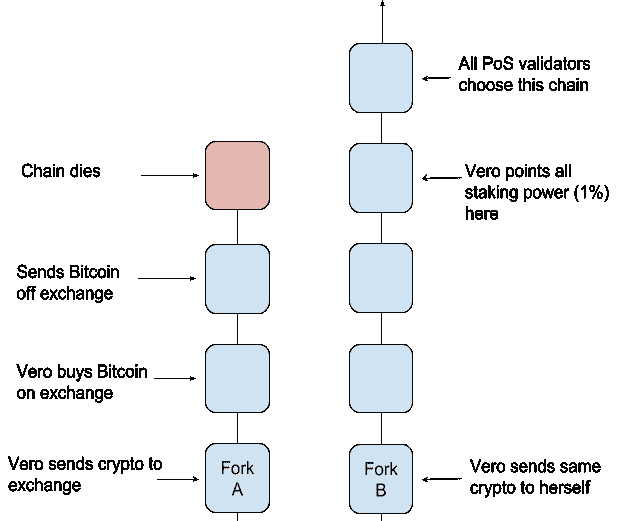

# 理解利害关系的证明:无利害关系理论

> 原文：<https://medium.com/coinmonks/understanding-proof-of-stake-the-nothing-at-stake-theory-1f0d71bc027?source=collection_archive---------0----------------------->

以太坊并不是第一个尝试使用利益证明(PoS)作为共识方法的协议。 [Peercoin](https://peercoin.net/) 于 2013 年实施 PoS，其他项目在不久后也实施了自己的 PoS 版本( [PIVX](https://pivx.org/) 、 [Reddcoin、](https://reddcoin.com/)等)。这些项目希望 PoS 能够消除与能源密集型采矿相关的问题，同时保持加密货币网络所需的高安全性和分散性。

PoS 社区对他们的新共识方法充满热情，但是怀疑论者很快引用了 PoS 面临的两个理论安全问题；远程攻击问题和无风险问题。在这篇文章中，我描述了无关紧要的问题，然后讨论了以太坊的 Casper 升级如何解决这个问题。

## 利害关系证明的利害关系是什么？

当我第一次了解股权证明时，我认为“股权”指的是验证者(又名 PoS 矿工)在被允许提议和验证区块之前必须提交的保证金。以太坊计划的 PoS 升级就是如此，但第一个实施 PoS **的区块链项目不需要安全押金**。

在 PoS 的早期版本中，您只需要拥有令牌就有资格成为验证者(又名 PoS miner)。把代币放在钱包里就是你的赌注。如果验证者攻击了网络，他们的“赌注”硬币不会发生任何变化。

## 如果没有保证金，为什么叫它股份？

这就是为什么他们仍然称之为木桩。这个想法是，如果你拥有一个 PoS 网络的令牌，你就对这个网络的成功感兴趣。如果网络受到攻击，您拥有的令牌越多，您的“风险”就越大。这是因为，如果网络被成功攻击，您的代币价值可能会大幅下降。

在这种逻辑下，根据你在网络中的股份数量授予验证权是有意义的。例如，如果您的标记代表由验证器共同标记的所有标记的 10%,那么您可以预期提议并验证所有块的大约 10%。与持股较少的人相比，拥有 10%的股份，你可以对网络产生更大的影响，因为从理论上讲，如果你破坏了网络，你会失去更多。

## 无利害关系理论

当 PoS 首次出现时，很大一部分加密社区不相信仅仅拥有一个令牌就足以阻止不良行为。他们主要关心的一个问题叫做无利害关系问题(从这一点开始我将称之为理论)。

无风险理论是**假设**在 PoS 的早期版本中，当一个分叉发生时，**每个**验证器将建立在**每个**分叉上。

On the left, we an ideal situation. Sometimes forks occur, but they are resolved quickly. On the right, every validator is building on both forks. People refer to this hypothetical problem as the nothing at stake problem.

期望验证器这样做有两个主要原因。

首先，与工作证明(PoW)不同，验证器不需要花费任何成本来验证多个分支上的事务。在每个分支上构建计算开销很小，因为你不再需要 PoW 来创建一个块。

第二，验证者被期望建立在每一个分叉上，因为从理论上讲，这样做符合他们自身的财务利益。如果验证者在两个(或更多)链上挖掘，他们将在最终获胜的分支上收取交易费。如果验证者在每个分叉上都下注，这至少会破坏共识，并可能使网络更容易受到双重花费攻击。

在 PoW 中，在多个链上同时采矿的激励**不存在**。如果一个矿工选择在两个链之间分配他们的散列能力(计算能力),这不会增加他们挖掘一个块的机会。

## 严格的安全假设

重要的是要强调这样一个事实，即无利害关系理论考虑了极其严格的安全假设。以下是安全假设的列表:

1.  它假设验证器**会在有机会时寻求利润**，即使是以牺牲网络的安全性或质量为代价。这是密码世界中一个标准的(也是聪明的)安全假设。
2.  它假设 0 个验证者会无私地行动(也就是说，没有验证者会出于好心而一次只挖掘 1 条链)。
3.  它假设验证者特意修改了他们的验证软件或者下载了别人修改的软件。标准的验证软件并不具备在所有分叉上挖掘的能力。这是因为标准软件带有一个内部逻辑，用于在出现分叉时选择一个“真正的”分叉。

## 这一理论问题引发的攻击

对无利害关系理论的担心不仅仅是它可能推迟或复杂化共识，主要的担心是它将使攻击比工作证明更便宜。在 PoW 中，攻击者需要总散列能力的 51%来攻击网络，但是在 PoS 中，它可能只需要购买网络中 1%的股份。

这是 1%攻击被怀疑的样子。

首先，让我们假设**一个分叉已经发生，并且所有的验证器都在两个分叉上积极地构建。**我们的攻击者 Veronica 对执行双重花费攻击很感兴趣。她将她的密码发送到一个分支(分支 A)中的交换机，并在另一个分支(分支 B)中发送到她控制的公钥。经过足够长的时间后，交易所接受她的存款，因为它识别 fork a。Veronica 随后用她的存款购买了一些比特币，并迅速将该比特币带出交易所。

这就是她逃脱惩罚的方式。

现在，她将 1%的赌注力量指向分叉 b。最终，她被选中验证一个区块，并在分叉 b 上仅构建**。由于每个人都在这两个区块上构建，并且没有明确的“最长链”，整个网络现在集中在(也称为选择)分叉 b 上**

**维罗妮卡现在已经成功地从一家交易所窃取了比特币。她发送到交易所的密码已经回到了她控制的公钥，现在她也有了一些额外的比特币。**

## **更真实的攻击场景**

**前面的攻击场景依赖于这样一个假设，即当一个分叉发生时，每个验证器都将在每个分叉上构建。这就是我们的攻击者如何能够在仅拥有网络 1%股份的情况下实现双倍支出。在一个更现实的场景中，可以安全地假设将会有诚实的验证器拒绝在分叉的链上构建。**

**如果 Veronica 想要在这种情况下加倍花费，她将不得不购买更多的网络股份或者贿赂其他验证者来帮助她进行攻击。**

## **没有利害关系真的是个问题吗？**

**在阅读本文时，您可能会认为这些场景有时让人感觉有些牵强。我也感觉到了。在研究了任何证据或者甚至提到了实际发生的无利害关系问题之后，我什么也找不到。**

**这仅仅是工作最大化证明的产物吗？可能吧。**

**不管怎样，以太坊的卡斯帕旨在认真对待无利害关系理论的潜力。为了减少验证器在所有分支上构建的可能性，验证器将被罚掉部分或全部安全保证金。似乎通过保证金来惩罚验证者将使这一理论变得不可能。**

**喜欢你读的吗？在推特上关注我@ [jmartinez_43](https://twitter.com/jmartinez_43)**

## **请阅读我在“利益相关证明”系列中的其他文章:**

** [## 理解利害关系证明:建议的好处，第 1 部分

### 在工作证明(PoW)中，共识机制和矿工激励都属于一个简单的逻辑:

medium.com](/@julianrmartinez43/understanding-proof-of-stake-suggested-benefits-part-1-a0d97546e6c9)  [## 理解利害关系证明:建议的好处，第 2 部分

### 这篇文章是我关于以太坊计划升级到利益证明(PoS)的系列文章的第二部分。如果您还没有阅读第 1 部分…

medium.com](/@julianrmartinez43/understanding-proof-of-stake-suggested-benefits-part-2-8c6e63e62c40) 

# 引用/资源/了解更多信息:

维塔利科·布特林——[在赌注上](https://blog.ethereum.org/2014/07/05/stake/)

[以太坊基金会](https://www.ethereum.org/) — [桩子问题证明](https://github.com/ethereum/wiki/wiki/Problems#8-proof-of-stake)

德国欧洲 NEC 实验室— [保护工作协议证明](https://pdfs.semanticscholar.org/ebfb/57843cdf23ce6fe7007c0f1ea233eca4b71e.pdf)

[Peercoin 神话](http://wiki.peercointalk.org/index.php?title=Myths#Busting_the_myth)

> 加入 Coinmonks [电报频道](https://t.me/coincodecap)和 [Youtube 频道](https://www.youtube.com/c/coinmonks/videos)获取每日[加密新闻](http://coincodecap.com/)

## 另外，阅读

*   [复制交易](/coinmonks/top-10-crypto-copy-trading-platforms-for-beginners-d0c37c7d698c) | [加密税务软件](/coinmonks/crypto-tax-software-ed4b4810e338)
*   [网格交易](https://coincodecap.com/grid-trading) | [加密硬件钱包](/coinmonks/the-best-cryptocurrency-hardware-wallets-of-2020-e28b1c124069)
*   [密码电报信号](http://Top 4 Telegram Channels for Crypto Traders) | [密码交易机器人](/coinmonks/crypto-trading-bot-c2ffce8acb2a)
*   [Pionex 双投](https://coincodecap.com/pionex-dual-investment) | [AdvCash 审核](https://coincodecap.com/advcash-review) | [支持审核](https://coincodecap.com/uphold-review)
*   [面向开发者的 8 个最佳加密货币 API](https://coincodecap.com/best-cryptocurrency-apis)
*   [维护卡审核](https://coincodecap.com/uphold-card-review) | [信任钱包 vs 元掩码](https://coincodecap.com/trust-wallet-vs-metamask)
*   [赢取注册奖金——10 大最佳加密平台](https://coincodecap.com/earn-sign-up-bonus)
*   [最佳加密交易所](/coinmonks/crypto-exchange-dd2f9d6f3769) | [最佳加密交易所](/coinmonks/bitcoin-exchange-in-india-7f1fe79715c9)
*   开发人员的最佳加密 API
*   最佳[密码借贷平台](/coinmonks/top-5-crypto-lending-platforms-in-2020-that-you-need-to-know-a1b675cec3fa)
*   [杠杆代币的终极指南](/coinmonks/leveraged-token-3f5257808b22)**