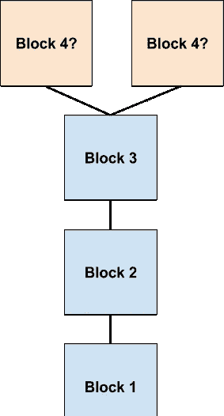
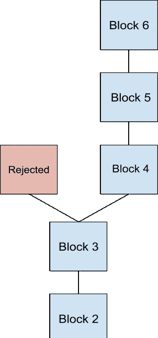

# 了解工作证明:达成共识和双重花费攻击

> 原文：<https://medium.com/coinmonks/understanding-proof-of-work-achieving-consensus-and-the-double-spend-attack-f822ab68e20b?source=collection_archive---------0----------------------->

这篇文章是我的工作证明系列的第 2 部分。如果您尚未阅读第 1 部分，[点击此处](/@julianrmartinez43/understanding-proof-of-work-part-1-586d7ee6b014)。

## **采矿只有在正确的链条上才有回报**

矿工不一定会因为成功开采了一个区块而获得区块奖励。有时候，两个矿工同时解决一个问题，会在网络中产生一个临时分叉。在这种情况下，两个版本的区块链(由叉子创建)在技术上是合法的，因为这些区块是由诚实的矿工创建的。我们可以说这些矿工是诚实的，因为他们在分叉发生时都遵守了规则。即使两个矿工都诚实行事，网络仍然需要集中在一个单一版本的区块链。

This is a temporary fork in the network. Both miners that proposed their version of block 4 were following the rules of the network when this fork occurred.

网络通过接受具有最多工作证明的链来解决这种临时分裂。工作证明是进入特定版本区块链历史的处理能力的数量。通常，具有最多工作证明的链归结为最终成为最长链(具有最多块的链)的分支。

A miner somewhere in the network built a block on top of one of the forks. Now, the fork on the right clearly demonstrates the most proof-of-work. That is now the true chain.

一旦网络中的一个节点在区块链的两个竞争版本中的一个上构建了额外的块，整个网络就会接受该链，因为它现在证明了最有效。**这一共识过程非常重要，因为它将区块链的真实版本与矿工生产那个版本的区块链所消耗的总资源联系了起来。**

## **在少的工作证明上肆意挖掘**

当有人第一次下载 miner 软件时，该软件会自动建立在最有效的链上。虽然一个熟练的开发人员可以修改这个软件，在一个工作证明较少的链上挖掘，但他们没有动力这样做。如果一个流氓矿工选择建立一个工作证明较少的链，网络的其余部分将拒绝接受这个分叉。

网络拒绝工作证明较少的分叉的部分原因是因为挖掘软件是自动编程这样做的。但是工作证明也有社会因素。**当所有人都同意燃烧资源来构建具有最多集体燃烧资源的链时，为什么要在工作证明较少的分支上采矿？**

如果流氓矿工建立在分叉链上，网络将不会识别他们的块奖励。他们将消耗电力，却没有办法还清。工作证明的优雅之处在于，在“遵守规则”的链条上挖掘总是最有利可图的，而偏离共识总是代价高昂的。

## **51%的攻击和双倍花费**

在本文的开头，我提到了成功的共识机制会抑制矿工攻击他们的网络。工作证明是一个优雅的共识系统，因为它极难攻击。

尽管攻击极其困难，但如果单个矿工或一群矿工控制了总处理能力的 51%，网络确实会变得脆弱。凭借 51%的处理能力，攻击者可以独自生成一个具有最佳工作证明的区块链。这使得他们能够进行所谓的双重花费攻击。双重支出攻击可以通过在不存在交易的地方构建竞争分支来从区块链中删除交易。恶意挖掘者可以使用双重消费攻击来支付非常昂贵的东西，然后从区块链中删除该交易。

下面是一个双重花费攻击在实践中的例子。

假设爱丽丝和鲍勃是一伙的。爱丽丝付给我哥哥尼科一幅价值 125 比特币的画。我的兄弟意识到网络中的临时分叉，在把他的画交给爱丽丝之前，他等待标准 6 确认。一旦画被移交，爱丽丝通知矿工鲍勃。

My brother really does sell amazing art. [Click here](https://nicomartinezart3.squarespace.com/) to check out what he has for sale. [Click here](https://www.instagram.com/nicos_artworks/) to follow him on Instagram.

Bob 控制了比特币 51%的哈希功率，开始挖掘自己的叉子。Bob 故意从当前版本的区块链后面的 6 个街区开始挖掘，因为他想从不包括 Alice 与我哥哥 Nico 的交易的历史开始。这被称为双重花费攻击，因为在这个分叉链中，爱丽丝使用相同的输入给她自己而不是我的兄弟发送 125 个比特币。她花了同样的比特币两次。

然后，Bob 拒绝从其他矿工广播的所有块，直到他的攻击叉上的工作证明超过原始链上的工作证明。在攻击分叉上的工作证明大于原始版本的区块链之后，Bob 将他的恶意分叉释放到比特币网络中。作为比特币节点接受工作证明最长的链，比特币网络接受攻击链，我弟弟的 125 比特币从钱包里消失了。

爱丽丝现在既有我哥哥的[画，也有她寄给我哥哥的 125 比特币。](https://www.instagram.com/nicos_artworks/)

The cool thing about cash is that you can’t double spend it.

## **对双倍消费攻击的警告**

虽然加密社区的人非常关注 51%的攻击，但这些攻击实际上在实践中非常难以执行。比特币网络消耗的电力和小国一样多。为了让一个矿工有机会成功攻击网络，他们需要购买大量的专用采矿设备，消耗的电力大约是一个小国的一半。这对潜在的攻击者来说是非常令人沮丧的，并且使得他们很难在双重花费攻击中获利。

进行双重花费攻击不太可能成功的另一个原因是，如果链中的 6 个块被还原，整个网络将立即意识到。由于区块链的假名性质，这可能会吸引攻击者的大量注意力。

## **下周的帖子**

工作证明已被证明是一个优雅的系统，具有非常小的攻击面。然而，有一个主要的缺点；它相当慢。在工作验证中，安全性是以牺牲速度为代价的。这极大地限制了以太坊这样的智能合约区块链所能实现的目标。为了在保持高度安全性的同时实现更快的交易速度，以太坊计划转向一种名为 proof-of-stage 的共识模型。虽然股权证明不会直接带来更快的交易速度，但它有望实现分片。

在我的下一篇文章中，我将分析利害关系证明是如何试图利用与工作证明相似的激励来实现更强大的区块链的。

在推特上关注我@ [jmartinez_43](https://twitter.com/jmartinez_43)

# 引用/资源/了解更多信息:

[**掌握比特币—安德里亚斯·安东诺普洛斯**](https://github.com/bitcoinbook/bitcoinbook)

[**区块链/比特币初学者 9:比特币难度、目标、位数——你需要知道的一切**](https://www.youtube.com/watch?v=4QxOUwG8a2Y&t=466s)**——**[马特·托马斯](https://www.youtube.com/channel/UCbXiy1W_1HSMawmBDfo_TOA)

## 另外，阅读

*   [最佳加密交易机器人](/coinmonks/whats-the-best-crypto-trading-bot-in-2020-top-8-bitcoin-trading-bot-c16adeb13317)
*   最好的比特币[硬件钱包](/coinmonks/the-best-cryptocurrency-hardware-wallets-of-2020-e28b1c124069?source=friends_link&sk=324dd9ff8556ab578d71e7ad7658ad7c)
*   最好的[加密税务软件](/coinmonks/best-crypto-tax-tool-for-my-money-72d4b430816b)
*   [最佳加密交易平台](/coinmonks/the-best-crypto-trading-platforms-in-2020-the-definitive-guide-updated-c72f8b874555)
*   [unis WAP 最佳钱包](/coinmonks/best-wallets-to-use-uniswap-e91a6385d9e8)
*   最佳[密码借贷平台](/coinmonks/top-5-crypto-lending-platforms-in-2020-that-you-need-to-know-a1b675cec3fa)
*   [顶级 DeFi 项目](/coinmonks/defi-future-10-promising-projects-in-the-defi-world-ff2b697ab006)
*   bits gap review——一个轻松赚钱的加密交易机器人
*   为专业人士设计的加密交易机器人
*   [3commas Review](https://blog.coincodecap.com/3commas-review-an-excellent-crypto-trading-bot) |一款优秀的密码交易机器人
*   [3Commas vs Cryptohopper](/coinmonks/cryptohopper-vs-3commas-vs-shrimpy-a2c16095b8fe)
*   Bitmex 上的[保证金交易的白痴指南](/coinmonks/the-idiots-guide-to-margin-trading-on-bitmex-dbbd7742c6fc?source=friends_link&sk=7bfa99d2a181142510c8442c8ddb0786)
*   [加密摇摆交易权威指南](/coinmonks/the-definitive-guide-to-crypto-swing-trading-7e4af6496d4d?source=friends_link&sk=70448050bd9323b42f63bfc0bb1e60d1)
*   [Bitmex 高级保证金交易指南](/coinmonks/bitmex-advanced-margin-trading-guide-2270c195ce25?source=friends_link&sk=1d986cca731f5084b9a2db4a4bc4a7ad)
*   开发人员的最佳加密 API
*   [加密套利](/coinmonks/crypto-arbitrage-guide-how-to-make-money-as-a-beginner-62bfe5c868f6)指南:新手如何赚钱
*   顶级[比特币节点](https://blog.coincodecap.com/bitcoin-node-solutions)提供商
*   最佳[加密制图工具](/coinmonks/what-are-the-best-charting-platforms-for-cryptocurrency-trading-85aade584d80)

> [直接在您的收件箱中获得最佳软件交易](https://coincodecap.com?utm_source=coinmonks)

