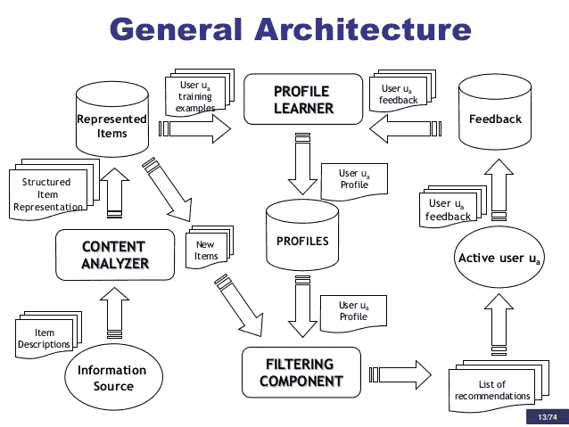
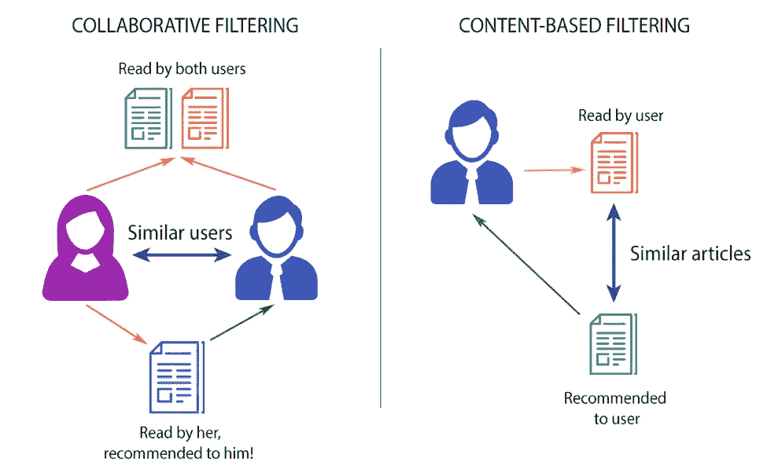

# 了解推荐系统-101

> 原文：<https://medium.com/coinmonks/understanding-recommendation-systems-101-f81eb1afcad?source=collection_archive---------4----------------------->

有没有想过亚马逊是如何推荐产品给用户在线购买的？
网飞如何向用户推荐电影？【Spotify 如何推荐音乐给用户听？
没有魔法，他们使用推荐系统来实现这一点。推荐系统利用用户的偏好和特征来优先选择和推荐用户喜欢的项目。

**什么是推荐系统？**

最通用和最基本的定义是:
“推荐系统是帮助用户发现他们可能喜欢的项目的系统”
推荐系统通常用于各种领域，包括电影、音乐、新闻、书籍、研究文章、搜索查询、社交标签和产品。还有专家、合作者、笑话、餐馆、服装、金融服务、人寿保险、浪漫伴侣(在线约会)和 Twitter 页面的推荐系统。

**推荐系统有影响吗？？**

是的，对于 FACEBOOK、网飞、谷歌、亚马逊等大公司来说，推荐系统算法是一个非常大的附加值。麦肯锡分析师[估计，亚马逊收入的 35%和他们在网飞上观看的 75%来自产品推荐](https://www.mckinsey.com/industries/retail/our-insights/how-retailers-can-keep-up-with-consumers)。在今天的数据世界中，用户在网上可以得到任何东西，但是很难找到需要的确切项目，推荐系统解决了这个主要问题。

**推荐系统的类型:**

这里我将主要讨论两种过滤方法
1。基于内容的
2。协同过滤

1.  **基于内容的推荐系统**
    基于内容的过滤方法是基于项目的描述和用户偏好的简档。它还推荐与给定用户过去喜欢的项目相似的项目。
    实际上，由基于内容的系统执行的基本过程包括将存储偏好和兴趣的用户简档的属性与内容对象(项目)的属性进行匹配，以便向用户推荐新的感兴趣的项目。

推荐过程分三步执行，每一步都由单独的组件处理:

*   **内容分析器** —当信息没有结构(例如文本)时，需要某种预处理步骤来提取结构化的相关信息。
    组件的主要职责是表示条目
    的内容(如文档、网页、新闻、产品描述等。)以适合于下一个处理步骤的形式来自信息源。通过特征提取技术来分析数据项，以便将项目表示从原始信息空间转移到目标信息空间(例如，被表示为关键词向量的网页)。该表示是简档学习器和过滤组件的输入。
*   **简档学习器** —该模块收集代表用户偏好的数据，并试图归纳这些数据，以便构建用户简档。通常，泛化策略是通过机器学习技术来实现的，机器学习技术能够从过去喜欢或不喜欢的项目开始推断用户兴趣的模型。例如，网页推荐器的简档学习器可以实现相关性反馈方法，其中学习技术将正面和负面例子的向量组合成表示用户简档的原型向量。训练示例是用户已经在其上提供了正面或负面反馈的网页。
    **过滤组件** —该模块利用用户简档，通过将简档表示与要推荐的项目相匹配来建议相关项目。结果是二元或连续相关性判断，后一种情况产生潜在感兴趣项目的排序列表。在上述示例中，通过计算原型向量和项目向量之间的余弦相似度来实现匹配
    。

2.**协同过滤**
基于协同过滤的系统以用户反馈、评级、偏好和活动的形式收集&分析用户行为信息。基于该信息，这些然后利用几个用户/项目之间的相似性来预测缺失的评级，并因此做出合适的推荐。协同过滤(CF)方法基于评级或使用(例如，购买)的模式产生用户特定的项目推荐，而不需要关于项目或用户的信息。
我们举个例子:
如果人 P1 喜欢 item1，item2，item3
如果人 P2 喜欢 item1，item3，item4
如果人 P3 喜欢 item1，？
那么，P3 很有可能喜欢项目 3，因为根据前两个陈述，我们知道 P3 P2 的 P1 喜欢项目 1。这是协作系统的一个非常基本的例子。

**最后注意:**
下图显示了文章的协同过滤和基于内容的过滤推荐。我们可以同时使用协同过滤和基于内容的方法，即混合方法，我将在下一篇博客中讨论混合方法。

感谢阅读。过去几个月，我一直在学习和研究推荐系统。你觉得这篇文章有用吗？给一些掌声，每周订阅一些有趣的与 ML 相关的技术文章。请在下面的评论区分享你的观点。