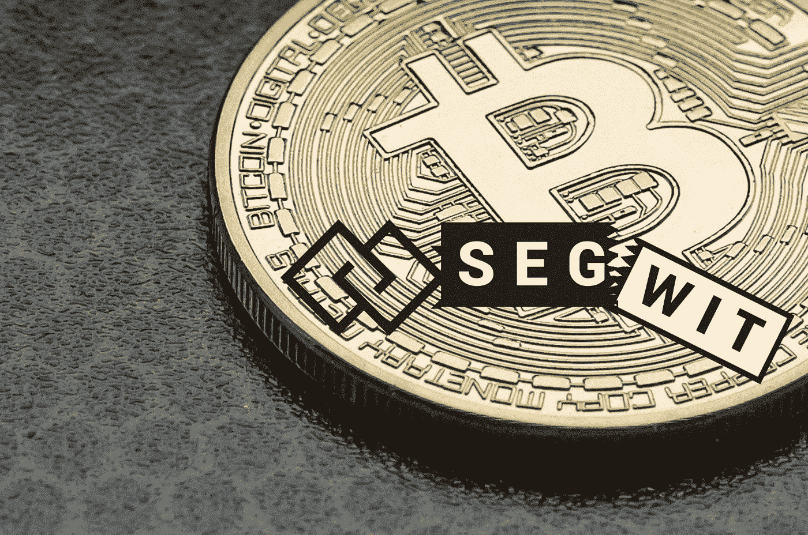

# 理解 SegWit

> 原文：<https://medium.com/coinmonks/understanding-segwit-7a1e206aff7b?source=collection_archive---------1----------------------->

第一层扩展解决方案由 3 种不同的扩展机制组成:

分片

硬叉子

塞格维特

在前两篇文章中，我已经介绍了[硬叉](/@tulip311bit/understanding-hard-fork-fc56cb68649)和[分片](/@tulip311bit/understanding-sharding-e3783176647a)。因此，在本文中，我将重点介绍最后一种扩展解决方案，即 SegWit。

## **什么是赛格维特？**

SegWit 代表**隔离见证**

即将签名从交易中分离出来。

在此过程中，事务的某些部分被删除，这将释放空间，以便可以将更多的事务添加到链中。使用这种方法的想法是为了克服区块链事务的块大小限制。简而言之，SegWit 改变了数据存储的方式，从而帮助比特币网络运行得更快更顺畅。

> 在比特币改进提案编号 BIP141 中，它被建议作为比特币交易格式的软分叉变化。

## **问题陈述**

在比特币平台中，每 10 分钟就会生成一个区块，最大大小不得超过 1 兆字节(MB)。随着事务数量的增加，需要向链中添加更多的块。但是由于块大小的限制，一个块中只能添加一定数量的事务。交易的重量会导致处理和验证交易的延迟。有时，确认交易有效需要几个小时。当网络繁忙时，这可能会进一步降低速度。

## **解决方案**

为了克服块大小限制问题并提高事务速度，事务被分成两个部分。从原始部分移除解锁签名(见证)，并将其作为单独的结构附加到末尾。原始部分仍然有发送者和接收者数据，新的“见证”结构将包含脚本和签名。原始数据段将正常计数，但新的“见证”数据段变为其原始大小的四分之一。

> ***数字签名在给定的交易中占 65%的空间。***

SegWit 是向后兼容的，这意味着使用 SegWit 比特币协议更新的节点仍然可以与未更新的节点一起工作。

SegWit 按块重测量块。

用于计算砌块重量的公式:

(去除见证数据后的 tx 大小)* 3 + (tx 大小)

由于隔离见证创建了一个存储见证数据的侧链，它可以防止不诚实的用户更改事务 id。它还通过将签名与事务数据的其余部分分开序列化来解决签名的可延展性，从而使事务 ID 不再具有可延展性。

## **历史**

比特币开发者 Pieter Wuille 首先提出了 SegWit 的概念。

2017 年 7 月 24 日，作为软件升级过程的一部分，即比特币改进提案(BIP) 91，隔离见证的概念在块 477，120 被激活。

在实施的一周内，比特币价格飙升了 50%。使用 SegWit 的交易使用率在 10 月的第一周进一步从 7%增长到 10%。截至 2018 年 2 月，SegWit 交易超过 30%。

然而，一群总部位于中国的比特币矿工对这一实施感到不满，后来被迫创造了比特币现金。

## **闪电网络—第 2 层解决方案**

闪电网络运行在比特币之上，被称为“第二层”组件。这是一个离线小额支付系统，旨在提高区块链网络的交易速度。

SegWit 充当闪电网络的基础组件。通过实施 SegWit，可以防止交易延展性问题，这将使这个安全的支付系统在比特币网络中每秒钟处理数百万笔交易。

## **赛格维特的优势:**

防止交易延展性问题。

防止签名延展性问题。

有助于扩大比特币网络。

增加块大小。

降低交易费用。

作为闪电协议的基础。

## **结论**

毫无疑问，比特币技术非常具有革命性，但像任何其他技术一样，它也有一定的缺点和挑战。缩放是限制其大规模应用的因素之一。它在基础层上每秒只能处理 7-10 个事务。来自比特币社区的许多开发者和研究人员正在努力克服这个问题。SegWit 和闪电网络一起致力于让比特币每秒处理数百万(或更多)的交易。但是真实的情况将取决于未来项目的成功。

> [直接在您的收件箱中获得最佳软件交易](https://coincodecap.com/?utm_source=coinmonks)

