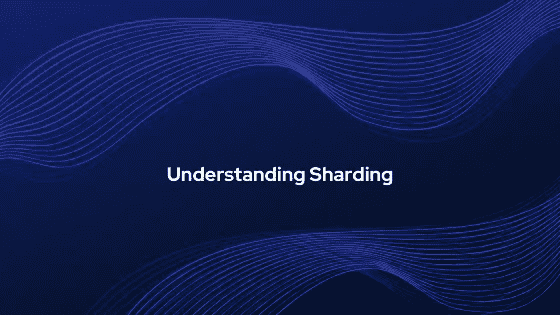

# 理解分片

> 原文：<https://medium.com/coinmonks/understanding-sharding-e3783176647a?source=collection_archive---------1----------------------->

区块链技术越来越受欢迎，这反过来吸引了更多的用户使用该平台。快速采用导致定期交易数量增加。这里出现了可伸缩性的问题。

该技术能否扩展到足以支持大量交易？

*交易的处理速度有多快？*

*它能替代传统的交易系统吗？*

所有这些以及更多的问题将会出现在每个用户的脑海中，然后他们才能说服自己将该技术作为其常规交易系统的一部分。

在我的上一篇文章中，我已经介绍了第一层的缩放解决方案之一，即[硬分叉](/@tulip311bit/understanding-hard-fork-fc56cb68649)。作为该系列的继续，我正在写一篇关于另一个第一层缩放解决方案的文章，即分片。

## **什么是分片？**

分片的概念来自传统的数据库系统，在传统的数据库系统中，大型数据库被划分为较小的部分，以便可以正确地管理它并支持更快的查询运行时。

这个过程包括将事务处理划分到更小的节点组(称为碎片)中。每个碎片代表整个系统的一个独特的小子集，它并行工作以最大化性能，并允许系统支持大型应用程序。

因此，这种方法有助于减少事务负载，因为一个节点只负责维护和处理与其分区相关的事务。

## **为什么会出现分片的想法？**

我们都知道区块链技术相当新，仍在开发中。该领域的许多开发人员、研究人员和先驱正在努力增加越来越多的功能，以便在不久的将来，它可以用来替代传统的交易系统。

但如果我们考虑目前的场景，比特币目前每秒仅处理 7 笔交易。然后是以太坊，它支持更多的功能，如建立智能合同、取款限额、金融合同、赌博市场等，但它每秒处理的交易不超过 12-30 笔，如果与传统的交易处理系统如 Visa(每秒约 2000 笔交易)和 Mastercard 相比，这是相当低的。

因此，为了提高交易速度，开发人员考虑实现一种扩展方法，即分片。

## **分片是如何工作的？**

在以太网中，所有的交易由所有的网络节点顺序处理。它们还存储状态值(如帐户余额、合同代码、存储)，并验证每个非常耗时的事务。

通过实现分片，想法是将整个网络分割成更小的唯一分片，这些分片将同时并行执行事务。网络中的节点将不再持有整个分类帐来执行每个交易，而是它们将被分配来处理和验证仅一些计算，这将提高整个网络的交易处理速度。因此，这种方法旨在提供可伸缩性问题的解决方案。

## **关键设计挑战**

碎片应该在所有网络节点之间均匀划分，以保持负载平衡。

跨分片事务需要仔细定义，以保持网络中的一致性。

单碎片接管攻击——系统更容易受到这种攻击，因为攻击者只需要控制单个碎片中的大多数归类器，就可以创建一个恶意的碎片来提交无效的归类。

因为每个碎片保存唯一的记录，因此损坏给定碎片中的任何节点将导致相应数据的永久丢失。

随机采样方案可以用来控制单碎片接管攻击，但是这带来了另一个问题，因为验证器并不总是为它们可能被分配到的每个碎片保持最新的状态信息。

在欺诈的情况下，网络中的其他节点如何被通知拒绝校对。

随着网络中计算机或节点数量的增加，会降低整个网络的效率。

## **使用分片的好处**

提高交易速度。

最小化处理和存储成本。

提高网络性能。

## **任何实际实现**

目前，以下项目列表正在实现分片。在这里找到来源[。](https://coinrivet.com/guides/what-is-blockchain-technology/four-projects-leading-the-way-in-database-sharding/)

## **结论**

分片方案似乎是最有效的候选方案，因为它们可以克服性能和可伸缩性问题。然而，分片机制仍处于开发和测试阶段。在将其视为永久解决方案之前，需要对许多关键组件进行验证。该解决方案必须支持区块链三难方案，即去中心化、可扩展性和安全性。应该明确定义安全和网络协议，以防止任何网络攻击。

阅读更多:[智能合同指南](/@tulip311bit/a-guide-to-smart-contracts-ad783eb015aa)

> [直接在您的收件箱中获得最佳软件交易](https://coincodecap.com/?utm_source=coinmonks)

