# 了解一些比特币指标

> 原文：<https://medium.com/coinmonks/understanding-some-bitcoin-metrics-ac51f28a4145?source=collection_archive---------7----------------------->

你是否厌倦了只听到比特币的价格？是的，我也是！事实是，比特币的价格(或任何密码的价格)是加密货币中最没意思的方面。当我们在新闻中听到比特币时，通常是因为它的价格或某种监管，但现实是在表面下有很多事情在发生。我们看到的只是“冰山一角”。

在这篇文章中，我们将深入分析其他比特币指标，这些指标将帮助我们评估比特币网络的表现、当前状态及其总体“健康状况”。

因此，我们将解释我们可以在最好的比特币区块链浏览器网站之一[www.blockchain.com/en/explorer](http://www.blockchain.com/en/explorer)上找到的一些指标。什么是区块链探索者？嗯，它基本上是一个网站，提供所有区块链的实时信息。例如，当您想要检查事务的状态时，它们非常有用。此外，我们将解释 Github 和 Lightning 网络的其他几个站点的一些指标。我们将逐一介绍一些最重要的方面，并解释它是什么以及它为什么重要！所以让我们开始吧:

# **最新街区**

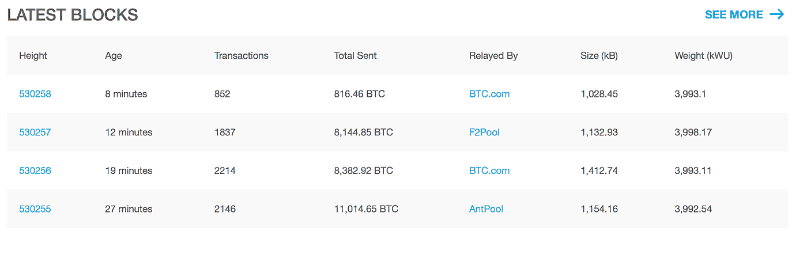

在进入区块链浏览器站点时，我们看到这个表有四个条目。这些是在比特币区块链上开采的最新区块。

## **积木的高度**

在第一列中，您可以看到高度，这基本上意味着块数。写这篇博文的时候，它在第 530258 街区。在区块链上创造的第一个石块是高度为 0 的创世石块。

## 积木时代

这是从区块开采到现在所经过的时间。每个街区之间应该有大约 10 分钟的时间，但有时可能更多或更少。

## 处理

事务表示单个块中包含的事务数量。这个数字可以根据每个单独事务的大小而变化，一般来说，数据块的大小应该在 1MB 左右。

## 总支出

这表示单个区块内交易中包含的比特币总量。

## 转播者

“Relayed by”表示解决了**工作证明**算法并赢得了扩展该特定区块的“比赛”的矿池。一些人将这篇专栏视为反对比特币真的是一种去中心化货币的论点。你能理解为什么吗？如果您通过点击“查看更多”来展开列表，并稍微浏览一下，您可以看到相同的 4 或 5 个采矿池不断重复出现。这意味着我们只有几个大型矿池，集中了所有的哈希能力，如果我们考虑到 [51%的攻击可能性](/coingape/what-is-51-attack-in-bitcoin-can-crypto-mining-pools-invade-a-majority-attack-on-bitcoin-1ce24e13bbc2)，这是一个非常危险的威胁。

## 大小(kB)

这只是以千字节表示块的大小。

## 重量(kWU)

权重列与 SegWit(一个增加比特币块大小的向后兼容补丁)相关。重量单位是一种衡量标准，用于按照共识执行的最大块大小限制的比例来比较不同比特币交易的大小。重量单位也用于测量其他区块链数据的大小，如块头。

Main chart of Blockchain.info

在上面的图表中，每天的交易量和比特币价格是不言自明的。我们将研究另外两个:市值和散列率。

## 市值

市值是衡量一个硬币或股票的市场规模。它是通过将硬币的价格乘以流通供应量来计算的，流通供应量是市场上流通的和普通公众手中存在的比特币的大致数量。所以:

> ***市值=价格*流通供应量。***
> 
> 如果我们取图表值，我们通过将市值除以比特币价格得到流通供应量:
> 
> ***108 . 801 . 529 . 650/6 . 624 . 83 = 16 . 423 . 293，8***

这一指标有助于了解加密货币的规模。流通供应量越多或价格越高，市值就越大。您可以在 [CoinMarketCap](https://coinmarketcap.com) 页面查看市值排名前 100 位的加密货币。

## 哈希速率

首先是正式定义:**哈希速率**是计算机在比特币网络中完成一项操作的速度。**散列率**越高，当**挖掘**时就越好，因为它增加了找到下一个块并获得奖励的机会。我们看到的大数字是比特币网络每秒执行的万亿次哈希(每秒万亿次哈希)的估计数。我们可以看到在一年的时间里，散列率是如何在图表上增长的:

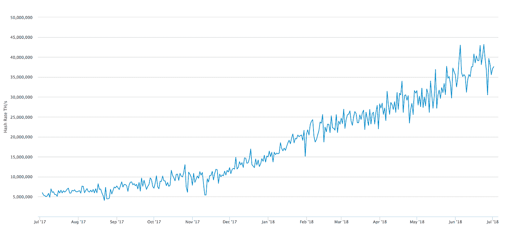

Hash Rate TH/s in a year

该度量用于观察随着时间的推移，挖掘者在网络上分配越来越多的散列能力以获得块。此外，我们可以在图表上看到比特币网络对散列率的“修正”。这与我们接下来要看到的挖掘难度的增减有关。

## [难度](https://www.blockchain.com/charts/difficulty)

这是一个相对的衡量标准，表明找到一个新的区块有多困难。难度根据挖掘者网络已经部署了多少散列能力而被周期性地调整。

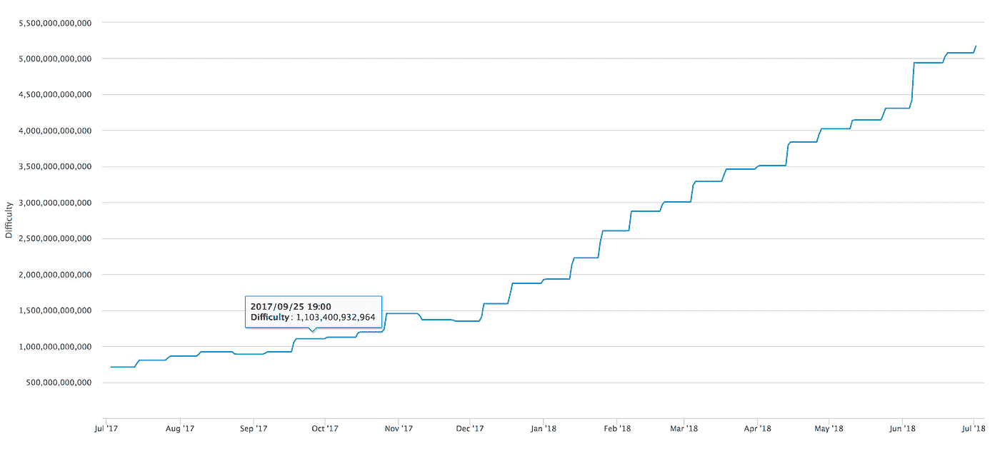

The graphic of the mining difficulty over a year period of time

正如我们在[其他帖子](/coinmonks/what-is-bitcoin-mining-84dca020c801)中看到的，难度是根据找到之前的 2016 个街区所花的时间，每 2016 个街区调整一次。按照每 10 分钟一个数据块的理想速度，2016 个数据块需要整整两周才能找到。如果之前的 2016 块花了两个多星期才找到，难度就降低了。如果他们花了不到两周的时间，难度就增加了。难度的变化与之前的 2016 块寻找所花的时间成比例，超过或低于两周。

我们可以在【bitcoinwidsom.com】*(同时查看难度历史)*上看到散列率和难度的关系。这是本文撰写时的图表:

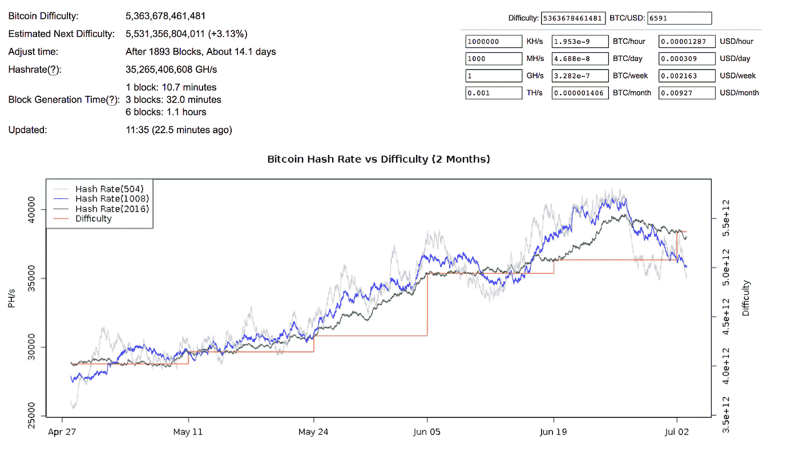

HashRate and Difficulty relationship chart

## 哈希速率分布

这一指标对于了解谁对大型矿池负责以及它们的表现非常有用。它显示了最大挖掘池中散列率分布的估计值。正如页面上所说，它不是 100%准确:

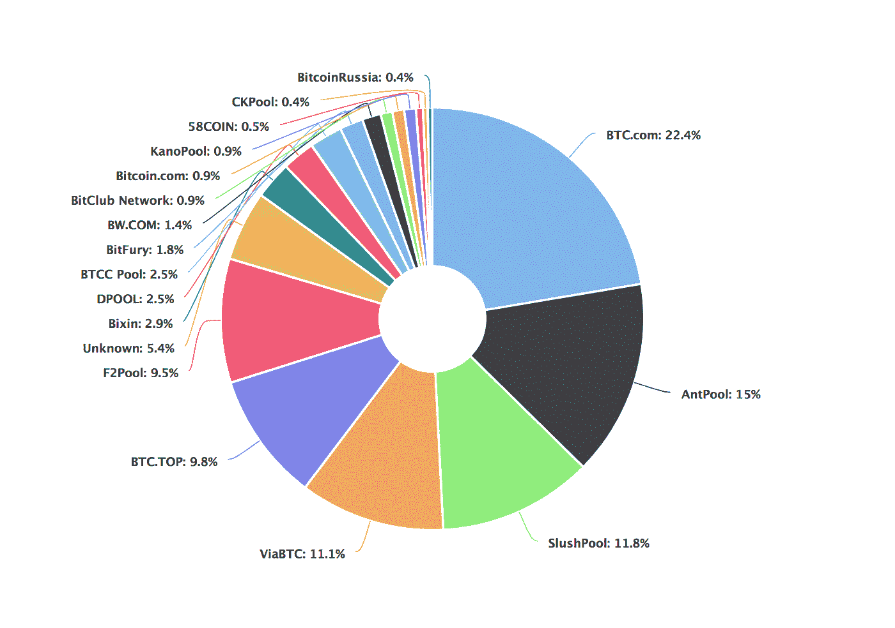

BTC.com and AntPool are the biggest mining pools.

对于那些声称比特币没有完全去中心化的人来说，这又是一个非常有趣的论点，我们可以看到 4 或 5 个非常大的矿池，没有办法知道这些不同的矿池是否是一个以不同名称拆分的大公司，以显示去中心化。BTC.com 池显然是最大的一个，在过去的 24 小时内获得了 22.4%的区块。

## 内存池大小

我们在其他帖子中谈到过 mempool，但基本上 mempool 是一个所有事务都放在第一位的地方，等待矿工挑选并在区块链区块中确认。

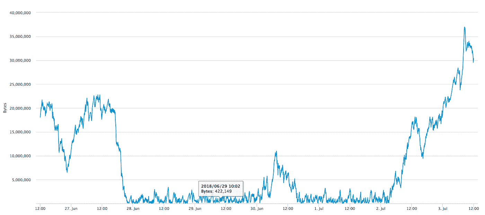

Size of the mempool in bytes from the lasts days.

这个指标向我们展示了等待确认的事务池有多大(以字节为单位)。大小越大，等待确认的事务就越多，这意味着如果向网络发送事务，等待的时间就越长。相反，如果它的大小越来越小，这意味着等待的事务越来越少，所以您自己的事务被挖掘器挑选的时间会更短。

我们还可以检查 mempool 上的[事务量:](https://www.blockchain.com/charts/mempool-count)

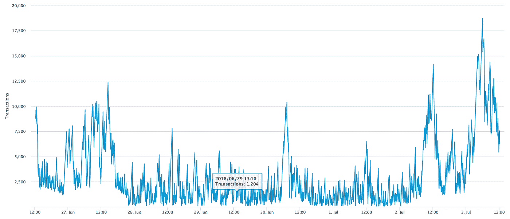

Amount of transactions on the Mempool

您可以在图表中看到交易规模和交易金额之间的相关性。0 到 5000 笔交易似乎是过去几天的平均交易量。如果我们考虑到 2017 年 12 月我们在 mempool 上达到了超过 175，000 笔交易的峰值，这并不算多。在那个年代，一笔交易确认需要很长时间！

## 中值确认时间

中值确认时间相当有趣。它表示交易被接受进入开采区块并添加到公共分类账的中间时间，请注意，这仅包括有开采费的交易。

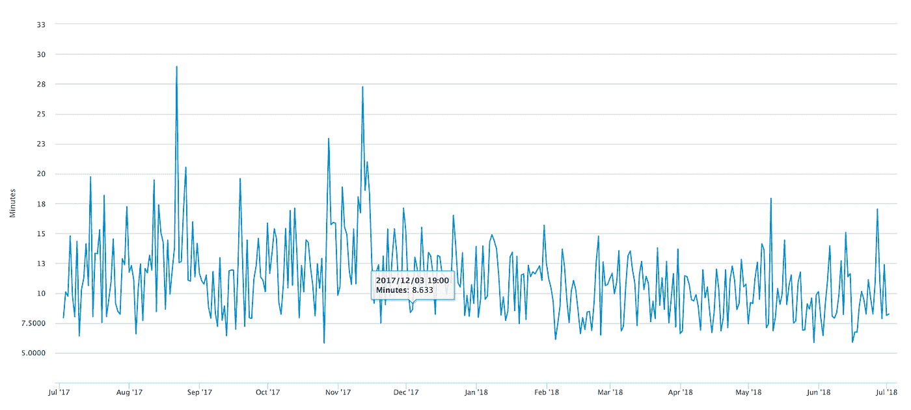

Time in minutes for a transaction to be confirmed

使用这个指标，我们可以检查从 mempool 中提取一个包含 miner 费用的事务平均需要多少分钟。这包括被加入有效区块，被其他矿工接受(顺便说一句，这就是你使用比特币时想要的全部！=P)。请注意图表的大部分都在 10 分钟线附近，因为比特币网络总是试图每 10 分钟获得一个区块。我们支付的费用越高，我们的交易就越有可能被更快地挖掘。当交易需要很长时间才能确认时，检查这个图表和 mempool 图表也很有用。

## 交易费用总额(美元)

这个从财务的角度来看相当有趣:总交易费用是支付给矿工的所有交易费用的总价值，不包括区块奖励(解决 PoW 和传播新区块的奖励)的 coinbase 值。

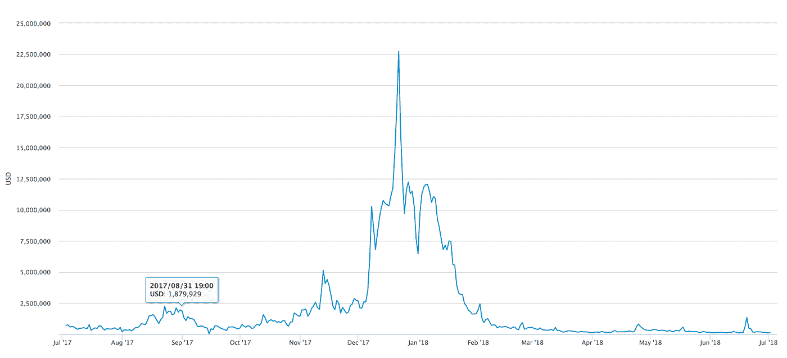

我们可以欣赏 2017 年 12 月左右比特币热达到顶峰时的大幅上涨。重要的是要明白，这张图表显示的是总费用，而不是每个矿工的个人费用。在下一个图表中，我们可以看到包括 coinbase 奖励在内的总收入，请注意这两个图表之间的相关性:

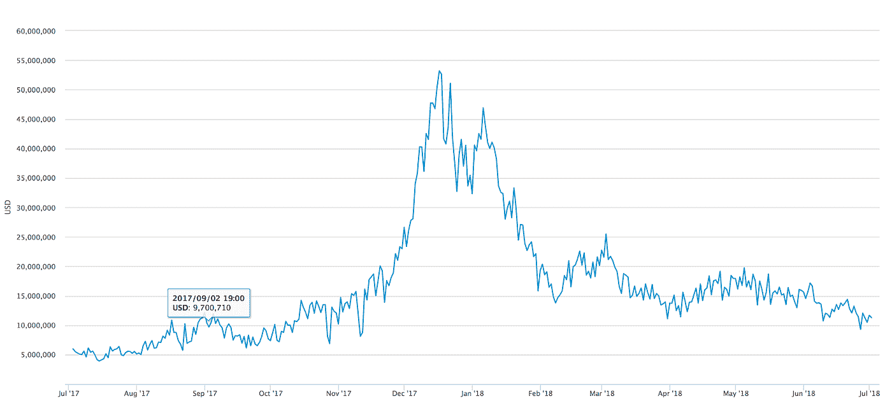

Total Revenue in USD with Coinbase reward included

## 每天确认的交易总数

这一条非常简单明了，但还是让我们来看看:

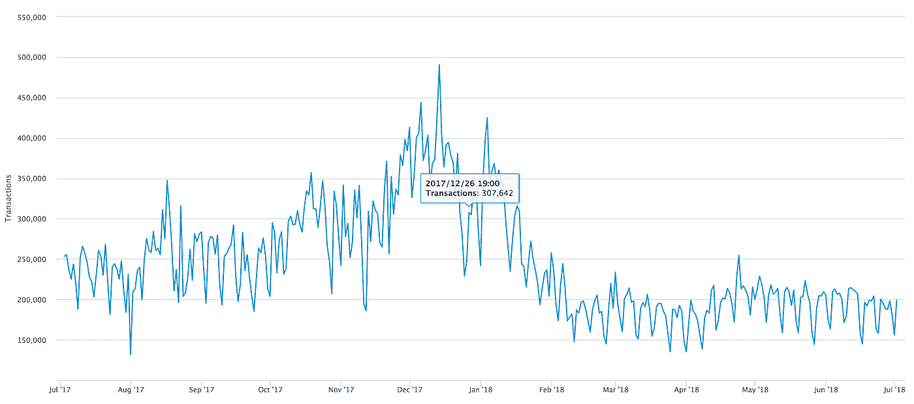

在这里，我们可以看到网络在白天的运行情况。我们看到，在过去的 6 个月里，每天大约有 15 万到 20 万笔已确认的交易。

## 使用的唯一地址数量

另一个特别有意思的点。它显示了某一天比特币区块链上使用的唯一地址的总数，这可以让我们了解现有比特币地址的范围有多大。看看我在[比特币地址上的帖子吧！](/coinmonks/what-is-a-bitcoin-address-6c822c857004)了解更多信息。=P 还有趣的是，在 2017 年 12 月的峰值，使用了更多独特的地址，这可以转化为(尽管不完全确定)更多的人进入该空间，更多的“新人”交易比特币。

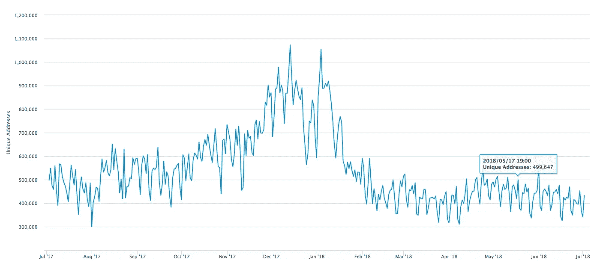

Unique Addresses

# 其他有用的统计数据:

# 开源代码库

查看比特币开发 [github 页面](https://github.com/bitcoin)查看项目状态。实际上，这个工具非常适合检查每个加密项目的社区状态。我建议浏览 github 页面，查看其中的一些部分，以了解开发进展的一些线索:

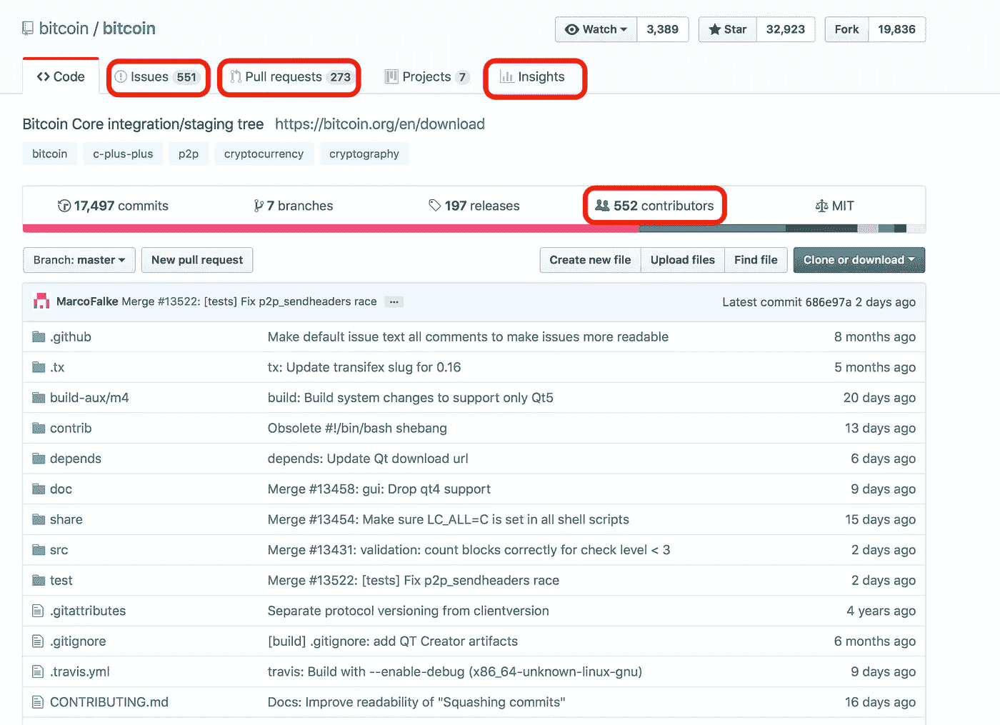

Bitcoin project github page

## 问题

在这里你会看到项目所有的 bug、修复、改进、提案和讨论。它变得相当技术性，但你可以看看社区是如何讨论新特性、修复和缺陷的。您可以看到社区互动的频率，这将为您提供项目“活跃”程度的线索。

## 拉取请求

拉式请求(又名 PR)是每个开源项目(每个人都可以协作)非常重要的一部分。PR 让你告诉其他人你对 GitHub 库所做的改变。一旦一个**拉请求**被发送，感兴趣的当事人可以审查变更集，讨论潜在的修改，甚至在必要的时候推动后续提交。您可以在这里看到哪些更改正在进行，哪些被批准，哪些被拒绝。

## 洞察力

Insights 是一个非常强大的工具，用于检查 github 软件项目的状态。您可以看到贡献者交互、编写/删除的代码行、拉取请求、问题、代码提交等的概述。所有这些都是非常技术性的东西，但是如果你想对如何评估一个开源项目有一个好的看法，知道这些非常有用！

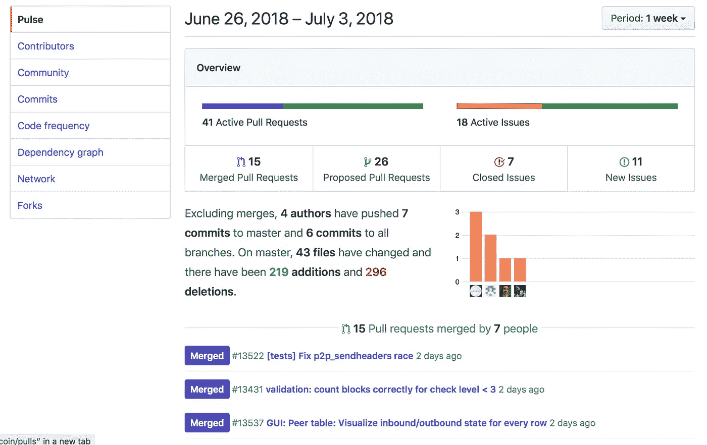

Insights of the Bitcoin project on Github

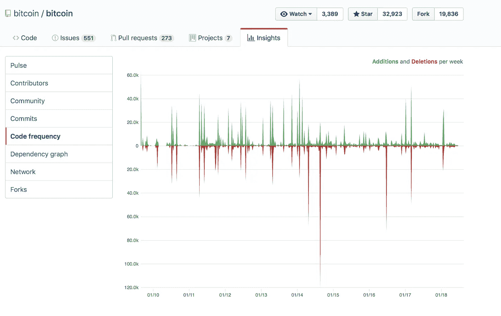

Code frequency — How many additions and deletions of lines of code are per week

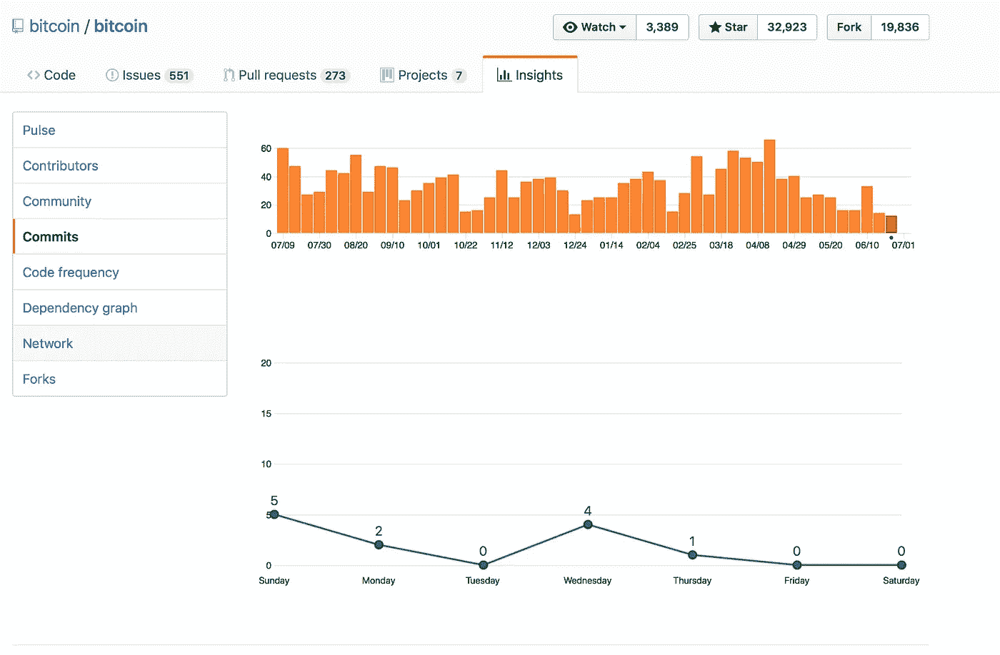

Number of commits per day —

# 闪电网络

有几个站点可以检查闪电网络(“LN”)的状态。它们有助于不时检查 LN 的生长情况。对于检查网络的拓扑结构来说，这个[站点](https://lnmainnet.gaben.win)相当不错，但是现在它已经变得如此之大(谢天谢地)很难欣赏了。我发现[这个](https://graph.lndexplorer.com)更有用，它包含了更多关于节点、它们的状态和连接的信息。您可以看到网络拓扑，并注意到 LN 上有一些大的参与者，他们只有几个节点和所有的连接，并获得路由支付的所有费用！

为了更清楚地了解总体数据，你可以查看[https://1ml.com](https://1ml.com)

# 结论

我们已经研究了比特币和一般加密项目的一些指标。关于比特币和区块链，还有很多要看和了解的，但我相信这篇文章应该是一个很好的起点，让我们了解“引擎盖下”正在发生的事情。请记住，当你听到比特币价格上涨或下跌时，这只是这个大型社会实验的另一个方面。我希望你今天学到了一些新东西。

# 行动呼吁

如果您想了解更多关于区块链的信息，请加入我们的每周简讯，了解加密领域的所有新闻。