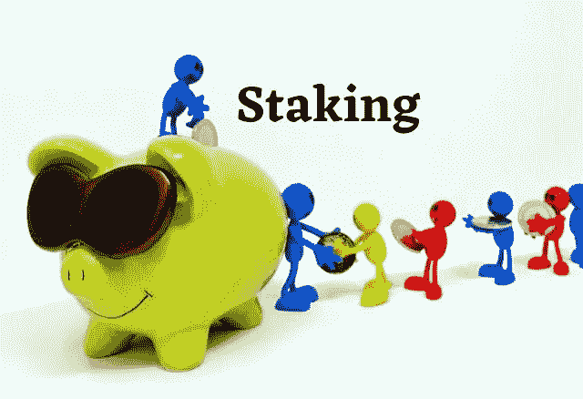
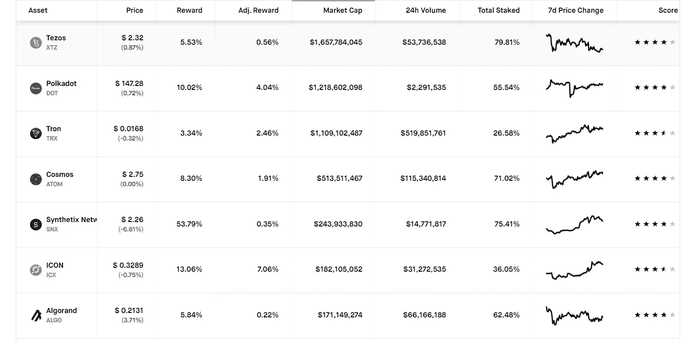

# 理解打桩

> 原文：<https://medium.com/coinmonks/understanding-staking-b045825e49db?source=collection_archive---------0----------------------->

加密货币除了其众多的特性之外，现在已经发展成为一种额外的收入来源。如果我们回顾几年前，人们可以通过购买、出售或挖掘加密货币来获利。区块链平台提供了新的方式，交易者和投资者可以通过押注他们的加密资产来获利。加密货币赌注是一种为硬币持有者创造被动收入的方式。

Staking 允许硬币持有者锁定他们的硬币，以便他们可以被底层协议随机选择，成为验证器，以在特定的时间间隔创建块。具有大赌注值的参与者有更高的机会被选为下一个块验证者。这些块验证器负责检查事务的有效性。

这一过程包括在加密货币钱包中持有资金，该钱包通过奖励驱动的过程支持区块链网络的运营。

> ***赌注是指在固定时间内，在钱包中持有一种数字货币，并获得赌注的奖励。***

赌注正获得相当多的关注，因为与采矿不同，它既不需要大量硬件来解决数学难题，也不消耗大量电力。除了给用户奖励之外，它还允许他们扩大自己的投资组合，人们可以很容易地看到大型交易所采用赌注特征的急剧上升。

但这并不是我们应该始终关注的奖励系统，主要关注点应该是通过鼓励和保持良好的行为和决策实践来建立强大的治理系统并加强网络安全，这反过来又会使赌注在未来变得更加稳定。

**优势**

赌注的最大优势之一是，即使是没有很多资产的天真用户也可以选择赌注，而在采矿的情况下，需要昂贵的硬件并需要高功耗，这使其超出了简单用户的能力。

现在，让我们看看赌注硬币还有什么其他优势

硬币持有者可以在网络上验证交易。

赌注带来的回报是额外的收入来源。

打桩是一个节能的过程，即它不需要大量的电力。

没有特定的硬件要求，如 ASIC。

减少矿工通常经历的 51%的攻击

**工作机构**

赌注的概念伴随着利益一致机制的证明而来。硬币持有者用他们的资产来获得生产和验证新积木的能力。PoS 区块验证器是根据他们下注的硬币数量来选择的。投入的硬币越多，被选为验证者的机会就越大。硬币被锁在钱包里一段时间，到期后，更多的硬币作为奖励被放入钱包。

2012 年，Sunny King 和 Scott Nadal 在一份介绍点对点加密货币 Peercoin (PPC)的白皮书中首次介绍了这种货币，作为对赌注共识算法证明的一种奖励形式。从那以后，其他几种加密货币已经在它们的系统中采用并实现了利益证明算法，作为交易验证的一种方法。

在下赌注之前，应该仔细观察硬币的价值或价格。建议投资波动率(通货膨胀率)低的硬币。高波动性硬币经历了价值的快速下跌，导致总体上没有利润。

点击查看完整列表

**劣势/风险**

赌注硬币的价值取决于市场趋势，可以根据市场价值经历上涨或下跌。

用木桩支撑的硬币会被锁定一段时间。锁定期过后，用户可以出售所持股份。

如果项目不成功，人们可能会失去所有的赌注硬币。在投资之前，用户需要了解具有潜在风险和缺陷的项目。该项目应该得到强大的技术和领导团体的支持。

如果用户用于下注的平台(即交易所或钱包)停业，用户可能会遭受损失或可能完全失去他们的硬币。

**赌注奖励是如何计算的？**

当用户在绑定期内押注加密货币时，他们会获得奖励作为激励。用户可以选择赌注，一旦绑定期结束，他们就开始获得奖励。不同的区块链网络使用不同的方法计算赌注奖励。

奖励根据以下标准计算:

赌注硬币的数量

打桩持续时间

在网络上下注的硬币总数

通货膨胀率

其他因素

一些网络提供固定百分比的赌注奖励。作为补偿，奖励分配给验证者。然后，验证者按照其他用户的赌注价值的比例在他们之间分配奖励。

**什么是赌注池？**

赌注池允许用户(硬币持有者)组成一个小组，他们可以贡献他们的资产。因此，合并来自多个参与者的资源增加了赌注值，从而增加了他们成为块验证者的机会。如果被选为验证者，从赌注中获得的奖励被发送给池操作者，然后池操作者按照他们的赌注值的比例在池用户之间分配奖励。

配置桩池的过程相当复杂，并且需要大量的时间、精力、维护和操作方面的专业知识。赌注池适用于过于复杂(无论是技术层面还是财务层面)的网络，用户无法理解，无法直接投资。在分配给参与者之前，池提供者从赌注奖励中收取他们的服务费。

如果你是一个新用户，建议加入一个赌注池，而不是独自下注。许多赌注池提供低最低余额，没有提款时间限制。

诸如 Crypto.com 币安和北海巨妖的交易所运行赌注池程序，在该程序中，用户可以存放他们的资产以用于赌注。

**冷铆接**

冷赌注是一个过程，通过该过程，用户可以使用硬件钱夹或气隙软件钱夹在钱夹上下注，而无需连接到互联网。

使用冷赌注，用户可以将他们的赌注权力委托给冷赌注节点，然后该节点代表用户下注，而无需花费硬币。因此，它允许用户安全地离线持有他们的硬币。用户一旦将硬币移出冷库，就停止领取奖励。

这种方法允许用户完全控制他们的资金。它主要适用于希望在支持网络的同时确保其资金得到最大保护的大型利益相关方。

**影响下注奖励的因素:**

赌注向参与者提供有保证的定期奖励，但某些因素可能会影响要分配的奖励的确切金额。这些变化有时是由底层网络或任何其他外部因素造成的。

1.在锁定期间，硬币不能移动或交易。

2.由于与之相关的服务成本，从钱包中获得的回报相对多于从交换中获得的回报。

3.赌注硬币的价值取决于市场波动，波动很大。

4.运营成本、维护成本和验证器佣金需要明确定义。

5.奖励发放时间表不固定。一些网络在固定的时间间隔后支付奖励，但是它也可能被延迟。因此，总是建议使用验证程序检查奖励分配标准。

6.每当网络出现故障时，网络的锁定机制都会收取一定的损失。这种损失由验证器或用户标记的令牌来弥补。在几种情况下，可能会出现斜线:

a)活性故障(IRISnet，Cosmos):如果验证器节点长时间不参与网络共识并错过许多块，则该验证器节点被扣分；

b)治理故障(IRISnet，Cosmos):如果验证器节点在同一共识过程中多次投票，并且这些投票互不相同，则该验证器节点会受到惩罚；

c)安全故障(IRISnet、Cosmos、Tezos 和许多其他协议):Cosmos 和 IRISnet 称之为双重签名，而 Tezos 称之为双重烘烤或双重背书。当同一个块被验证两次或更多次时，就会发生这种情况。

7.赌注回报回报率可能会随着时间的推移而变化。

8.一些网络要求最低持有要求，以获得赌注奖励。

**用户在选择下注前应检查的事项**

在选择项目时做广泛的研究。该项目应该得到强大的技术和领导团体的支持，并且应该满足真正的用户需求。

仔细阅读并理解关于以下内容的条款和条件

o 锁定期。

o 标桩服务费

o 等待时间

o 最低持有量。

o 最短持有期或初始持有期。

o 下注回报收益率

o 任何促销奖励。

o 地理或管辖限制。

不要把所有的钱都放在一个地方。通过知名的赌注服务提供商，如交易所或钱包，将你的资产分散到不同的优质项目中是明智的。

硬币的安全应该是首要的关注点。大声说出任何一种疏忽、骗局或黑客行为。

**结论**

如今，赌注加密正在成为增加您的加密资产以及使用区块链赚钱的重要来源之一。但是和其他行业一样，它也有自己的缺点。建议用户在选择赌注之前进行广泛的研究，并获得关于其工作原理、使用了什么赌注协议、相关奖励和最小赌注值等的完整知识。对相关风险的全面了解将有助于采取措施减少资产损失。

> 加入 Coinmonks [电报频道](https://t.me/coincodecap)和 [Youtube 频道](https://www.youtube.com/c/coinmonks/videos)获取每日[加密新闻](http://coincodecap.com/)

## 另外，阅读

*   [复制交易](/coinmonks/top-10-crypto-copy-trading-platforms-for-beginners-d0c37c7d698c) | [加密税务软件](/coinmonks/crypto-tax-software-ed4b4810e338)
*   [网格交易](https://coincodecap.com/grid-trading) | [加密硬件钱包](/coinmonks/the-best-cryptocurrency-hardware-wallets-of-2020-e28b1c124069)
*   [密码电报信号](http://Top 4 Telegram Channels for Crypto Traders) | [密码交易机器人](/coinmonks/crypto-trading-bot-c2ffce8acb2a)
*   [最佳加密交易所](/coinmonks/crypto-exchange-dd2f9d6f3769) | [印度最佳加密交易所](/coinmonks/bitcoin-exchange-in-india-7f1fe79715c9)
*   [开发者最佳加密 API](/coinmonks/best-crypto-apis-for-developers-5efe3a597a9f)
*   最佳[密码借贷平台](/coinmonks/top-5-crypto-lending-platforms-in-2020-that-you-need-to-know-a1b675cec3fa)
*   [免费加密信号](/coinmonks/free-crypto-signals-48b25e61a8da) | [加密交易机器人](/coinmonks/crypto-trading-bot-c2ffce8acb2a)
*   杠杆代币的终极指南