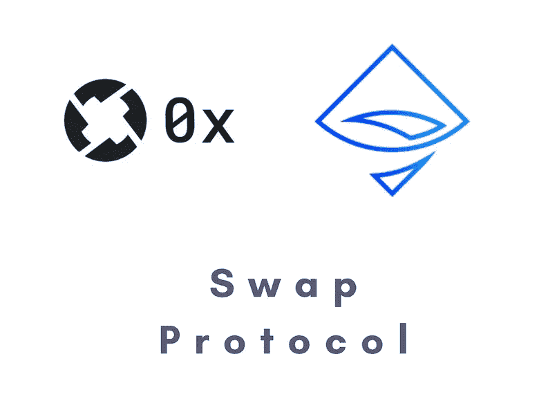
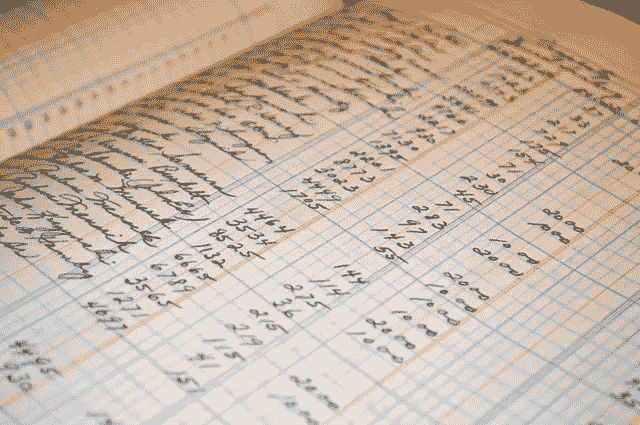

# 去神秘化的交换协议

> 原文：<https://medium.com/coinmonks/understanding-swap-protocol-92a821095d8?source=collection_archive---------2----------------------->

0x | Airswap

本文试图简化并理解 Swap 协议:一个用于交易以太币的对等协议白皮书。

# **什么是互换？**

在协议中互换，以实现 ERC-20 令牌的对等交易。交换协议本质上有助于找到对交换 2 个令牌感兴趣的双方，私下获得交换值，并最终交易令牌。

**它与现有的解决方案有何不同？**

***现有方案***

现有的解决方案适用于区块链订单簿。

Order Books

订单簿就像交易所的分类账，假设你在交易所买了 IBM 的股票，当订单进来时，它就被记在这样的分类账里

*买入，IBM，100，极限，99.5*

以 99.5 的价格买入 100 股 IBM 股票。这是对购买订单的过度简化。在区块链这样的分散系统上维护这样一个系统的成本是巨大的，并且随着订单规模的增加，成比例地增加了性能限制。这也是区块链标准做法受到影响的原因之一，但我离题了。

***不同的做法***

与此相反，Swap 协议采用的方法是纯对等系统的方法，它支持交换和协商的发现。

*分散交易方式的优点:*

*   没有人工干预，因此没有滞后和没有许可批准过程。
*   没有控制基金的规模，即没有提款货币的限制。
*   开源，没有冻结资金的风险。

在继续理解交换协议之前，我们应该先了解一下该协议中使用的一些术语。

# 术语

**制定者:**提供订单的一方。

*一个例子可以是一个想购买 EOS 以换取 TRON 的同行*

接受者:完成订单的一方。

一个想做相反事情的人是一个接受者。

> *注:制定者和接受者都是同行，所以任何一方都可以担任任何角色。*

# 协议:

## **步进器**

负责索引和匹配不同制造商和接受者的服务。

## 神谕

提供订单价格的链外服务

**合约:**以太坊上的智能合约，接受者可以使用它来处理订单。

# 使用对等协议成功交易的步骤

1.  对等点发现(这一步是集中进行的)
2.  价格发现
3.  执行
4.  清算
5.  监护

## 对等发现

总的来说，第一步是对等点发现，其中制造者提供他们愿意进行的交易，即用令牌 A 交换令牌 b。此时，没有公开给出关于价格的信息，从而保持了想要操纵系统来改变价格的对等点的效率。

在这一步中，收单人可以向庄家询问具体的交易。

## 价格发现

这一步包括对一个或多个制造商提供的交易感兴趣的接受者。

> 这可以利用 Oracle 协议(可选)。其中一方可以利用链外服务(第三方)来查询与另一方交换令牌的合理价格。

制造者可以继续并向接受者提供可以交易的价格信息。

## 执行、清算和保管

最后 3 个步骤实际上被合并为一个部分，因为它涉及智能合约所做的工作。

一旦制造商向收货人发出订单。接受者可以使用智能合约来执行该交易，智能合约有助于交换代币。

该步骤包括预备步骤中的两个部分:

A.通过智能合同检查制造商给出的到期日期。

B.检查上一步中接受者和制定者的批准。

> 注:这利用了 ERC-20 中可用的审批规则

获得批准的智能合同可以提供清算(这利用了 ERC-20 中可用的“转移自”。

这为每一方提供了各自令牌的保管。

总结一下，互换协议有许多积极的方面，其中有一些是**隐私** ( *价格不公开，因此不太容易受到价格变化的影响*)，**低交易成本** ( *，因为它是点对点的，并且是使用智能合同完成的*)和**开源** ( *索引器和 Oracle 协议，因此给最终用户和实现者带来了自由和透明*)。

## 接下来去哪里？

下一个地方将是检查**交换协议白皮书**和各种分散的交换，如 **Airswap** 、 **0x** 、 **Kyber** 。除此之外，请参见 **Loopring** ( *使用自己的协议 Loopring，但仍然是分散的*)。

## 参考

1.  [https://swap.tech/whitepaper/](https://swap.tech/whitepaper/)
2.  [https://www . fine xtra . com/blog posting/15752/what-the-ERC-20-standard-ERC-20-ether eum-tokens](https://www.finextra.com/blogposting/15752/what-is-the-erc-20-standard-erc-20-ethereum-tokens)
3.  [https://www.coinbase.com/price/eos](https://www.coinbase.com/price/eos)
4.  [https://www.coinbase.com/price/tron](https://www.coinbase.com/price/tron)
5.  [https://www.airswap.io/](https://www.airswap.io/)
6.  [https://0x.org/](https://0x.org/)
7.  [https://loopring.org/](https://loopring.org/)
8.  [https://kyber.network/](https://kyber.network/)

> [在您的收件箱中直接获得最佳软件交易](https://coincodecap.com/?utm_source=coinmonks)

