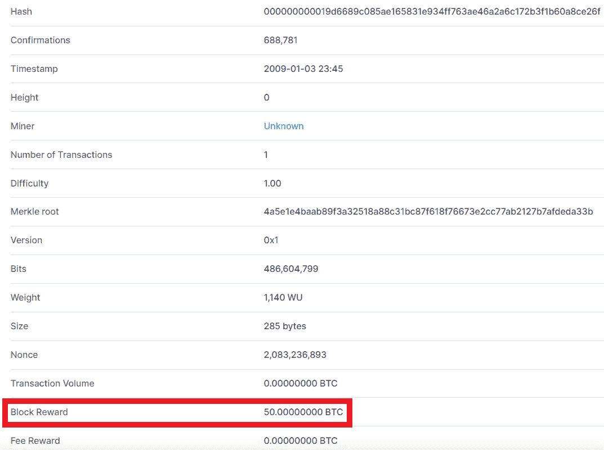
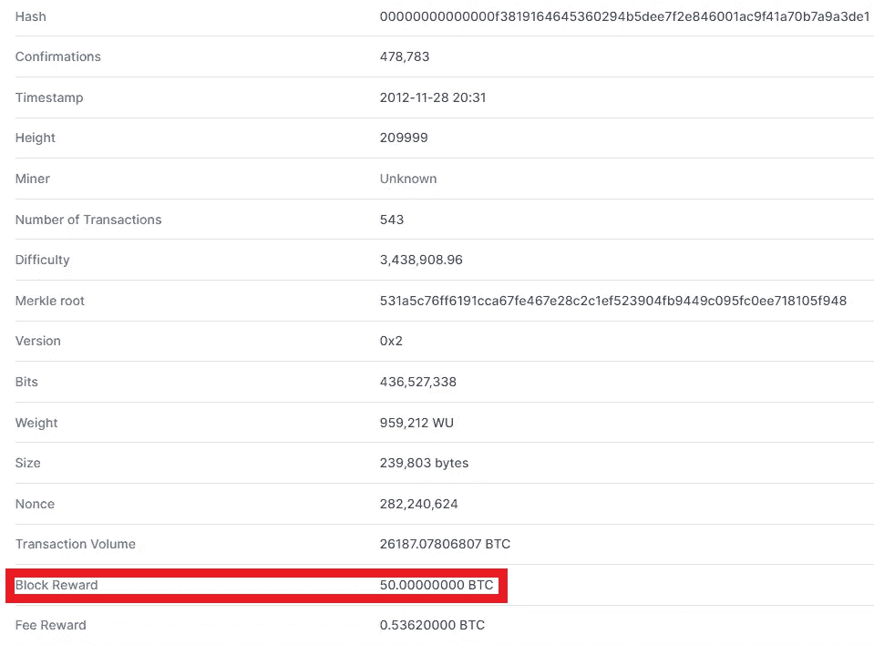
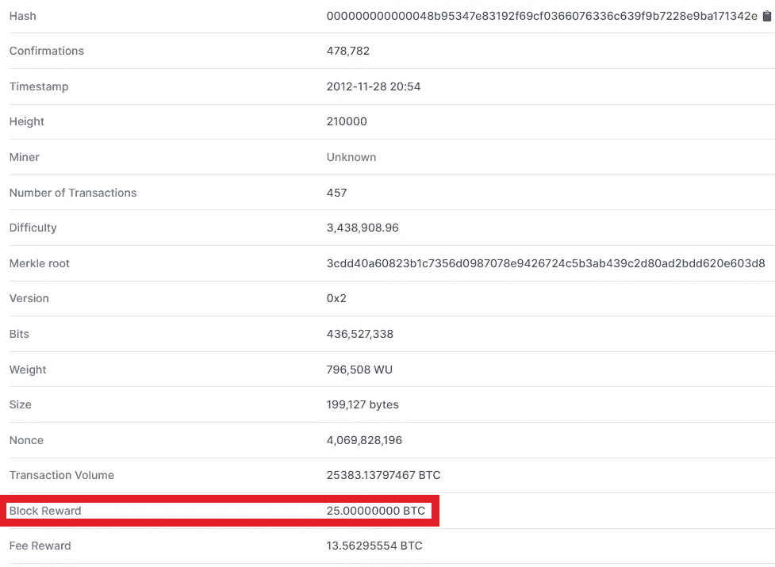
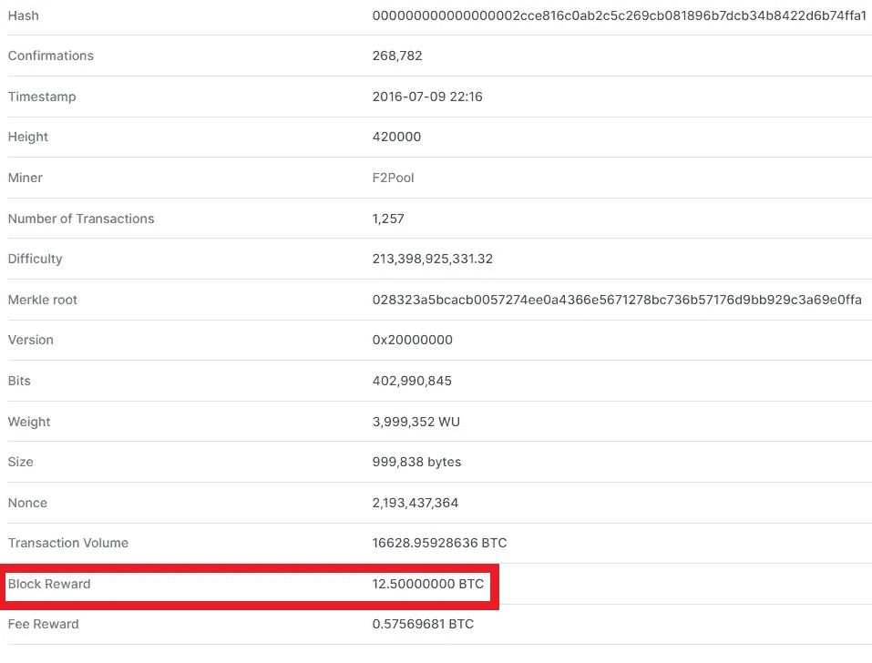
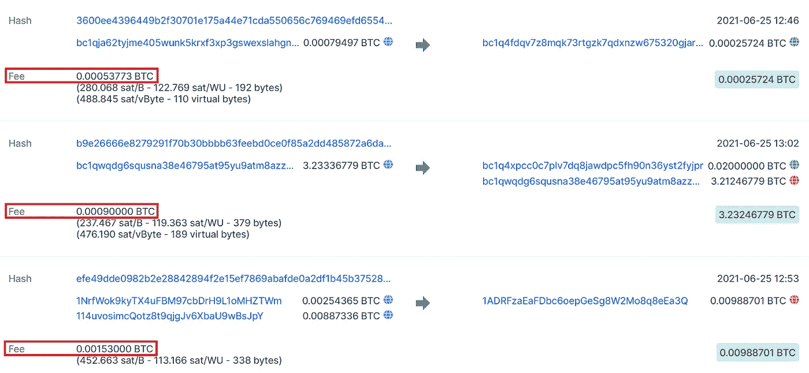

# 理解区块链的概念

> 原文：<https://medium.com/coinmonks/understanding-the-concepts-of-blockchain-1920c6f80bd0?source=collection_archive---------10----------------------->

Image taken from [here](https://www.finance-monthly.com/2019/08/the-top-3-cryptocurrencies-what-makes-them-a-success/)

在我的上一篇博客中，我讨论了密码学的概念和加密的使用，区块链的概念，一个从密码学概念衍生出来的领域。普通银行交易和比特币交易的类比，有何不同，为什么建议使用分散的加密货币而不是集中的银行系统。在这篇博客中，我将讨论比特币区块链的其他概念。重要的一点是，比特币区块链与以太坊区块链完全不同。虽然使用的是区块链的概念，但是交易的实现和交易的验证是不同的。所以首先我会在这篇博客和接下来的博客中完成关于比特币区块链的讨论，然后我会讨论以太坊区块链。

# 1.区块链如何透明

在区块链，所有以加密方式存储的东西。密码学涉及哈希和加密。这两个术语互不相同。哈希是加密的一种方式，加密包括加密和解密。区块链使用非对称类型的加密，涉及两种不同的密钥，公钥和私钥。所有这些都用于通过对交易进行数字签名来数字证明您的身份。这就是为什么它是透明的。你可以很容易地在区块链浏览器[这里](https://blockchain.com/explorer)看到所有正在被验证的交易。在未来的解释中，我将使用这个网站来阐述各种各样的例子，因为你将能够在那里实时看到每一件事情的发生。

# 2.什么是未确认交易池？

在加密货币中，当发送者将钱发送给一些商家/接收者时，在货币从发送者的钱包转移到商家的钱包之前，交易需要一些时间来确认。矿工根据发送者是否有想要的资金来进行确认。当交易未被确认时，该交易被存储在一个称为**未确认交易池**的空间中。所以，比特币将有自己的未确认交易池，以太坊将有自己的未确认交易池，Dogecoin 将有自己的未确认交易池，等等。
在该池中，存在所有未被确认且必须由矿工确认的交易。它可以是 1 笔交易、10 笔交易、100 笔交易或任何数量的交易，这些交易尚未得到采矿者的确认。矿工基本上选择那些提供他更多**费用奖励**(我将在以后讨论)的交易集。所以这完全取决于 miner，您的交易将在 miner 确认后完成，这意味着直到发送方的金额在未确认的交易池中，发送方只是该金额的所有者，但一旦得到确认，接收方将成为该金额的所有者。确认交易的时间可能需要 10 分钟、20 分钟、1 小时、2 小时、12 小时、一周或更长时间。在矿工没有确认交易之前，钱不会被转移。**但是**有一个必须确认的时间限制，在此之后，如果交易仍然没有被确认，那么交易将从未确认池中删除，并且不会从您的钱包中转移资金。在 14 天的有限时间内，您的交易必须得到确认，否则您的金额将再次添加到您的钱包中。

# 3.谁是矿工？

我在上面的段落中使用了一个单词 **miner** 。这是什么意思？是人还是机器？这些问题出现在学习区块链的最初阶段。挖掘者是负责确认未确认交易池中存在的交易的人。他/她创建块，说“创建”意味着 miner 找到块的散列。矿工确认的所有交易都由他/她的区块添加。在比特币中，块的大小是 1 Mb，并且它对于作为比特币区块链的一部分的所有块是固定的。比特币区块链的共识中提到了大小，如果你想增加区块的大小，那么只能通过共识来实现。共识就像一个约定，区块链的每个节点都必须同意。所以比特币有自己的共识，以太网有自己的共识。这样，黑客找到了对每个块都是唯一的散列，并将事务添加到其中。

# 4.矿工得到什么回报？

这是一个显而易见的问题，因为矿工正在使用他们的计算机资源来验证交易，并将它们添加到区块中。但是他们为什么要这样做呢？他们这样做是为了获得每个矿工解决难题(我将在即将到来的博客中讨论)和获得区块散列的奖励。目前，当矿工解决难题获得区块散列时，他/她将获得 6.25 BTC( **区块奖励**)作为奖励。矿工还获得由发送者支付的**费用奖励**，以便进行交易。
**块奖励**在每 210，000 块之后改变，即大约 4 年，并且在整个期间保持不变，而**费用奖励**取决于发送者发送给商家的交易量。创造比特币的中本聪·区块链创造了这个区块链的第一个区块，当时区块奖励是 50 BTC。参考下面的快照，即**块 0** 。

**重要:**第一块是**块 0** 因此第二块是**块 1** ，因此第 210000 块是**块 209999** ，210000 块之后我们知道会发生什么。如果没有，请再次阅读上述内容。

紧接着在下面的快照中看到**块 209999** 并看到块奖励。

现在看到下面快照中的**区块 210000** 并看到区块奖励，它应该减半，因为它是第 210001 区块。

现在查看下面快照中的**区块 420000** 并查看区块奖励。

类似地，找到街区奖励开始为 6.25 BTCs 的街区。现在假设你的比特币钱包里有 4 个 BTC，你想给一个商家发送 4 个比特币，你将无法支付，因为你需要支付的“费用”也必须由你支付。现在假设这笔交易的手续费是 0.00090000 BTC，那么你要送 4.00090000 BTC，其中 4 个 BTC 会自动转给商家，0.00090000 BTC 给矿工，作为交易确认后的手续费奖励。但由于我们钱包里没有 4.00090000 BTCs，交易无法发起。您无需担心计算交易过程中需要支付的额外费用。钱包会自动计算费用，并计入您支付给商家的总金额。没有费用，您无法进行交易。我们在上例中看到，交易不成功是因为我们无法支付费用。但是现在假设我想交易 2 个 BTC，而不是 4 个 BTC。现在假设交易的费用是 **0.000XXXXX** BTCs，其中 **X** 是我们必须支付作为交易费用的钱包中的任何数字。现在将为 2.000XXXXX BTCs 发起交易，由于我有足够的资金(我的钱包中有 4 个 BTC)，我可以发起交易，交易将进入未确认的交易池，如果矿工确认，那么商家将收到钱。下面是比特币的 [**区块 688767**](https://www.blockchain.com/btc/block/0000000000000000000a2b3818afc6aa08a2490a693eff4e93c027163c6d5cec) 的交易快照，显示了发送者必须随商家要求的钱一起发送的每笔交易的交易费。

*在这篇博客中，我讨论了加密货币为何透明、什么是未确认交易池、我们看到的各种区块、它们的区块奖励、区块奖励如何受到影响、谁是矿工等概念。我希望你明白了。在下一篇博客中，我将讨论区块链和加密货币的其他有趣概念。*

> 社交媒体链接:[LinkedIn](https://www.linkedin.com/in/ansh-vaid/)|[GitHub](https://github.com/AnshVaid4)|[insta gram](https://www.instagram.com/being_optimist/)|[Twitter](https://twitter.com/anshvaid4)
> 
> 访问我的网站:[https://cybergeeks.website/](https://cybergeeks.website/)
> 
> *最初发表于*[*【https://github.com】*](https://github.com/AnshVaid4/Blogs/blob/caff161e83f7cb87d41468660ab5875de2cd47a4/blogs/2021-10-13-ExploitingServices.md)*。*

> 加入 Coinmonks [电报频道](https://t.me/coincodecap)和 [Youtube 频道](https://www.youtube.com/c/coinmonks/videos)了解加密交易和投资

## 另外，阅读

*   [南非的加密交易所](https://blog.coincodecap.com/crypto-exchanges-in-south-africa) | [BitMEX 加密信号](https://blog.coincodecap.com/bitmex-crypto-signals)
*   [MoonXBT 副本交易](https://blog.coincodecap.com/moonxbt-copy-trading) | [阿联酋的加密钱包](https://blog.coincodecap.com/crypto-wallets-in-uae)
*   [雷米塔诺评论](https://blog.coincodecap.com/remitano-review)|[1 英寸协议指南](https://blog.coincodecap.com/1inch)
*   [MoonXBT vs Bybit vs 币安](https://blog.coincodecap.com/bybit-binance-moonxbt) | [Arbitrum:第二层解决方案](https://blog.coincodecap.com/arbitrum)
*   [买 PancakeSwap(蛋糕)](https://blog.coincodecap.com/buy-pancakeswap)|[matrix export Review](https://blog.coincodecap.com/matrixport-review)
*   [最佳免费加密信号](https://blog.coincodecap.com/free-crypto-signals) | [YoBit 评论](/coinmonks/yobit-review-175464162c62) | [Bitbns 评论](/coinmonks/bitbns-review-38256a07e161)
*   [OKEx 评论](/coinmonks/okex-review-6b369304110f) | [Kucoin 交易机器人](/coinmonks/kucoin-trading-bot-automate-your-trades-8cf0ca2138e0) | [期货交易机器人](/coinmonks/futures-trading-bots-5a282ccee3f5)
*   [AscendEx Staking](https://blog.coincodecap.com/ascendex-staking)|[Bot Ocean Review](https://blog.coincodecap.com/bot-ocean-review)|[最佳比特币钱包](https://blog.coincodecap.com/bitcoin-wallets-india)
*   [霍比审核](https://blog.coincodecap.com/huobi-review) | [OKEx 保证金交易](https://blog.coincodecap.com/okex-margin-trading) | [期货交易](https://blog.coincodecap.com/futures-trading)
*   [比特币基地赌注](https://blog.coincodecap.com/coinbase-staking) | [热点评论](/coinmonks/hotbit-review-cd5bec41dafb) | [库币评论](https://blog.coincodecap.com/kucoin-review)
*   [最佳加密交易信号电报](/coinmonks/best-crypto-signals-telegram-5785cdbc4b2b) | [MoonXBT 评论](/coinmonks/moonxbt-review-6e4ab26d037)
*   [Coinswitch 俱吠罗评论](/coinmonks/coinswitch-kuber-review-1a8dc5c7a739) | [电网交易机器人](https://blog.coincodecap.com/grid-trading) | [比特币基地收费](/coinmonks/coinbase-fees-831e77d4f2c5)
*   [Bitget 回顾](https://blog.coincodecap.com/bitget-review)|[Gemini vs block fi](https://blog.coincodecap.com/gemini-vs-blockfi)|[OKEx 期货交易](https://blog.coincodecap.com/okex-futures-trading)
*   [OKEx vs KuCoin](https://blog.coincodecap.com/okex-kucoin) | [摄氏替代品](https://blog.coincodecap.com/celsius-alternatives) | [如何购买 VeChain](https://blog.coincodecap.com/buy-vechain)
*   [币安期货交易](https://blog.coincodecap.com/binance-futures-trading)|[3 commas vs Mudrex vs eToro](https://blog.coincodecap.com/mudrex-3commas-etoro)
*   [在印度利用加密套利赚取被动收入](https://blog.coincodecap.com/crypto-arbitrage-in-india)
*   [德国最好的加密交易所](https://blog.coincodecap.com/crypto-exchanges-in-germany) | [WazirX P2P](https://blog.coincodecap.com/wazirx-p2p)
*   [如何购买 Monero](https://blog.coincodecap.com/buy-monero) | [IDEX 评论](https://blog.coincodecap.com/idex-review) | [BitKan 交易机器人](https://blog.coincodecap.com/bitkan-trading-bot)
*   [如何在 Bitbns 上购买柴犬(SHIB)币？](https://blog.coincodecap.com/buy-shiba-bitbns) | [印度币安](https://blog.coincodecap.com/binance-in-india)
*   [币安 vs 比特邮票](https://blog.coincodecap.com/binance-vs-bitstamp) | [比特熊猫 vs 比特币基地 vs Coinsbit](https://blog.coincodecap.com/bitpanda-coinbase-coinsbit)
*   [如何购买 Ripple (XRP)](https://blog.coincodecap.com/buy-ripple-india) | [非洲最好的加密交易所](https://blog.coincodecap.com/crypto-exchange-africa)