# 了解 eosio.token 合同

> 原文：<https://medium.com/coinmonks/understanding-the-eosio-token-contract-87466b9fdca9?source=collection_archive---------2----------------------->

我必须承认，学习 eosio 不是在公园里散步，我可以理解为什么许多人说它有一个陡峭的学习曲线。随着 eosio 软件的持续快速发展，可参考的文档和工作示例非常有限。我已经被难住了好几次，我想帮助下一个开发人员改善体验。在本文中，我将把“eosio.token”合同分解成几个独立的部分。

> [发现并回顾最佳区块链软件](https://coincodecap.com)

**EOS io . token 契约是什么？**

eosio.token 契约允许创建许多不同的令牌。这使得任何人都能够创建和转移令牌。每个代币必须由“发行者”账户发行。由于帐户可以包含多方，因此您可以使用具有所有者和活动权限的普通帐户或自定义配置的帐户来创建和管理令牌。每个令牌都是一个`asset`类型，如下所示:

`1000000000.0000 SYS`

`1.0000 SYMBOL`

`0.10 SYS`

`asset`类型是一个数字(如果我没记错的话，可以达到 18 位小数)和一个符号，可以是 1-7 个大写字母。这个契约有三个动作可以用来与之交互。它们是:创建、发布和转移。

创建用于定义新令牌的特征。这包括代币(`asset`)符号、最大供应量以及允许发行代币的账户。创建还会将新令牌配置持久化到区块链上。这意味着新令牌配置的存储必须由某人来标记。正如您稍后将看到的，部署此合同的帐户(在我们的示例中为“eosio.token”)也将为令牌配置存储付费。

发行用于增加令牌的主动供应。代币可以不断发行，直到达到最大供应量。在令牌创建过程中定义的`issuer`必须批准该操作才能成功。

转账让一个账户向另一个账户转账代币。

**部署合同**

你应该知道的第一件事是，每个 eosio 智能合约都属于一个 eosio 账户。契约基本上是其他帐户可以与之交互的对象。契约包含在区块链上执行代码的“动作”。合同可以直接访问区块链上的存储、移除和更新数据。

将操作推送到合同需要至少一个帐户的授权。根据合同的复杂程度，可能需要更多的帐户和权限。在基于许可的配置中，一个帐户可以由一个或多个个人创建。智能合约只能由一个帐户运行，一个帐户只能有一个智能合约。最佳做法是为帐户和合同提供相同的(小写)名称。

在与 eosio.token 合同进行交互之前，您需要创建一个同名的帐户，并将合同部署到该帐户上。

首先创建一个帐户

`$cleos create account eosio eosio.token <OWNER-KEY> <ACTIVE-KEY>`

然后编制合同

`$cd eos/contract/eosio.token`

`$eosiocpp -o eosio.token.wast eosio.token.cpp`

最后，将合同部署到帐户上

`$cleos set contract eosio.token ../eosio.token`

您可以验证该合同是使用

`$cleos get code eosio.token`

**合同架构**

合同分为两个文件“eosio.token.cpp”和“eosio.token.hpp”。的’。hpp '文件定义了合同类、动作和表格，而。cpp '文件实现了动作逻辑。让我们首先看一下将用于实例化契约对象的契约类。(我把‘EOS io . token . HPP’的一些遗留代码去掉了)

构造函数和动作被定义为公共成员函数。构造函数获取一个帐户名(这将是部署契约的帐户，又名 eosio.token ),并将其设置为`contract`变量。请注意，此类是从“eosio::contract”继承的。

表和助手函数是作为私有成员提供的。底部定义了两个内联函数，但从未使用过。这给我们留下了重要的功能`sub_balance()`和`add_balance()`。这些将被转移动作调用。

**表格**

定义的两个表是`accounts`和`stat`。`accounts`桌子由不同的`account`对象组成，每个对象持有不同令牌的余额。`stat`表由`currency_stats`对象(由`struct currency_stats`定义)组成，包含一个 supply、一个 max_supply 和一个 issuer。在继续之前，重要的是要知道这个契约将数据保存在两个不同的范围内。`accounts`表的作用域是 eosio 帐户，而`stat`表的作用域是令牌符号名。

*根据“eosio::multi_index”的定义，“code”是具有写权限的帐户的名称，而“scope”是存储数据的帐户。*

作用域本质上是一种在契约中划分数据的方式，以便它只能在定义的空间内访问。在令牌契约中，每个 eosio 帐户都被用作`accounts`表的作用域。`accounts`表是一个包含多个`account`对象的多索引容器。每个`account`对象由其令牌符号索引，并包含令牌余额。当使用用户的范围查询用户的`accounts`表时，将返回用户拥有余额的所有令牌的列表。

以下是我的设想。

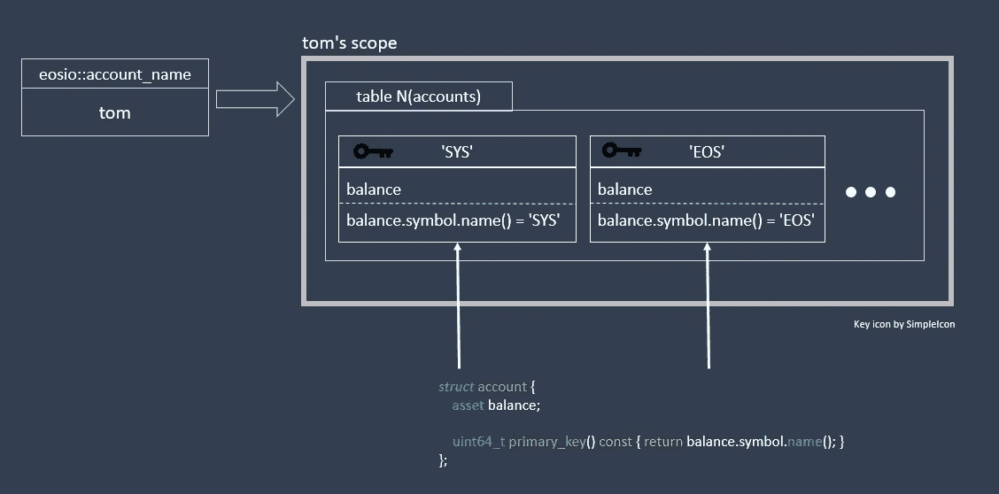

In the above picture, there is an eosio account named tom who has his own scope. Within his scope is a table called ``accounts``. Within that table is a separate `account` object for each token he holds, ‘SYS’ and ‘EOS’.

还有第二个表叫`stat`。此表将包含现有令牌的状态。新的标记是在它们自己的符号名范围内创建的。范围内是一个保存有一个`currency_stats`对象的`stat`表。与包含许多不同的`account`对象的`accounts`表不同，`stat`表只保存给定令牌符号的单个`currency_stats`对象。

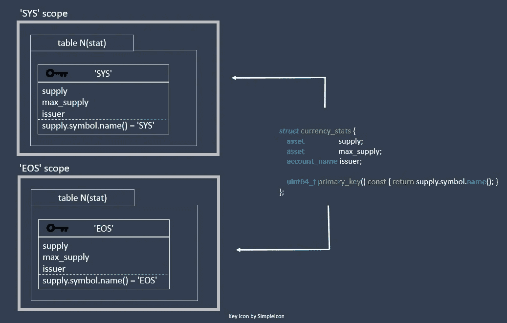

**动作**

操作在'中实现。“cpp”文件。为了创建新令牌，必须发送创建操作。Create 有两个参数；发行者和新令牌的最大供应量。只有`issuer`被允许增加新的代币供应。`issuer`不能发出超过最大供应量的量。

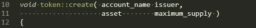

第一行代码只需要合同帐户本身的授权。这可以在推动动作时用命令行标志`-p eosio.token` 给出。

接下来的几行提取传入的`maximum_supply`资产的符号，并执行一些错误处理。如果任何一个`eosio_assert`失败，那么所有的代码都将回滚，事务不会被推送到区块链。

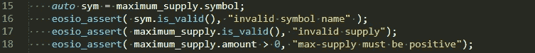

名为`statstable`的`stat`表是使用符号名(令牌符号)作为其作用域构建的。代码检查令牌是否已经存在。如果没有，它将创建新的令牌状态并保存到区块链上。`emplace`函数中的第一个参数`_self`表示该合约账户‘EOS io . token’将支付赌注存储。

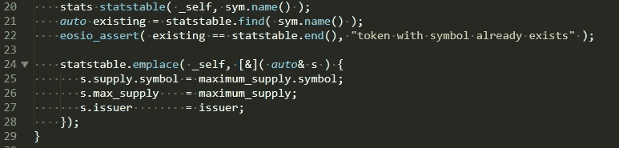

请注意，`supply`的符号被保存，因为它被用作定位表格行的键，但是耗材量尚未发出。

现在，您可以执行下一个操作，问题。Issue 将接收已发行令牌的帐户、正在发行的令牌数量和备忘录。issue 操作将两个操作合二为一，因为它既会修改已创建的令牌供应，又会调用 transfer 操作来发送已颁发的令牌。同样，前几行提取令牌符号并执行错误检查。

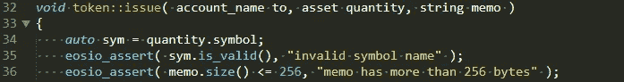

下面的代码部分将使用符号名作为作用域来构造`stat`表。这用作查找先前通过创建操作创建的令牌的密钥。

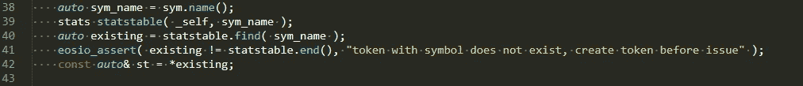

注意从`statstable.find()`返回的`existing` currency_stat 是一个迭代器，它指向找到的对象。为了简洁起见，声明了一个名为`st`的新变量，并将其设置为`existing`迭代器所指向的实际对象。这让我们使用`.`操作符来访问成员变量，而不是指针符号`->`。

需要创建的令牌的`issuer`来签署该交易，并执行更多的错误处理。

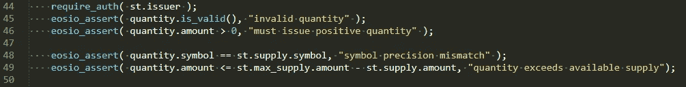

最后，我们现有令牌的 currency_stats `st`被修改，已发行的`quantity`被添加到`supply`中。`issuer`也将把这个`supply`添加到他们的余额中，以便初始供应可以追溯到他们的账户。

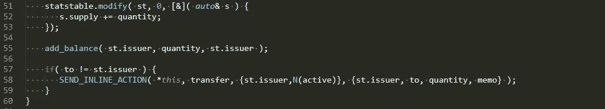

紧接着，通过`SEND_INLINE_ACTION()`宏调用`transfer`函数，该宏将转移资金。论据如下:

1.  `*this`该行动所属的合同代码
2.  `transfer`行动的安姆
3.  `{st.issuer, N(active)}`动作所需的权限
4.  `{st.issuer, to, quantity, memo}`行动本身的论据

这就把我们带到了最后的行动转移。传输将采用四个输入参数`from`、`to`、`quantity`和`memo`。`from`是将发送代币的人，因此将从他们的余额中减去`quantity`。`to`将接收代币，因此`quantity`将添加到他们的余额中。`quantity`是发送的令牌数量，`memo`是可以随交易一起发送的字符串。`memo`未在本合同中使用或储存。

该操作首先要求`from`帐户权限，并对`from`和`to`帐户执行错误处理。该符号从`quantity`中提取，并用于获取令牌的`currency_stats`。

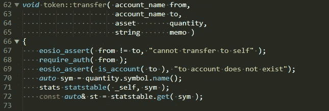

`require_recipient()`功能将在动作完成时通知发送方和接收方。

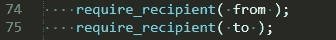

进行更多的错误处理，最后调用两个私有函数`sub_balance()`和`add_balance()`，从发送方减去令牌余额，并为接收方增加令牌余额。

这是完整的“eosio.token.cpp”文件

命令示例:

表格命令:

> 注意:本文是在 Dawn4.1 代码发布时撰写的

