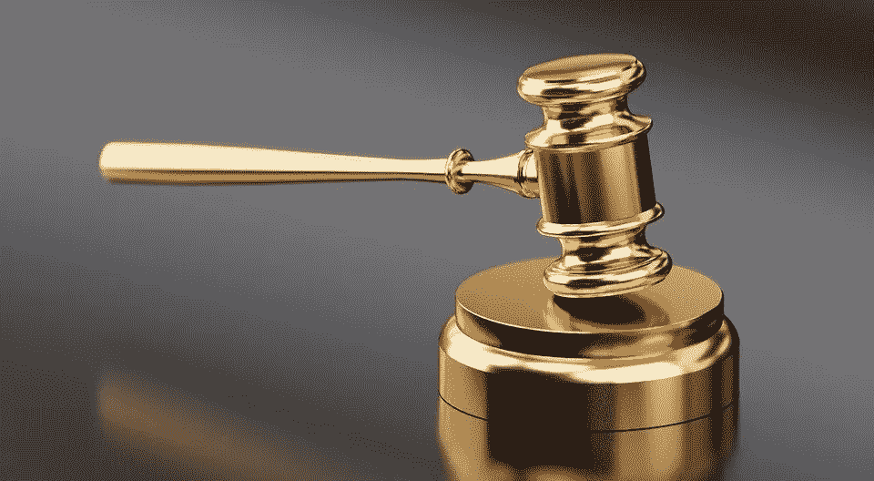

# 马克尔道还能用吗？

> 原文：<https://medium.com/coinmonks/understanding-the-impact-of-makerdaos-black-thursday-6e338e37c10c?source=collection_archive---------0----------------------->

3 月 12 日，以太坊价格从 191 美元暴跌至 88 美元。在随后的混乱中，支持戴的马可道系统无法正常执行清算。在后来被称为“黑色星期四”的日子里，价值约 800 万美元的 ETH 被从系统中取走。

在市场波动中，戴汇率大幅偏离了 1 美元的目标。目前还不清楚戴的使用是否安全，也不知道它是否能经受住这次事件。

不久后，马克尔道迅速对协议进行了紧急调整，并做了一次拍卖，试图挽救协议。够了吗？

# 发生了什么事？

3 月 12 日，来自冠状病毒的压力袭击了股票市场，导致它们经历了自 1987 年以来最严重的下跌。密码市场也下跌了。ETH 的价格从 191 美元暴跌至 88 美元左右。以太坊网络被交易活动淹没，天然气价格飙升。

使用正常数量天然气的交易无法通过，使制造商的价格神谕等系统无法正常运行。当神谕最终更新为低得多的 ETH 价格时，它们引发了大规模的清算浪潮。

MakerDAO 清算通过拍卖进行。在这些拍卖中，以 3%的折扣为戴出售了一批 ETH 抵押品。令人难以置信的大量拍卖同时发生，天然气价格异常高，拍卖结束时没有任何成功的投标。看到这一点的攻击者能够提交 0 DAI 投标并赢得 50 ETH 的拍卖，而只需支付汽油费。这些攻击给 MakerDAO 留下了 540 万美元的抵押品缺口(相对于要求的 150%抵押品比率)。

值得注意的是，尽管支持戴的乙醚价值降至 150%的抵押要求以下，但仍远高于 100%。从最直接的意义上来说，戴得到了价值至少 1 美元的 ETH 的支持，他从未被抵押不足。

# 马可道治理开始行动了

事件一发生，马克尔道的管理层就立即采取行动，以减少又一个黑色星期四的可能性。在三月份的过程中，对 MakerDAO 协议进行了一些值得注意的调整:

拍卖时间从 10 分钟延长到 6 小时。

在黑色星期四期间，一波大规模的拍卖发生了，并在清算正常进行之前结束。通过增加拍卖时间，清算人有更多的时间获得 DAI 并适当地参与拍卖，而不管网络条件如何。

**维稳费下调至 0.5%**

稳定费是铸造戴的人支付的利率，直到他们归还戴贷款。通过[降低稳定费，](https://blog.makerdao.com/executive-vote-march-20-2020/)制造戴的成本更低。其结果是，更多的人将铸造戴，将有更多的戴在流通，提高流动性，并帮助戴回到 1 美元挂钩。

**DSR 减少/淘汰**

对新用户来说，是一个很大的吸引力，但这也使戴缺乏流动性。戴被关在是因为他在二级市场上买不到。通过[剔除](https://blog.makerdao.com/executive-vote-march-20-2020/)，持有者最大化了戴的流动性。

**USDC 追加抵押品**

作为紧急措施，MKR 持有者在 USDC 投票作为抵押品。这听起来很奇怪，但实际上有很多好处:

*   非易失性抵押品使清算人即使在极端的市场条件下也能以合理的价格轻松获得戴。
*   戴可以被盯住套利。认为戴将回到与 1 美元挂钩的 USDC 持有者可以在戴价值超过 1 美元时铸造戴，卖出 USDC，然后在未来以更低的价格买回戴。

**治理安全模块延迟从 24 小时减少到 4 小时**

去年 12 月，MakerDAO 实施了 24 小时治理延迟，旨在应对恶意攻击。任何恶意的执行提案在生效前都有 24 小时的时间接受社区审查。

虽然面对恶意攻击时，24 小时的延迟是好的，但这也意味着善意的行动也会受到同样的延迟。鉴于黑色星期四，MKR 持有者投票将延迟时间减少到 4 小时，以便在黑天鹅事件发生时能够更快地做出反应。

**清算冻结模块介绍**

黑色星期四的一个主要问题是发生在极短时间内的大规模清算浪潮。这并没有给清算人足够的时间来获得足够的戴，并适当地参与清算拍卖。

[清算冻结模块](https://blog.makerdao.com/immediate-executive-vote-march-15/)允许 MKR 持有人暂时冻结清算拍卖，以允许清算人回收他们的 DAI，使他们有足够的流动性和时间参与所有拍卖。重要的是，该模块不受治理安全模块的 4 小时时间延迟的影响。

**MKR 拍卖会**

类似于当抵押品低于 150%时，ETH 的清算拍卖如何针对个人金库发生，MakerDAO 被设计为当系统低于 150%时，针对 MKR 进行债务拍卖。

黑色星期四之后，MKR 被铸造(稀释了现有 MKR 的价值)并通过一系列 MKR 拍卖出售，以弥补抵押品损失。 [20，980 MKR 以 530 万戴](https://blog.makerdao.com/the-market-collapse-of-march-12-2020-how-it-impacted-makerdao/)拍出，弥补了黑色星期四的抵押品不足。

# **马克尔道还可以安全使用吗？**

不能保证另一个黑色星期四不会发生。但如果这种情况再次发生，由于 3 月份采取的行动，MakerDAO 应该会好得多。

虽然戴供应量比事件发生前少，但流动性更强，因为没有 DSR 锁定戴。拍卖时间比以前长得多，这意味着清算人有更多的时间获得戴。清算冻结模块甚至允许 MKR 持有者在网络条件阻止清算成功发生时手动冻结清算过程。

重要的是要明白，戴从未低于 1 美元。即使 ETH 抵押品低于 150%的要求，它仍然远远高于 100%的要求，以保持戴完全支持至少 1 美元的抵押品。

同样重要的是要认识到，MakerDAO 低于 150%抵押品的情况虽然不理想，但在 MakerDAO 协议中是有计划的。债务拍卖是一种内置机制，系统可以拍卖铸造的 MKR 来弥补抵押品短缺。

没有人知道未来会发生什么。随着[马克尔道转向分权治理](https://blog.makerdao.com/what-will-maker-governance-look-like-after-complete-decentralization/)，上述任何或所有参数都有可能发生变化。但目前看来，黑色星期四并没有杀死马克尔道，反而让它更强大了。

**推荐阅读**

*   [马克尔道到底发生了什么](https://insights.glassnode.com/what-really-happened-to-makerdao/)
*   [2020 年 3 月 12 日至 13 日的市场崩溃:它如何影响了马克道](https://blog.makerdao.com/the-market-collapse-of-march-12-2020-how-it-impacted-makerdao/)

*免责声明:我不是金融分析师。这不是财务建议。*

> [直接在您的收件箱中获得最佳软件交易](https://coincodecap.com/?utm_source=coinmonks)

