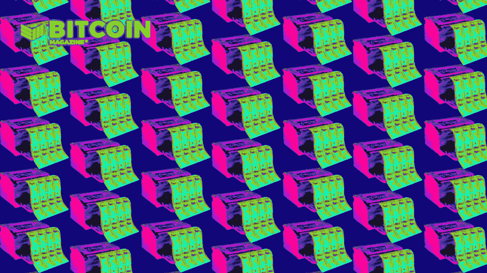

# 理解利率谬误:持有法定货币的风险

> 原文：<https://medium.com/coinmonks/understanding-the-interest-rate-fallacy-the-risks-of-holding-fiat-e12b8f8ddf30?source=collection_archive---------8----------------------->

> 经历了美国大萧条时期的经历，经历了 20 世纪 70 年代的通货膨胀和利率上升，经历了 20 世纪 80 年代的通货紧缩和利率下降，我认为将高利率的紧缩货币和低利率的宽松货币等同起来的谬论已经不复存在了。显然，旧的谬误永远不会消失。”
> 
> *——米尔顿·弗里德曼，《复兴日本国***，《1998 年**

*在这篇文章中，我想深入探讨一个关于利率的常见误解，即低利率是宽松货币和刺激的标志。这种被误导的信念会导致人们对通货膨胀做出错误的评估，从而导致他们的投资观点。今天，我们讨论“利率谬误”*

*学术界和美联储的疏忽大意的经济学家灌输给我们的通胀故事的很大一部分是相信低利率会导致人们借贷更多并扩大信贷，也就是印钞。他们想让我们相信，美联储将低利率作为一种宽松的货币政策，以导致增长和通胀。除此之外，他们还认为低利率加上量化宽松(QE)会导致严重的通货膨胀，就好像他们正在释放圣经中的流动性和印钞洪流。*

*我所熟悉的所有思想流派都同意低利率具有刺激作用:古典主义、凯恩斯主义、货币主义，甚至是我钟爱的奥地利学派。这是一个几乎普遍持有的教条，客观上是错误的。*

# *米尔顿·弗里德曼和利率谬误*

*米尔顿·弗里德曼早在 1968 年就在《美国经济评论》出版的《货币政策的作用》中概述了利率谬误。他在尼克松冲击之前写下了这篇文章，当时美国仍然实行金本位制，但货币体系已经像一个 100%基于信用的体系一样运行。这里是重要的一点:*

> **“从经验上来说，低利率是货币政策紧缩的标志——从某种意义上说，货币数量增长缓慢；高利率是货币政策宽松的标志——从货币数量快速增长的意义上来说。最广泛的经验事实与金融界和学院派经济学家普遍认为理所当然的方向恰恰相反。**
> 
> **“矛盾的是，货币当局可以保证低名义利率——但要做到这一点，它必须从看似相反的方向开始，实施通缩性货币政策。”**
> 
> **——米尔顿·弗里德曼，《货币政策的作用***》，1968 年***

**弗里德曼明确表示，利率是从货币状况——“一直紧缩”或“一直宽松”而来的。利率变动不会导致货币状况。低利率不会导致货币扩张，是通缩环境导致了低利率。**

**如何实现货币扩张？有人可能会说，“降低利率”，但根据观察，这并不奏效。如果我们被困在超低利率环境中，要么货币条件自然收紧，要么美联储以某种方式人为地收紧了这些条件。低利率并不是因为宽松的货币环境。**

**碰巧的是，当前的货币环境有两种选择，扩张或收缩。这意味着，任何低利率时期的收缩都只能伴随着扩张及其导致的利率上升。这为我们的灵长类大脑创造了一种模式:“低速率之后是扩张。”**

**虽然从技术上来说是真的，但这不是因果关系。低利率可能伴随着持续的紧缩货币条件和更低的利率，但我们不会认为这是一个单独的低利率事件。最终，扩张会回来，利率会开始上升。瞧，你的低利率导致了扩张。**

**虽然弗里德曼说的是“货币政策一直偏紧”，但他指的不是“利率政策”。我将这一术语解释为货币条件，因为他并不认为利率是最重要的政策选择，甚至是一个可能的选择。**

> ***“这些考虑不仅解释了为什么货币政策不能盯住利率；他们还解释了为什么利率是货币政策是“紧缩”还是“宽松”的误导指标(因为利率谬误)。为此，最好是看看货币数量的变化率。”***
> 
> ***——米尔顿·弗里德曼，《货币政策的作用***》，1968 年****

**弗里德曼将低利率与普遍的货币状况挂钩，但没有将低利率与经济增长水平直接挂钩。他表示，货币增长只能为经济增长提供“有利的环境”。**

> **但是稳定的货币增长会提供一个有利于企业、独创性、发明、勤奋和节俭这些基本力量有效运作的货币环境，而这些力量才是经济增长的真正源泉——米尔顿·弗里德曼，《货币政策的作用**》，1968 年****

# **理查德·沃纳论增长和利率**

**弗里德曼 50 年后，理查德·沃纳(Richard Werner)发现了货币条件和经济增长之间的经验联系，并将其与利率谬误联系起来。**

**创造了“量化宽松”一词的德国经济学家沃纳(Werner)在 2018 年发表了一份[研究](https://www.sciencedirect.com/science/article/pii/S0921800916307510)，研究了四大央行(德国、日本、英国和美国)50 年的数据，比较了 1957 年至 2008 年的经济增长和利率。**

**沃纳发现利率跟随经济增长的方向。利率是跟随经济增长水平的因变量。这与大多数人认为利率是经济扩张的因果因素完全相反。换句话说，在收集了二战后 50 年的数据并应用统计过程后，沃纳发现低利率并不能刺激经济，低利率意味着低增长。**

**现在，我们从沃纳的发现与弗里德曼的利率谬误非常相似的事实中得到了两点启示:在弗里德曼那里，紧缩的货币条件导致了低利率，而在沃纳那里，低增长导致了低利率。因此，我们可以说，在一个以信贷为基础的体系中，低利率意味着货币紧缩和低增长。相反，如果有宽松货币——也就是加速印钞——利率就不会低。**

**今天，我们在全球范围内的低利率和负利率并不意味着高水平的印钞。事实上，他们告诉我们，印钞已经减弱或下降。**

# **基于信用的系统**

**如果你理解当前系统中的货币是基于信用的，这是有意义的。通货膨胀论者是正确的，印钞票是通货膨胀，并导致利率上升，但他们声称我们正处于一个大规模印钞票的宽松货币环境是不正确的。**

**货币是在银行发放贷款的过程中创造出来的，在偿还贷款或违约的过程中毁灭。信贷的净变化就是供给的变化。可以发放 10 亿美元的新贷款，但如果 20 亿美元被偿还或违约，净变化是总信贷的萎缩。通货膨胀论者关于货币正在被印刷的说法可能是正确的，但是如果利率很低，几乎所有这些都会再次被摧毁。**

**如果经济在增长，信贷的净变化将是正的，货币供应将会增长。这种通货膨胀通过经济传导，导致价格上涨。只有这样，通胀和通胀预期才会上升，从而推高利率。这确实带来了最近利率小幅上升的另一个方面，这不是由通胀引起的，而是由流动性受损引起的。在以后的文章中会有更多的介绍。**

**信贷增长放缓或直接收缩的情况正好相反。在较高增长率下进行的经济计算遇到了经济放缓。这使得在紧缩的金融环境下，即使信贷名义上仍在扩张，贷款也更难偿还。在一个以信贷为基础的金融体系中，所需要的只是信贷增长放缓，金融环境收紧。低利率意味着低增长和糟糕的经济环境，迫使银行收紧对信用更好的借款人的贷款标准。低利率抑制了印钞。**

**当我们将弗里德曼和沃纳的这两种观点结合起来时，显而易见的是，我们需要经济增长和货币扩张来实现利率的可持续上升。在以信贷为基础的货币体系中，这两者(增长和货币扩张)之间的联系是如此紧密，以至于它们可以被视为同一件事。没有经济增长，货币扩张就不可能发生，反之亦然。因此，在增长率接近零、利率处于 40 年低点的今天，我们知道不可能出现净货币扩张。**

# **低利率和贷款行为**

**大多数人认为，如果利率降低，借款人会想借更多的钱。不一定是这样的。低利率意味着经济增长缓慢，借款人通常都在经历艰难时期。在这种环境下，借款人认为他们的收入不太安全，他们自然会尽量减少他们的账单，不想要更多的债务来度过艰难时期。**

**在低利率的糟糕经济中，寻找新债务的是不太负责任的借款人，这转化为贷款人面临越来越大的风险。出于这个原因，供应方的贷款人也会对较低的利率犹豫不决。他们不想以无法补偿这种风险的利率放贷。随着利率的提高，更多的借款人有资格获得贷款。随着利率下降，符合条件的借款人越来越少。**

**银行家想赚钱；他们想借钱给那些偿还贷款和利息的人。政府救助的安全毯并不那么重要。自金融危机以来的所有危机都证明，在央行做出反应之前，市场就会冻结。美联储是跟随者，危机发生得很快。该行不希望在危机爆发前出现流动性差的风险资产，更不用说在危机全面爆发之际。他们知道美联储总是迟到，不想成为下一个雷曼。**

**低利率告诉贷款人，风险增加了，而不是刺激信贷创造，它们导致贷款标准收紧。这限制了谁和什么值得冒险。只有信誉最好的公司和个人才能获得贷款。大型上市公司比小型企业有更好的信用风险。**

**担保贷款也比无担保贷款风险低。许多人声称飙升的房价是印钞的迹象，而事实上这是收紧贷款标准和低利率的迹象。买房时，住宅的标题总价并不重要。这是每月付款——可负担性。**

**随着利率降低，月供下降，由于抵押贷款是由房地产本身担保的，同样质量的借款人可以负担更大的抵押贷款，同时保持相对相同的风险。这是在紧缩的货币条件下资产价格上涨的过程。贷款自然会集中在风险较低、质量较高和增长较快的行业。**

# **总之，比特币的潜力**

**我们可以总结为，利率下降是因为经济增长放缓以及与之相关的总体信贷风险上升。获得信贷的机会自然会随着信用度而减少，这解释了日益加剧的财富不平等、部门差距，甚至表现为政府在经济中发挥更大的作用(因为信用度最高的借款人很可能是政府本身)。低利率并不意味着印钞，而是意味着货币环境紧张、缺乏信心以及对风险的感知增加，这很可能是由于在市场中的直接经历。**

**一些读者可能会误以为这篇文章表明我赞同当前的经济状况或货币和财政政策。我不知道。然而，我也不认为当前的经济和政治形势是一种独特的、恶意的意识形态或中央计划的结果。正如弗里德曼所说的有利于经济增长的“气候”,我认为这些经济条件为极端的意识形态和政治创造了有利的气候。**

**最后，这篇文章中阐述的利率、印刷和增长之间的极端动态是由于 17 世纪的货币形式和目前在世界上占主导地位的货币体系——基于信用的货币。如果比特币成为主要货币，这些影响将会大大降低。**

**比特币仍有可能获得信贷，但商品货币是一种没有交易对手风险的金融资产，因此将大大有助于抑制危机在经济中的蔓延。与所有金融资产都是其他人的负债相比，资产负债表在本质上更安全。**

**这是安塞尔·林德纳的客座博文。所表达的观点完全是他们自己的，不一定反映 BTC 公司或比特币杂志*的观点。***

***原载于 2021 年 10 月 19 日*[*【https://bitcoinmagazine.com】*](https://bitcoinmagazine.com/markets/understanding-the-interest-rate-fallacy)*。***

> **加入 Coinmonks [电报频道](https://t.me/coincodecap)和 [Youtube 频道](https://www.youtube.com/c/coinmonks/videos)了解加密交易和投资**

## **另外，阅读**

*   **[网格交易机器人](https://blog.coincodecap.com/grid-trading) | [Cryptohopper 审查](/coinmonks/cryptohopper-review-a388ff5bae88) | [Bexplus 审查](https://blog.coincodecap.com/bexplus-review)**
*   **[7 个最佳零费用加密交易平台](https://blog.coincodecap.com/zero-fee-crypto-exchanges)**
*   **[分散交易所](https://blog.coincodecap.com/what-are-decentralized-exchanges) | [比特恩斯 FIP](https://blog.coincodecap.com/bitbns-fip) | [皮奥克斯评论](https://blog.coincodecap.com/pionex-review-exchange-with-crypto-trading-bot)**
*   **[在印度利用加密套利赚取被动收入](https://blog.coincodecap.com/crypto-arbitrage-in-india)**
*   **[德国最佳加密交易所](https://blog.coincodecap.com/crypto-exchanges-in-germany) | [WazirX P2P](https://blog.coincodecap.com/wazirx-p2p)**
*   **[如何购买 Monero](https://blog.coincodecap.com/buy-monero) | [IDEX 评论](https://blog.coincodecap.com/idex-review) | [BitKan 交易机器人](https://blog.coincodecap.com/bitkan-trading-bot)**
*   **如何在 Bitbns 上购买柴犬(SHIB)币？ | [印度的币安](https://blog.coincodecap.com/binance-in-india)**
*   **[币安 vs Bitstamp](https://blog.coincodecap.com/binance-vs-bitstamp) | [Bitpanda vs 比特币基地 vs Coinsbit](https://blog.coincodecap.com/bitpanda-coinbase-coinsbit)**
*   **[如何购买瑞波(XRP)](https://blog.coincodecap.com/buy-ripple-india) | [非洲最好的加密交易所](https://blog.coincodecap.com/crypto-exchange-africa)**
*   **[非洲最佳加密交易所](https://blog.coincodecap.com/crypto-exchange-africa) | [Hoo 交易所评论](https://blog.coincodecap.com/hoo-exchange-review)**
*   **[eToro vs robin hood](https://blog.coincodecap.com/etoro-robinhood)|[MoonXBT vs by bit vs Bityard](https://blog.coincodecap.com/bybit-bityard-moonxbt)**
*   **[Stormgain 回顾](https://blog.coincodecap.com/stormgain-review) | [Bexplus 回顾](https://blog.coincodecap.com/bexplus-review) | [币安 vs Bittrex](https://blog.coincodecap.com/binance-vs-bittrex)**
*   **[Bookmap 评论](https://blog.coincodecap.com/bookmap-review-2021-best-trading-software) | [美国 5 大最佳加密交易所](https://blog.coincodecap.com/crypto-exchange-usa)**
*   **[如何在 FTX 交易所交易期货](https://blog.coincodecap.com/ftx-futures-trading) | [OKEx vs 币安](https://blog.coincodecap.com/okex-vs-binance)**
*   **[如何在势不可挡的域名上购买域名？](https://blog.coincodecap.com/buy-domain-on-unstoppable-domains)**
*   **[印度的加密税](https://blog.coincodecap.com/crypto-tax-india) | [altFINS 审核](https://blog.coincodecap.com/altfins-review) | [Prokey 审核](/coinmonks/prokey-review-26611173c13c)**
*   **[区块链 vs 比特币基地](https://blog.coincodecap.com/blockfi-vs-coinbase) | [比特坎评论](https://blog.coincodecap.com/bitkan-review) | [币安评论](/coinmonks/binance-review-ee10d3bf3b6e)**
*   **[Coldcard 评论](https://blog.coincodecap.com/coldcard-review) | [BOXtradEX 评论](https://blog.coincodecap.com/boxtradex-review)|[uni swap 指南](https://blog.coincodecap.com/uniswap)**
*   **[阿联酋 5 大最佳加密交易所](https://blog.coincodecap.com/best-crypto-exchanges-in-uae) | [SimpleSwap 评论](https://blog.coincodecap.com/simpleswap-review)**