# 解密可升级合约:从开发人员的角度理解可升级智能合约

> 原文：<https://medium.com/coinmonks/understanding-upgradeable-smart-contracts-from-a-developers-perspective-9469ce09680b?source=collection_archive---------0----------------------->

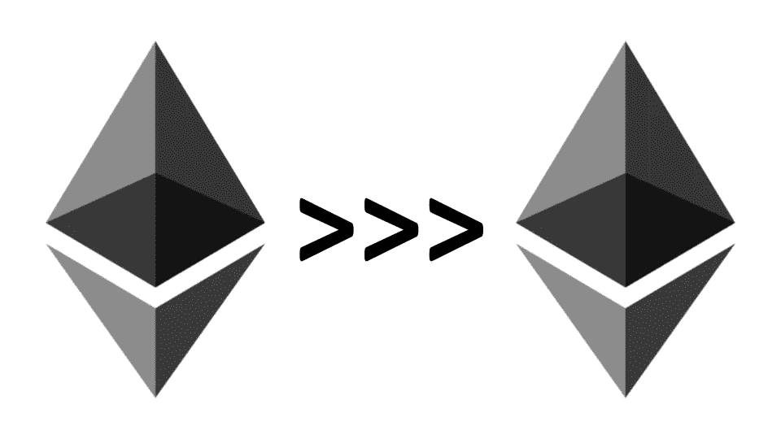

Source: Indorse

没有人能否认这样一个事实:有一些真正必要的特性使得智能合约非常可靠。

> 其中一个至关重要的特征就是它的**不变性**。

一旦部署，没有人可以添加、修改或删除智能合同的任何部分，这一事实使得它非常安全和值得信赖。

虽然智能合约的这种不可改变的性质看起来是一种好处，但它也存在一些不容忽视的黑暗面。

# 永恒性的丑恶嘴脸

软件开发的世界强烈依赖于其升级代码的能力，从而在每个新版本中增强软件的性能。

嗯，一个典型的**智能合同从不允许升级其代码**。

这正是我们开始观察不可变智能合约的阴暗面的地方。

因为不可否认的事实是，开发一个完全无 Bug 的代码是一个非常麻烦的任务，Smart contract 的不可改变的本质使得它更糟糕，因为它不允许纠正错误。

> **对 DeFi 部门的最严重影响**
> 说实话，由于合同中无法纠正的小漏洞，加密世界已经见证了价值数百万的巨大损失。

例如，2016 年 6 月 17 日的**见证了加密社区历史上最大的黑客攻击之一，即**DAO Hack**。
总计**360 万乙醚(*【5000 万美元* )** 被黑客盗取。**

## **这种攻击背后的原因是一个简单的**重入**错误，如果智能合同是可升级的，这个错误就可以解决。**

**因此，尽管智能合约的不可变性质使其可靠，但升级智能合约的能力也确保了最大的安全性。**

**这正是**可升级智能合约**的用武之地。**

# **可升级合同到底是什么意思？**

**现在很明显，智能合约是相当严格的。**

**一旦部署，就没有办法改变智能协定，即使修改增强了代码。**

**现在，这正是可升级智能合约要解决的问题。**

> *****简单来说，可升级智能合约是在保留原始合约的状态、地址以及余额的同时，有效升级(修改)智能合约的过程。*****

**虽然这听起来很容易，但是开发可升级的合同是一个非常复杂的过程。**

## **撰写可升级合同时的主要障碍**

**一个典型的可升级契约无疑会在其开发过程中包含巨大的复杂性。**

**例如，即使是基本的可升级合同开发也需要:**

*   ****重新创建&部署**带有修改代码的现有合同的新版本。**
*   ****状态的手动迁移:**开发人员必须手动将所有命令性状态从旧契约迁移到新契约。**
*   ****处理未保存的合同地址:**部署新合同将完全改变之前用于合同交互的合同地址。**

**因此，这使整个场景变得非常复杂，因为我们需要更新所有的契约地址，以便使用新的契约来代替旧的契约。**

**无可否认，上述程序根本不是一个有效的程序。**

**因此，社区已经见证了许多开发可升级智能合同的方法，如:**

*   *****分离逻辑和数据*****
*   *****主从契约*****
*   *****可部分升级的智能合同系统。*****
*   *****永久保管契约等。*****

**然而，其中最有效的是**代理合同方法**。**

# **代理合同方法论的深入分析**

**在使用这种方法时，我们考虑了 3 个主要因素:**

*   ****逻辑实现契约** — *该契约负责所有的逻辑和工作机制。***
*   ****代理契约** — *包含委托调用*
    *的功能，其主要功能是将调用委托给逻辑契约。***
*   ****密钥存储契约** — *包含共享状态。最重要的是，这个契约必须由双方逻辑继承&代理契约。***

# **但是……什么是委托通话？**

**委托调用实际上是代理契约方法的核心，因此是一个非常重要的概念。**

> **委托调用是 EVM 提供的一个重要操作码， ***使我们能够在目标契约地址，但在调用契约的上下文中执行代码。*****

**让我们明白这一点。**

# **用简单呼叫理解委托呼叫**

****在简单调用的情况下****

*   **当契约 A( *调用方契约*)对 B( *目标契约*)， ***进行简单调用时，代码实际上在 B.*** 的上下文中执行**

## **这意味着使用了 B 的存储。**

*   **此外，契约 B 假设实际的调用者是契约 A，而不是外部所有者帐户(*，尽管这根本不是真的*)。**

****因此，简单调用不能保存消息发送者或消息值****

**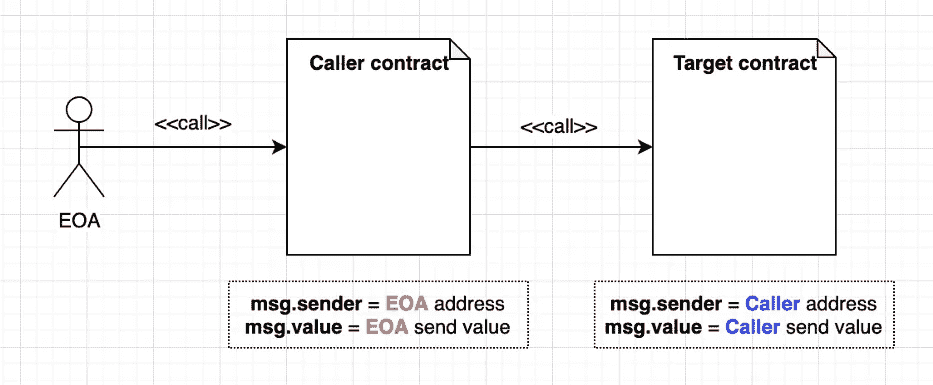**

****代表呼叫时****

*   **与简单调用不同，委托调用修改得更多，也更有效。**
*   **当合同 A 委托呼叫联系人 B 时，**T3 代码在合同 A(呼叫合同)而不是合同 B(目标合同)的上下文中执行。****

## **这意味着使用了 A 的存储。**

*   **此外，在委托调用中，msg.sender 和 msg.value 被保留。**
*   **例如，*在委托调用期间，契约 B(目标契约)知道实际的调用方不是契约 A(调用方契约)，而是外部拥有的帐户(msg.sender)。***

**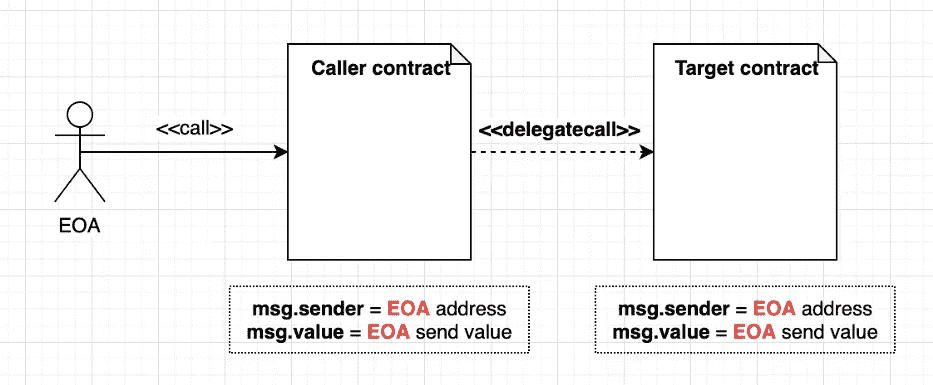**

# **工作机制一瞥**

**也就是说，是时候探索代理契约方法如何使用委托调用并帮助我们开发可升级的智能契约了。**

> **这种方法的有效性背后的一个最重要的原因是这样一个事实，即 ***最终用户只需要与代理契约*** 进行交互。**

**因为我们已经分离了逻辑契约，所以我们可以更改逻辑，同时为用户保持代理契约不变。**

**因此， ***此过程中的代理契约充当不可变存储，而逻辑契约将包括所有功能。*****

**现在，为了升级契约的逻辑，**我们只需要让代理契约知道新委托契约的地址。**因此，每当我们调用代理契约中的特定函数时，它只是委托调用逻辑契约(其中包含函数逻辑)。**

## **因此，每当我们调用代理契约中的特定函数时，它只是委托调用逻辑契约(包含函数逻辑)。**

**因此，使我们能够在与相同的旧代理契约交互时使用修改后的代码，同时完全保留契约的状态和地址。**

**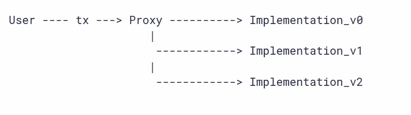**

**Source: openzeppelin**

> *****代理契约和逻辑契约的存储结构，即状态变量的顺序必须相似。*****
> 
> **这是代表电话最充分发挥作用的最迫切要求之一。**

**仔细观察可能会让我们认识到，即使我们选择了代理契约方法，开发可升级的智能契约也是一个非常麻烦的过程。**

**因为在开发可升级契约时有大量的细节需要考虑，所以每次从头开始编写契约无疑会导致我们不希望的结果。**

***因此，非常需要为智能合约提供健壮、易用和有效的升级机制的工具或库。***

**幸运的是，这些正是 Openzeppelin 升级 CLI 有效解决的问题。**

# **进入开放齐柏林飞船**

**Openzepplin 升级 CLI 已经完全消除了开发可升级合约所涉及的复杂性。**

**让我们用 openzepplin CLI 写一个可升级的契约来理解它到底是如何工作的。**

> *****注****:*Openzeppelin CLI 需求 **Node.js** 进行开发。确保你已经预装了*。***

# **启动项目**

1.  **让我们从创建一个单独的文件夹开始。**

> **$ **mkdir 测试-可升级-合同& & cd 测试-可升级-合同****

**进入文件夹后，创建一个 npm 包**

> ****$ npm 初始化-y****

**现在，让我们安装 Openzepplin CLI**

> **$**NPM I @ open zeppelin/CLI****

**由于整个过程将涉及创建、编译和部署智能合同，我们必须安装一个本地区块链。**

**运行以下命令来安装它。**

> **npm 安装 ganache-cli**

**太好了！**

**现在我们已经完成了安装，让我们启动一个 CLI 项目。
运行以下命令。**

> ****$ npx 盎司初始****

**成功执行该命令后，您将:**

****network.js 文件****

*   **这是 CLI 存储网络配置的地方。**

```
module.exports = {
  networks: {
    development: {
      protocol: 'http',
      host: 'localhost',
      port: 8545,
      gas: 5000000,
      gasPrice: 5e9,
      networkId: '*',
    },
  },
};
```

****。openzeppelin 目录****

*   **这里存储了每个项目的相关细节。**

```
{
  "manifestVersion": "2.2",
  "contracts": {},
  "dependencies": {},
  "name": "test_upgrades",
  "version": "1.0.0",
  "compiler": {
    "compilerSettings": {
      "optimizer": {}
    },
    "typechain": {
      "enabled": false
    }
  }
}
```

# ****撰写和部署合同****

**现在我们已经准备好了工具，让我们写一个基本的契约。**

**转到合同目录并创建一个实体文件。**

> *****美元 cd 合约*****
> 
> *****$ touch Invest.sol*****

*****理解合同**
用更简单的话来说，这个合同允许用户在合同中投资 ETH，并在他们希望的任何时候撤回它们。***

***合同中的功能如下:***

*   ****存储每个用户地址投资额的映射。****
*   ****一个* ***投资*** *功能，让用户在合同中投资 ETH。****
*   ******撤回*** *允许特定用户撤回已投资的 ETH 并更新合同状态的功能。****
*   ******getcontractballance****返回合同的余额。****
*   ******【getuser balance】****返回特定用户的余额。****

```
*pragma solidity ^0.5.0;contract Invest{ mapping (address => uint) public userBalances; function invest() public payable{
    userBalances[msg.sender] = msg.value;
  } function withdraw() public{
    require (userBalances[msg.sender] != 0, "User doesn't have any balance");
    address payable rec = msg.sender;
    rec.transfer(userBalances[msg.sender]);
    userBalances[msg.sender] = 0; 
  }

  function getContractBalance() public view returns(uint256){
      return address(this).balance;
  } function  getUserBalance(address _user) public view returns(uint256){
    return _user.balance;
  }
 }}*
```

## ***部署合同***

***在部署合同之前，我们必须确保本地区块链( *Ganache-CLI* )正常运行。***

***启动 Ganache CLI***

****转到一个新的终端，运行****ganache-CLI****启动本地区块链****

***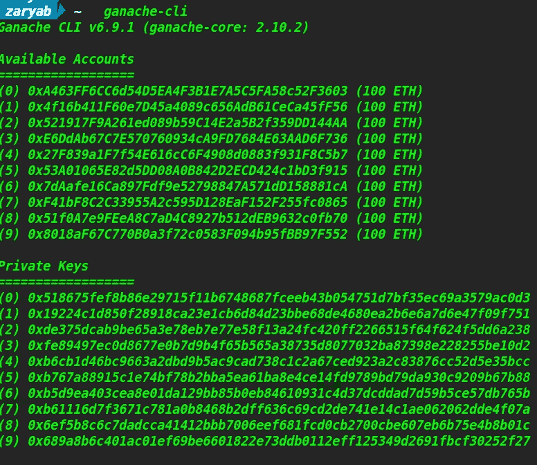***

## ***现在 Ganache 正在监听**端口 8545** 。***

***一旦 Openzeppelin CLI 与 ganache 连接，我们就可以使用以下命令访问这 10 个帐户:***

> *****$ npx 盎司账户*****

***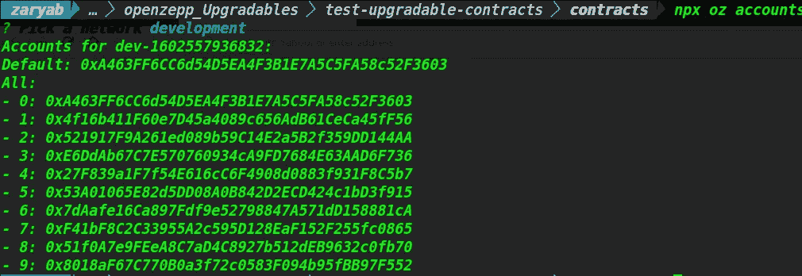***

*****让我们开始部署我们的合同吧。*****

***为了部署计数器契约，请运行以下命令:***

> *****$ npx 盎司部署*****

****这为您提供了几个选项来选择您想要的部署类型。****

***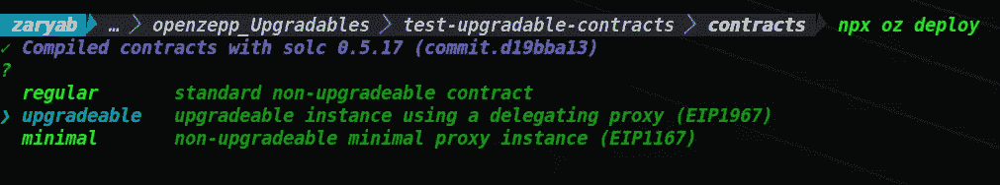***

***因为我们想要一份可升级的合同，所以选择**可升级**选项。***

***选择后，您的合同将被部署到本地区块链。***

***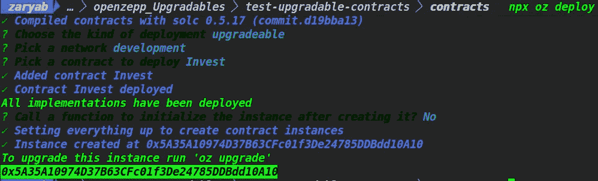***

***该合同现已成功部署。***

> ****合同地址*0x5a 35 a 10974d 37 b 63 CFC 01 F3 de 24785 ddbdd 10 a 10***

***现在让我们与我们的合同进行交互。
Openzeppelin 让我们与合同的互动变得异常简单。***

***事实上，为了简化整个过程，他们把它分成两个必要的部分。***

*   ******发送交易******
*   ******调用特定的组件来检查更新的变更******

> ******注意:*为了与我们的合同进行交互，我们必须确保本地区块链已经在端口 8545 运行*****

*****合同初始状态**
在投资合同之前，我们先检查一下我们的合同初始状态。***

******用户余额******

***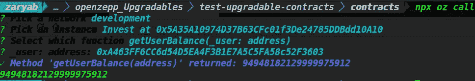***

***我们调用了 **getUserBalance** 函数，**显示用户有 94 ETH。*****

> ***我们的所有 10 个帐户中，我们使用的第一个测试帐户的地址是**0xa 463 ff 6 cc 6d 54 e a4 F3 B1 e 7 a5 C5 fa 58 c 52 f 3603*****

*****合同余额*****

***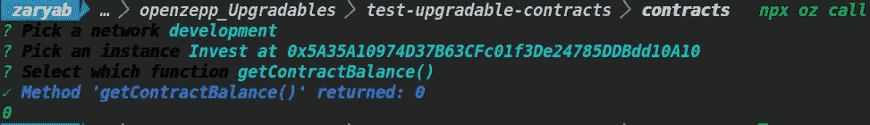***

***由于还没有投资 ETH，**合同余额为 0。*****

***让我们在合同中预付一些定金吧。***

*****发送事务**
为了发送事务，我们需要运行:***

> *****$ npx oz 发送-发送*****

***在我们的例子中，我们有两个主要功能:***

*   ****投资****
*   ****撤回****

***让我们先在合同中投入一些钱。***

*****注意:** *用 Openzepplin CLI 向契约发送 Ether 最初可能看起来有点复杂，但一旦理解就相当简单了。****

***为了在契约中传递一些以太，我们需要运行命令:***

> *****$ npx oz send-tx—value<value>*****
> 
> ***这里的**值**是**尾**中将要转入合同的金额。***

***现在让我们调用 **invest** 函数在契约中存放一些 eth。***

***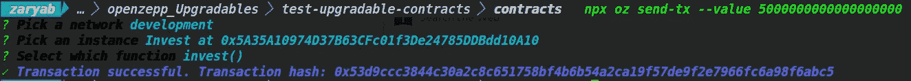***

***于是我们用 ganache 的第一个测试账号调用了 ***50000000000000 魏*** 的意思是 ***5 乙醚*** 。***

***一旦交易成功，我们就会收到交易散列。***

***我们现在可以进一步检查 ETH 是否存在于合同中。***

*****检查合同余额**
为了检查余额，我们只需通过运行以下命令调用 **getContractBalance** 函数:***

> ******$ npx oz 调用******

***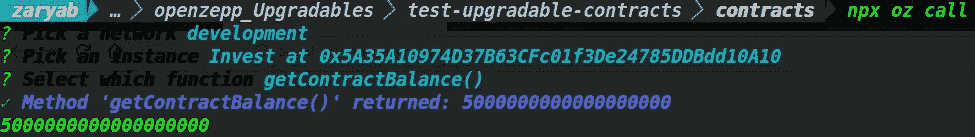***

******这样，我们就有 5 份乙醚存放在契约中。******

***此外，用户余额也应该被扣除。让我们通过调用 **getUserBalance 来检查余额。*****

***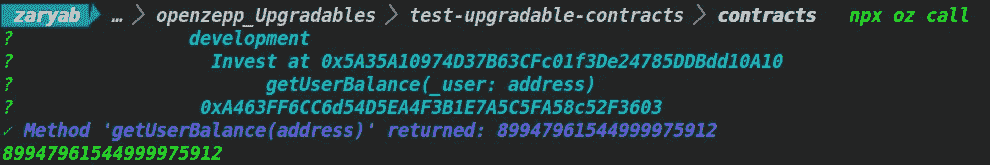***

***现在的余额是 94–5 = 89 ETH。***

*****撤销 ETH*****

***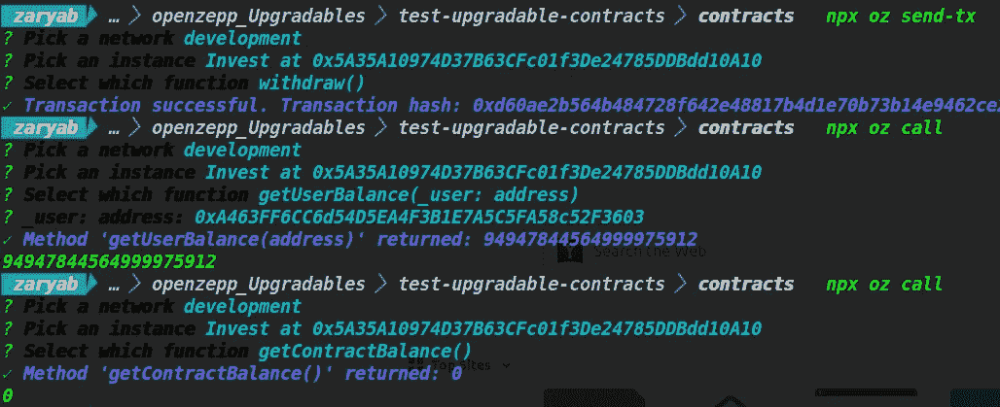***

***我们可以看到，一旦我们调用**取款**函数，*存入的 eth 被发送回用户的地址，合同余额回到 0。****

# ***让我们升级***

***让我们通过修改或添加一些提款功能的规则来升级我们的合同。***

***根据修改后的取款功能， ***用户只能在特定时间段后提取存入的 ETH。******

***让我们相应地修改合同。***

*****修改后的合同*****

```
*pragma solidity ^0.5.0;contract Invest{ mapping (address => uint) public userBalances;
  mapping(address => uint) public lockTime; function invest() public payable{
    userBalances[msg.sender] = msg.value;
    lockTime[msg.sender] = now + 1 weeks;
  }

  function withdraw() public{
    require (now > lockTime[msg.sender], "Deadline is not over yet");
    require (userBalances[msg.sender] != 0, "User Doesn't have any balance");
    address payable rec = msg.sender;
    rec.transfer(userBalances[msg.sender]);
    userBalances[msg.sender] = 0; 
  }

  function getContractBalance() public view returns(uint256){
      return address(this).balance;
  } function  getBalance(address _user) public view returns(uint256){
    return _user.balance;
  }

 }}*
```

> ***注意:上面的代码只是作为一个例子。***
> 
> *****该代码不得用于生产*****

***根据修改后的更改，我们添加了一个名为 **lockTime 的新映射。*****

******该映射存储每个用户地址的截止日期，在该日期之后，用户将能够提取他们的余额。******

***为了升级我们的合同，我们运行以下命令:***

> *****$ npx oz 升级*****

***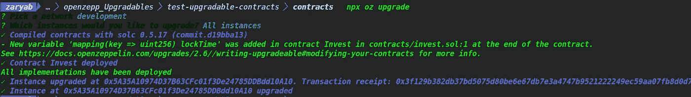***

***我们的合同经过所有必要的更改，现已成功升级。***

***必须注意的最重要的部分之一是, ***契约地址保持不变。******

> ****升级后的合同地址:****0x5a 35 a 10974d 37 b 63 CFC 01 F3 de 24785 ddbdd 10 a 10******

# *****测试升级后的合同*****

***既然合约现在已经成功升级了，那我们就来看看它是否如预期的那样工作。***

*****在合同中存款*****

***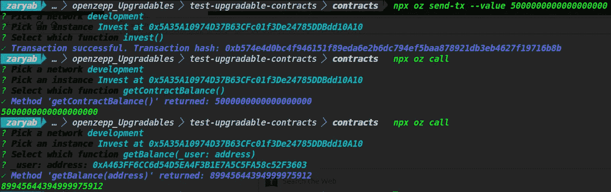***

***一旦交易被正确执行，我们可以看到 5 以太再次按照预期存入合同。***

***现在，让我们试着取出存款。***

*****收回乙醚**
由于我们已经更新了**收回**功能，该功能不会像以前一样工作。***

***根据最新变更， ***存款金额只能在 1 周后提取。******

***因此，让我们检查一下该功能是否已经升级，并且按照我们的预期工作。***

***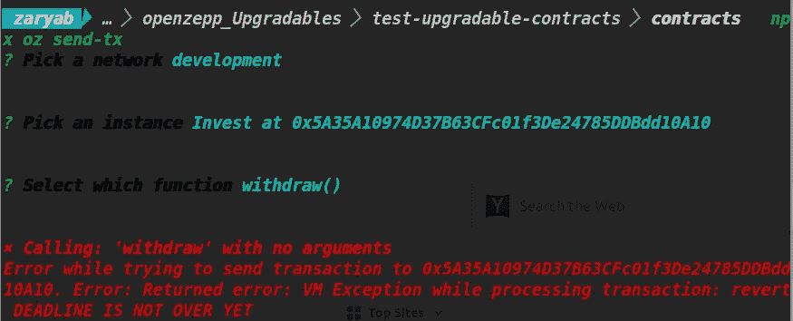***

***一旦我们在**撤回**功能上运行命令 **npx oz send-tx** ，我们发现该功能执行失败(*如预期*)。***

****因此，错误消息* ***“截止日期尚未结束”*** *清楚地表明，我们已经成功地升级了我们的合同，进行了所需的更改，同时有效地保留了先前合同的状态和地址。****

# ***必须注意的必要细节***

***尽管 Openzepplin CLI 简化了编写可升级智能合约的过程，但仍有一些不可忽视的关键细节。***

***虽然这些细节可能看起来是 Openzepplin 工具的局限性，但它们存在的实际原因在于以太坊虚拟机的内部工作机制。***

## ***可升级协定中没有构造函数***

****可升级合同不能有* **构造函数。*****

***然而，由于构造函数至关重要，openzeppelin 可升级工具为我们提供了一个名为 **Initializable** 的基础契约。***

```
**pragma solidity >=0.4.24 <0.7.0;
contract Initializable {
  bool private initialized;
  bool private initializing; modifier initializer() {
    require(initializing || isConstructor() || !initialized, "Contract instance has already been initialized"); bool isTopLevelCall = !initializing;
    if (isTopLevelCall) {
      initializing = true;
      initialized = true;
    } _; if (isTopLevelCall) {
      initializing = false;
    }
  } address self = address(this);
    uint256 cs;
    assembly { cs := extcodesize(self) }
    return cs == 0;
  }
  uint256[50] private ______gap;
}**
```

****可初始化的基契约有效地解决了这个构造函数问题。****

****代替构造函数，我们只需要写一个**初始化**函数，它将作为构造函数(继承 Initializable.sol 契约后的*)。*****

****在部署可升级契约时，Openzepplin CLI 将自动提示我们执行初始化函数。它还允许我们将参数(*如果有的话*)传递给**初始化函数**。****

> ****使用构造函数时，必须确保构造函数只被调用一次。****
> 
> ****因此，在这种情况下,“initializer()”修饰符会处理这个问题。确保构造函数在可升级契约中只被调用一次。****

# ****用值初始化变量****

****虽然 Solidity 允许我们用固定值初始化变量，但在可升级契约中不允许这样的任务。****

****例如:****

```
**pragma solidity ^0.5.0;contract Counter {
    //Such initializations aren't possible in Upgradable contracts.
    uint256 public value = 1000;
 function increase() public {
      value += 1;
    }
}**
```

******解决方案**
然而，对此的一个有效解决方案是初始化契约的 **initialize()函数** ( *构造函数*)内部的值。****

```
**pragma solidity ^0.5.0;import "@openzeppelin/upgrades/contracts/Initializable.sol";contract Counter { uint256 public value; function initialize() initializer public {
       value = 1000;
    } function increase() public {
      value += 1;
    }
}**
```

# ****存储布局至关重要****

****如前所述， ***只有当我们确保两个合同具有相似的存储布局时，合同之间的委托调用才会有效。*******

****因此，可升级合同的一个非常重要的事实是，在升级旧合同时，我们不允许对其存储布局进行任何细微的更改。****

****这仅仅意味着在升级合同时，我们不能删除以前声明的状态变量或改变其类型。****

******如果我们想添加新的状态变量呢？**
根据规则，我们不能在旧的状态变量之前添加新的状态变量。****

****所有新的状态变量必须添加在先前声明的变量之后，以便**存储布局**不受干扰。****

> ****因此，牢记这些必要的细节无疑会帮助我们写出更好、更有效的可升级智能合同。****

# ****关于我自己****

## ****我是谁？🙋🏻‍♂️****

****𝙃𝙞, 𝙄 𝙖𝙢 𝙕𝙖𝙧𝙮𝙖𝙗 👋🏻我是一名精通区块链和智能合同的工程师，我的愿景是用 Web3 去中心化和保护传统 Web。主要从事智能合约工作，在开发和智能合约安全方面都有丰富的经验。****

## ****我做什么🧑🏼‍💻****

*   ****我撰写安全和优化的智能合同****
*   ****我对智能合同进行安全审计，并提高 EVM 连锁店智能合同的整体安全性****
*   ****我撰写和谈论 Web3 和智能合约&为扩展 Web3 的边界贡献我的一份力量。****

## ****打声招呼，保持联系🤝****

****[领英](https://www.linkedin.com/in/zaryab-afser-97085b157/)。| [推特](https://twitter.com/zaryab_eth)。| [Github](https://github.com/zaryab2000) 。| [邀请我参加 Web3 活动](https://zaryab2000.notion.site/Invite-me-to-your-Next-Web3-Event-78bcd204b866426687e1afbcdc61c5c7)****

> ****加入 Coinmonks [电报频道](https://t.me/coincodecap)和 [Youtube 频道](https://www.youtube.com/c/coinmonks/videos)了解加密交易和投资****

# ****另外，阅读****

*   ****[分散交易所](https://coincodecap.com/what-are-decentralized-exchanges) | [比特 FIP](https://coincodecap.com/bitbns-fip) | [Pionex 评论](https://coincodecap.com/pionex-review-exchange-with-crypto-trading-bot)****
*   ****[用信用卡购买密码的 10 个最佳地点](https://coincodecap.com/buy-crypto-with-credit-card)****
*   ****[最好的卡达诺钱包](https://coincodecap.com/best-cardano-wallets) | [冰棒副本交易](https://coincodecap.com/bingbon-copy-trading)****
*   ****[印度最佳 P2P 加密交易所](https://coincodecap.com/p2p-crypto-exchanges-in-india) | [柴犬钱包](https://coincodecap.com/baby-shiba-inu-wallets)****
*   ****[8 大加密联盟项目](https://coincodecap.com/crypto-affiliate-programs) | [eToro vs 比特币基地](https://coincodecap.com/etoro-vs-coinbase)****
*   ****[最佳以太坊钱包](https://coincodecap.com/best-ethereum-wallets) | [电报上的加密货币机器人](https://coincodecap.com/telegram-crypto-bots)****