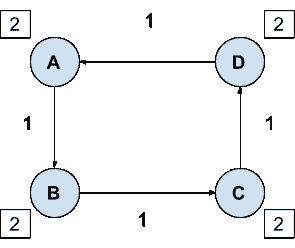
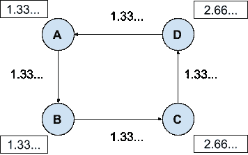

# 理解速度及其对 MoE 令牌动力学的影响

> 原文：<https://medium.com/coinmonks/understanding-velocity-and-its-effects-on-moe-token-dynamics-db57d8b056cf?source=collection_archive---------4----------------------->

## 交易媒介令牌动力学模型的交换方程探讨

Holding behaviour and unicorns — photo by Annie Spratt @anniespratt

## 介绍

在为 OpenZeppelin 做项目时，我对 token dynamics 产生了兴趣。在这次探索中，我发现交换方程(EoE)被广泛用于模拟加密经济环境。

试图重新思考适用于密码经济学的等式，我发现有趣的是，这个概念在许多层面上都有解释，所以它的使用当然受到了广泛的批评。尽管如此，我知道 cryptoasset 估值背后最有影响力的头脑正在使用它，所以我觉得有必要打破它。我首先回顾了反复提到的关于这个主题的文章。

## **维塔利克的改编**

维塔利克写了一些[有趣的概念](https://vitalik.ca/general/2017/10/17/moe.html),关于一种特殊的交换媒介令牌——那些通过在特定网络上强制使用来增加价值的东西。他为 EoE 提供了一个经过修改的形式，使我们更容易理解持有和铸造代币对其价格的影响。Vitalik 使用的公式如下:

MC = TH

其中:

*   M =流通中的硬币数量
*   C =每枚硬币的价格
*   T =每个周期(比如一天)的总交易值
*   H =硬币在用于交易之前的平均持有时间(天数)

为了理解这个等式，我们可以观察到它陈述了这样一个事实，即在一个经济体中进行的交易的价值等于进行这些交易所花费的硬币的价值。例如，假设 H = 3 天，T = 5.000 美元/天，您将需要 15.000 的总市值来满足该经济的需求和行为。这种等价的简单性隐藏了我们可以围绕它展开的许多层分析。

Vitalik 指出了持有期 H 的重要性，并提到了在用户没有持有令牌的动机的情况下，无摩擦的交换会如何加速令牌的消亡。我意识到清楚地理解速度的概念对于在 EoE 之上建立模型是必要的。

## **EoE 估价申请**

第一篇被广泛引用的描述使用 EoE(以其传统形式，MV = PQ)的代币估值模型的文章是[克里斯·伯恩斯克](https://medium.com/u/2a8f9285c9aa?source=post_page-----db57d8b056cf--------------------------------)的[加密资产估值](/@cburniske/cryptoasset-valuations-ac83479ffca7)。Chris 明确表示，这个模型不是为了计算代币的价格，因为我们需要更多地了解密码经济学，而市场没有足够的效率来对模型做出反应。

他描述了一个虚构的网络，其中带宽以确定的价格出售。在他对 EoE 的解释中,“PQ”一词代表该经济体的 GDP，只有与购买带宽相对应的交易才占“Q”。交易所之间发生的交易不应考虑在内(因为这些交易不会增加 GDP)。

然后是速度。克里斯认识到这是整个模型最重要的假设，并选择 20 的 **V** 作为浮动代币(在债券人和霍德勒之后)，以比特币的速度为基准，并根据他对比特币用户概况的研究进行调整。

## **支付的 EoE 多市场经济**

在交易媒介令牌驱动销售不同种类商品和服务的开放 p2p 网络的情况下，可能很难确定“有助于国内生产总值的交易”与任何其他交易之间的区别。例如，用法定货币购买代币可以代表网络中的交易，该交易说明了法定货币的购买。这里的要点是，很难区分那些对 GDP 有贡献的交易和那些只是在交易所之间流通硬币的交易。原则上，两个用户之间的每笔交易都可以在 P.Q 和 **V** 的演算上考虑。

Michael Zochowski [将用于代币评估的 EoE](/logos-network/cryptoasset-valuation-1-improving-the-equation-of-exchange-model-6525aa748d28) 概念扩展到支付代币，从而可以满足多个市场的需求。在[后来的文章](/logos-network/cryptoasset-valuation-2-the-velocity-problem-8bbb4111c9c7)中，他提供了一些关于速度的见解，其中我强调了“营运资本最小化”的概念，以及速度的主要驱动力是消费者习惯。我相信理解速度的关键就在这里:根据用户的持有行为来识别用户配置文件，并定量预测每个配置文件的行为。我所指的持有行为不仅是将硬币作为价值储存手段，也是指用户拥有的硬币平均价值与用户购买商品和服务的交易额之间的关系。

## **从行为角度看速度**

我的解释是，速度作为其他变量的粘合剂，整合了所有影响动态的行为经济学的复杂概念，因此 EoE 有效。速度代表激励，并最终代表硬币作为产品的价值，与代表硬币所针对的市场价值的 **P.Q** 相反，在许多代币(特别是支付代币)的情况下，即使硬币访问它的实现很普通，它也会存在。尽管我们可以计算现有网络的速度，并将其定义为 **V=PQ/M** ，但这样做会引发公式的同义反复，并对我们隐藏一些有趣的见解。

假设存在一个市场，我们希望建立一个加密资产作为交易媒介来提供对它的访问，硬币的价格受供求关系的影响。假设供给是固定的，PQ 是固定的(我们的代币正在与其他交换媒介竞争)。查看 EoE，我们可以推断出令牌的价格完全取决于 V。因此 V 提供了这种“需求”的表示。一个巩固购买欲望和拥有欲望的术语。是什么产生了这种购买和购物的欲望？

*   预期象征性价格升值(投资者/投机者)。
*   预期稳定性+实际效用(消费者)。
*   交换资产的摩擦(经济、操作和认知)。

## **集中应用中的速度**

理解支付令牌的速度的一种方法是对其他网络中的用户行为进行基准测试，在这些网络中，钱必须被“加载”到卡/应用程序/钱包中，才能访问该网络的功能。

举个例子，我观察了阿根廷的公交卡。一种可以在任何火车或地铁站充电的塑料，必须用于支付交通费。我平均每天使用 4 次交通工具，花费 20 比索，我通常用大约 400 比索支付我的钱包，相当于 20 次旅行，平均相当于 5 天。所以我每周给我的卡充值一次。我实际上没有计算这个，只是觉得这是一个合适的金额，基于我需要为卡充电的时间量，丢失它的概率和如果我这样做了，应该为找回信用所做的努力，当我需要它时没有钱充电的后果，我在卡中持有的钱的机会成本(利率)，可能还有其他一些无意识的因素。

当一项从我的手机上用 NFC 为卡充电的服务推出后，无需排队等待充值，我账户上的平均充电次数下降了(减少摩擦→减少平均握持量→增加速度)。

另一个例子是，阿根廷主要的类似亚马逊的市场开始提供钱包服务，在许多商店里可以存放比索并通过二维码消费。他们增加了一种机制，通过这种机制，钱包里的钱以类似于阿根廷通胀的利率投资于一只基金(这里已经很有趣了)。这为钱包中的硬币(阿根廷比索)提供了某种“稳定性”,增加了平均余额并降低了速度。

在这两个例子中，钱包中使用的货币是阿根廷比索，我们很确定它不会很快升值。但对于加密经济环境，投机成分在速度中起着至关重要的作用。

## **速度能好吗？**

我想这取决于我们对 EoE 的解释。如果我们坚持我的方法，认为 **V** 是影响硬币需求和持有欲望行为的外部因素的结果，更高的速度只会损害代币的价值，但可能有利于整体经济，或创造代币的公司。

[Madhumitha Harishankar](https://medium.com/u/11bcad2e5d16?source=post_page-----db57d8b056cf--------------------------------) 在这篇文章[中](https://hackernoon.com/token-velocity-is-good-and-other-implications-of-analyzing-mv-pq-from-first-principles-v81y43ztt)做了一件很好的工作。她认识到公式的局限性，并开发了一个适应加密环境的方法。顾名思义，她挑战了速度不利于象征性价值的普遍观念。

> “……交换等式意味着，对于给定的硬币供应量和服务价格水平，更高的令牌速度会产生更高的网络 GDP，并可能增加硬币价值。”

当分析一个国家的经济时，我们可能会同意，其硬币的持有行为可以通过印刷货币来改变。通货膨胀刺激消费，因为人们预计未来价格会上涨，不想持有贬值的资产。这是政府用来增加 GDP 和创造增长的一种众所周知的策略，我认为这种策略之所以有效，只是因为很大一部分人没有工具或知识来转移到其他金融资产，以保持他们的购买力。在加密资产经济中，我们将不得不问自己，我们正在分析的网络是否会对这种行为做出反应。

最终，为了理解每个参数的影响并回答诸如此类的问题，我们应该独立地分析引起每个变量扰动的外生因素。那么，当我们问“速度好吗？”我们必须同意我们正在谈论这些因素的影响。这同样适用于 EoE 中的所有其他参数。

## **投射速度**

如果我们想对任何网络中的预期速度进行深入分析，我们应该定义用户简档，并分别研究他们的预期行为。就速度而言，影响用户行为的外部因素的非穷尽列表可以从以下因素开始:

*   交易费用的变化。
*   推出更好的交易应用。
*   实现为价值提供稳定性的机制。
*   关于监管的新闻。
*   硬币的宣传/营销(预期价格上涨)。
*   引入改变购买频率的新产品。
*   宏观经济背景(硬币的获取能力)。
*   替代投资条件的修改(利率、摩擦等)。
*   推出新的公用事业，其中赌注硬币是有用的。
*   投票期间的开始/结束，投票时需要下注。

用户概况将取决于每个网络，并且可以根据他们购买的商品、用户的技术技能、他们的购买习惯、他们的购买能力等来定义。其中我们会有“霍德勒”剖面，预期速度为 0。

我相信，可以开发一个整合了这些变量的模型来估计用户的持有行为，从而估计速度。

## 速度外源扰动的影响

Madhumita 分析了一个关于持有行为扰动的有趣场景:投机者在交易所抛售硬币，因为他们不再认为硬币有价值。

> “如果我们担心是否会有一个客户市场，他们愿意在交易所使用这些新的硬币供应来利用公司的服务，那么交易所的等式对此无能为力。当由于霍德勒倾销而导致瞬时硬币供应量突然增加时，如果这个尚未开发的市场不存在，硬币的汇率很可能会下降。这不是速度所能捕捉到的。交换方程不能描述自发的供求动态，对于这种分析来说，它是一个过于静态的模型。”

尽管 EoE 无法告诉我们是否存在愿意购买这些倾销硬币的市场，但我相信，如果我们根据用户的“持有概况”来观察速度，EoE 可以提供关于多市场经济中这种动态的有用信息。为了解释我的解释，让我们研究一个简单的经济模型，这个模型是由一个完全由供给和需求决定价值的代币驱动的。

假设一个稳定的经济模型在平衡状态之间转换。在我们的经济中，4 个参与者(A、B、C、D)用商品和服务交换代币。交易费用是不存在的，这不一定是一个加密经济网络。

使用 Madhumita 公式，其中 **α** =代币供应量， **β** =以美元表示的代币价格，我们设置 **α** =8， **P** =1， **Q** =4， **V** =0，5。因此， **β** =1。 **Q** 和 **V** 是受一段时间 **t** 影响的变量。我们将“持有概况”定义为用户在同一时期内交易的金额超过用户拥有的平均金额。

下图用箭头显示了参与者之间的硬币交易以及每个参与者在期初的硬币余额。在[这个文件](https://docs.google.com/spreadsheets/d/1RcG2X3ttJGZgK_uhPGuhE-RfaiUPWHSj_65Zh1e-eN8/edit?usp=sharing)中，你可以看到每个时期的计算结果，并下载它来处理不同场景的变量。

在周期 **t1** 中，每个参与者花费一枚硬币，每枚价值 1 美元，总共交易 4 件产品。每个用户在下一个时期都可以拿回一枚硬币来消费，所以我们有一个稳定的均衡。在这个例子中，每个演员平均拥有 2 枚硬币。我们可以观察到，总硬币中有 4 枚在每个期间交易了一次，另外 4 枚没有交易，因此“每个期间每枚硬币的平均交易次数”为 0，5。这个稳定的平衡允许价值 4 美元的交易。

现在，对于期间 **t2** ，考虑修改 A 和 B 的持有情况，当经济中的商品需求量及其美元价格不受影响时(保持每周 4 个单位，每个单位 1 美元)，他们不希望再在钱包中持有他们的“静态”硬币。如果 C 和 D 不愿意吸收这些硬币，并将其作为“静态”硬币持有(换句话说，他们不愿意改变他们的持有状况)，价格 **β** 将开始下降，直到它符合需求。现在，这个经济体中的每个用户都需要更多的硬币来购买等量的商品。因此，如果 C 和 D 希望维持他们的持有配置，他们最终将需要从 A 和 b 购买硬币。 **EoE 有助于解释如何调整价格，以支持新的持有配置的经济。**

具有新控股概况的生态系统的稳定模型变成:

变量处于平衡状态:

**α** =8， **P** =1， **Q** =4， **V** =0，66…， **β** =0.75

这个基本示例允许我们理解基于持有概况对代币价格的影响，这可以根据现实生活中的事实来建模。如果我们进一步探索这些动态，EoE 可以为代币交易媒介经济学的建模提供一些启示，并可能作为预测上述外部因素对代币价格和 GDP 的影响的工具。

## **支付渠道对速度的影响**

支付渠道会双向影响流通速度:减少频繁交易的摩擦和成本会刺激人们增加支出、减少持有。这种激励的一部分通过 **P.Q.** 的增加得到补偿(我们不认为这是 V 的外部扰动)，另一部分也会对持有行为产生影响，因为用户可能会减少他们对“备份”令牌的需求。有趣的是，将代币绑定到开放渠道的要求以及随后关闭渠道的成本(经济成本、运营成本和认知成本)降低了放弃代币的动机，减少了可用于交易的流动性硬币的数量，从而降低了流通速度。

考虑到我对速度的解释是描述用户购买需求和 hodl 硬币的行为的术语，很明显支付渠道今天的工作方式导致了速度的降低。

## **结论**

*   EoE 可能会有不同的解释，行业定义并同意公式中每个参数的计算标准可能会有所帮助。
*   我们可以开发一个模型，允许对交易和速度进行正确的分类和量化。
*   如果我们以伪实时自动的方式实现这一点，我们实际上可以设计为加密经济环境的本地令牌的值提供稳定性的机制。
*   为交易媒介代币设计代币机制时，应考虑速度，并根据用户及其行为的预期持有情况进行考虑。这种行为可以表示为，对于每种持有情况，硬币所拥有的平均价值超过行业中销售的产品的平均价值。
*   当试图在设计阶段预测网络的速度时，我们可以用具有类似功能的其他硬币作为速度基准。我们在使用比特币作为基准时必须小心，因为它被定位为一种独特的优质价值货币储存手段，刺激了特定的持有行为，而这些行为无法准确预测到小额货币。也许在我们的目标市场缺乏现有比特币的情况下，分析比特币用户不同持有情况的行为可以达到目的。

> [在您的收件箱中直接获得最佳软件交易](https://coincodecap.com/?utm_source=coinmonks)

