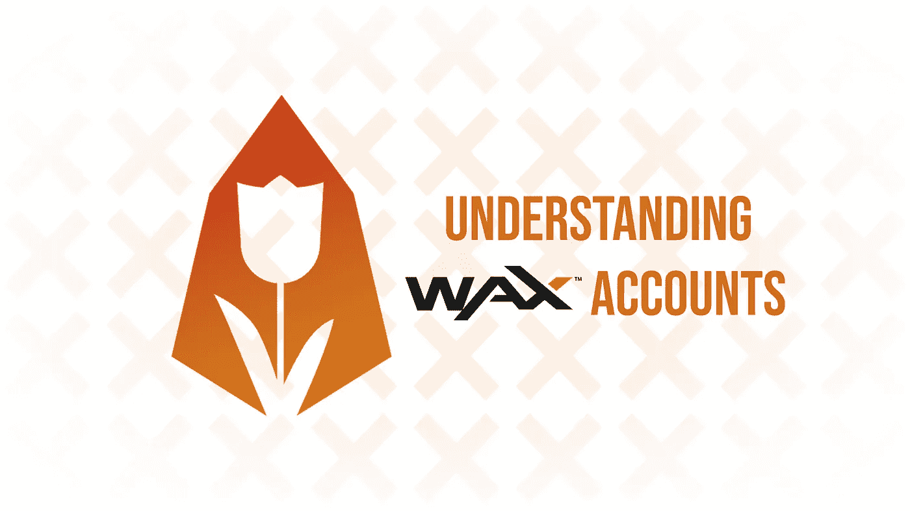
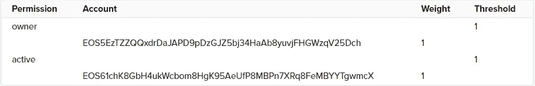
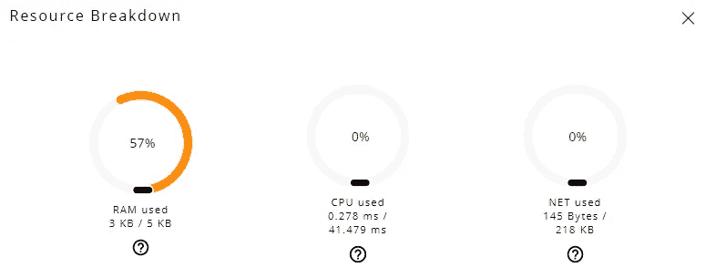
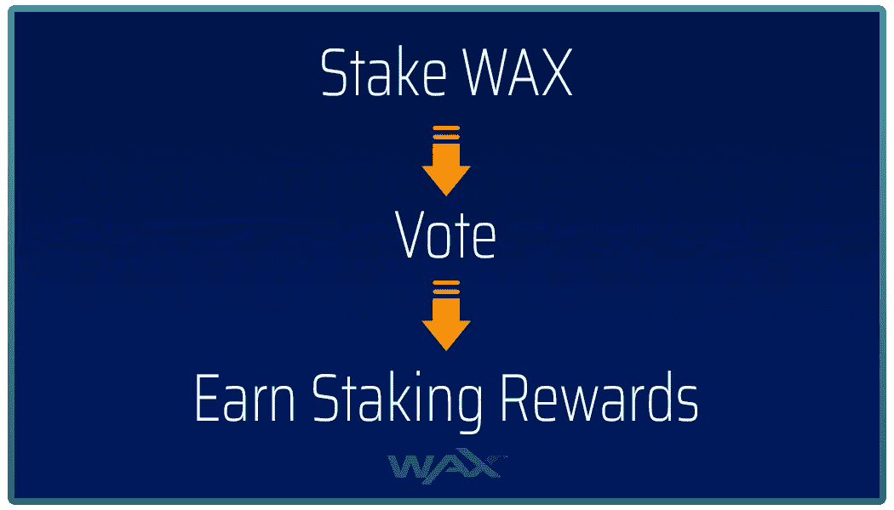
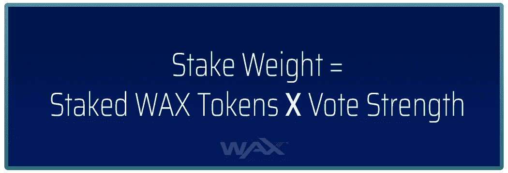
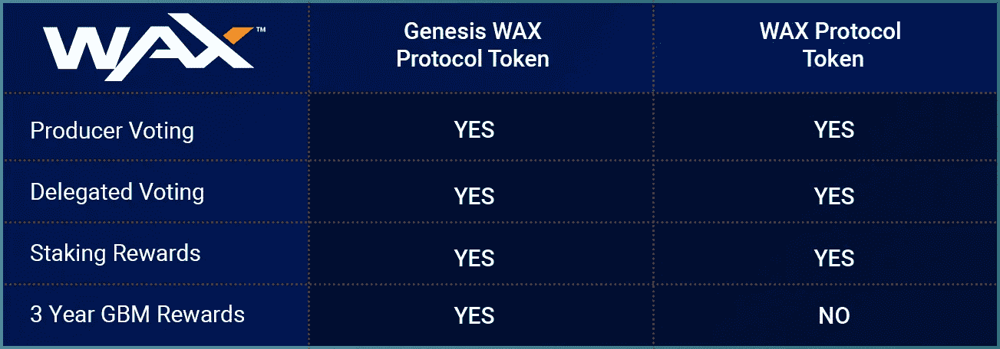
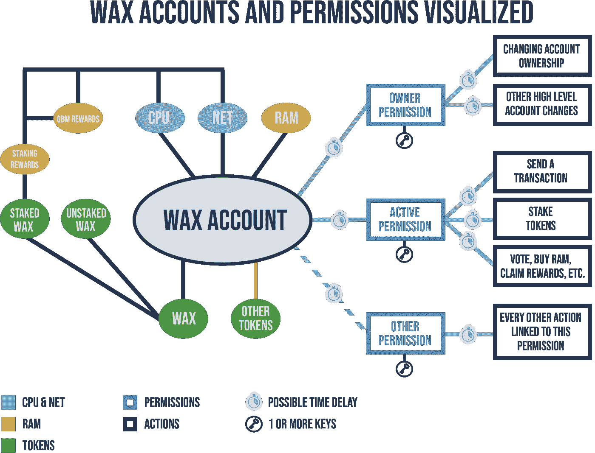

# 了解蜡像账户

> 原文：<https://medium.com/coinmonks/understanding-wax-accounts-db56d6091f3f?source=collection_archive---------0----------------------->

WAX 帐户的功能与 EOS 帐户非常相似，但它们有一些关键的区别和附加功能。在这篇文章中，我们将解释一切，从默认蜡帐户的帐户结构，到你可以(可能)获得的奖励。最后，我们还会为您提供各种有用的资源。

# 不同种类的蜡账户

蜡账户有两种，分别是默认蜡账户和蜡云钱包账户。默认帐户是非常通用和可定制的，并允许您使用您的蜡帐户的全部潜力。但是对于普通用户来说，它们很难理解和使用。蜡云钱包帐户更容易使用和理解，但与默认帐户相比，功能更有限。不过，它非常适合日常使用，可以使用主流社交媒体账户访问，而不是(令人困惑的)键盘配对。在这篇文章中，我们将解释默认蜡帐户。如果您想了解更多关于蜡云钱包帐户的信息，我们在此编写了一份全面的指南[。](/@eos_amsterdam/the-complete-guide-to-the-wax-cloud-wallet-f14f95788012)

# 账户结构

让我们从一个默认的 WAX 帐户的结构开始。每个用户在蜡像区块链上都有一个或多个账户。WAX 账户是存储在区块链上的人类可读标识符，它们需要将任何(有效)交易推送到或转移到 WAX 区块链。根据权限配置，这些帐户也可以由多人拥有。

WAX 帐户长度为 12 个字符，可以包含字母 a-z 和数字 1-5，或者更短，以结尾。waa(或者。wam 为蜡云钱包账户)。这些帐户名称取代了大多数加密货币中使用的又长又笨拙的钱包地址。

再者，每个蜡像账号都有权限。许可可以被看作是为了使事务通过而需要满足的要求。默认情况下，WAX 帐户有两个本机权限:

*   *所有者*:显示账户的所有权，需要对账户的所有权进行任何更改。这个许可的密钥最好(安全地)离线保存，因为他们不需要在 WAX 网络上做大多数事情。
*   *活动*:用于转账、制作人投票、申领奖励等高级账户变更。

除了这两个本地权限之外，您还可以创建新的自定义权限来满足您的需求。

每个权限都有一个或多个与之关联的密钥和/或帐户名。与权限相关联的每个键或帐户名都有某个**权重**，并且每个权限都有某个权重**阈值**，在接受要求该权限的交易之前需要满足该阈值。

Visualization of a default permissions structure. (Source: [EOSIO Developer Portal](https://developers.eos.io/eosio-nodeos/docs/accounts-and-permissions#section-__-multisig-account-authorities-__))

为了帮助你理解所有这些信息，我们包括了上面的图片，它可视化了一个默认的 WAX 帐户的权限结构。如您所见，*所有者*权限的默认**阈值**为 1，并且有一个键的**权重**为 1。这同样适用于*活动*权限，其默认**阈值**为 1，1 个键的**权重**为 1。
这意味着仅需要与*所有者*或*激活*权限相关联的(私有)密钥来执行任何需要*所有者*或*激活*权限的交易。

# 帐户资源

现在，您已经熟悉了 WAX 帐户的结构，是时候了解帐户资源了。每个蜡像账号有 3 个资源: **CPU** 、 **NET** 和 **RAM** ，它们都允许用户做不同的事情。我们将在下面使用 EOS Asia 的[比喻来单独解释每种资源。](/@eosasia/what-is-cpu-what-is-ram-and-how-does-the-eos-blockchain-utilize-these-resources-a7a52e158652)

How resources in a WAX account (can) look

> *如果蜡区块链是一列火车，****CPU*******RAM*******网*** *可以这样解释:***
> 
> *****净*** *将是离开和进入区块链的每列火车的可用座位。你的椅子将永远被保留，如果你需要它，它将是你的。但是，如果火车上没有人，你可以跨过一堆椅子，因为它们是免费的！所以网络是一种确保火车离开时你有地方坐的方式。***
> 
> *****CPU*** *是你可以乘坐火车的频率，就分配而言，它的工作方式很像网络。你可能有一张火车票，但是当然这张票只在特定的日子和时间有效。***
> 
> ***现在，WAX train 相当悠闲，所以任何未使用的空间都可以免费使用 re:****CPU****和 N****ET****，直到为空间付费的人需要使用空间。***
> 
> *****CPU*** *和****NET****是联合资源，合起来称为* ***带宽*** *。***
> 
> *****RAM*** *是你在火车上的储物空间。如果你需要带一吨行李，你需要按包付费，把你的包托运上火车。如果你不需要带很多行李，你可以把你的储物空间卖给火车上的其他人。***

****CPU** 和 **NET** 可以通过 staking WAX 获得，本质上是把你的代币锁定一段时间，本质上是让交易免费..当用户想要移动他们的蜡时，他们可以拆下他们的令牌。 **RAM** 不能通过赌注获得，而是可以买卖，用于存放其他代币等。**

**一个默认的 WAX 账户(由 WAX 团队创建)已经有 1 个 WAX staked 给 **CPU** ，1 个 WAX staked 给 **NET** ，还有少量的 **RAM** 。**

# **帐户奖励**

**蜡像奖励是蜡像账户的另一个方面。有两种主要的方式，人们可以用蜡帐户赚取奖励，这两种方式都将在下面解释。不过，奖励不会自动添加到账户中。相反，账户持有人可以每 24 小时领取一次奖励。**

## **赌注奖励**

**第一种蜡奖励是下注奖励，可以通过下注你的代币并投票给至少 16 个公会或代理人来获得，这意味着鼓励代币持有者成为积极参与的选民。**

****

**Staking rewards (Source: [WAX blog](https://wax.io/blog/earn-more-wax-introducing-wax-block-rewards-staking-and-voting-guilds-and-more))**

**每天都会留出固定数量的蜡币作为打蜡奖励。每个代币持有者每天收到的代币数量取决于他们相对于其他赌注者的当前**赌注重量**。例如，如果在任何给定的一天，您的赌注重量达到总赌注重量的 0.5%，您将获得蜡赌注奖励金额的 0.5%。**

****

**Calculating the stake weight (Source: [WAX blog](https://wax.io/blog/earn-more-wax-introducing-wax-block-rewards-staking-and-voting-guilds-and-more))**

**你的**股权重量**可以用上面的公式计算。这是您当前下注的代币数量乘以您的**投票强度**。您的**投票强度**是一个介于 0 和 1 之间的数字，1 代表全部投票强度。如果您每周投票，您将保持最高的投票强度。如果你不每周投票，你的投票力量会慢慢衰减。您的股份权重将为 0，直到您投票(第一次)，此时它将增加到 1。**

**下注奖励在申领后会自动为 [CPU 和](https://wax.io/blog/what-is-net-cpu-and-ram-on-the-wax-blockchain)NET 各下注 50/50，并计为 **Genesis WAX 协议令牌**，我们将在下面进行解释。**

## **创世纪街区会员(GBM)奖励**

**第二种 WAX 奖励是 Genesis Block Member (GBM)奖励，旨在鼓励公民参与并奖励长期的 WAX 社区成员。**

**GBM 奖励可通过 Genesis WAX 协议代币获得，可通过以下两种方式获得:**

*   **获得创世纪蜡令牌的第一个方法是在令牌交换期间。如果您在代币交换期间持有自己的代币，并且自己进行了代币交换(并且还没有取消这些代币的标记)，则您拥有的 Genesis WAX 代币的数量等于您在代币交换期间交换的代币的数量。然而，进行互换已经不可能了。**
*   **获得创世纪蜡令牌的第二种方式是赌注奖励。如上所述，下注奖励在申领后会自动为 [CPU 和](https://wax.io/blog/what-is-net-cpu-and-ram-on-the-wax-blockchain)NET 各下注 50/50，并算作 Genesis WAX 代币。**这是这时候获得新的创世纪蜡令牌的唯一方法。****

****

**Genesis WAX tokens compared to regular WAX tokens (Source: [WAX blog](https://wax.io/blog/introducing-the-genesis-block-member-program-join-and-receive-daily-token-rewards-for-3-years))**

**创世纪蜡令牌等同于普通蜡令牌，唯一不同的是普通蜡令牌不赚取 GBM 奖励。一旦一个创世纪蜡像被取消标记，它将永久成为一个普通蜡像，这意味着它再也不能成为创世纪蜡像(也意味着它再也不能获得 GBM 奖励)。**

**每个标桩的创世纪蜡像将在 3 年内产生一个常规蜡像，这意味着一个创世纪蜡像每天将产生常规蜡像的 1/1096 部分，持续 1096 天。生产的代币被称为 GBM 奖励，并且是常规的、液体的、蜡制代币。**

# **把所有的放在一起**

**现在你了解了蜡像账户的主要方面，是时候把所有的东西放在一起了，为了理解所有这些方面如何一起工作，以使蜡像账户工作。我们创造了一幅图像，展示了所有这些不同方面之间的关系。**

****

**WAX accounts and permissions visualized**

**在上图中，您可以看到帐户结构如何与帐户资源相关联。浅蓝色的线表示需要 **CPU** & **NET** 来执行任何需要该权限的操作，而红线表示需要 **RAM** 来保存其他令牌。这应该会让你对蜡像账户的运作有一个坚实的理解。**

# **有用的资源**

**在本文的最后一部分，我们列出了各种有用的文章，让你对 WAX 账户及其功能有更深的了解。**

*   **[蜡云钱包完全指南](/@eos_amsterdam/the-complete-guide-to-wax-cloud-wallets-f14f95788012)**
*   **[如何:创建免费的 WAX 区块链账户](https://wax.io/blog/how-to-create-a-wax-blockchain-account)**
*   **[如何创建新的 WAX 账户](/@eos_amsterdam/how-to-create-a-new-wax-account-7a23cf315ac0)(使用现有账户)**
*   **[如何使用您的蜡账户](/@eos_amsterdam/how-to-use-your-wax-account-f7cf7744b257)**
*   **[蜡像奖励:它们如何工作以及如何得到它们](/@eos_amsterdam/wax-rewards-how-they-work-and-how-to-get-them-923a1c3ec9db)**
*   **[WAX 区块链上的 NET、CPU、RAM 是什么？](https://wax.io/blog/what-is-net-cpu-and-ram-on-the-wax-blockchain)**
*   **[高级蜡权限](/@eos_amsterdam/advanced-wax-permissions-b0743f80104a)**
*   **[WAX 上的多重签名账户:它们是如何工作的？](/@eos_amsterdam/multisignature-accounts-on-wax-how-do-they-work-efa864abd0ae)**
*   **[在蜡上下注和投票:一个技术性的深入研究](https://wax.io/blog/staking-and-voting-on-wax-a-technical-deep-dive)**

## **关于我们**

**EOS mainnet 的基础模块生产商。BOS mainnet 的块生成器。活跃的顶级蜡公会。欧洲连锁姐妹连锁店的合作伙伴。区块链项目的投资者。治理、跨文化合作和安全专家。你可以在这里找到我们:
EOS and Europechain Block 出品方名称:eosamsterdam
BOS Block 出品方名称:amsterdambos
WAX 公会名称:amsterdamwax
[网站](https://eosamsterdam.net/?source=post_page---------------------------) | [Twitter](https://twitter.com/eosamsterdam?source=post_page---------------------------) | [电报](https://t.me/EOS_Amsterdam?source=post_page---------------------------) | [微信](https://eosamsterdam.net/wp-content/uploads/image/x-png/medium.png?source=post_page---------------------------)**

***由*写成[写成*Yannick Slenter*](https://www.linkedin.com/in/yannick-slenter/)*为*[*EOS Amsterdam*](https://eosamsterdam.net/)**

> **[直接在您的收件箱中获得最佳软件交易](https://coincodecap.com/?utm_source=coinmonks)**

****