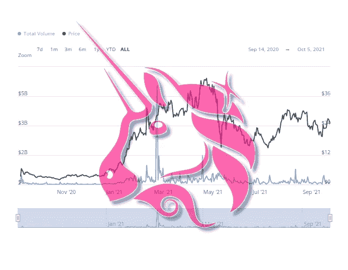

# UNI WAP(UNI):链上数据

> 原文：<https://medium.com/coinmonks/uni-on-chain-data-2cb7330e72e8?source=collection_archive---------21----------------------->

## Uniswap 联机数据的弱点和矛盾。

Original image from Baro Virtual

# 所有交易所保留

2020 年 11 月，我们固定了所有加密货币交易所的最低 UNI 准备金；后来我们看到了一个疯狂的代币增长，一直持续到 2021 年 5 月。如你所知，硬币储备水平越低，对资产的上升趋势越有利。需要注意的是…