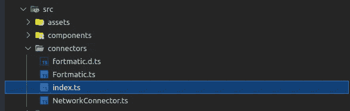
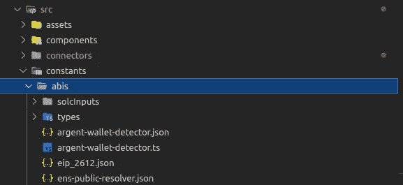
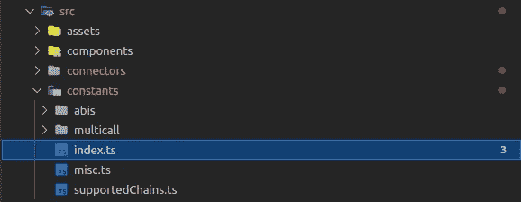
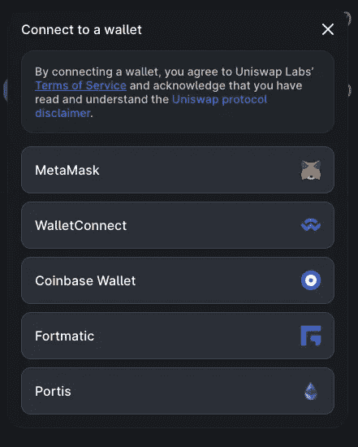

# Uniswap Fork:带有 React 挂钩和 Redux 的 Web3

> 原文：<https://medium.com/coinmonks/uniswap-fork-web3-with-react-hooks-and-redux-ed407abffbc8?source=collection_archive---------4----------------------->

本文将演示如何使用 react 钩子来评估/提交事务并从区块链中获取事件。我发现了许多可以遵循的实践，但是我发现的最好的一个是在 Defi 项目中。Defi 项目需要创建复杂的组件来管理矿池、获取用户数据以及高效地提交事务。有时，您的 React 组件可能需要等待区块链事务来确认。在一些费用较低的情况下可能需要一天以上的时间。这就是为什么我克隆了 Uniswap [存储库](https://github.com/Uniswap/uniswap-interface)，并学习了它们的组件如何与多个事务交互。监听事务状态并更新组件。

# 议程

*   连接到钱包。
*   挂钩来评估/读取区块链中的值。
*   钩子提交交易。
*   事件侦听器获取触发的区块链事件，并将它们分派到您的 react 状态。

我将为每一部分提到来自 [Uniswap Interface](https://github.com/Uniswap/uniswap-interface) 资源库的相关代码。

# 将您的 React 应用程序连接到外部钱包

我将从 MetaMask 钱包开始，它将支持多个网络，如 mainnet、Rinkeby、Ropsten、Goerli、Kovan、币安和 localhost。

然后，我将只为 Mainnet 网络添加 Fortmatic、WalletConnect、WalletLinkm Portis 钱包。



`The final output should look like that`

为了注入钱包，我将使用`@web3-react/injected-connector`

```
yarn add @web3-react/injected-connector
```

添加支持的链 Id:

```
const SUPPORTED_CHAIN_IDS = [1, 4, 3, 42, 5, 56, 97, 1337]
```

## 连接到 MetaMask Wallet

导入`InjectedConnector`并将支持的 chainId 作为参数传递

```
import { InjectedConnector } from '@web3-react/injected-connector'const SUPPORTED_CHAIN_IDS = [1, 4, 3, 42, 5, 56, 97, 1337]const injected = new InjectedConnector({ supportedChainIds: SUPPORTED_CHAIN_IDS})
```

## 连接到其他钱包

其他钱包将只支持 mainnet。(chainId 为 1 的 mainnet)

从`web3-react`包中导入连接器

```
import { WalletConnectConnector } from '@web3-react/walletconnect-connector'import { WalletLinkConnector } from '@web3-react/walletlink-connector'import { PortisConnector } from '@web3-react/portis-connector'import { FortmaticConnector } from './Fortmatic' 
/* You can check Fortmatic configuration here */
```

初始化连接器

```
// mainnet only
export const fortmatic = new FortmaticConnector({
   apiKey: FORMATIC_KEY ?? '',
   chainId: 1
})// mainnet only
export const portis = new PortisConnector({
   dAppId: PORTIS_ID ?? '',
   networks: [1]
})// mainnet only
export const walletlink = new WalletLinkConnector({
   url: NETWORK_URLS[1],
   appName: <Replace me with app name>,
   appLogoUrl: <Replace me with app logo url>
})
```

WalletConnect 与其他钱包有些不同

```
export const walletconnect = new WalletConnectConnector({ supportedChainIds: SUPPORTED_CHAIN_IDS, bridge: <Replace me with WALLETCONNECT_BRIDGE_URL>, qrcode: true, pollingInterval: 15000})
```

假设您想了解更多有关钱包连接的信息。我推荐这个文档[系列](https://github.com/NoahZinsmeister/web3-react/tree/d0b038c748a42ec85641a307e6c588546d86afc2/docs) s。你可以在 [uniswap-interface 连接器目录](https://github.com/Uniswap/uniswap-interface/tree/main/src/connectors)中找到连接器的完整模块。

# 导入工件

为了调用我的智能合同，我需要导入 ABI 和地址。



Uniswap 添加内部的所有地址。`index.ts`



我使用 [hardhat](https://hardhat.org/) 和 [alchemy](https://www.alchemy.com/) 进行智能合约部署。所以我不使用`ABIs`而是使用工件(abi +契约地址)。为了导入你的合同，我使用了`useContract`钩子。可以查看它的[实现](https://github.com/Uniswap/uniswap-interface/blob/main/src/hooks/useContract.ts#L42)。在连接到外部钱包并导入智能合约构件之后，我们就可以创建用于提交/评估交易的区块链服务了。

# 区块链服务

在`src/services`，我将创建一个`Blockchain/`目录。这一部分不同于 Uniswap 存储库，因为我更喜欢创建一个额外的层来提交和读取事务。更灵活的做法是，在不修改大量代码的情况下，尽可能多地修改您的提供程序。

## 评估交易

评估交易是一项简单的任务，因为您不需要使用提供者进行签名或连接到钱包。因为我使用的是 Typescript，所以添加数据类型是非常必要的。

```
import { Contract } from '[@ethersproject/contracts](http://twitter.com/ethersproject/contracts)'
import { BigNumber } from 'ethers'
```

然后评估事务服务是可重用的。它将协定对象、方法名和一组参数作为参数。

```
export async function evaluateTransaction(
    contract: Contract | null,
    methodName: string,
    args: Array<string | number | BigNumber>
 ): Promise<any> {
  try {
    const methods = await contract?.callStatic
    const bcValues = await methods?.[methodName](...args)
    return bcValues
  } catch (e) {
     console.log(e)
     return e
  }
 }
```

现在，我准备创建第一个钩子来获取一个地址的 ERC20 余额。

导入我想与之交互的`evaluateTransaction`服务和合同

```
import { evaluateTransaction } from 'services/Blockchain/evaluateTransaction'
import { useERC20Token } from './useContract'
```

为了使钩子尽可能地可用，并在任何事件动作中使用它们，我将使用`useCallback`钩子(通过触发事件提交事务，在条件或另一个钩子中)

```
export const useTokenBalance = (): ((address: string) => any) => {     const contract = useERC20Token(false) 
 /*The parameter is a  boolean value to use signer or not. In our case, we don't need signer as we read from blockchain not submitting*/ return useCallback((address: string) => { /*Will call use evaluate transaction here*/    }},[])
}
```

现在使用`evaluateTransaction`服务，只添加一个新行并传递给它 1。合同对象:`const contract = useERC20Token(false)`

2.合同方法名称:`balanceOf`

3.参数数组:`[address]`

```
export const useTokenBalance = (): ((address: string) => any) => {     const contract = useERC20Token(false) 
return useCallback(async(address: string) => {
   /* THE NEW LINE */
   return await evaluateTransaction(contract, 'balanceOf', [address])
}},[])
}
```

现在我可以使用`useTokenBalance`挂钩了

```
/* Inside a component or another hook */
const getBlance = useTokenBalance() // get the callback value
/* Call getBalance */ 
 getBalance(<address>) 
```

就这样，现在您可以对需要从区块链调用的方法/变量做同样的事情来获取数据。您可以在 Unsiwap [存储库](https://github.com/Uniswap/uniswap-interface/blob/2ee9b16c49ff22699ece4273b15039e96a23f626/src/hooks/useTotalSupply.ts#L11)上查看 totalSupply 示例。

## 提交交易

提交交易稍微复杂一点。因为我们需要签署交易，连接到钱包，如果在区块链上触发了事件，我们需要捕捉它🎯

首先，在`src/services/Blockchain/submitTransaction.ts`创建提交事务服务。导入，数据类型作为评估事务服务。

```
import { BigNumber } from '@ethersproject/bignumber'
import { Contract } from '@ethersproject/contracts'
```

其次，创建`submitTransaction`函数。与`evaluateTransaction`类似，我解析方法名、参数数组和作为参数的契约对象。此外，我将作为提供者传递用户地址和`libray`对象。

```
export const submitTransaction = async (
      methodsName: string,
      args: Array<string | number | BigNumber> | undefined,
      contract: Contract | null,
      account: string | null, 
      library: any // the signature provider) => {
      try {
      /*Submit transaction here*/
      } catch (e) {
        console.log(e)
        return e
      }
}
```

要提交事务，我们需要首先创建它。一项交易包括三个强制性的特征

1.  `from`提交者的地址
2.  `to`智能合同地址
3.  `data`被调用方法和参数的编码数据。

我使用契约对象中的`encodeFunctionData`创建数据

```
const callData = contract?.interface.encodeFunctionData(methodsName, args)
```

发送交易

```
const callData = contract?.interface.encodeFunctionData(methodsName, args)return library?.getSigner().sendTransaction({
   from: account ? account : undefined,
   to: contract?.address,
   data: callData
})
```

现在`submitTransaction`应该是这个样子

```
export const submitTransaction = async (
      methodsName: string,
      args: Array<string | number | BigNumber> | undefined,
      contract: Contract | null,
      account: string | null, 
      library: any // the signature provider) => {
      try {
      const callData =   contract?.interface.encodeFunctionData(methodsName, args) return library?.getSigner().sendTransaction({
          from: account ? account : undefined,
          to: contract?.address,
          data: callData
       })
      } catch (e) {
        console.log(e)
        return e
      }
}
```

Uniswap 提交交易的方式[稍有不同](https://github.com/Uniswap/uniswap-interface/blob/5831328364708b251e12bdcb054ed2c6d20b1683/src/hooks/useSwapCallback.ts#L324)。

就这样，让我们创建一个用于转移 ERC20 令牌的挂钩。

```
export const useTransfer = (): ((address: string, amount: string | number) => any) => {
const contract = useStartFiToken(true)/*Will import user address and provider here*/return useCallback(
  async (address: string, amount: string | number) => {
      try {
        /*Will call use submit transaction here*/
      } catch (e) {
         console.log('error', e)
         return e
       }
},[])
}
```

从`useActiveWeb3React`钩子中获取用户地址和签名者。这里已经实现[了](https://github.com/Uniswap/uniswap-interface/blob/main/src/hooks/web3.ts#L10)

```
const { account, library } = useActiveWeb3React()
```

现在我可以安全地使用我的`submitTransaction`绕过它了:

1.  方法名称
2.  争论
3.  合同对象
4.  用户地址
5.  签名者对象

```
await submitTransaction('transfer', [address, amount], contract, account, library)
```

最后但同样重要的是，使用转移挂钩应该是这样的。

```
export const useTransfer = (): ((address: string, amount: string | number) => any) => {
const contract = useStartFiToken(true)const { account, library } = useActiveWeb3React()
return useCallback(
  async (address: string, amount: string | number) => {
      try {
      await submitTransaction('transfer', [address, amount], contract, account, library)
      } catch (e) {
         console.log('error', e)
         return e
       }
},[submitTransaction, account, contract, library])
}
```

在使用`useTransfer`挂钩之前，您必须确保用户已连接到钱包。否则，您将发送`account`(带有空值的用户地址)。如果您想在您的`useTransfer`上处理此情况，您可以使用`useWalletModalToggle`来切换此模式



Wallet Modal Toggle on Uniswap

你可以查看`useWalletModalToggle`T21 的执行情况。它返回一个回调函数，这样我们就可以像这样使用它

```
const toggleWalletModal = useWalletModalToggle()if (!account) { 
     toggleWalletModal()
     return `account: ${account} is not connected`
}
```

传送钩将看起来像这样

```
export const useTransfer = (): ((address: string, amount: string | number) => any) => {const contract = useStartFiToken(true)const transfer = useSubmitTransaction()const { account, library } = useActiveWeb3React()const toggleWalletModal = useWalletModalToggle()return useCallback( async (address: string, amount: string | number) => { if (!account) {
        toggleWalletModal()
        return `account: ${account} is not connected`
   } try {
       return await transfer('transfer', [address, amount], contract, account, library)
     } catch (e) {
       console.log('error', e)
       return e
     }
   },
  [transfer, account, contract, library, toggleWalletModal]
 )
}
```

⚠️注意⚠️钩子的返回值是挂起状态的事务处理方法。在某些情况下，您可能需要等到交易被确认。你可以通过使用。`waitForTransaction`

```
const transaction = await transfer('transfer', [address, amount], contract, account, library)return await library?.waitForTransaction(transaction.hash) // wait until transaction is confirmed
```

你需要小心使用`wairForTransaction`,因为这会花费很多时间，这对你的用户来说可能是个糟糕的体验。如果您需要来自已提交事务的数据，我不建议返回值，因为这可能会花费很多时间，处理起来可能会很复杂，所以我更喜欢在智能合约上发出[事件](https://docs.soliditylang.org/en/v0.8.6/contracts.html#events)，并使用`library.on()`监听器和合约事件过滤器监听事件

```
import { useStartFiToken } from './useContract'const tokenContract = useStartFiToken(false)
const transferEvent = tokenContract?.filters.Transfer()
```

使用`useEffect`钩内的`library.on`

```
useEffect(() => {
   if (transferEvent) {
       library?.on(transferEvent, result => {
          const eventLogs = 
tokenContract?.interface.parseLog({ data: result.data, topics: result.topics }).args})/*Dispatch eventLogs here*/}
return () => {
   library?.removeAllListeners(transferEvent as EventFilter)
}}, [])
```

我将在下一篇文章中进一步开发带有 redux 状态管理的事件监听器。我还会谈到交易签名。我希望我说清楚了。如果你有任何问题，请不要犹豫问我😃

> 加入 [Coinmonks 电报频道](https://t.me/coincodecap)，了解加密交易和投资

## 也阅读

[](https://blog.coincodecap.com/crypto-exchange) [## 最佳加密交易所| 2021 年十大加密货币交易所

### 加密货币交易所的加密交易需要了解市场，这可以帮助你获得利润…

blog.coincodecap.com](https://blog.coincodecap.com/crypto-exchange) [](https://blog.coincodecap.com/crypto-lending) [## 2021 年 9 大最佳加密贷款平台| CoinCodeCap

### 当谈到加密货币贷款时，大量因素等同于良好的收入状况。此外，借款的一部分…

blog.coincodecap.com](https://blog.coincodecap.com/crypto-lending) [](/coinmonks/crypto-trading-bot-c2ffce8acb2a) [## 2021 年最佳加密交易机器人(免费和付费)

### 2021 年币安、比特币基地、库币和其他密码交易所的最佳密码交易机器人。四进制，位间隙…

medium.com](/coinmonks/crypto-trading-bot-c2ffce8acb2a) [](/coinmonks/best-crypto-signals-telegram-5785cdbc4b2b) [## 最佳 4 个加密交易信号电报通道

### 这是乏味的找到正确的加密交易信号提供商。因此，在本文中，我们将讨论最好的…

medium.com](/coinmonks/best-crypto-signals-telegram-5785cdbc4b2b) [](https://blog.coincodecap.com/blockfi-review) [## BlockFi 评论 2021:利弊和利率

### 今天，我们提出了一个全面的 BlockFi 评论，这是一个成立于 2017 年的加密贷款平台，拥有其…

blog.coincodecap.com](https://blog.coincodecap.com/blockfi-review) [](/coinmonks/buy-bitcoin-in-india-feb50ddfef94) [## 如何在印度购买比特币？2021 年购买比特币的 7 款最佳应用[手机版]

### 如何使用移动应用程序购买比特币印度

medium.com](/coinmonks/buy-bitcoin-in-india-feb50ddfef94) [](/coinmonks/best-crypto-tax-tool-for-my-money-72d4b430816b) [## 加密税务软件——五大最佳比特币税务计算器[2021]

### 不管你是刚接触加密还是已经在这个领域呆了一段时间，你都需要交税。

medium.com](/coinmonks/best-crypto-tax-tool-for-my-money-72d4b430816b) [](https://blog.coincodecap.com/pionex-review-exchange-with-crypto-trading-bot) [## Pionex 评论-被动交易者的简单交易机器人

### 在本文中，我们将回顾 Pionex，它提供了加密交易机器人自动化工具，集成了一个…

blog.coincodecap.com](https://blog.coincodecap.com/pionex-review-exchange-with-crypto-trading-bot) [](https://blog.coincodecap.com/best-hardware-wallet-bitcoin) [## 存储比特币的最佳加密硬件钱包[2021]

### 保管您的数字资产很容易，但找到正确的存储方式却是一项繁琐的任务。在线钱包有一个风险…

blog.coincodecap.com](https://blog.coincodecap.com/best-hardware-wallet-bitcoin)