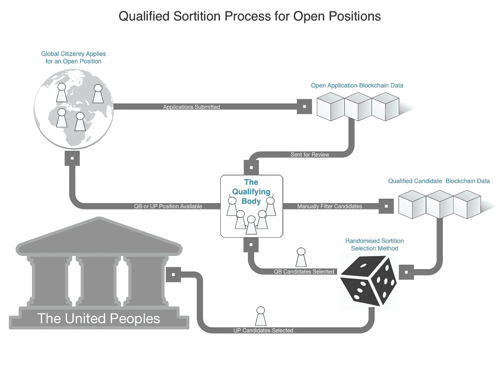
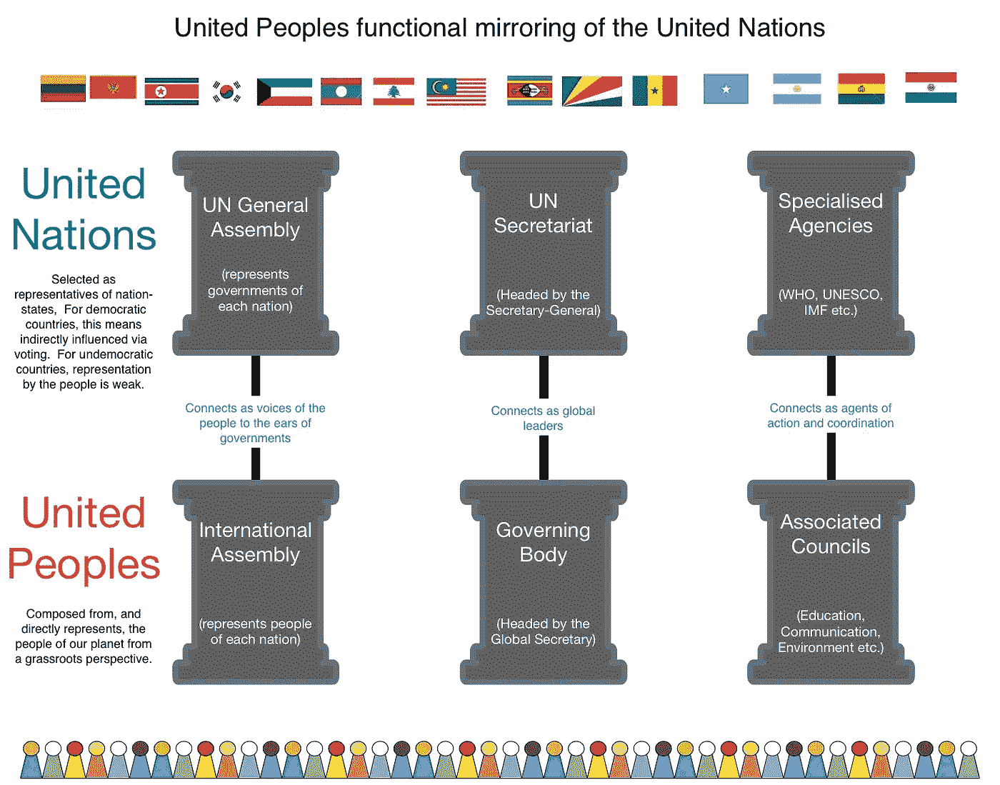

# 团结人民

> 原文：<https://medium.com/coinmonks/united-peoples-70973d198b86?source=collection_archive---------0----------------------->

21 世纪经济、教育和全球治理的公平分布、透明、高效、基于信任的模式。

作者 j .凯尔西

# 摘要

“联合人民”是一个基层全球治理结构的提案，其领导层通过随机挑选从合格公民中直接选出，并受到现代区块链结构和机制的保护和激励。

Sortion(也称为 [demarchy](http://wiki.p2pfoundation.net/Demarchy) )是一种通过抽签随机选择公职人员的方法。在古希腊，sortition 不仅为公民提供了政治教育，也是平等原则的实际应用。

就效率、公平和防止腐败影响的安全性而言，Sortition 比民主有许多[提议的优势](https://www.newdemocracy.com.au/research/alternatives/structural/98-demarchy)，总结如下:

*   Sortition 消除了与魅力非凡、受人欢迎的职业政治家进行昂贵竞选的需要。
*   通过排序来选择候选人相对容易，可以在不完全更换政府的情况下，实现单个成员到下一个成员的非破坏性、交错和有效的过渡。
*   很有可能准确反映实际人口统计数据，包括年龄和性别。
*   由于最终选择过程的随机性，游说、培养、贿赂和影响变得更加困难。
*   分类减少了允许政党、特殊利益集团和寡头政治形成的条件和权力渠道。
*   分类倾向于让公职人员回到公共生活中，理想的是激励诚实的行为。

简单和纯粹的基于排序的系统的优点和缺点都来自于选择方法的随机性。我们提出的模型有许多特点，通过其控制机制、经济结构和技术框架的设计来解决缺点。

这些功能包括:

*   申请人需要满足一定的标准，以符合办公室的工作描述。最终的选择可能是随机的，但任何给定职位的整体申请人都不是随机的。
*   最初的申请被放在区块链的一个临时池中，以确保安全和公开审计。在任何时候，公众都可以查看任何申请任何治理职位的志愿者。
*   在被选入最终分类池之前，建立一个资格机构(QB)来检查工作要求。
*   最后一批合格的申请人被输入区块链的数据库。由于区块链数据库的性质，每一个条目、决策和更改都是安全、透明和公开跟踪的。这有助于确保 QB 绝对以诚实的方式行事。
*   每个主要职位都有唯一的开始和结束日期，以帮助防止治理中断。这些日期是重叠的，因此前 UP 官员可以培训新的职位持有者。
*   一种加密货币(在本提案中称为 Lift)与联合人民组织相关联。每年的通货膨胀奖励的一部分被分配给美国人民的国库。
*   被选到任何一个高职位都会给这个人分配预算的钥匙，这是国库的一部分。这是一个部门的领导用来制定政策，目标和任务，他们被分配完成。
*   联合人民内部的官员可能会呼吁内部请愿，以引发对任何其他职位持有人的不信任投票，以罢免无效的领导人。
*   如果公众请愿达到一定的门槛，公众也可以要求进行公众投票，以解除联合人民运动官员或 QB 成员的职务。这就用投票的权利代替了投票的权利。理想情况下，投票出局的频率会更低，因此效率会更高。
*   任何成功的罢免投票，也会立即取消所有进入财政部的权限(钥匙)和任何官方的权力标签(即组织间投票特权)。

总部设在区块链的强调结构确保为治理职位和权力采取的步骤是透明的，并具有超越当今传统治理制度的强有力的问责制。

与联合国不同——在联合国中，政府选定的成员从政府间的角度处理问题——联合人民旨在直接由全球公民组成，因此代表了我们日益联系在一起的世界的更准确的观点、意愿和智慧。

# 结构概述

联合民族党(UP)有三种主要权力，每种权力相互制衡，拥有单一但平等的投票权。这些主要权力仅仅是最初的提议，还需要更多的辩论、集思广益和设计。

目前提议的三项权力是:

*   **国际大会:**每个国家都有一名首席代表，负责协调每个国家的活动和办公室，并与其他代表交流，就问题、规则和条例进行协调和投票。议会的多数共识作为单一投票。国际讲习会有一位轮值主讲人，担任整个讲习会的协调人和主要代表。主要发言人旨在直接与联合国大会互动(并一直寻求在联合国大会中的永久投票地位)。
*   **理事机构**:理事机构由全球秘书领导，作为 UP 的领导，提供正式的代表权以及行政职责和建立规章制度。该部门旨在直接与联合国秘书处和各国政府首脑接触。
*   **关联委员会:**这些是以个人为中心的委员会，每个委员会都有一个领导者，可以从每个部门的角度投票。每个委员会的多数票将计入代表咨询委员会的一张选票中。理事会的设立由理事机构决定，并由国际大会投票决定。成立委员会是为了采取行动，解决与健康、安全、经济、教育、环境、救灾等重点领域相关的问题。这些委员会中的许多可能在联合国中有相应的机构，要寻求强有力的联系来帮助协调努力，并帮助向联合国提供代表我们世界公民的直接声音。

作为进一步的制衡，资格审查机构是对这三种权力的制衡。QB 通过筛选所有潜在候选人来完成这一任务，帮助运行和管理排序过程，协调对任何 UP 官员的任何潜在不信任投票，并确保个别官员在任期届满时被替换。

由于这些管理权力中的每一个都由设在区块链的机制支持，以提供安全和透明的投票和排序方法以及每个部门和个人的预算，因此有强烈的动机来创造有效的行动，从每个机构中提供切实的利益。

# 授权和建立

在理想的情况下，这种基于分类的管理机构将立即被世界各国政府所推崇、接受和资助；此后，迈向更具合作性的世界的巨大步伐可能会立即开始。

建立阶段的治理和沟通部门将侧重于尝试快速促进各国政府和联合国等国际机构之间的全球合法性，以及在基层直接与全球公民沟通。

然而，这一提议并没有假设现有机构和世界政府是否会赋予其合法性；相反，UP 看起来像是通过其草根方式直接获得了全球公民团体的合法性。通过成为人民信赖的盟友，UP 寻求通过真实和切实的努力来教育和提升整个一代人。随着越来越多的信任支持基础，或许有可能增强被剥夺权利者的权能，并开始将力量的天平向一个健康、可持续和造福所有人的未来倾斜。

早期组织 UP to grow、empower 和 entrust 的方法是通过一种方法，这种方法最初利用三种容易分发的、公平和有效的战略，涵盖经济、教育和通信，并以一种强有力的治理模式为基础，这种模式由区块链机制提供保障。这些创建策略的细节将在下面的章节中详细介绍。

# 模型

# 主要任务

联合人民的主要任务仅仅是“促进所有人的相互和健康的合作”。

这一使命的灵感来自 P2P 基金会的座右铭“[我们一起知道一切，我们一起拥有一切](http://wiki.p2pfoundation.net/Main_Page)这项任务既简单又全面，使我们的成员能够衡量每一项行动，看它是否在每一种情况下促进了尽可能广泛的相互健康合作。

平等和相互尊重是这种合作精神的核心。这项任务包括——但不排除——所有人类活动。它包括与生物圈和所有生物之间的合作。这一要求是基于这样一种认识，即尽管竞争和进化与生存能力有很大关系，但繁荣的能力取决于合作。团结人民的目标是帮助支持和促进合作精神和共同文化，旨在帮助生命在地球上茁壮成长，甚至超越地球。

在建立阶段作为重点启动的通信、教育和经济模式就是要本着这种合作精神来创建的。

此外，这种对合作的重视使联盟能够利用现有的实体，如政府、公司、非政府组织和联合国，作为潜在的合作伙伴，帮助解决问题，建立信任和沟通渠道。由于合作与协作是界定首要任务的核心基本原则，这就成为检验和衡量所有行动和政策的尺度。

# 建立之路

联合民族有两个初始发展阶段，每个阶段都将进一步确定其结构:创建阶段和建立阶段。一旦组织稳固建立，随着时间的推移，其他相关的理事会可能会添加到关联理事会中。

随着区块链和分布式决策，人们可能会问，所有这些理事会的目的是什么？它们是否是迈向更彻底民主形式的中间步骤？老实说，这是目前未知的，因为这取决于哪一级的 UP 是授予，或建立权威和合法性。对于最初的短期愿景，人们认为最实际的方法是尝试利用他们熟悉的结构与当前的组织进行沟通。这也符合“促进所有人的相互和健康合作”的任务规定，因为这一任务规定包含广泛合作的理念，包括现有实体和既定权力。

随着时间的推移，随着人们越来越理解、关心和牢固地确立联合人民更为根本的方面，自然会有更多程度的改进和相关性。

由于联合人民组织的目标是成为一个直接由全球公民组成的全球理事机构，它将需要各种机构和个别理事会中的每一个机构与现有的理事机构，如国家政府、企业、非政府组织以及环境和人道主义关切直接接触。由于此类政策将十分复杂，高度依赖此类机构未来成员的政策和战略，本提案将仅作为一个高级概念涵盖这些想法。一旦建立阶段开始，现实地假设更多的实际细节将开始出现。

# 创始阶段

创始阶段始于一个小型高效的机构，主要由创始成员组成，致力于建立规则、授权、分类机制和初始合格机构。

联合人民的建立取决于制定一个公平和透明的基于区块链的申请选择和筛选方法，以及创造一个公平和安全的方法通过排序随机选择最终候选人的技术。

因此，技术开发将是创始阶段的主要开发重点。创始人应寻求合格的专家来创建初始应用程序选择流程，该流程最终应成为区块链数据库条目，并采用不可篡改的可靠且安全的排序方法。

一旦确定了适用、资格和分类的手段，将寻求三个权力机构的个别候选人。QB 将筛选这些候选项，以便进行排序。一旦候选人被选定，每个人都将签署一系列授权，承诺将发展建立阶段的计划付诸行动。

由于这一提议雄心勃勃，属于试验性质，在创始阶段，对模型和机制进行模拟、测试和调整，以便在付诸实践之前取得更大的效果。

创建阶段的另一个关键组成部分是 Lift 加密货币的创建。这种货币旨在成为一种普遍收入，提供给提供强 KYC 要求的成员，以减轻不良行为者，如机器人，多个帐户等。

此外，Lift 加密货币将为保护网络、参与投票以及以可信的方式与他人联系提供额外的奖励。这样的活动改变了给定的提升量。这一概念的未来补充可能包括教育、参与慈善事业，以及其他向更有权力和更有见识的公民迈进的举措。

提升货币的关键目标之一是帮助激励领导力。其他加密货币包括激励模型，以实现以下目标:保护网络、参与交易、保护数据、参与社交媒体活动、贡献文章等。

Lift 的独特设计旨在激励领导力，因此它是主要的联合人民组织用高素质和有效的候选人填补关键角色的手段，并在经济上增强这些候选人的能力。

即使在作为普遍收入来源的其他角色中，收入的乘数也来自于协作、信任和(最终)自我完善——这反过来有助于营造有利于领导者发展和繁荣的环境。

# 建立阶段

建立阶段是在第一次基于分类的选拔选出最初的领导者和军官之后。这一阶段的主要目标之一是建立一个完全成熟的全球性组织，得到世界大多数(如果不是全部)民众以及世界各国政府、企业和其他组织的信任和接受。这包括一个更成熟、更强大的结构，从实际目的来看，它反映了联合国的一些部门和机构(尽管其重点不那么以政府间为中心)。这种信任将通过确保一个积极的国际机构采取实际的积极行动来培养。

第一个资格机构的早期成员应由创始人人工选择，以帮助筛选国际大会、理事机构和相关理事会的少数初始机构职位的初始候选人。资格审查机构还将帮助保持对这些成员的问责，帮助采用各种手段，通过不信任投票、自上而下投票或公开投票，罢免不称职的官员。除了资格机构成员的第一次甄选之外，所有未来的成员也将接受同样的程序。

由于 QB 采取的所有行动，包括任何官员的任免，都将记录在一个分散的、公众可访问的区块链数据库中，透明度和问责制将从根本上存在。此外，由于 QB 的成员也将受到潜在的不信任投票，这将进一步加强整个组织的完整性。

对候选人申请某个职位(或任何其他职位)的次数进行限制也是 QB 的职责。

通过利用合格成员、简单的三层权力结构和授权的全球秘书的组合，预计可以立即和有效地采用有效的决策来应对全球挑战。

# 联合理事会的组成

为了帮助达到成熟和影响，建立阶段有它的早期重点仔细选择，以帮助确保在最短的时间内达到最大的有效性和影响。这一重点将作为联合民族的最初成员签署的一系列授权来实施。

在创建阶段，将组建组成相关理事会的初始机构。创建这些初始委员会的重点领域是:

*   **技术**:开发 IT 基础设施，协助其他部门开发他们的技术。还帮助开发和维护排序方法和保存所有候选人的区块链数据库。
*   **教育**:设计一个广泛分布的、有趣的、引人入胜的教育平台和课程，它是游戏化的，包括智能算法和跟踪，以帮助促进教学。
*   **经济学**:设计一种基于信任圈的区块链数字货币，并以此作为全民基本收入。
*   **沟通**:该部门负责公共关系和市场营销，并确保所有部门之间、与外部合作伙伴和实体之间以及与世界大多数人口的各种语言之间有有效的沟通手段。

这些早期理事会的最初重点构成了赋权战略的一部分，既针对人民，也针对 up 的机构。

随着 UP 变得更稳固和更有权力，更多的委员会将会成立，成为一个不断发展和更有效的机构，能够对各种全球问题采取行动。

# 治理结构

联合民族的主要结构是三重结构，资格审查机构作为监督机构，为关键的个人候选人提供进入和退出机制。

理事机构、国际大会和相关理事会都有自己的内部运作，以及相互之间的制衡、结构机制和沟通渠道。

尽管有制衡机制来防止明显的权力滥用，但全球秘书是作为一个组织的明确、果断的领导而存在的，他有能力下令执行行动。这样就可以在潜在的全球问题上迅速做出决策。

# 全球秘书和理事机构

全球秘书是组织的首脑，不是一个有名无实的职位；它通过批准行政行动的决定而拥有明确的权力，这些行动由适当的委员会执行。这些执行行为可以是整个组织内部的，也可以是外部的。理事机构的其余部分与国际大会和组成相关理事会的各种机构都有联系。

为了保持对滥用权力的合理制衡，相关理事会和国际大会可以通过代表每个投票机构一定比例(即三分之一)的请愿书，要求对任何行政行动进行投票。

理事机构能够在一组给定的限制内改变任何规则、预算、安全行动或任务，包括在相关理事会内成立一个额外的机构。

全球秘书也可以对国际大会或相关理事会的请愿进行临时限制，前提是在一段时间内达到了特定的请愿阈值。这是为了防止过度和严重的延误，以免影响决策的实施。

示例约束如下:

*   预算分配需要大多数相关委员会投票同意才能通过(任何与安全有关的预算除外，该预算受安全相关事项的限制，如下所述)。
*   安全行动和预算要求 IA 和 AC 以较大的多数(即三分之二)投票。
*   影响整个组织方向的任何授权变更也需要内部审计和审计委员会的多数票。此外，在下一任全球秘书的新任期开始六个月之前，委任不得更改(在此期间，新全球秘书可以尝试通过行政措施推翻委任的更改)。

任何时候，公众都可以呼吁请愿，以触发对全球秘书的不信任投票。如果这份请愿书达到了一定的数量和分布(尚未确定)，公众投票将被要求解除全球秘书的职务。通过这种方法，公众可以“解雇”任何被认为对政府和公众信任不诚实的领导人。即使是未达到投票所需门槛的请愿书也可能被用作公众舆论的警告或指标。希望这能不断提醒我们这样一个公务员的职责所在。

# 国际大会

内部审计是代表国家的一种手段，也是一个广泛多样和分布的机构，是提供必要的制衡以防止腐败的主要手段。

国际大会的每个国家都有若干代表，代表每个国家的人口(这是根据世界人口中所有国家的平均数)。例如，授予一个国家的代表的最小数量可以是一个，最大数量为八个。这是承认每个国家都是受尊重的成员，同时也承认，在某些情况下，世界上很大一部分人居住在少数几个国家。然而，它并不认为拥有大量人口就一定是国家拥有过度权力的方法。例如，代表标准上限为 3500 万(相当于一个国家的平均人口)，像汤加这样的小国和像加拿大这样的大国都只有一名代表。在这一门槛下，土耳其将有两名代表，日本将有三名代表，俄罗斯将有四名代表，巴西将有六名代表，印度尼西亚将有七名代表。在这种情况下，只有美国、印度和中国有八名代表。多数人的声音将有力量，而不是围绕核实力或经济实力来构建世界，而不会反过来淹没少数文化的声音。(这种情况只是一种提议，需要进一步考虑)。

关于每个国家的代表人数上限的规则将首先在创始阶段确定，进一步的修订和调整将由管理机构确定，并由国际大会投票决定。

虽然国际大会最初是围绕国家的概念构建的，但未来的结构可能会超越这一点，帮助较大国家中的少数民族文化和群体(即库尔德人、加泰罗尼亚人、切诺基人、艾马拉人、毛利人)发出声音，承认和认可我们不同的观点和文化传统，让以前没有发言权的人在全球范围内存在。

主要发言人将在代表之间轮换，是整个 IA 的代理领导和主持人。主要发言人直接与全球秘书以及联合国和其他全球机构互动。如果由于任何原因，临时情况突然解除全球秘书的职务，(如悲剧或不信任投票)，关键发言人将充当临时全球秘书，直到排序方法替换该关键个人。

主要发言人有权将任何法律提案进行公开的直接民主表决。

如果在设定的时间内超过了预定的阈值，IA 也可以投票限制行政命令。这是为了防止管理机构越权和滥用权力。

与全球秘书一样，IA 可能会通过引发请愿书导致 IA、AC 或公众内部的不信任投票，让任何个别代表被投票罢免。

# 相关理事会

每一个单独的机构组成了更大的相关理事会，代表了行动和应对任何挑战或全球需求的方法。

尽管每个机构都有自己独特的领导，但相关理事会的每个机构最终都由全球秘书领导的理事机构直接领导。每个机构的领导可以通过在整个 AC 内部请愿或通过他们自己的请愿请求国际大会干预来抵制来自全球秘书的行政命令。

联合委员会各机构的负责人可以决定他们自己要承诺的行动，但必须让 IA 的主要发言人以及全球秘书知道他们的决定。全球秘书可以通过行政命令阻止此类行动。

与 IA 一样，如果在设定的时间内超过了预先确定的阈值，AC 可以投票限制行政命令。这一点对审计委员会尤为重要，因为行政命令有可能对审计委员会的特定机构最有经验和最熟悉的一类主题采取行动或阻止重要的必要反应。

如果审计委员会、内部审计员或公众的请愿达到最低票数，审计委员会的每位领导人也可能被投票罢免。

# 赋权战略。

为了确保团结的人民有能力为我们的全球社会做出有效和有意义的贡献，需要从组织的一开始就考虑一些战略。

赋予权力战略的一个基本原则是“赋予人民权力”。正如增强本国人民权能的公司、社区和国家最终会从这种投资中获益一样，联合人民期待着类似的结果。

# 经济的

没有资源，联合起来的人民几乎不可能在世界舞台上产生任何有意义的影响。该组织的战略依赖于拥有一个坚实而持久的经济结构，通过两条主要的战略路径来实现:筹款和加密货币的创造。

目前的联合国筹资模式依赖于会员国的捐款，也依赖于捐款国的善意。要让联合起来的各国人民获得同样的权利，必须给予强有力的支持和合法性，然后必须提出各国是否愿意为两个全球组织提供资金的问题。

随着联合人民的重点是直接代表全球公民，国家会愿意支持他们几乎没有控制或发言权的事情吗？

为了确保团结的人民不依赖于会员国的捐款，也不受制于强国的愿望，将尝试一种筹资模式，这种模式不仅为团结的人民提供自治的手段，而且也是帮助公民赋权的手段，这是整个 UP 概念所依赖的。

早期的联合民族(United Peoples)的部分重点将是通过传统方式获得资金，而另一个重点将是建立一种总部位于区块链的加密货币，这种货币与比特币类似，但具有更公平、更平等的分配系统。出于本文的考虑，该货币将被称为 Lift。

电梯的设计应考虑以下特点:

*   一个基于区块链的开放和安全的经济模式。
*   分散且有弹性，即使全球网络瘫痪或无法到达也能采取行动。
*   基于(并鼓励)双方同意的信任。
*   通货膨胀模型。
*   向满足明确的 KYC 式身份要求和/或群体身份共识的个人提供普遍收入(为无证件者提供身份手段)。
*   每产生一个单位的生命并作为普遍收入分配给个人，也会产生一个百分比(待定)并交给美国财政部。
*   允许请愿导致直接投票罢免(通过不信任投票帮助削弱不良行为者的权力)。
*   公平而平等的分配方式。
*   收入随着时间的推移而增长，类似于硬币使用的机制，如 [Grantcoin/Manna](http://www.grantcoin.org/get-grantcoin/basic-income/) [1]

作为一种货币，Lift 的设计特点是展示和鼓励信任，提供随着时间推移而增长的普遍收入，并建立和加强地方合作。[一些总部位于区块链的](https://fair-coin.org)加密货币目前正在[试图完成这些目标](http://iamcicada.com)，UP 将使用这些模型作为模板来创建提升货币。

在众多全民收入的竞争者中，与 Lift 最相似的模型是 Martin Kö ppelmann 创造的 [Circles](https://ourbasicincome.wordpress.com/2016/02/16/fair-money-for-all-basic-income-on-the-blockchain/) 概念。这种设计从基层开始，通过建立(和奖励)信任圈。随着信任圈的扩大，货币在本质上变得更加全球化。

由于 Lift 的中心设计侧重于鼓励本地信任，因此它降低了持有多个帐户的优势和价值，因为很少有人会真正信任这样的帐户，从而使其价值非常有限。同样，拥有多个 id 在犯罪活动之外没有什么价值，一旦用户被发现，这种策略的所有价值都变得过时了。

尽管有许多类似的竞争者，但全民收入要真正流行起来，就必须是“全民的”。通过建立一个全球性的代表性机构，如 United Peoples(反过来是一种全球性的安全货币)，可以有一定程度的合法性，目前很少有其他类型的加密货币声称拥有这种合法性。

如果像联合人民这样的全球性机构能够创造值得信赖的普遍收入，将会有许多直接的好处:

*   Lift 通过全球机构的合法性被赋予了很高的价值。
*   联合人民的部分融资努力可以收集法定货币，随后在内部兑换成电梯，帮助提高和稳定价值。
*   人们越来越意识到，一个人越早接受这种免费的普遍收入，随着时间的推移就能获得越多的财富，那么这种货币病毒式传播的机会就会大大增加。
*   通过 Lift，人们将有一份收入、一个平台和一个 ID 来参与治理。
*   团结一致的人民可以利用 Lift 来支持切实的、积极的努力。
*   联合人民可以资助工人去帮助那些目前很少得到财政支持的领域，比如环境清理，制止人口贩卖等。

随着时间的推移，人们希望以信任为基础的强调将创造一种全球货币，这种货币持有信心，并达到比目前以法定货币更高的相对价值。这样，作为一个组织,“联合人民”将越来越有能力采取真正有影响力的行动。类似地，许多现有的加密货币目前的估值水平远远超过任何其他基于法定货币的国家货币。

由于 Lift 有可能成为 UP 有效执行其任务的巨大财富、资源和授权的来源，因此 Lift 的广泛建立和强大、稳定的价值将是关键。推广和建立 Lift 作为一个有价值和有用的交换媒介将是早期议程的一部分。

拥有由这样的全球实体创建和支持的全球加密货币还有额外的优势。例如，这种货币可以是无国界的和高度安全的，如比特币、以太坊等。它可以代表一种无债务的货币，可以抵御通胀和通缩，更类似于资源支持的货币，而不是目前的浮动法定货币。

额外的好处是，区块链系统可以被设计成通信和协作工具，如 [Steemit](https://steemit.com/) 。它们可以包括已经被诸如 [BitShares](https://bitshares.org/) 、 [DASH](https://www.dash.org/) 、 [EOS](https://eos.io/) 、 [Cardano](https://www.cardano.org/en/home/) 和 [Steemit](https://steemit.com/) 等项目证明或开发的安全和负责任的治理模型的方法。

然而，UP 的主要目的不是简单地成为加密货币的发行商(无论如何公平地发行)；这是一个它设计和构建的真正代表地球人民和我们面临的许多挑战的机构。

一旦联合人民开始成为一个组织，最初的任务之一就是从基层开始赋予自己和世界人民权力。这始于一种公平的加密货币的全球均匀分布，作为一种承诺的开始，但需要迅速将其自身扩展为积极支持的切实手段。

# 教育

积极支持的最有力手段之一在于教育。为了创造一个合作的社会，使我们能够从战胜挑战转向充满机遇的繁荣，我们需要一个全球性的、公平的和广泛分布的教育模式。众所周知，教育是减少疾病、贫困、战争、人口增长、人口贩运和现代世界常见的其他弊病的一个因素。

在信息时代之前，教育的分配是困难的。今天是一个非常不同的故事，因为我们碰巧生活在一个教育资源和传播方式丰富的时代。

此外，[有趣的、引人入胜的娱乐模式](https://www.psychologytoday.com/files/attachments/4141/the-neuroscience-joyful-education-judy-willis-md.pdf)开始被发现可以增强学习。数据跟踪系统和智能算法可以专注于学生的优势和劣势，以帮助提供最佳和及时的课程或鼓励。[游戏化技术被证明可以加速和简化学习](http://www.nytimes.com/2010/09/19/magazine/19video-t.html)，让学生在更短的时间内达到更高的知识水平。鼓励和发展创造力的方法正在建立。有效应用这些模型的设计良好的教育系统可以提供比当前系统更多的优势。

有能力的父母通常愿意为最好的教育付费。如果可以开发出一种吸引人的、有效的、数字分布的模型，该模型是可移植的，并且便于教育工作者使用，那么这种服务可以分布到贫困地区，以帮助在一代人的时间内快速教育全体民众。从本质上讲，从有经济能力的顾客那里获得的利润将被用来资助这些最初的再分配努力。

全球教育市场估计超过[、4 万亿](https://marketbrief.edweek.org/marketplace-k-12/size_of_global_e-learning_market_44_trillion_analysis_says/https://marketbrief.edweek.org/marketplace-k-12/size_of_global_e-learning_market_44_trillion_analysis_says/)美元，并且有望显著增长，尤其是在增长中的市场，如[中国和印度](https://www.vccircle.com/indias-education-market-nearly-double-180-bn-2020-1/)。目前，它的规模是软件市场的八倍，是媒体和娱乐业的三倍。除了是一个非常有利可图的领域，这个行业还包括改变和塑造生活以及社会和经济动态的重大影响——可能在整整一代人的时间内。

United Peoples 初期发展阶段的部分目标是建立一个世界一流、高效且易于分布的教育模型，该模型基于最新的游戏化技术、数据跟踪、人工智能数据分析以及社会和心理研究。这种教育旨在超越大多数当前的模式，允许它立即被赋予巨大的社会和经济价值，因为这样的价值将有助于资助和推动 UP。

这种教育的第一阶段是立即为富有和有影响力的地区开发优质服务，然后作为第二阶段，将这些服务扩展到中产阶级地区。这种教育的成本将会提高，以帮助鼓励使用和增加感知价值。

一旦教育系统足够发达，就会分配到贫困地区。一台平板电脑、一台投影仪和一个太阳能充电器就能让一名教师将教育带到地球上最偏远的村庄。该软件将被设计为完成大部分繁重的工作，在某种程度上使教师更像一个促进者或教练，主持一些有趣和有吸引力的课程和活动。这样，即使在教师教育水平不高的地区，也能让一代学生与几千公里之外的国家和城市中更富裕的学生达到同等水平。

除了经济利益之外，提供有效的、令人愉快的和公平分配的教育方法将为作为一个组织的联合起来的人民带来信任和价值，它将有助于培养一代寻求合作的个人，他们有潜力极大地改善我们的世界。有效的教育为未来的领导者提供了一个坚实的基础，而作为一个全球性的组织，UP 需要来自全球各个角落的有效和有知识的领导者。

教育本身也是帮助解决世界上许多最严重问题的关键。

*   受过教育的民众，即使是农村和贫困人口，也有可能降低人口增长率。
*   教育有助于[改善社会内部的平等。](https://unchronicle.un.org/article/education-pathway-towards-gender-equality)
*   教育程度的提高通常会减少犯罪[。](https://as.nyu.edu/content/dam/nyu-as/politics/documents/Gonzalez.pdf)
*   人们普遍认为教育能增加社会财富和经济增长。
*   这也被认为可以减少人口贩运(因为不识字的父母经常屈服于导致儿童被拐卖的骗局)。

这个拟议中的教育系统的部分任务是鼓励合作。拟议的教育结构将促使学生把无条件尊重作为核心个人原则，因为尊重导致信任，反过来，信任导致更大的合作、和谐和财富。

通过增加升力，这种教育模式也可能有间接的激励。可信的教师可能能够在本地可信共识的版本中，为每个即将毕业的学生的 Lift 帐户提供乘数。因此，这种教育模式变成了一种有效的入职流程，增加了受过教育、知情的公民，有助于在全球范围内培养团结的人民。此外，对于许多基础设施较差的地方，这可能是为当今地球上存在的许多现有的无证件个人提供安全身份证明的唯一方式。

如果推出这样的教育体系，以全民收入为支持，并以联合人民的额外资源为指导，那么就可以创建一个有能力的劳动力队伍，帮助解决我们今天面临的许多问题，例如:

*   环境清理。
*   野生动物保护。
*   教育。
*   维持和平。
*   提升穷人。
*   种植可持续作物。

人口不再是一种负担，它可以开始转变为一种资源，投入到恢复繁荣的生态系统和合作的全球文化的工作中。随着时间的推移，随着教育更加广泛地传播，人口水平可能会开始下降，留下一个更加尊重和合作的全球文化来继承我们的星球。

# 沟通

联合民族的最初早期机构的主要和必要的关键战略之一是在组织内部以及与外部实体(包括公众)建立和保持强大的沟通渠道。

由于主要任务是围绕促进合作，强大和积极的沟通渠道成为一项基本的核心战略。

相关理事会将有一个通讯机构，作为最早成立的机构之一。该沟通机构将负责确保沟通以健康和积极的方式进行。这种关注的一部分还将是确保通信噪声不会开始延迟或阻止重要决策和行动的发生。

通信机构将负责:

*   确保审计委员会各机构的领导就有效且一致的策略进行沟通和合作。
*   确保审计委员会的领导、内部审计机构的主要发言人和 GB 的全球秘书就高效、有效且符合合作精神的战略进行沟通和合作，如主要任务所述。
*   宣传和教育公众，让他们知道联合起来的人民如何与普通人一起工作，如何代表普通人。
*   与其他外部机构联系，确保良好的合作机会能够相对容易地得到利用。
*   制作营销材料，包括为联合民族及其个人团体和机构在互联网和社交媒体上展示。
*   有助于确保参与排序过程被广泛理解和传播，以及呼吁公众请愿进行不信任投票的能力。
*   在挑选过程中，确保资格审查机构为其协助的每个机构和部门选择候选人时有最准确的标准。
*   确保联合人民内部的流程和决策是透明的、有记录的并且能够清楚地呈现给全球秘书、IA 的主要发言人、AC 的每个机构负责人以及公众。
*   在世界各国政府和人民中推动合法性，以及财政和立法支持。
*   建立和加强尊重和信任。这将是确定沟通是否健康的核心衡量标准之一。
*   为公众提供一个了解电梯及其好处的渠道。
*   为人们提供一个了解数字教育及其好处的渠道。

在联合人民的最初几年，传播该组织所代表的理念，建立信任、合法性和协作的关系，是沟通战略的关键重点。经济和教育战略的发展在很大程度上取决于确保人们能够从联合起来的人民活动中获得利益的知识。同样重要的是建立信任的基础，并鼓励人们提交他们对 UP 中关键职位的候选人提名。

通过通信机构协调和促进内部和外部的信息流动和理解，联合人民的任务可以更快地付诸行动，从而有助于增强本组织及其服务对象的权能。

# 结论。

由于数字技术无处不在的特性，特别是区块链的发明，人类历史上第一次有可能拥有一个以分散、公平、透明和平均分配的方式进行选择的全球政府。

通过区块链的安全和去中心化特性，提议的联合人民模式可能只有在当今移动和数字连接的世界中才有可能。这种模式允许诸如数字透明、全面制衡、经济激励、安全身份、权力限制和强有力的果断行动途径等特征。它还提供了一种分类方法，允许有效、安全的选择流程，公平地选择有技能的候选人，并具有与我们全球人口相匹配的多样性。投票和请愿也将是安全的，并通过区块链分散进行。

这种区块链技术还能够创造一种数字货币(Lift ),可以作为一种普遍收入广泛分发。作为一种货币，如果得到全球可信机构的支持，电梯可能会有额外的价值，这与目前合法性有限的当前加密货币实施不同。

最终对教育的关注有能力成为收入的主要驱动力，以及更广泛的社会变革的驱动力。随着时间的推移，世界一流教育模式的分布有望产生对组织的信任，并创造一个授权的公民。教育部门的利润将被重新投资，以确保这种模式能够尽可能广泛和公平地传播。从长远来看，教育服务的付款将被转换为 Lift 数字货币，以帮助进一步增强价值，并帮助跨境支付使用该平台的教育者。

为了确保这种模式快速、有效地传播，并允许快速和知情的决策，沟通(内部和外部)是联合人民治理模式的关键和重要方面。这将由一个传播机构来推动，该机构在确保“促进所有人的相互和健康合作”这一任务得到理解并付诸实践方面发挥着重要作用。

有了这样一个模式，可以想象建立一个统一的世界管理机构，以真正公平和公正的方式直接来自——并直接代表——这个星球上的人民。这将是一个来自基层的真正具有代表性的全球性政府的历史性创造；一个有可能将权力从现有秩序转化为人类最高理想的意志、同情心和智慧的治理体系。

# 附加注释

# 1.核心价值观

美国人民的价值观是根据其基本使命确定的，即 _' **促进所有人的相互和健康合作。**

这一使命是整个组织核心价值观的核心，并延伸到全人类以及我们所居住的生态系统。从“相互健康合作”的角度来看，每一项决策和行动都是为了提供最广泛、最有益的结果，让尽可能多的积极方参与进来。

通过根据这一标准组织和制定所有决定，人们期望相互尊重的合作方式能够成为所有决策和解决问题的首要方式。从建立健康动态的角度来看群体，并确保各方之间存在良好的沟通对这一模式至关重要。

选择联合民族主要候选人的合格分类结构确保了人口中真实和广泛的样本在组织中普遍拥有权力和影响力，确保多样性和平等是该模式持续结构的重要组成部分。

尊重、平等、全球健康、接受良好教育的平等权利、环境保护、资源的公平分配、和平和理解是这些核心价值观的一部分，也是从一开始就寻求“所有人相互健康合作”的使命的自然延伸。

# 2.决策能力。

由于全球秘书代表着一个清晰而果断的负责人，有能力呼吁管理层迅速采取行动，这种模式有望能够并准备好以即时解决方案应对全球挑战。

由于在这种模式下，全球秘书职位将从拥有治理和管理大型全球性机构和组织经验的合格成员中随机选出，因此可以相对肯定的是，这些候选人将拥有应对全球范围挑战的经验、洞察力和资格。

由于联合民族内部的任何关键职位(包括全球秘书)都需要交错重叠，任何所需的知识、洞察力和一般“技能”都有足够的时间从现任全球秘书传递给下一位候选人。这有助于确保权力交接比现政府平稳得多，让关键和重要的决策毫不拖延地继续下去。

此外，全球秘书具有来自任何人群的潜力，这一事实可以预期，随着每个角色的统治地位的推移，世界将受益于各种观点和展望，并且总体上代表了广泛的领导阶层。

# 3.有效性。

团结人民模式有若干特点，旨在提高其应对全球性挑战的效力。

*   领导能力:头脑清晰果断，能够立即做出明确的行政命令。
*   **合格**:包括一个清晰的结构，以确保关键成员有资格从事他们的工作。
*   **代表**:通过排序选出的每一个成员都是随机的，有很强的潜力选择多样且分布广泛的关键岗位。此外，国际大会拥有来自所有国家的代表，这些代表也是通过选举产生的，因此代表了各自国家的多样性。随着时间的推移，该组织对公平和公正教育的关注将有助于确保各行各业都能获得资格证书。
*   **有效选择**:本提案的合格排序方法不需要复杂的后勤工作，而这种后勤工作可能是全球民主制(大型、协调的全球选举和初选)所必需的，因此更适合全球治理结构，这种结构仍然能够提供从全球公民中直接选出的公平(可能更具代表性)的候选人。
*   **高效交接**:每个新选的成员都有一段时间与现任者重叠，作为培训和工作准备的一种方式。每个职位的届满日期错开，确保政府能够持续运作。安全的区块链请愿和投票机制适用于任何要求提前终止职位的情况。
*   **透明度**:区块链的数据库允许对全球公众完全透明。候选人被放入区块链数据库，确保公众可以查看和评估资格审查机构是否不公平地选择或拒绝潜在候选人。此外，决定、行政命令、规则、法律和条例都放在可公开查阅的区块链数据库中，这些数据库是分散的，不会被篡改。这确保了每个成员的行为对公众(以及整个组织的成员)都是透明的。
*   **制衡**:除了透明度，组织结构中还设计了许多制衡机制。这些允许不同的主体，组织内的个人，甚至公众，在不削弱组织的情况下，合理地制止权力的滥用。
*   **合作**:通过与联合国类似的结构，联盟打算与这一全球性实体以及各国政府、非营利组织、非政府组织、慈善机构等合作。
*   **廉洁**:由于候选人是随机挑选的，与之前的候选人有一些重叠，并且可以通过内部和外部手段投票下台，外部机构很难贿赂组织成员。在不知道哪位候选人将被选中的情况下，培养候选人行贿变得更加困难。即使一个候选人是腐败的，投票(来自组织内部或外部)可以结束任何被抓住的候选人的任期。即使候选人仍然腐败但被隐藏，任期也将不可避免地结束。新的替代候选人将继承上述外部腐败企图的困难。此外，该模式的多样性和透明度将进一步防止腐败成为一种自然现象，因为多样化的组织[有潜力更好地抵制腐败](http://blog.lawroom.com/corruption/diversity-reduce-corruption-culture/)。这些减少腐败的机制也适用于资格机构，其成员(在最初的创始机构之后)也通过资格排序法选出。
*   **金融** **独立**:联合人民的部分意图是提供一种数字加密货币，它可以与传统法定货币一起推广、使用和交易。此外，该组织打算通过提供高质量的数字教育来筹集资金，这已经是一个高价值的增长行业。
*   相关联的 **委员会**:这些委员会代表组织的活跃分支，旨在解决某些关键领域(教育、通信、安全、卫生等)的问题。).随着组织的成长，这些机构的权力、范围和效率预计也会随着时间的推移而增长。

# 4.资源和融资。

虽然联合人民最初可能需要通过传统的筹资技术获得资源，但最初的重点将是创建一种基于区块链的数字加密货币(Lift)，以帮助筹集更多资金。

这种类型的模型目前在加密货币领域非常常见。硬币/代币是在所谓的“[初始硬币发行](https://www.coinist.io/biggest-icos-chart/)中创建的，以帮助为其创造者的努力筹集资金。最近，这些努力包括分布式计算、数据分析、深度学习和其他类型的高价值努力。

随着这些 ico 的创造者的美元估值进入数十亿美元的领域，以及比特币等硬币的总市值达到数千亿美元，全球支持的数字货币有可能保持巨大的价值。

此外，United Peoples 的战略在于创建一个有趣、引人入胜的数字教育系统，该系统易于与数字教育一起分发。数字教育是一个利润丰厚的全球增长行业，其目的是以溢价向富裕和中产阶级客户提供高价值的教育系统，以筹集资金。同样的教育将被分配到世界各地的贫困社区。它旨在对教师非常友好，利用智能跟踪和深度学习原则来推动学生取得更好的成绩，希望即使是教育程度较低的辅导员也可以管理一个班级，提升整整一代人。

这些战略旨在帮助提供获得财政资源的手段。至于人力资源，希望财务健康、核心价值观和明确积极的意图将吸引合格的候选人参加基于排序的选择过程，从而满足模型所需的人力资本。

# 5.信任和洞察力。

教育和普遍收入战略的目的是从基层建立对团结人民组织的信任。

对于社会中具有洞察力和批判力的部分来说，整个组织都受到清晰和透明的监督，因为它要求公布所有的决定、规则、命令等。一个加密的安全的，分散的，区块链数据库。

这些数据将确保记者、政治观察家、监督机构、有抱负的候选人以及任何有兴趣跟踪组织日常运作的人能够清楚地知道做出了什么决定，以及由谁做出的决定。

资格审查机构还将作为一个监督机构，让公众了解联合人民组织内的任何不诚实活动。

# 6.灵活性。

在管理机构/全球秘书作为整个组织的决定性领导的情况下，随着管理模式适应不断变化的世界的需求，规则、结构、组件、战略和任务都可以改变。

这些变化确实有一定的限制，如果需要的话，可以加以抵制，但是要抵制需要很大程度的共识。

这种模式的部分灵活性在于相关的委员会，它提供了一种创建具有特定用途的子组织的途径。当这些委员会不再有用时，也可以解散。

# 7.防止滥用权力。

如果在一段时间内超过了预定的阈值，国际大会和相关理事会也可以投票限制行政命令。这是为了防止管理机构越权和滥用权力。

此外，所有三个机构中的个别代表可以被投票罢免，方法是引发请愿，导致联合民族内部的不信任投票或外部公众的不信任投票(向合格机构请愿)。

某些与全球安全、变更授权、规则(或未来的法律)等事项相关的行动需要 IA、AC 和 GB 在不同的多数门槛下投票才能生效。这是为了确保关键决策受到最低程度共识的反对。

此外，随机排序具有强大的潜力来限制腐败影响的类型(如培养候选人)，这种影响通常存在于当前的治理形式中。

# 8.问责制。

由于这种模式包括一种将滥用权力的个人从权力中清除的方法，以及通过在一个安全和公开的区块链数据库中保存记录来实现决策者及其行动的透明度，这种模式显然具有让决策者对其行动负责的方法。

即使举行不信任投票的请愿不成功，也可以成为一个警告，提醒任何决策者他们必须承担的责任和信任。

由于不信任投票的成功意味着公职人员失去财政预算拨款，以及在管理机构内的投票权，这是在信任受到损害时提供追索权的有效手段。

> [在您的收件箱中直接获得最佳软件交易](https://coincodecap.com/?utm_source=coinmonks)

