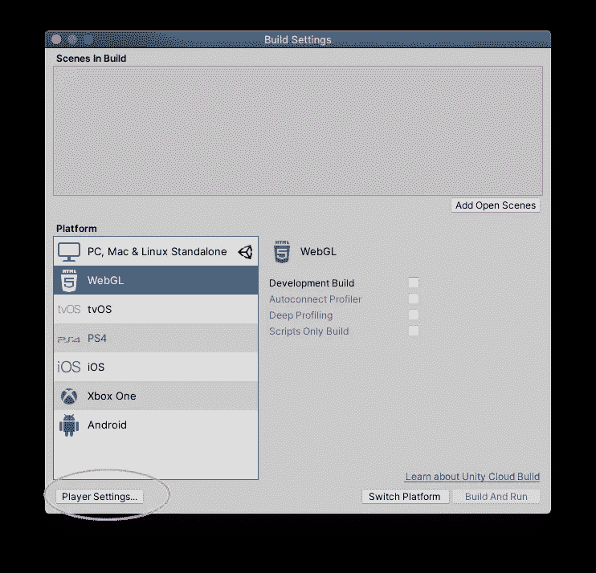

# Unity 引擎+ MetaMask 钱包

> 原文：<https://medium.com/coinmonks/unity-engine-metamask-wallet-6797d4699e45?source=collection_archive---------1----------------------->

## 将您的 Unity 游戏与 Metamask 钱包(或任何 web3 钱包)自动连接

*这个项目有链家！ChainSafe 非常高兴 Leon 加入我们，成为游戏主管。他的 Unity SDK 现在可以在 ChainSafe 的 Github* [*这里*](https://github.com/ChainSafe/web3.unity) *作为 Web3 公开获得。Unity library，在那里它将继续得到发展。请查看我们的* [*公告文章*](https://bit.ly/3zgdQnF) *了解更多*

# 概观

在本文中，您将能够

*   创建 web3 WebGL 模板
*   更改 web3 模板的播放器设置
*   用 MetaMask 连接您的 Unity 游戏
*   在游戏中显示元掩码地址。

# Web3 WebGL 模板

创建新项目

在您的项目中的`Assets`下，创建一个名为`WebGLTemplates`的文件夹

接下来，下载现有的 WebGL 模板或使用下面的模板。查看 [Unity 手册](https://docs.unity3d.com/Manual/webgl-templates.html)了解更多信息。将模板移入`WebGLTemplates`

[https://github.com/underscoredLabs/web3-webgl-template](https://github.com/underscoredLabs/web3-webgl-template)

最终结果应该是这样的:

> 它是如何工作的？

有两个变化

1.  在`Web3Template`内部的`index.html`中，我们正在导入一个脚本

`<script src="TemplateData/web3Connect.js"><script/>`

2.在`TemplateData/web3Connect.js`下的脚本是

简而言之，这个模板说:

> 当网页加载时，连接到 web3 钱包。

# 更改播放器设置

在您的 Unity 项目中，转到`File > Build Settings...`

`Switch Platform`到 WebGL。一旦完成，转到`Player Settings...`

将 WebGL 模板更改为我们之前添加的`Web3Template`。

为了测试元掩码连接，`Build and Run`

应该会有连接的提示

# 在游戏中显示地址

既然连接上了，那就利用数据吧。这个例子将显示游戏中的 web3 钱包地址。

`Right Click > UI > Button`

选择`Button`和`Add Component`。创建新脚本。在本例中，脚本名为`GetWalletAddress.cs`

将代码粘贴到`GetWalletAddress.cs`

创建另一个名为`web3.jslib`的文件，查看 [Unity 文档](https://docs.unity3d.com/Manual/webgl-interactingwithbrowserscripting.html)了解更多信息。

将代码粘贴到`web3.jslib`缓冲区，mallocs 也来自 [Unity Docs](https://docs.unity3d.com/Manual/webgl-interactingwithbrowserscripting.html) 。

现在代码完成了，把所有东西连接起来。将按钮对象拖到`On Click ()`处理程序中，并选择我们创建的`OnClick()`函数。

将`Text`拖到`Button Text`脚本中。

为了验证，`Build and Run`再来一次。

点击按钮应该会显示一个地址

hard to see but it works

这将为更复杂的交互奠定基础，例如获取 ERC-721 数据以显示游戏中的项目。

## 另外，阅读

*   [复制交易](/coinmonks/top-10-crypto-copy-trading-platforms-for-beginners-d0c37c7d698c) | [加密税务软件](/coinmonks/crypto-tax-software-ed4b4810e338)
*   [网格交易](https://coincodecap.com/grid-trading) | [加密硬件钱包](/coinmonks/the-best-cryptocurrency-hardware-wallets-of-2020-e28b1c124069)
*   [密码电报信号](http://Top 4 Telegram Channels for Crypto Traders) | [密码交易机器人](/coinmonks/crypto-trading-bot-c2ffce8acb2a)
*   [最佳加密交易所](/coinmonks/crypto-exchange-dd2f9d6f3769) | [印度最佳加密交易所](/coinmonks/bitcoin-exchange-in-india-7f1fe79715c9)
*   开发人员的最佳加密 API
*   最佳[密码借贷平台](/coinmonks/top-5-crypto-lending-platforms-in-2020-that-you-need-to-know-a1b675cec3fa)
*   [杠杆代币](/coinmonks/leveraged-token-3f5257808b22)终极指南
*   [最佳区块链分析工具](https://bitquery.io/blog/best-blockchain-analysis-tools-and-software)
*   [加密套利](/coinmonks/crypto-arbitrage-guide-how-to-make-money-as-a-beginner-62bfe5c868f6)指南:新手如何赚钱
*   最佳[加密制图工具](/coinmonks/what-are-the-best-charting-platforms-for-cryptocurrency-trading-85aade584d80)
*   [莱杰 vs 特雷佐](/coinmonks/ledger-vs-trezor-best-hardware-wallet-to-secure-cryptocurrency-22c7a3fd391e)
*   了解比特币的[最佳书籍有哪些？](/coinmonks/what-are-the-best-books-to-learn-bitcoin-409aeb9aff4b)
*   [3 商业评论](/coinmonks/3commas-review-an-excellent-crypto-trading-bot-2020-1313a58bec92)
*   [AAX 交易所评论](/coinmonks/aax-exchange-review-2021-67c5ea09330c) |推荐代码、交易费用、利弊
*   [Deribit 审查](/coinmonks/deribit-review-options-fees-apis-and-testnet-2ca16c4bbdb2) |选项、费用、API 和 Testnet
*   [FTX 密码交易所评论](/coinmonks/ftx-crypto-exchange-review-53664ac1198f)
*   [n 零审核](/coinmonks/ngrave-zero-review-c465cf8307fc)
*   [Bybit 交换审查](/coinmonks/bybit-exchange-review-dbd570019b71)
*   [3Commas vs Cryptohopper](/coinmonks/cryptohopper-vs-3commas-vs-shrimpy-a2c16095b8fe)
*   最好的比特币[硬件钱包](/coinmonks/the-best-cryptocurrency-hardware-wallets-of-2020-e28b1c124069?source=friends_link&sk=324dd9ff8556ab578d71e7ad7658ad7c)
*   [block fi vs Celsius](/coinmonks/blockfi-vs-celsius-vs-hodlnaut-8a1cc8c26630)vs Hodlnaut
*   Bitsgap 评论——一个轻松赚钱的加密交易机器人
*   为专业人士设计的加密交易机器人
*   [PrimeXBT 审查](/coinmonks/primexbt-review-88e0815be858) |杠杆交易、费用和交易
*   [埃利帕尔泰坦评论](/coinmonks/ellipal-titan-review-85e9071dd029)
*   [SecuX Stone 评论](https://blog.coincodecap.com/secux-stone-hardware-wallet-review)
*   [BlockFi 评论](/coinmonks/blockfi-review-53096053c097) |从您的密码中赚取高达 8.6%的利息