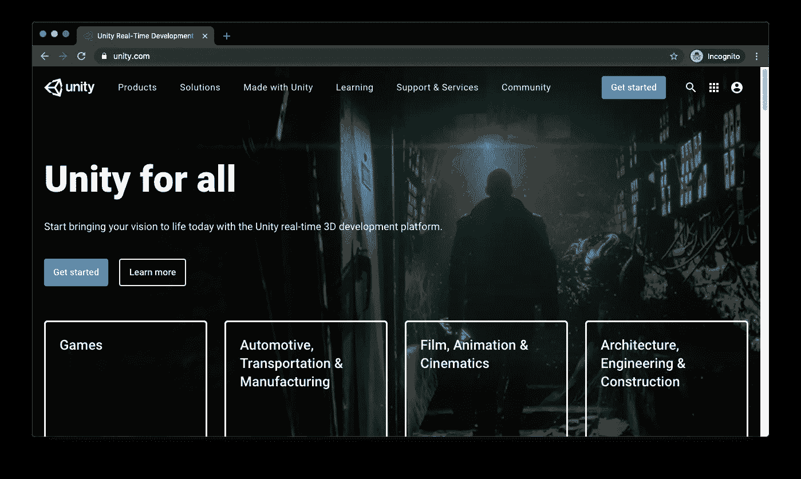
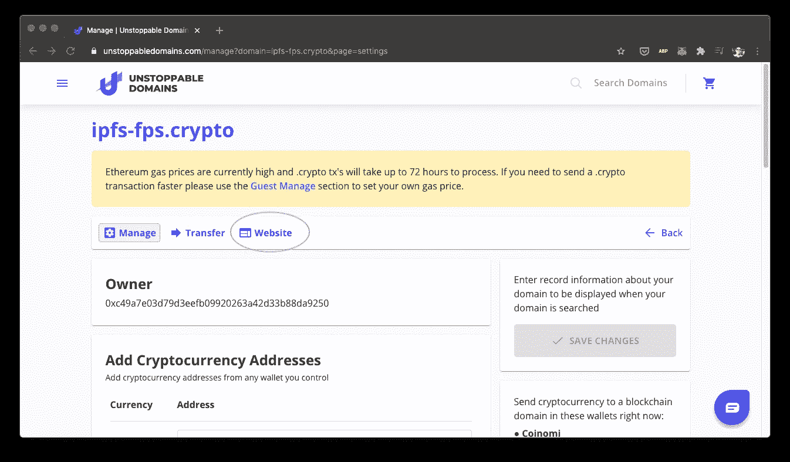

# IPFS 的团结

> 原文：<https://medium.com/coinmonks/unity-on-ipfs-e0baa792f014?source=collection_archive---------0----------------------->

## 一款分散式游戏，使用了 Unity、IPFS、Github、Fleek、Unstoppable Domains 和 Pinata。


# 概观

这篇文章将回顾:

*   Unity:安装 Unity 来为 IPFS 创建和导出你的游戏。
*   Github:将你的游戏上传到 Github 上进行持续部署。这将建立 Fleek。
*   Fleek: Fleek 从 Github 获取内容，并在 IPFS 上发布。Github 的任何更新都会自动重新发布。
*   不可阻挡的域名:为你的 IPFS 游戏购买一个人类可读的域名，并与世界共享。
*   Pinata.cloud:钉住图片等静态内容。对 meta 标签有用。

# Unity 设置

访问 [Unity](https://unity.com) 并安装。



打开 Unity Hub 并创建一个新项目。


在这个例子中，我们将使用一个预建的 FPS 游戏。


预构建的版本已经可以使用了，所以我们可以开始导出了。

文件>构建设置


选择 WebGL 并切换平台。


构建并保存您的项目。


这些文件将存放在 IPFS。


# Github 设置

创建一个 Github 账户，进入你的仓库，点击新建。


命名存储库。如果需要，初始化自述文件


将从 Unity 导出的文件添加到 Github 存储库中。


如果您不熟悉 git，只需将文件拖放到。


等等…


编写消息并提交更改。


最终结果应该是这样的


# Fleek 设置

访问[fleek.co](https://fleek.co/)并用您的 Github 帐户登录。


添加新站点。


用 Github 连接。


选择您的 Github 帐户。


允许对您的项目的权限。


连接后，选择项目。


没有多余的配置。部署网站


应该有你的

*   内容标识符(CID): `Qm...`
*   网址:`[https://foo-bar-9999.on.fleek.co](https://foo-bar-9999.on.fleek.co)`


试验


# 无法停止的域设置

访问[不可阻挡的域名](https://unstoppabledomains.com/)并搜索一个令人敬畏的名字。


添加到卡中并遵循流程。


一旦购买，访问我的域名和管理。


点击网站



添加来自 Fleek 的 CID 并保存更改


当事务等待批准时，添加不可停止的扩展。这让你可以参观。密码和。zil 域。


如果你已经购买了一个. zil 域名，并且不想安装插件，在你的域名后面加上`.sh`。例如，如果您的网站是 helloworld.zil，则使用 helloworld.zil.sh 了解更多信息，请访问 [https://zil.sh](https://zil.sh)


一旦完成，访问并分享你的分散游戏！


# Pinata 奖金！

[Pinata](https://pinata.cloud/) 提供了一个易于使用的固定服务，非常适合静态内容。上传图像:


然后在元标签中使用它。

```
<meta property="og:image" content="[https://gateway.pinata.cloud/ipfs/QmfTfFRZTac5onepjgqBFDfmnqKcG4dVEBgrNKGqpxLgaD](https://gateway.pinata.cloud/ipfs/QmfTfFRZTac5onepjgqBFDfmnqKcG4dVEBgrNKGqpxLgaD)" />
```

# 结论

本指南是构建更复杂的 web3 游戏的起点。我们希望你能接受这个想法并付诸实践(多人游戏、聊天、加密支付)。我们很高兴看到未来的迭代！

> [在您的收件箱中直接获得最佳软件交易](https://coincodecap.com/?utm_source=coinmonks)

[](https://coincodecap.com/?utm_source=coinmonks)