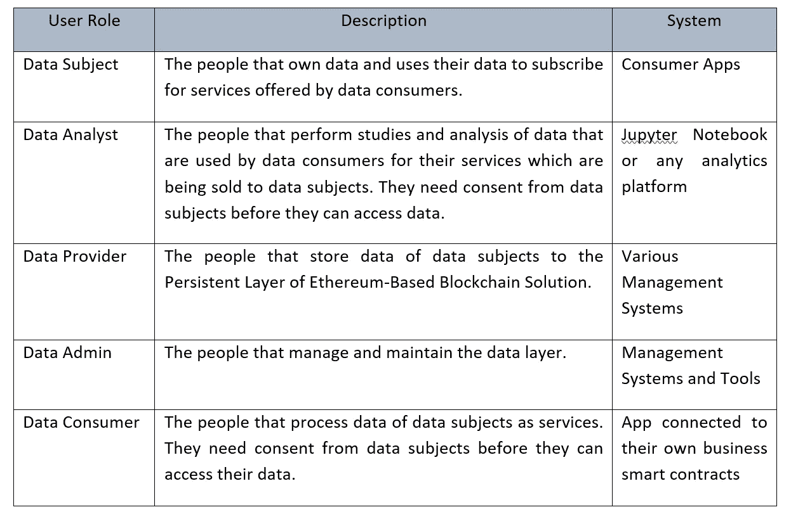
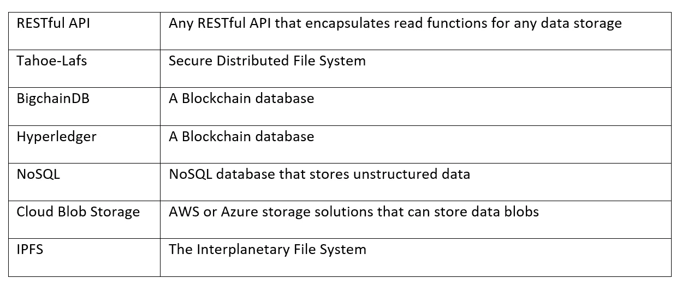

# 释放数据经济:让基于以太坊的区块链成为持久存储解决方案—第二部分

> 原文：<https://medium.com/coinmonks/unleashing-the-data-economy-making-ethereum-based-blockchains-as-persistent-storage-solutions-dcff23303e69?source=collection_archive---------0----------------------->

# 基本原理

在集中式系统中，你并不拥有你的数据。像脸书、推特和谷歌这样的中央系统确实拥有用户数据的权利。他们可以在他们的中央服务器上控制、处理和货币化你的数据。在你不知情的情况下，集中式系统会将你的私人和公共数据出售给第三方公司。

所有的集中式系统也容易被黑客攻击。黑客有可能攻击集中式服务器，因为它有单点故障。没有 100%完全不受黑客攻击的集中式服务器。据估计，仅在 2018 年上半年，就有约 450 万条数据记录遭到破坏。最近的剑桥分析公司丑闻揭露了数百万脸书用户数据被利用的情况，这是一个中央系统无法保护用户数据的典型例子。2020 年，预计数据泄露的年度成本将达到 2.1 万亿美元。

在基于以太坊的区块链，数据所有权和安全性截然不同。在以以太坊为基础的区块链，没有一个中央机构拥有注册和保存用户数据的网络。因为没有一个中央机构拥有网络，所以用户的数据归他们的实际用户所有。根据设计，基于以太坊的区块链生态系统在数学上也不会受到黑客攻击。要破解像以太坊这样著名的区块链协议，黑客必须超过整个区块链网络计算能力的 51%。以太坊大约有 25000 个分散的节点。这使得黑客攻击以太坊网络成本高昂且不切实际，因为黑客必须超过整个以太坊网络至少 51%的计算能力。到目前为止，没有已知的 51%的攻击是针对一个完善的区块链网络的。

# 真正基于同意的数据架构

用户的隐私权必须始终得到保护。用户必须同意任何希望使用其数据的人。用户应该能够控制谁可以读取和处理他们的数据，仅仅因为这是他们的数据。我认为，并非所有信息都必须保留在公共领域。例如，如果用户不希望与任何人共享个人信息，那么用户的个人信息很可能对任何人都没有什么好处。

为了保护用户对其数据的权利，我们必须在考虑同意的情况下设计基于以太坊的生态系统。可以在智能合约的不同层上建立同意，这将强制执行查看和处理用户数据的权限。征得同意后，用户可以决定是否将自己的数据分享给第三方公司。公司也可以尝试激励用户分享他们的数据进行处理和分析。这样，拥有数据的用户可以将他们的数据货币化。

为了实现真正的基于同意的数据架构，我们必须避开集中式服务器。如果我们真的想实现我们自己数据的完全自治，就不应该有一个中央机构来保存用户的数据。使用分散技术，如基于以太坊的区块链，我们可以构建一个持久层，它可以在对等存储系统(如 IPFS)中注册和管理用户数据。

# 方法

我建议在以太坊的区块链地址上注册数据。数据的存储是通过链外存储，如 IPFS。在基于以太坊的区块链地址上注册数据的困难将通过定义一个持久层来解决。持久模型将由智能契约层组成，这些层处理与数据管理和权限相关的特定责任。

为基于以太坊的区块链开发持久模型的方法将由持久层智能合约组成。持久层将处理在个人用户地址上注册并存储在链外对等网络(如 IPFS)中的数据的整体管理。我们将借用在[第 1 部分](/@andrew.tud_18529/unleashing-the-data-economy-making-ethereum-based-blockchains-as-persistent-storage-part-1-e9df2d77e840#1514-d071ccf2596a)中讨论的可靠的关系数据库原则来实现健壮的数据管理。

# 体系结构

持久层由 3 种智能合约组成，每种都有不同的责任。所有业务智能契约都需要与持久层契约进行交互，以存储和检索信息。该流程如下面的架构图所示。

## 注册表—数据接口—数据集—用户地址

## 持久层视图

## 持久层合同

# 企业图

持久层将支持 5 个主要用户:数据主体、数据分析师、数据提供者、数据管理员和数据消费者。这些角色根据其特定需求，与基于以太坊的区块链生态系统进行交互的方式截然不同。他们将通过不同的应用程序和管理系统进行交互，为数据生态系统做出贡献。下面是对他们职责的描述。

# 数据管理

数据管理员是管理基于以太坊的区块链基础设施的 IT 团队成员。数据管理员将通过数据管理系统和工具与区块链进行交互，以管理和维护基础设施。有 2 个应用程序来管理基础架构:

1.数据管理系统——将提供管理区块链数据的 CRUD 功能。此外，数据管理系统将以表格形式提供数据和模式的可视化，以方便数据管理。

2.数据分析工具—将提供交易的监控和审计功能。区块链交易的所有标签和分类器将被不对称加密，以防止数据泄露。

## 成分

数据管理有 3 个主要组件:管理应用程序、基于 Web3 的库和数据层。

1.管理系统和工具—开发数据管理系统和数据分析工具等应用程序，以促进基础架构的管理。

2.基于 Web3 的库—用于与基于以太坊的区块链交互的库。这将根据用于开发管理系统和工具的编程语言而有所不同。

3.持久层—数据管理。

# 数据提供者

数据提供者是为数据主体收集数据集的机构。它们是医院、金融机构、学校、特殊利益集团等。数据提供商将通过连接到基于以太坊的区块链的不同第三方管理系统与区块链进行交互。

## 成分

数据提供商有 4 个主要组成部分:管理应用程序、基于 Web3 的库、数据层和离线存储。

1.管理应用程序—为数据主体收集数据的第三方应用程序。

2.基于 Web3 的库—用于与基于以太坊的区块链交互的库。这将根据用于开发管理系统和工具的编程语言而有所不同。

3.持久层—链接离线存储上的数据的数据管理。

4.离线存储—任何可以被组织的存储或数据库系统。

# 数据消费者

数据消费者是利用数据主体的数据向数据主体提供特定服务的服务提供者。他们是医疗保健提供商、金融机构、教育提供商、特殊利益集团等。数据消费者将使用他们的终端应用程序与区块链进行交互，该应用程序将调用商业智能合同来处理基于以太坊的区块链上的数据。

## 成分

数据消费者有 6 个主要组件:终端应用程序、基于 Web3 的库、商业智能合同、数据层、oracle 和离线存储。

1.终端应用程序—调用业务智能合同服务的应用程序。

2.基于 Web3 的库—用于与基于以太坊的区块链交互的库。这将根据用于开发管理系统和工具的编程语言而有所不同。

3.业务智能合约-执行服务以处理数据的智能合约。

4.数据层—链接离线存储上的数据的数据管理。

5.Oracle —区块链和离线存储之间的桥梁

6.离线存储—任何可以被组织的存储或数据库系统。

# 数据主题

数据主体是数据的所有者。他们的数据由保护隐私的以太坊区块链管理和保护，如 [Enigma](https://enigma.co/) 。充当数据消费者的不同服务提供者可以利用他们的数据为他们提供特定的服务。由于数据主体拥有他们的数据，服务提供商在处理他们的数据之前需要征得同意。

## 成分

数据主体有 6 个主要组件:消费者应用、基于 Web3 的库、商业智能合同、数据层、oracle 和离线存储。

1.消费者应用程序—连接到基于以太网的区块链以访问所有者数据的应用程序。

2.基于 Web3 的库—用于与基于以太坊的区块链交互的库。这将根据用于开发管理系统和工具的编程语言而有所不同。

3.业务智能合约(可选)—执行服务的智能合约。

4.数据层—链接离线存储上的数据的数据管理。

5.Oracle —区块链和离线存储之间的桥梁。

6.离线存储—任何可以被组织的存储或数据库系统。

# 数据分析师

数据分析师研究数据主体的数据。他们是数据科学家，为数据消费者分析数据，为数据主体准确地提供服务。数据分析师在研究他们的数据之前需要得到数据主体的同意。

## 成分

Data Analyst 有 5 个主要组件:Jupyter 笔记本、基于 Web3 的库、数据层和离线存储。

1.jupyter Notebook——面向数据科学家的基于 Python 的平台。

2.基于 Web3 的库—用于与基于以太坊的区块链交互的库。这将根据用于开发管理系统和工具的编程语言而有所不同。

3.数据层—链接离线存储上的数据的数据管理。

4.Oracle —区块链和离线存储之间的桥梁

5.离线存储—任何可以被组织的存储或数据库系统。

# 非链式存储

离线存储将用于存储用户的原始数据。请注意，选项不限于以下非链存储选项:

# 许可的持久层模块视图

向基于以太坊的区块链的持久层添加许可将构成注册数据调用者和所有者的附加智能合约。调用者是得到数据所有者同意的人。调用者通过他们的以太坊地址在注册表智能契约中注册。所有者是拥有数据的人(数据所有者)。它们也通过它们的以太坊地址在注册中心智能合同中注册。

# 以前

[第 1 部分](/@andrew.tud_18529/unleashing-the-data-economy-making-ethereum-based-blockchains-as-persistent-storage-part-1-e9df2d77e840#1514-d071ccf2596a)探索了数据管理的历史。它还探讨了基于以太坊的区块链作为释放数据经济的持久数据存储解决方案的局限性和潜力。本文探讨如何在基于以太坊的区块链中创建一个持久层，使基于以太坊的区块链成为数据经济的持久存储解决方案。

> [在您的收件箱中直接获得最佳软件交易](https://coincodecap.com/?utm_source=coinmonks)

