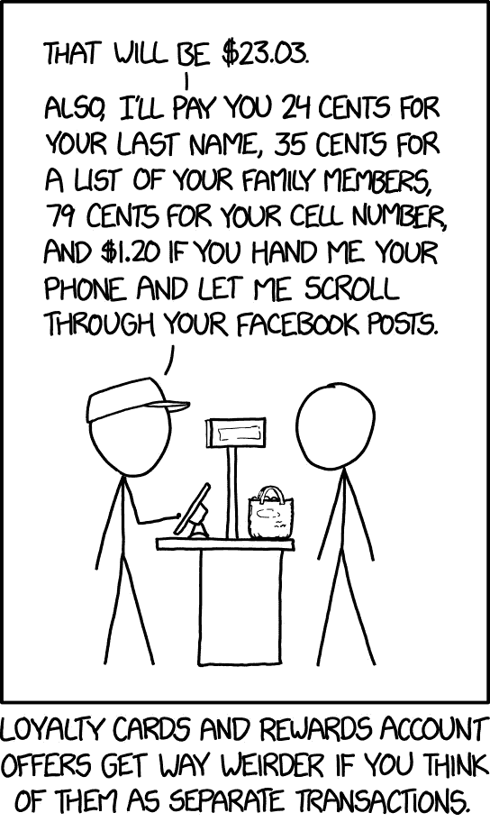
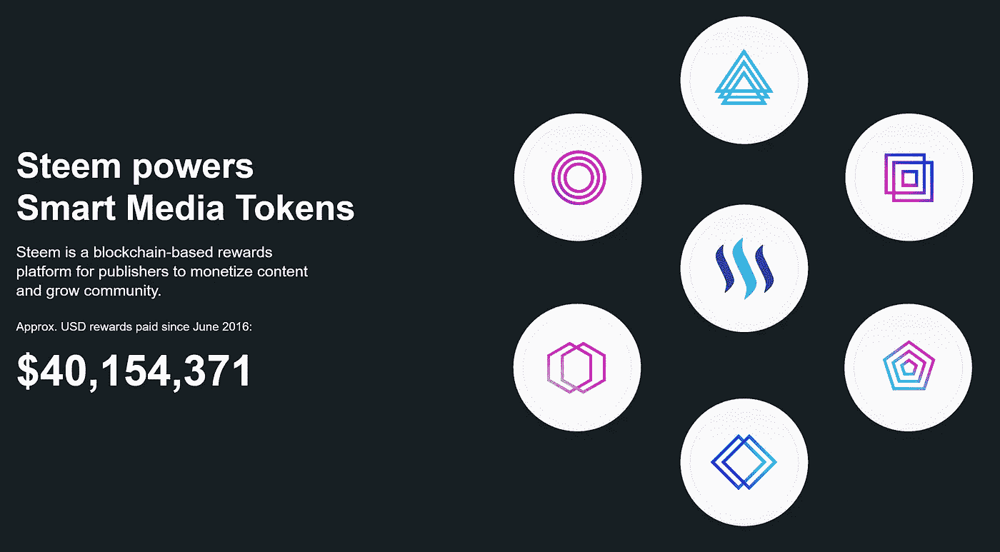

# 释放互联网的潜力

> 原文：<https://medium.com/coinmonks/unlocking-the-internets-potential-69608b6c67d4?source=collection_archive---------1----------------------->

今天的互联网坏了。在更有效地投放广告的竞赛中，我们错过了互联网的更大目标，即与其他人建立有意义的联系，并推动知识的生产。就像设计糟糕的激励机制在 2008 年至 2009 年的金融危机中让金融市场陷入瘫痪一样，广告驱动的互联网固有的激励机制正慢慢将我们推向一个日益复杂的系统，在这个系统中，只有中间商受益，而公司、创造者和用户则受损。

平均而言，在你今天访问的任何新闻网站上，都有超过 40 个追踪器，其中超过四分之三纯粹是为了衡量你作为消费者的偏好。想象一下，对于你阅读的每一篇报纸文章，都有 30 双眼睛在你身后窥视，评判你，并试图将你归入他们的人口统计类别之一。如果在现实世界中是这种情况，我们肯定会注意到，但在虚拟世界中，缺乏任何物理反馈使我们对我们允许人们收集的个人数据量一无所知。即使对那些注意到这一点的人来说，许多人认为这只是“免费互联网”的交易，在这里我们用数据交换服务。因此，要解决这个免费午餐问题，我们需要先退一步，回答以下问题:

> 我们如何资助未来的互联网？

**当前的市场:一场徒劳的演习**

Personal data as seen through the eyes of xkcd ([https://xkcd.com/2006/](https://xkcd.com/2006/))

基于广告的市场的日益增加的复杂性已经导致单个广告单元在多个网络上被反弹，因为市场试图为广告单元找到“最佳”目标。在此过程中，广告部门将产生额外的做市商费用，并获取附加到它上面的额外数据，从而导致跨多个数据库传输这些数据的能源成本增加。

对于消费者来说，这导致了更长的页面加载时间以及由于下载额外的数据而导致的成本增加。更令人担忧的是，在广告的每一站，消费者也通过出售他们的个人数据间接付费。因此，隐私也是一个大问题，尤其是在剑桥分析丑闻之后，公众越来越意识到这一点。很难说专家们没有看到它的到来，因为这是激励因素推动行业转向微观目标时的自然结果，特别是当政府几乎没有监管时，因为政府总是在技术上落后。

与消费者数据成为盈利关键相关的是，随着脸书和谷歌等平台越来越多地获得消费者数据的最大份额，平台交付渠道也变得更加集中。这是一把双刃剑，因为这些数据使这些平台的服务更加个性化，但这种自上而下的权力结构也存在扼杀替代观点的真实风险。这可以从 YouTube 的去货币化事件中看出，公司开始撤出广告，因为他们不想与有争议的观点联系在一起。受此影响最大的是内容创作者，他们减少了对替代媒体的讨论。

除了广告欺诈和广告不当的风险之外，按印象付费的激励机制还导致了一个我认为更大的问题:点击诱饵。这不仅让用户感到沮丧，而且总的来说，大量的资源被浪费在产生没有价值的内容上，除了获得点击，或者在最糟糕的情况下，当它处于最有效的状态时，煽动两个群体之间(特别是政治群体之间)的争议和愤怒。

广告什么时候变得令人毛骨悚然了？

如果你想一想过去的传统广告，这些广告被分发在它们具有最高可见度的地方。这可能是当地报纸的头版，繁忙高速公路旁的广告牌，甚至是 21 世纪初《黑道家族》(The Sopranos)节目之间的商业广告。定向广告当时很有限，因为他们对顾客的了解最多是，他们喜欢看人们被抽雪茄、穿西装、听起来像意大利人的男人屠杀。即便如此，我认为他们能销售的产品范围可能非常有限。这不像今天，在谷歌上简单地搜索更健康的食物选项会导致减肥产品的无休止的轰炸。

互联网是让公司开始为其所有客户形成虚拟身份的关键，社交媒体档案的兴起也大大有助于这一点。自 iPhone 发布以来，随着个人智能设备的兴起，这一点变得更加明显。几年前公司只能梦想的数据财富突然变得可用。那些能够梳理海量数据的公司最有能力应对未来，因为驱动它们利润的石油基本上是免费的，而消费者很难意识到他们留下了数字足迹。

事后来看，这很容易说，但基于将广告匹配到目标消费者的激励结构的可能结果是，一个市场将涌现出尽可能多的用户数据。因此，在传统经济中，由于技术的限制，价格发现总是需要一个可信的第三方。这增加了广告市场的复杂性，因为公司开始从优化他们自己的匹配算法中获利。与任何系统一样，系统越复杂，引入系统的潜在故障点就越多。

我们有什么选择？

*广告*

*   优点:用户不会直接产生成本；公司现在有更多的数据可以洞察社会如何运作，但这些数据隐藏在各自的筒仓中
*   缺点:用户数据成为广告市场上的商品；用户对自己数据的所有权成为灰色地带；加载页面时延迟增加；数据载体对每页加载的额外数据收费；按印象付费导致点击诱饵；内容平台交付渠道的集中化

*免费增值(内容有付费墙，免费用户可以访问非独家内容)*

*   优点:公司能够决定哪些内容是公开的；通过转换率，公司能够不断测试价格点
*   缺点:由于覆盖面广，更倾向于大玩家；内容仅限于能够付费的用户；内容是孤立的

*免费增值(内容具有有限的付费墙，免费用户可以访问有限数量的内容)*

*   优点:允许用户选择适合他们内容限制的内容；公司能够看到真实的现场行为，因为没有受限制的内容
*   缺点:由于覆盖面广，更倾向于大玩家；考虑到内容限制，无力付费的用户将不得不自觉地导航

*订阅(用户付费以在固定时间段内访问内容)*

*   优点:公司可预测的收入流；用户的最佳观看体验
*   缺点:纯订阅模式是不可持续的，因为品牌发现是不可能的；如果用户只需要访问单个产品/内容，订阅可能会非常昂贵

*小费平台(用户可以免费获取内容，并能够通过小费机制直接向内容创作者付费)*

*   优点:用户能够直接支持他们喜欢的创作者；更少的资源将流向中间商，创作者从这种效率的提高中受益
*   缺点:进行微交易的成本使其不太可行，尽管加密货币的潜在使用将大大降低交易成本；偏爱以付得起小费的用户为目标的内容；如果算法没有针对内容多样性进行优化，则“赢家通吃”的风险更高

*代销商/销售线索生成*

*   优点:内容本身将公司与相关用户相匹配；研究强调，当用户对熟悉的面孔更加信任时，当地有影响力的人能够获得更高的转化率
*   缺点:内容将由公司策划；随着关注者数量取代内容质量成为公司的一个关键指标，资源向最有影响力的人集中

*浏览器内加密挖掘*

*   优点:侵入性最小，因为不需要身份跟踪；由于用户在网站上花费的时间决定了加密挖掘的数量，创作者受到激励去创造更吸引人的内容
*   缺点:由于挖掘可以在所有智能设备上进行，这将有利于使用更高效设备的用户；能源和数据传输的成本；由于节流，设备寿命缩短

从上面可以看出，许多模式都有自己的权衡，这就是为什么基于广告的模式仍然存在，因为改变的动机还不足以迫使人们转向另一种模式。在接下来的部分，我们将看看一些公司提出的解决这个问题的创新方案。

**中等**

Medium 已经成功地完全摆脱了广告，同时仍然允许在它的平台上自由分享想法。中型模式允许任何人查看平台上的所有内容，但将非付费注册用户的优质文章数量限制为每月 3 篇。对于每月支付 5 美元订阅费的用户来说，他们将可以无限制地访问所有优质文章，外加一些额外的好处，如音频旁白和离线阅读。

Medium 在增强内容创作者能力方面所做的一件重要事情是，让他们能够决定哪些内容被视为优质内容，创作者只能从优质内容中获得报酬。在创作者如何获得报酬方面，5 美元的订阅费在月底根据阅读时间和用户当月互动的所有优质文章的掌声数(媒体自己的投票机制)按比例分配。

媒介模式成功地平衡了免费获取内容的需求，同时也使创作者能够获得报酬。也就是说，这种模式也有一些问题。其中的关键是，付费墙仍然存在，平台上的文章分为优质和公共文章。鉴于 Medium 拥有的唯一收入来源是其订户，可以理解为什么需要这么做，但这是以思想被孤立为代价的。因此，在向非付费会员显示付费内容和公开内容之间需要有一个很好的平衡。对于不想付费或者很难付费的人，一定要有意识的选择自己想看的优质文章。

与优质内容的商业化相关的另一个挑战是，创作者只能从他们认为优质的内容中获得报酬。抛开很难确定哪些文章会传播的事实不谈，这种模式要求创作者在将内容货币化或通过免费发布获得更多曝光之间做出权衡。理想情况下，货币化和曝光应该齐头并进，因为如果创作者分享的知识对读者有价值，他们就应该得到回报。

Medium 作为一个想法分享平台的一个主要挑战是，匿名参与是不可能的，因为支持它的支付渠道只有信用卡或 PayPal，这两种渠道都将有效地将帐户与用户的身份联系起来。仍然可以使用匿名电子邮件帐户参与，但是这些用户将不能支付或接收任何金钱支付。鉴于 media 是一个单一的平台，这也意味着该平台容易受到审查，正如 media 在中国被禁以及此前在马来西亚等国被禁一样。如果要鼓励思想和言论，抵制审查将是互联网未来的关键。

**勇敢**

Brave 采取了一个相当创新的步骤，为用户提供对他们的数据以及他们如何选择资助他们最喜欢的创作者的更多控制。Brave 的目标是在保护用户隐私的同时将出版商的内容货币化。为了做到这一点，他们推出了勇敢的浏览器和附带的基本注意力令牌(BAT)。

勇敢的浏览器为用户充当了互联网的门户，很像谷歌 Chrome、Mozilla Firefox 或微软 Edge (Internet Explorer)。对于使用 Brave browser 的用户来说，浏览互联网的体验将基本相同，尽管速度更快、更安全、更隐私，因为浏览器会自动屏蔽第三方广告和追踪器。

Brave 带来的最大创新是，用户将不必改变他们的网络浏览行为，甚至会受到激励，转而使用 Brave 浏览器，同时保护用户数据，提高广告市场的效率。这是通过 Brave 浏览器实现的，该浏览器在浏览器级别上秘密监控用户意图，并对这些数据进行加密，仅存储在设备上。浏览器通过各种算法来跟踪参与度，这些算法计算活动标签上的广告被观看的时间。设备内的机器学习将匹配相关广告，而公司将能够通过分散的广告市场购买广告空间。

此外，通过基本注意力令牌(BAT)，一种 ERC-20 令牌，这些微交易变得更有效。通过购买广告空间，广告商将 BAT 存入锁定状态，该状态仅在用户查看广告时打开，从而允许来自该账户的钱被分配给 Brave、出版商以及用户的钱包。因此，BAT 实际上是对用户注意力的货币估价。

Brave 成功的关键在于，他们的收入流不仅限于广告，因为 BAT 通过让用户间接为他们最喜欢的创作者做出贡献来增强创意内容。该平台的用户可以选择留出一个月的贡献金额，该金额按比例分配给他们当月参与最多的注册 Brave publisher 网站。这使得竞争更加公平，因为内容创作者不必被锁定在按印象付费的循环中。

这种设计的一个可能的痛点是，对于内容创作者来说，他们必须向 Brave 注册成为出版商，因此 Brave 仍然拥有验证和审查的权力。此外，就目前情况而言，浏览器内置的勇敢钱包目前只是单向的，未来将更新为需要了解客户程序的多方向转账。也就是说，Brave 基础设施是开源的，Brave 作为一个整体对他们的团队和方向非常透明。Brave 正计划在未来走向完全分布式的微支付系统，这是令人兴奋的，因为创作者将获得更多的收入流。

**Steemit**

Steemit 是一个社交媒体平台，每个人都可以通过创建和管理内容获得报酬。Steemit 颠覆了传统的价值交换体系，让社区为社区整体认为有价值的内容向创作者付费。这是通过相对复杂的平台架构实现的，该平台架构的核心由 STEEM 令牌提供支持。

在不涉及太多技术细节的情况下，用户可以对平台上的内容投赞成票或反对票，这些选票的分配将决定奖励池如何分配给内容的创作者和推广者。用户对分发的影响与他们在网络中拥有的 STEEM 令牌的数量成正比。奖励池不是凭空产生的，而是用户将其 STEEM 令牌授予网络的结果。在一个简化的层面上，这个奖励池可以被认为是网络产生的利息的一部分，一旦所有的利息支付已经支付给授予他们令牌的个人用户(对于那些熟悉区块链的人来说，这基本上是块奖励)。因此，当用户投票支持一个帖子时，买单的是社区。

尽管这项创新具有开创性，但它也有一些缺点。其中最主要的是集中化风险，因为用户的投票权与他们在网络中拥有的 STEEM 数量成正比。因此，STEEM 的较大持有人能够不成比例地影响公共话语，因为他们的投票将对哪些内容被推广或隐藏产生重大影响。围绕这一点有很多讨论，但这是一个可以通过限制或权力下放来解决的问题。Steem 自己正试图通过授权投票使分配更加公平。

此外，Steemit 面临的问题是，这个生态系统只能通过单一平台访问。因此，它要求用户购买网络，尽管有一个匿名注册的选项。尽管如此，对于许多用户来说，这将是采用的一个重大障碍，因为不仅存在对改变的阻力，而且内容本身也仅限于 Steemit 平台。

**来自中等、勇敢和坚定的教训**

以上所探讨的所有公司(除了 Medium 中的非付费用户)的关键是，用户不必在每次交互的基础上做出付费决定。因此，用户能够自由地导航平台/网络，而不必担心招致额外的费用。这对互联网的未来至关重要，因为用户担心的不一定是金钱成本，而是决定一个网站是否值得付费所伴随的不确定性。

此外，通过经由各种投票机制分配资源，激励社区继续创建被社区整体重视的吸引人的内容。这种在网络中构成价值的主观性将使生态系统继续增长。

**结论**

鉴于我们上面所探讨的，我相信有一些设计原则将有助于创造一个更好的互联网:

*   除了价值来源于排他性的金融交易等内容，互联网上的内容将不得不保持免费，以减少围绕微支付的决策焦虑。这将确保每一个能够访问互联网的人也能够平等地获取知识。有效的内容和品牌发现也取决于这个想法。
*   鉴于数字资产非常容易被复制，内容的不变性也将是使数据能够被自由访问的关键。这将确保原创内容创作者的辛勤工作得到回报。因此，区块链很可能在未来的内容分发中扮演重要角色。
*   将需要一种投票机制来表明用户在网络上的价值。这将使生态系统不断发展，与社区整体认为有价值的东西保持一致。
*   参与这个网络将基于每个用户愿意为他们所参与的社区贡献多少，无论是通过货币(贡献池、小费或购买附属产品)还是非货币方面(劳动或个人数据)。
*   为了确保一个繁荣的生态系统，网络将不得不补贴一些费用，以便在网络上看到替代的视图。
*   广告可能仍将发挥作用，因为消费者和公司仍将从这种关系中受益。然而，广告市场可能会在所需数据最少的基础上运作。此外，这些数据必须匿名，并由用户自己拥有。如何使用这些数据的透明度也是赢得消费者信任的关键。
*   增值服务对平台的可持续性很重要，但这必须是可选的，不能以牺牲平台的可用性为代价。例如，为额外的存储空间甚至贴纸付费，会给那些需要它的人带来真正的价值，而不会损害非付费用户的可用性。这些服务的营销必须与道德设计选择相平衡。

上述原则只是未来互联网设计的起点。我很想听听你对这一点和其他方式的想法，我们可以建立一个更好的互联网，鼓励有意义的互动。

谢谢你坚持到最后。希望听到你的想法/评论，所以请留言。我在 twitter 上很活跃[*@*AwKaiShin](https://twitter.com/awkaishin)*如果你想收到更多易消化的密码相关信息，或者访问我的* [*个人网站*](https://www.awkaishin.com/) *如果你想要我的服务:)*