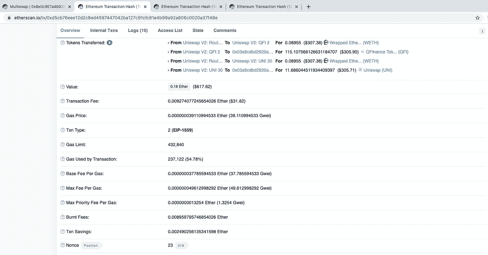
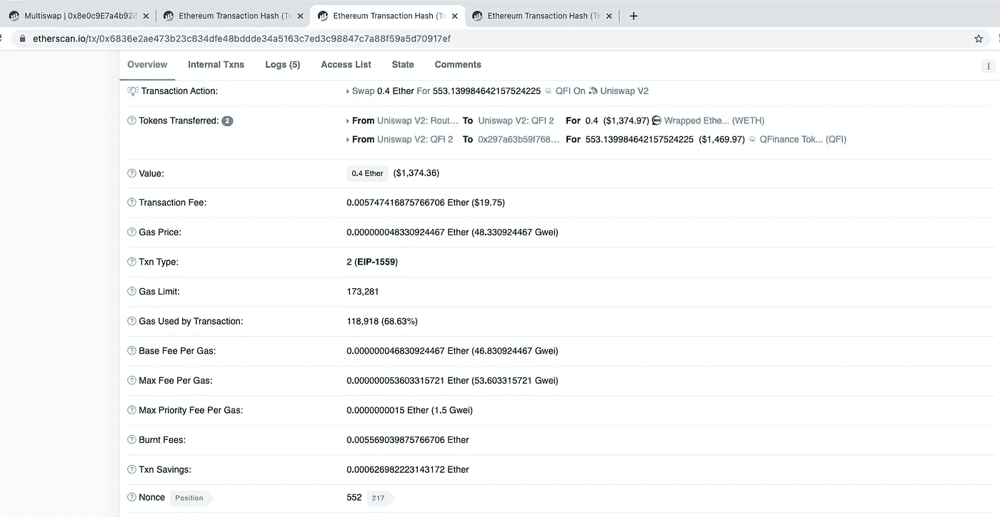
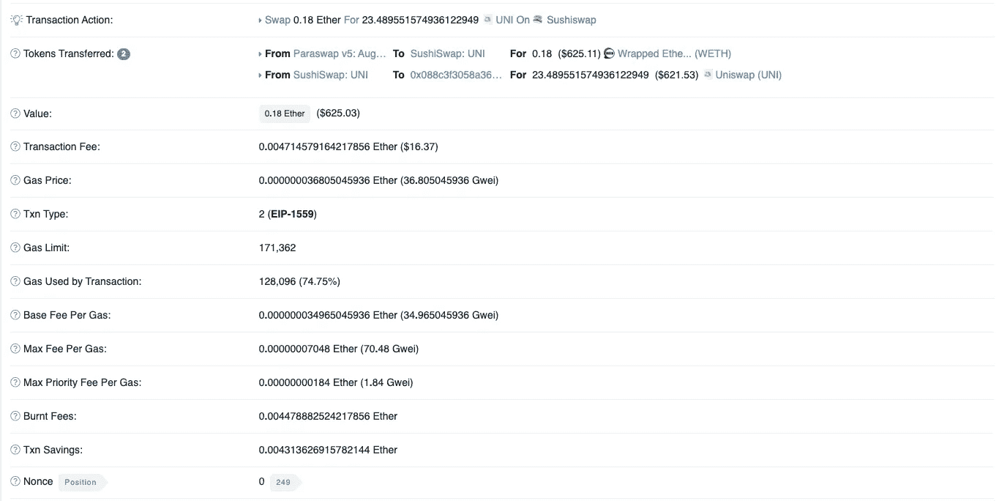

# 揭开 Multiswap 路由器的面纱

> 原文：<https://medium.com/coinmonks/unveiling-the-multiswap-router-89c3203b9266?source=collection_archive---------5----------------------->

我们的 multiswap 路由器终于完成了，可以在以太坊、币安智能链、Polygon 和 Avalanche 主网上使用了！

以上网络均可在 0x 8 E0 c 9 e 7 a4 b 9285 a2 c 671942 ECE 944175 a 52874 a 7 找到合约。

除了上面的网络，我们计划在不久的将来支持 Arbitrum。我们鼓励我们的社区分享他们希望我们支持的其他第 2 层/二级区块链。

**动机是什么？**

在 QFinance V1 公司，互换功能直接内置于资金池合同中。这意味着联营合同部署成本高昂，并且只能单独使用。

分离池已经具有的 multiswap 功能(具有重大改进)以部署成本的一小部分向投资池提供相同的功能。此外，它可以由其他合同使用，也可以由用户直接使用。

我们的目标是构建一个模块化、可扩展的 DeFi 套件。将 multiswap 合同从投资池中分离出来是这条道路上的第一步。

> 订阅 [**Coinmonks Youtube 频道**](https://www.youtube.com/c/coinmonks/videos) 获取每日加密新闻。

**有什么好处？**

*   将多个掉期批量处理为一个交易，节省了等待多个 DEX 掉期单独结算所需的时间和精力。
*   一次进行多次交换时节省汽油。互换捆绑在一起更便宜，节省的汽油随着互换数量的增加而增加。
*   提交交易以利用短期天然气价格波动。如果天然气意外下降，你可以进行多次交换，这比你必须分别签署和广播每个交换要快得多。

**关于节约汽油**

通过将多个交易捆绑成一个交易，从而节省额外交易的基本天然气成本，可以节省天然气。一个令牌，汽油节省为零。您可以通过两次互换看到节省。随着你开始添加更多的代币，汽油节省更加明显。

This image shows a two token swap using the multiswap router. Note the gas used: 237,122.

现在，请点击此处查看 QFI 个人掉期的直接 Uniswap 交易:

Direct swap for QFI on Uniswap. Note gas used: 118,918.

这里有一个直接交换 UNI 的 Sushiswap。Sushiswap 和 Uniswap v2 具有相同的代码，因此可以公平地进行比较:

Swap on Sushiswap ETH — UNI. Note gas used: 128,096.

在 Uniswap 上执行两次相同的操作将等于 247，014 的油费，高于 multiswap 路由器使用的 237，122。这一差额将随着每次互换而增加。

**合同有哪些限制？**

这份合同没有魔力。气费还是吸，这并没有“解决”以太坊交易费。如果您需要进行多种代币交换，这是一个可以帮助您在当前汽油形势下实现价值最大化的工具。

它专为其所在网络的主要索引而设计(Uniswap、Pancakeswap、QuickSwap 和 Pangolin)。我们的计划是在未来建立我们自己的聚合器，以节约汽油为首要考虑。这样，我们的用户将同时获得最优惠的价格和最节省的汽油。对于 99%的代币，当前合约将返回最佳价格，但如果您交易的是小盘股，我们建议您仔细检查。

审计怎么样了？

我们将很快发布另一篇关于审计的帖子，这样我们可以更深入地讨论它。我们的审计已经完成，我们的合同可以安全使用。