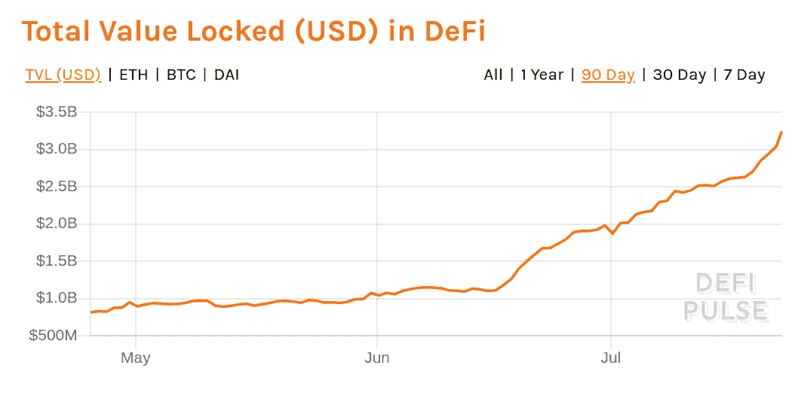

# Upbit 黑客向币安发送了超过 59K ETH 美国银行现在可以监管加密资产/ DeFi 超过 30 亿美元

> 原文：<https://medium.com/coinmonks/upbit-hackers-sent-more-than-59k-eth-to-binance-us-banks-can-take-custody-of-crypto-assets-now-3a1022110a87?source=collection_archive---------7----------------------->

嘿，

我希望你是安全的。让我们开始本周的更新。

Now more than $3 billion is locked in DeFi protocols. [source](https://defipulse.com/)

## 秘密交易🆓

想在收件箱中直接收到最新的加密交易吗？报名 [***这里***](https://coincodecap.com/)

*   [Holderlab](https://coincodecap.com/product/holderlab-0?scroll=deal) —自动化您的加密组合
*   [CoinTracking](https://coincodecap.com/product/cointracking-8?scroll=deal) —加密税务解决方案九折优惠
*   [加密 API](https://coincodecap.com/product/crypto-apis-8?scroll=deal)—加密、区块链和市场 API 享受 70%的折扣

## 最新消息📰

*   [监管机构称，美国银行现在可以提供密码保管服务](https://www.coindesk.com/banks-in-us-can-now-offer-crypto-custody-services-regulator-says)
*   [黑客如何利用密码交换洗白数百万美元？](https://blog.bitquery.io/upbit-hack-crypto-money-laundering)
*   [分散金融现在是一个 30 亿美元的产业，还是一个泡沫](https://decrypt.co/36237/decentralized-finance-is-now-a-3-billion-industry-or-a-bubble?ref=coingecko)
*   [波尔卡多特现在没有权限](/polkadot-network/polkadot-launch-phases-3-4-8cb2e8c2a187)
*   [币安完成第 12 季度 BNB 烧伤](https://www.binance.com/en/support/articles/44d873922bf24317ac314d9f0665729b-Binance-Completes-12th-Quarterly-BNB-Burn)
*   [2020 批 CoinList 种子公司](https://blog.coinlist.co/announcing-the-summer-2020-batch-of-coinlist-seed-companies/)
*   维塔利科·布特林警告高额费用威胁以太坊的安全
*   [以太坊‘Flippens’比特币成为使用最多的区块链](https://cointelegraph.com/news/ethereum-flippens-stablecoins-to-become-the-most-used-blockchain)
*   [苏斯博士收藏品加密时，神秘小猫遇到了戴帽子的猫](https://decrypt.co/36223/cryptokitties-cat-in-the-hat-dr-seuss-collectibles-go-crypto?ref=coingecko)
*   [俄罗斯将密码视为应税财产](https://www.coindesk.com/russia-to-treat-crypto-as-a-taxable-property)
*   [PayPal 选择 Paxos 为新服务提供密码](https://www.coindesk.com/paypal-picks-paxos-to-supply-crypto-for-new-service-sources-say)
*   [GPT 3 号是什么，我们应该害怕吗？](https://www.coindesk.com/gpt3-what-is-it-and-should-we-be-terrified)
*   梦想 1000% APY 产量的农民向 YFI 投入数百万美元
*   [mStable 在没有告知社区的情况下解锁了 300 万代币](/mstable/mta-emission-important-update-d1332bed0374)
*   [北京透露 145 页蓝图要做区块链枢纽/ JP 摩根亮相新加坡支付网络/无代码区块链整合](/coinmonks/beijing-reveals-145-page-blueprint-to-be-blockchain-hub-jp-morgan-debuts-singapore-payment-584174d40b5)

## ☺️的好作品

*   [以太坊 2.0 经济评论](/@thomasborgers/ethereum-2-0-economic-review-1fc4a9b8c2d9)
*   [比赞廷定律](/@apbakst/bizantines-law-c9bc93529e89)
*   [Yallo，一种新的 Tezos 语言](/coinmonks/yallo-a-new-tezos-language-f1298069d268#b077-f3d484888094)
*   [Twitter Hack——使用 Coinpath 实时追踪比特币犯罪](https://blog.bitquery.io/twitter-hack-tracking-bitcoin-using-coinpath)

使用[**n . exchange**](https://bit.ly/301vKd6)在一小时内建立一个加密交易所。

> *加入我们的* [***电报频道***](https://t.me/joinchat/FyuZERD5oyp6LWbwLASOKQ)**来谈谈新的密码产品和区块链生态系统。**

## *在 Coinmonks 上发布*

*如果你喜欢在 crypto/区块链空间上写教育文章，并且想在 Coinmonks 出版物上发表。只需发邮件给我***【gaurav@coincodecap.com】****或者 DM 我**[***推特***](https://twitter.com/coinmonks)**

> ***“我们是一个非宣传性和非营利性的教育出版物，如果您喜欢阅读* [*【金和尚】*](https://medium.com/coinmonks)*[*您也可以捐助我们*](/coinmonks/monks-need-your-help-7440418d67ec) *。****

> ***[*在您的收件箱中直接获得最佳软件交易*](https://coincodecap.com/?utm_source=coinmonks)***

******

******暂时就这样吧，送我❤️，下次再说。******