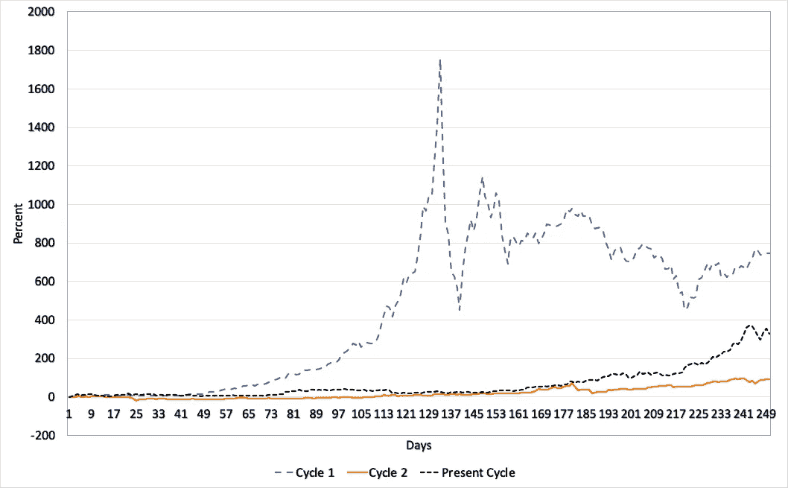
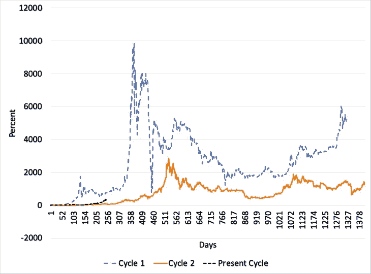

# 更新(1):周期减半和比特币价格

> 原文：<https://medium.com/coinmonks/update-1-halving-cycles-and-bitcoin-price-35904cb691a7?source=collection_archive---------4----------------------->

## 第三周期第 250 天

2020 年 12 月 20 日，我发表了文章[周期减半和比特币价格](/coinmonks/halving-cycles-and-the-bitcoin-price-7b95130f74d0)。此时，比特币已经进入第三个减半周期(2020 年 12 月 19 日)223 天。我们现在已经进入第三个周期 250 天了(2020 年 1 月 15 日)。从那以后，发生了很多事情，我想简单地告诉你比特币现在的情况。

Graph 1: Percentage change in bitcoin price since the halving event. All three cycles. 223 days into the cycle (halving day included) (Datasource: investing.com)

在 223 天之后，已经可以看到当前周期正在脱离第二个减半周期。然而，这一趋势并不像现在这样明显。随着比特币价格从 2020 年 12 月 19 日的 23.844 美元上涨到 2020 年 1 月 15 日的 36.845 美元，这一趋势似乎已经得到证实，看起来当前的周期已经与第二个周期脱钩，如在**图 1** 和**图 2** 中可以看到的。它已经远离了第二周期。虽然比特币的表现优于第二周期，但距离第一周期的表现仍有一段距离。它目前在两者之间的某个地方清晰可见，这在 27 天前是不可见的。

如果趋势继续发展，当前周期优于周期 2，那么这个周期的新 ATH 将在 254.650 美元以上。

更多定期更新请在 Twitter 上关注我: [@JanWues](https://twitter.com/JanWues)

披露:上述文章引用了一种观点，仅供参考。它无意成为投资建议。

Graph 2: Percentage change in bitcoin price since the halving event. All three cycles over the whole cycle (Datasource: investing.com)