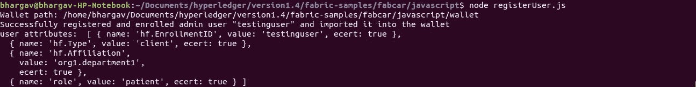
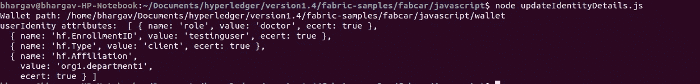

# 使用节点 SDK 更新 Hyperledger 结构中的身份

> 原文：<https://medium.com/coinmonks/update-an-identity-in-hyperledger-fabric-using-node-sdk-1b93edb6cb2b?source=collection_archive---------0----------------------->

Hyperledger Fabric 使用认证机构和加密工具为网络中的任何身份生成加密材料。Cryptogen tool 仅用于开发目的，但实际上使用认证机构是首选。如果任何用户想在网络中进行交易，用户需要有一个证书，该证书将由为该组织注册的管理员生成。因此，我们首先需要在组织中注册管理员，然后注册，使用管理员上下文注册用户。这可以使用 Fabric Node SDK 中的 CertificateAuthority 类来完成。


当你这样做时，让我们以织物样品中的 fabcar 为例。/startFabric.sh，结构网络将启动并运行，在对等体中安装并实例化 chaincode。如果您需要使用 node SDK 从客户端进行交易，您可以运行 enrollAdmin.js 来注册 Admin，它会在您提供的 wallet 文件夹中为 admin 生成密钥对和证书，还可以运行 registerUser.js 来注册 enroll User，它会为 user 生成相同的密钥对和证书。我们使用用户证书来调用 chaincode 方法和提交事务。我们可以将自定义属性传递给用户证书，用户证书可用于在链码中执行访问级别控制，我们称之为基于属性的访问控制(ABAC)。假设您想要更改证书属性，一种方法是我们可以根据您提供的 MaxEnrollment 参数多次重新注册用户。这将在您每次注册用户时生成新的证书。另一种方法是使用来自节点 SDK 的 IdentityService 更新证书属性。让我们来看看它。

让我们尝试用自定义属性注册用户“testinguser”。我们创建一个名为“role”的自定义属性，并为其赋值“patient”。

```
 attrs: [{ name: “role”, value: “patient”, ecert: true }]
```

就是你添加自定义属性的方式。

下面是 registerUser.js 的代码，自定义属性是在注册用户时添加的

```
'use strict';const { FileSystemWallet, Gateway, X509WalletMixin } = require('fabric-network');
const path = require('path');
const ccpPath = path.resolve(__dirname, '..', '..', 'first-network', 'connection-org1.json');async function main() {try {// Create a new file system based wallet for managing identities.const walletPath = path.join(process.cwd(), 'wallet');
const wallet = new FileSystemWallet(walletPath);
console.log(`Wallet path: ${walletPath}`);// Check to see if we've already enrolled the user.const userExists = await wallet.exists('testinguser');
if (userExists) {
console.log('An identity for the user "testinguser" already exists in the wallet');
return;}// Check to see if we've already enrolled the admin user.const adminExists = await wallet.exists('admin');
if (!adminExists) {
console.log('An identity for the admin user "admin" does not exist in the wallet');
console.log('Run the enrollAdmin.js application before retrying');
return;}// Create a new gateway for connecting to our peer node.const gateway = new Gateway();
await gateway.connect(ccpPath, { wallet, identity: 'admin', discovery: { enabled: true, asLocalhost: true } });// Get the CA client object from the gateway for interacting with the CA.const ca = gateway.getClient().getCertificateAuthority();
const adminIdentity = gateway.getCurrentIdentity();// Register the user, enroll the user, and import the new identity into the wallet.const secret = await ca.register({ affiliation: 'org1.department1', enrollmentID: 'testinguser', role: 'client', attrs: [{ name: "role", value: "patient", ecert: true }] }, adminIdentity);const enrollment = await ca.enroll({ enrollmentID: 'testinguser', enrollmentSecret: secret });const userIdentity = X509WalletMixin.createIdentity('Org1MSP', enrollment.certificate, enrollment.key.toBytes());await wallet.import('testinguser', userIdentity);console.log('Successfully registered and enrolled admin user "testinguser" and imported it into the wallet');// retrieve the registered identityconst identityService = ca.newIdentityService();const retrieveIdentity = await identityService.getOne("testinguser",adminIdentity)console.log("user attributes: ",retrieveIdentity.result.attrs)} catch (error) {console.error(`Failed to register user "testinguser": ${error}`);process.exit(1);}}main();
```

您可以看到控制台中记录的身份详细信息，其自定义属性“role”的值为“patient”。



让我们试着将属性“角色”从病人改为医生，

以 CLI 方式进行，

```
fabric-ca-client identity modify testinguser --json '{"secret": "newPassword", "affiliation": ".", "attrs": [{"name": "role", "value": "patient"}]}'
```

如果您想使用 Node SDK 更改属性，可以使用 IdentityService 类来创建/更新/删除/检索身份。

让我们看看下面的代码，

```
'use strict';const { FileSystemWallet, Gateway, X509WalletMixin, User } = require('fabric-network');const path = require('path');const ccpPath = path.resolve(__dirname, '..', '..', 'first-network', 'connection-org1.json');async function main() {try {// Create a new file system based wallet for managing identities.const walletPath = path.join(process.cwd(), 'wallet');const wallet = new FileSystemWallet(walletPath);console.log(`Wallet path: ${walletPath}`);// Check to see if we've already enrolled the user.const userExists = await wallet.exists('testinguser');if (!userExists) {console.log('An identity for the user "testinguser" does not exist in the wallet');console.log('Run the registerUser.js application before retrying');return;}const gateway = new Gateway();await gateway.connect(ccpPath, { wallet, identity: 'admin', discovery: { enabled: true, asLocalhost: true } });const ca = gateway.getClient().getCertificateAuthority();const adminIdentity = gateway.getCurrentIdentity();const identityService = ca.newIdentityService();let updateObj = {type:"client",affiliation:"org1.department1" ,attrs: [{ name: "role", value: "doctor", ecert: true }] ,caname:"ca_peerOrg1"}// update identityconst response = await identityService.update("testinguser",updateObj,adminIdentity)console.log("userIdenity attributes: ",response.result.attrs)} catch (error) {console.error(`Failed to update "testinguser" attributes: ${error}`);process.exit(1);}}main();
```

当您运行代码时，您可以看到值为 doctor 的修改后的“role”属性的详细信息。太好了！



这样，您可以在 Hyperledger Fabric 中更新身份详细信息，而无需重新注册。

快乐学习！！！

> [在您的收件箱中直接获得最佳软件交易](https://coincodecap.com/?utm_source=coinmonks)

[](https://coincodecap.com/?utm_source=coinmonks)