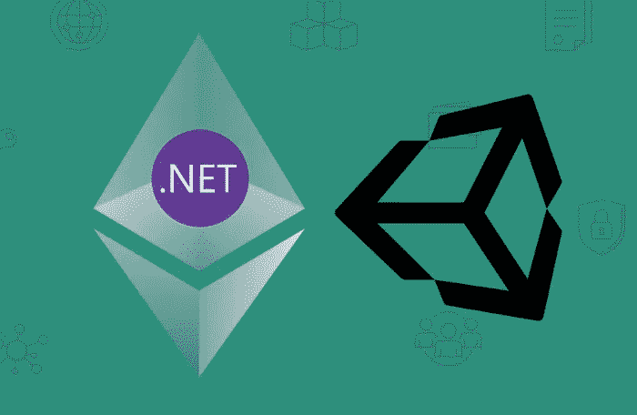

# 更新 Unity 中的智能合同数据

> 原文：<https://medium.com/coinmonks/updating-smart-contract-data-in-unity-419473bafb03?source=collection_archive---------1----------------------->

## 更新 Unity 中的区块链数据

# 概观

本文将介绍如何在 Unity 中更新/更改以太坊智能合约中的数据。

**先决条件**

*   创建了一个 Unity 项目
*   进口尼瑟姆图书馆
*   部署了智能协定:带有协定地址的代码
*   下载了 [VS 代码](https://code.visualstudio.com/)和 [Solidity 插件](https://marketplace.visualstudio.com/items?itemName=JuanBlanco.solidity)

如果您还没有完成先决条件，请查看[第 1 部分:在 Unity 中使用以太坊](/coinmonks/part-1-using-nethereum-in-unity-54e62f7e65d5)和[创建和部署以及以太坊排行榜](/coinmonks/create-and-deploy-an-ethereum-leaderboard-1ba60dba1495)。

# 创建 C#定义

(这些指令类似于[从 ETH](/coinmonks/part-2-using-nethereum-in-unity-5b09f2d8c718) 获取数据)

在 VS 代码中打开[坚固性代码](https://gist.github.com/leon-do/d5850bf39fd7710bc365764d1c0d1c8d)。确保[坚固性插件](https://marketplace.visualstudio.com/items?itemName=JuanBlanco.solidity)已安装。右键单击合同并选择`Solidity Compile and Code generate CSharp contract definition`下面是一个[排行榜](https://github.com/IPFS-FPS/leaderboard-solidity-contract)合同的示例。

它应该在`/CONTRACT_NAME/ContractDefinition/CONTRACT_NAME_Definition.cs`下生成一个合同定义

这里有一个`LeaderboardDefinition.cs`的例子

注意`AddScoreFunction`用于更新排行榜。它接受两个参数

1.  用户
2.  得分

这个文件应该被复制到 Unity 项目中。

# 向 Unity 添加 C#定义

打开你的 Unity 项目，确保尼瑟姆`.dll`文件已经被添加。如果未完成，检查[第 1 部分](/coinmonks/part-1-using-nethereum-in-unity-54e62f7e65d5)。

接下来，通过拖动文件将合同定义添加到 unity 项目中。

# 更新以太坊合同中的数据

现在一切都设置好了，创建一个脚本来从智能合约中获取数据。

出于演示目的，在`Main Camera`中创建一个脚本

命名为`UpdateLeaderboard`

打开`UpdateLeaderboard.cs`并更新脚本。

注意:[在下面的代码中添加您的私钥](https://metamask.zendesk.com/hc/en-us/articles/360015289632-How-to-Export-an-Account-Private-Key)。

更多信息:[https://github . com/nether eum/unity 3d simple sample # transfer-transaction](https://github.com/Nethereum/Unity3dSimpleSample#transfer-transaction)

运行您的项目并检查控制台

复制事务 ID 并检查块浏览器。

恭喜你！您可以从分散的来源更新数据。

## **还有，读**

*   [顶级 DeFi 项目](/coinmonks/defi-future-10-promising-projects-in-the-defi-world-ff2b697ab006)
*   最好的[硬件钱包](/coinmonks/the-best-cryptocurrency-hardware-wallets-of-2020-e28b1c124069?source=friends_link&sk=324dd9ff8556ab578d71e7ad7658ad7c)
*   [unis WAP 最佳钱包](/coinmonks/best-wallets-to-use-uniswap-e91a6385d9e8)
*   [面向开发人员的最佳加密 API](/coinmonks/best-crypto-apis-for-developers-5efe3a597a9f)
*   顶级[比特币节点](https://blog.coincodecap.com/bitcoin-node-solutions)提供商