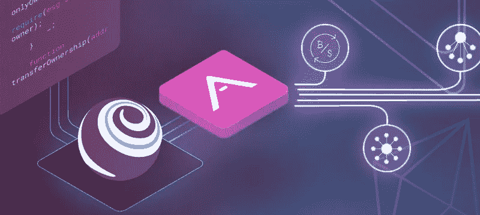

# 升级到 Truffle 5🍨

> 原文：<https://medium.com/coinmonks/upgrading-to-truffle-5-22aedc7c2a4d?source=collection_archive---------5----------------------->

## 我们❤️的比特和我们😠—总体而言，这是一个具有强大功能的可靠版本。

[松露 5](https://github.com/trufflesuite/truffle/releases/tag/v5.0.0#user-content-what-s-new-in-truffle-v5-interacting-with-your-contracts-websockets) 是松露框架的一次大修和返工。目前以太坊领域有几个相互竞争的框架，但 Truffle 是市场领导者，也是最常用的，所以绝对值得保留👀在[松露总部](https://github.com/trufflesuite/truffle)发生的事情。

我们已经广泛使用 Truffle 超过 18 个月了，从原始的 Web3JS 库切换到完整的构建管道，支持测试套件集成、CLI 工具、多网络支持和部署工具等功能。

我们对松露 4 有一些小小的不满，但它在去年为我们提供了很好的服务，但随着最近松露 5 的发布，升级的渴望正在接近我们。我们去找它，下面是我们在通往松露 5 号的路上发现的一些最好和最差的部分。

**Web3JS 1.0** ✅

Truffle 现在与最新的 [Web3JS](https://web3js.readthedocs.io/en/1.0/index.html) 捆绑在一起，这有许多新的补充，但我们最喜欢的是我们在处理事务时使用 [*PromiEvent*](https://web3js.readthedocs.io/en/1.0/callbacks-promises-events.html#promievent) 构造的能力，例如:

这是处理向网络提交交易的更流畅的方式。以前我们所拥有的只是一个简单的[承诺](https://developer.mozilla.org/en-US/docs/Web/JavaScript/Reference/Global_Objects/Promise),不幸的是，当一个交易可能会有几种状态时，这个承诺并不总是合适的。以前，我们使用类似监听事件和每 X 秒检查一次计时器的方法来解决这个问题，最近的变化使它感觉*正确*。

**异步/等待** ✅

所有的 Web3 调用都是 async/await——无论是在测试、迁移还是 webapp 中使用它们——这使得大多数情况下的生活变得更加简单。

**附加网络配置** ✅

额外的配置选项对我们很有用，我们通常将交易定价在低端，因为我们并不总是需要它们立即通过，使用新的配置，我们可以增加超时和阻止确认，例如:

这意味着我们可以更有信心运行迁移，而不用担心时间，这在 Truffle 4 迁移中确实发生了。

**回复原因字符串** ✅

一个期待已久的新功能——给 Solidity 和 Web3 带来了最新的变化。测试现在可以验证失败原因，如果需要，前端逻辑可以显示这个原因。

这使我们能够加强测试，并在一个场合发现假阳性。此外，在需要时将这些原因呈现给前端是诊断潜在问题的一大优势。

**bignome . js 到 BN.js** 😠

从[bignome . js 切换到 BN.js](https://github.com/trufflesuite/truffle/releases/tag/v5.0.0#user-content-breaking-changes) 的变化让我们大吃一惊。我们升级所花的大部分时间都是在进行数千次测试，这些测试利用 BigNumber 并将它们转换为 bn . js——我知道 web3 1.0 的引入迫使我们进行了这一迁移，我只是希望有一种更简单的方法来完成它。我还发现了将 BN.js 与 ***bn-chai*** 和 **should.js** 一起使用的问题，详见[此处](https://github.com/EthWorks/bn-chai/issues/2)。

**从 ASCII 到 HEX 的显式转换**😠

这似乎是一个不必要的改变，大概 Truffle 在调用时知道方法参数和签名，所以我认为显式转换为十六进制的新要求似乎是一个不必要的改变，理想情况下，它会以某种方式为我进行类型转换。

> 类型为`*bytes*`的函数参数现在必须使用`[*web3.utils.asciiToHex()*](https://web3js.readthedocs.io/en/1.0/web3-utils.html#asciitohex)`转换为十六进制字节字符串。

## 结论

总结来说，最新的 Truffle 5 版本是一个巨大的改进，应该被所有运行生产就绪的 Truffle 部署的人考虑。所有参与的人都应该为这个版本投入的成千上万个小时和承诺感到骄傲。以上只是一些我们喜欢的新功能，我们计划在未来探索和利用更多的新功能。

我们将继续使用和支持松露，并看到它非常积极的未来。完整的发行说明可以在这里找到[https://github . com/truffle suite/truffle/releases/tag/v 5 . 0 . 0 # user-content-what-s-new-in-truffle-V5-interactive-with-your-contracts-web sockets](https://github.com/trufflesuite/truffle/releases/tag/v5.0.0#user-content-what-s-new-in-truffle-v5-interacting-with-your-contracts-websockets)

祝平安和新年快乐！ [blockrocket.tech](http://blockrocket.tech)

在 twitter 上关注我们— [@blockrockettech](https://twitter.com/blockrockettech)

报名参加我们的社区聚会— [区块链曼彻斯特](https://meetup.com/BlockchainManchesterMeetup)

> [在您的收件箱中直接获得最佳软件交易](https://coincodecap.com/?utm_source=coinmonks)

**Read today’s Top Story**